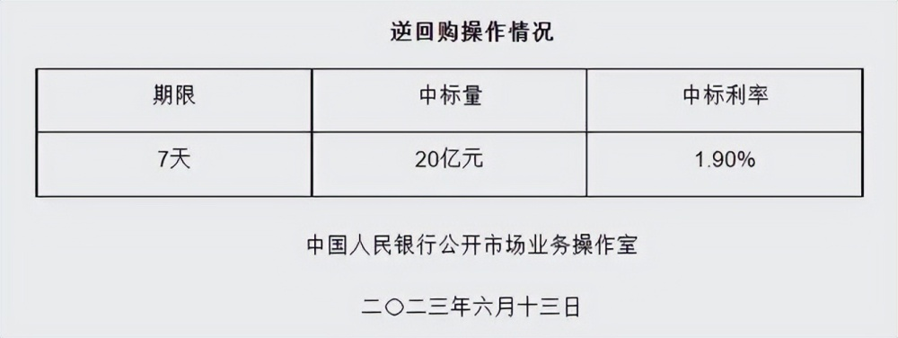
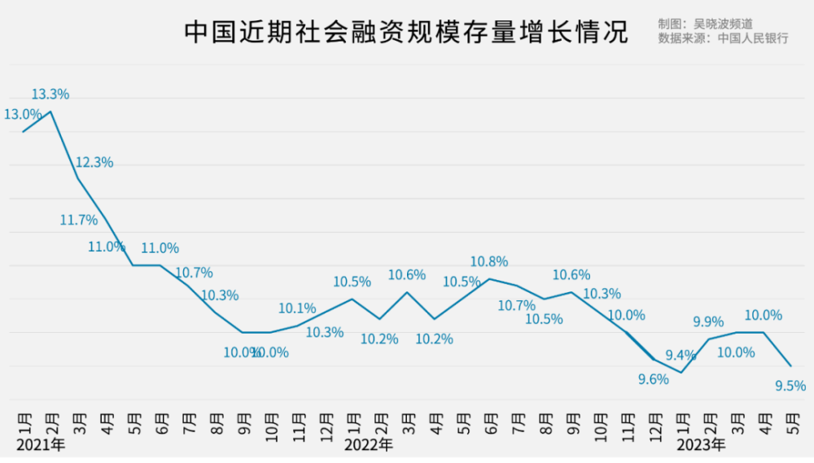
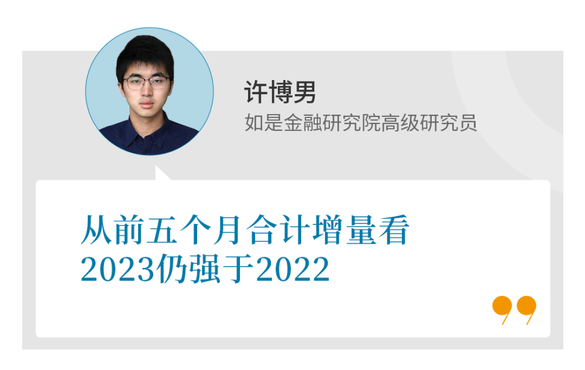
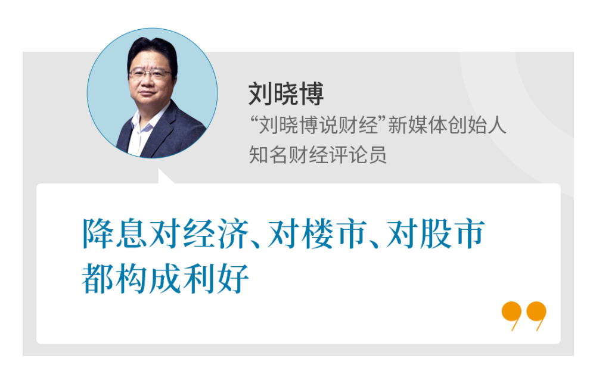
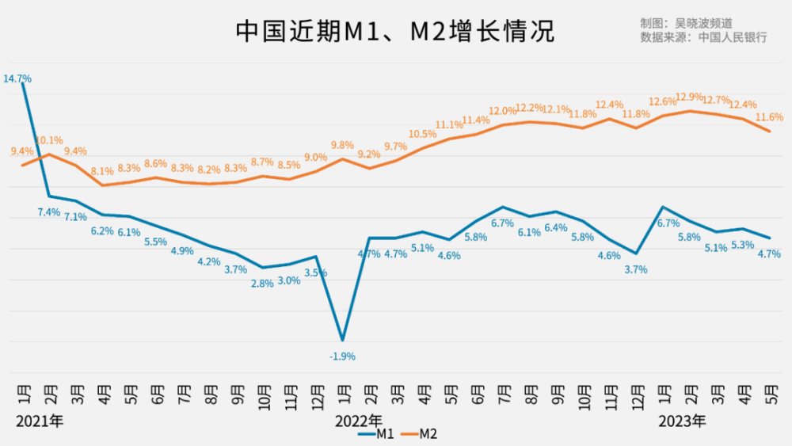
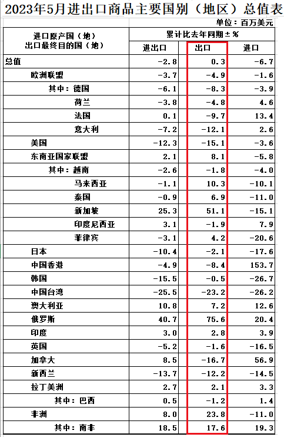

# 年内第一次降息意味着什么？对企业和家庭而言意味着能减负

**“周二的降息令人意外，因为中国人民银行很少在一年期利率之前调整短期政策利率。上一次发生这种情况是在2020年3月。”**

文 / 巴九灵（微信公众号：吴晓波频道）

像说好了一样，昨日，央行和发改委同时开始发力。

——先是央行。上午，中国人民银行以利率招标方式开展了20亿元7天期逆回购操作，出人意料的是，中标利率下降10个基点至1.90%。

此前市场预测，降息至少要在6月15日MLF（中期借贷便利）出炉时发生，从而引导LPR的调整。而周二的消息，则直接“预告”了后续两个利率的下调——自2022年9月以来，它们已有8个月纹丝未动了。

这并不常见。一般而言，央行很少在一年期利率之前调整短期政策利率，上一次发生这种情况是在2020年3月，是比较紧急的情况下才有的举措。

——再是发改委。下午，国家发改委紧随央行之后，发布了关于做好2023年降成本重点工作的通知，其中一项呼应了央行的举动，它写道
**“将推动贷款利率稳中有降”**

降息，从有一定预期到预期被拉满，中间只隔了6个多小时。

那么，作为2023年内的“首次降息”，对我们来说到底意味着什么？

**有人判断是当前宏观政策的发力还不足，因此要继续加码。**

财经评论员刘晓博认为，宏观政策力度够不够，今年主要看社融存量的同比增速。昨日央行公布了5月金融数据、社会融资数据，其中，5月末社会融资规模存量为361.42万亿元，同比增长9.5%，增速为今年以来次低。

他认为，这个增速在2020年一度反弹到过13%，与现在相比，差距还是较大。【现在需要大规模刺激吗？点击查看分析】

**有人看出了后续一系列政策即将出炉的信号**

东吴证券首席宏观分析师陶川说，从历史经验来看，一旦PMI连续跌破50，且出口同比增速降至-5%以下，政策往往会快速出手应对，这不仅仅是货币政策的降息和降准，
**还将伴随着地产调控的松绑和基建投资的加码，** 特别是LPR利率，可能会下调10个基点甚至更多。

**对企业和家庭而言，降息能减负。**

6月8日，上海财经大学校长刘元春在陆家嘴论坛期间就指出，由于通胀放缓，中国的实际利率已经上升到相对较高的水平。据他测算，目前领先的国有企业的贷款利率低于1.8%，但许多私营企业的贷款利率高达9%。

国家外汇管理局局长潘功胜也在同一场活动中表示，中国的实际利率——用两年期国债收益率减去通货膨胀率计算——约为1.7%，与美国持平。

对股市而言（尽管昨日的市场反应平平），但在今年的涨幅快被跌没了的情况下，有好消息总比没消息好。

对于当下的经济状况亦是如此。正如吴老师近日在一篇专栏中写得那样：

也许最要紧的是，要让这个沉闷的屋子里响起歌声……要有人大声地发布一些好消息，让开心和向上的空气荡漾和传染开来。

这阵子，我们也在频道持续发文，呼吁用“降低存量房贷利率”“降低改善型住房房贷利率”“全面取消限价政策”等五项建议以“救楼市”；呼吁在“消费关节处”，设立一万亿元的“专项补贴”精准鼓励城市新中产进行家电、家居和家装消费以“救内需”等等。

**是的，降息只是第一步，重要的是下一步。**

**救楼市**

建议一：尽快对房地产税和产权到期问题作出具体的法律安排和明示。

建议二：降低改善型住房的房贷利率。

建议三：降低存量房贷利率。

建议四：全面取消限价政策。

建议五：认真落实“三支箭”和保交楼政策。

**促内需**

对“三家”消费进行精准补贴，可以起到三方面的成效：

首先是刺激城市新中产重新规划家庭消费，通过较低的成本支出，满足人们对美好生活的向往；

其次，撬动“三家”消费，将极大地刺激制造业和服务业的复苏，既可以缓解产能过剩和产品积压，又可以解决迫在眉睫的就业难题；

还有一点也很重要，近年以来，中国家电及家居产品在节电、节水以及环保材料等方面都取得了长足的进步，以旧换新，同时能起到节能减排的“双碳”目的。

我在家居装修行业调查时还发现，很多家电和全屋定制公司都推出了三到五小时的“闪装”服务，可以帮助有翻新需求的家庭减轻时间和成本压力。

综上所述，建议中央政府针对“消费关节处”，尽快出台财政补助政策，设立一万亿元左右的“专项补贴”，精准鼓励城市新中产进行家电、家居和家装消费，枯棋局面或可一解。

如果你对昨日公布的金融数据、后续的降息空间还有疑问，我们还准备了一些专家学者的深入分析，以供参考。

**大头有话说**

5月人民币贷款新增13600亿元，同比少增5300亿元，一方面是去年货币信贷形势分析会议刺激背景下的高基数，另一方面则是二季度以来“弱需求”现实的延续。

企业中长贷还得“再撑一会”。5月新增企业中长贷7698亿元，同比多增2147亿元，显示经济动能偏弱下的对公需求增强，但基建与制造业投资增长连续放缓与企业中长贷比重持续增加存在反差，信贷传导有待疏通。

居民部门“贷不动了”。5月新增居民贷款仅3672亿元，其中拖累几乎全在中长贷（同比少增近3000亿元），居民短贷同比持平。
**反映居民消费修复缓慢，举债意愿仍较弱，早偿问题未明显缓解。**

政策“出手”或意味着6月社融反弹。参考去年5月及8月降息及稳经济一揽子政策出台后均有两个月的信贷反弹，我们认为本周二调降OMO后，宽松信号逐步明确，稳经济的政策“组合拳”有望早于7月政治局会议出台，大概率拉动下个月社融大幅回升。

**而“稳地产+扩基建”有望成为下半年托住经济的主要抓手，** 尤其是地产端，需要政策松绑以释放一二线城市的改善性需求。

基建上相对于特别国债，我们更看好政策性开放性金融工具的加码以发挥杠杆效应。另外在消费和制造业领域，对于稳汽车消费和针对性的税收优惠出台也是值得期待的。

我们国家的利率体系是政策利率与市场利率并行，政策利率负责提供利率指导，市场利率负责践行。

OMO和MLF是两个常见的政策利率，指导意义特别大。

简单来说，OMO指导的是银行间利率市场，可以理解为是银行的一种融资成本，MLF说的是银行往外贷款的投资成本。一般情况下，MLF在每月15日公布，OMO则是高频观察央行利率政策的一个窗口。

在一般情况下，OMO降，MLF就会降，然后引导市场利率整体降低。
**即OMO为降息前瞻，打开了我们国家降息的想象空间。这次降了虽然其成交量很低，但降息幅度也不算小，达10个BP。**

我们预计本月15日，央行或将官宣MLF降息，可能为5-10个基点。

此外，金融数据好不好要重点看“累计同比”。

从单月数据看，5月无论是“社融”口径还是“新增人民币贷款”口径，融资需求表现均明显不及市场一致预期。但信贷数据的主要组成部分是企业信贷，和出口数据类似，企业信贷投放情况主要看销售，有较强的“订单性”，应该通盘考虑，最好要看累计同比。

以“社融”口径看，累计同比增量仍在2022年之上水平。从1—5月的社融增量累计同比情况看，虽然5月单月数据表现并不尽如人意，但从前五个月合计增量看，2023仍强于2022。
**虽然这一现实情况并不足以使市场转向乐观，但也可以从一定程度上打消对社融的过度悲观判断。**

M2同比增速可以看作“印钞速度”，今年基本在12%以上，但5月只有11.6%，接近于去年疫情闯关时的水平。M2同比增速下滑，跟经济偏冷，企业、地方政府投资欲望不强有密切关系。

现代银行制度下，M2的扩张不仅需要货币政策的宽松，还需要参与印钞的各方有信心，也就是大家通常说的“宽货币”要转化为“宽信用”。如果企业不愿意扩张，地方政府因为地方债管控投资能力下降，就会出现M2同比增速下滑，现在就是如此。

狭义货币M1，主要由银行体系之外的现金，以及企事业单位活期存款构成。其中主要的变量是“企事业单位活期存款”。

M1同比增速下降意味着：第一，企业扩张欲望不强，把活期存款暂时转为了定期存款；第二，企业现金回流不畅，缺少现金流入。

而人民币贷款同比少增5418亿元，也意味着企业扩张欲望不强。住户贷款的增长也维持在较低水平，只有3672亿元，跟2021年5月（增加6232亿元）相比，显然处于非常低的水平，说明居民贷款买房、消费的欲望也不强。

央行重启降息，强调“逆周期调节”，意义重大。这说明，未来一段时间货币政策、财政政策都会加大调控力度，来对抗经济下行压力和通缩预期。这有利于给市场、给全社会树立信心。

降息是实实在在的利好，虽然一次10个基点左右的降息看似力度不大，但持续的降息、降准会产生政策叠加效应。降息还会引导全社会无风险利率下行，
**也有利于把堆积在银行里的各类存款挤出来，去消费、去投资。**

因此，降息对经济、对楼市、对股市都构成利好。中国即将再次降息，而美国即将再次加息，这会带来人民币的贬值压力，这将有利于扩大对发达国家的出口。

数据显示，中国对发达国家出口大多出现了两位数跌幅。其中对美国下跌了15.1%。人民币适度贬值，可以增加中国商品在国际上的竞争力，有利于稳增长、保就业。

**本篇作者 |** 和风月半｜李梦清 **| 当值编辑 |** 麻酱

**主编 |** 何梦飞 **| 图源 |** VCG

