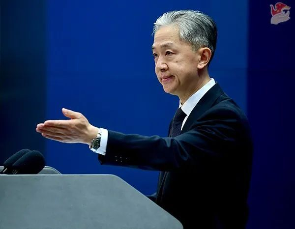

# 日本驻华使馆在北京举办记者会，不邀请中国媒体

6月14日，外交部发言人汪文斌主持例行记者会。

有记者提问，据报道，日本驻华使馆昨日就福岛核污染水排海问题在北京举行外国驻华媒体记者吹风会，对中方一再拒绝日方提议两国开展基于科学的专家对话表示遗憾，并对中方使用“核污染水”的称谓表示关切，强调拟排放的含氚“处理水”是安全的。请问中方对此有何评论？

_汪文斌
资料图。图源：外交部网站_

“你提到的报道表明，日方不仅没有反思，强行推进核污染水排海的错误政策，反而再次散播虚假信息，企图混淆国际视听。”汪文斌说，日本驻华使馆在中国举办一场不邀请中国媒体参加的吹风会，却句句不离中国，不是别有用心，就是底气不足。

“日方在核污染水处置问题上，没有遵循善意协商原则，并一再试图误导国际社会。”汪文斌再次强调，如果日方真有协商的诚意，就应该宣布暂停启动排海，允许邻国、太平洋岛国等利益攸关方对核污染水进行独立采样分析，并同意探讨除排海以外所有可能的处置方案。如果日方声称的“处理水”真的是安全的话，日方就应该选择在国内处置，而不是向环太平洋国家转嫁风险。

汪文斌表示，中方奉劝日方，停止政治操弄，早日回到解决各方关切的正道上来。希望日方忠实履行国际义务，停止强推排海方案，充分研究论证排海以外的处置方案，切实以科学、安全、透明的方式处置核污染水，并接受严格国际监督。

