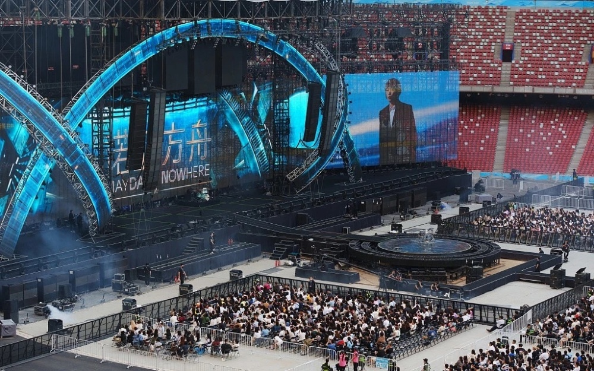

# 歌迷没票，黄牛却用来点烟，演唱会与淄博烧烤都快乐

特约作者 | 胡世鑫

编辑 | 陈弗也

出品 | 棱镜·腾讯小满工作室

为了抢到五月天演唱会门票，大学生欣悦（化名）做了很多功课，还请室友一起帮忙。

但最终，四台手机也没能抢到一张票。都到支付页面了，抢票系统却出了问题，显示支付人数太多，退出再进来时，票已经没了。

今年以来，演唱会“井喷式”举办，一个百亿级市场被打开。根据中国演出行业协会对外披露的最新数据，截至今年5月底，全国营业性演出场次近9万场，票房收入超110亿元，接待观众2500余万人次。

《证券日报》此前曾经报道，在今年，全国已经举办了近500场演唱会，4、5月份更是进入旺季，两个月均有近150场演唱会，这一数据已经超过了2019年的同期水平。

来自各个年代的歌手都在赶这趟快车，仅5月20日一天，举办演唱会的就有薛之谦、梁静茹、李宇春、毛不易、李荣浩等近20位歌手，韩国顶流女团BLACKPINK则在澳门开唱，甚至吸引了Anglelababy、欧阳娜娜等明星到场。

值得注意的是，周杰伦、陈奕迅、蔡依林、林俊杰等顶流歌手尚未在内地开唱，可想而知，在未来的不久，这个市场将会持续爆发。

一张几百元的门票，就可能承包歌迷几天的快乐，有人将此与此前火爆的淄博烧烤相比，认为，这都是年轻人消费降级、追求性价比的一种市场表现。不过，与淄博烧烤不同的是，遍布全国的演唱会，对各地餐饮、酒店、交通等行业有着更大的带动作用。

演唱会，能成为继旅游、露营之后，消费市场上的又一匹黑马吗？

**歌迷一票难求，黄牛却燃票点烟**

“宁可鸟巢门口站，也不能让黄牛赚”，这是五月天歌迷的一个口号。

5月26日下午6点，欣悦来到了鸟巢，由于拒绝向黄牛买票，她决定站在鸟巢外远程听演唱会。那里挤满了不少跟她一样的歌迷，有人还带了野餐垫、小马扎。不时会有人举着写有“抵制黄牛”的充气棒，呼吁歌迷拒绝高价买票。

在这个“百亿级”的市场上，黄牛们异常疯狂，他们想要赚回失去的三年。

根据歌迷的介绍，黄牛一般分有两类：溢价转让的“路人牛”和以此为生的“专业牛”。前者溢价低，但门票真假难辨；后者看似靠谱，但每张票溢价500到1000元。

黄牛抢票的花样繁多，作者联系上了一位“专业牛”，他的朋友圈都是演唱会门票的代抢和转卖信息，他并非利用软件去抢票，而是会招募大量的人力进行人工抢票，如果抢票成功，这些“代抢”们可以获得1000元左右的佣金。

除了这些“个体”黄牛之外，一些代理平台、二级票务平台也开始溢价卖票，这些平台被歌迷们戏称为黄牛的“正规军”。

当然，如此高的“代抢”佣金，仅出现在热门演唱会中，这些演唱会的歌迷多，歌迷们也愿意付高价，黄牛的利润空间就大。

比如五月天的演唱会，作者向这位黄牛询问是否可以花1500元去听一场，得到的是斩钉截铁甚至略带不屑的四个字回应：“当然不能。”而五月天的演唱会门票一般在300到1600元不等，若没有黄牛的溢价，1500元足以买一张视野好的位置。

在一次演唱会中，歌迷与陈奕迅互动时说，自己是从黄牛手上买的门票，票价高达8000港币，陈奕迅当场就震惊了，整个人在舞台上“呆滞”了一会。

“今年的票实在是太难抢了，价格也更高了，之前从来没有遇到这种情况。”二丁目（化名）向作者感言，他是五月天的资深歌迷，今年之前，曾经看过3场五月天的演唱会。门票如此难抢，让他深受打击，他一度怀疑主办方与黄牛是一条船上的人。

就在歌迷们苦于抢不到票时，一些黄牛却做出“暴殄天物”的事情。

在今年，歌迷与黄牛之间的“战争”异常激烈。由于不少歌迷拒绝高价买票，演唱会临近时，黄牛有时会降价处理，但很少会亏本“大甩卖”，此前的高价票已经让他们赚得盆满钵满，为了保持市场稳定，他们宁可将票砸在自己手上。

几天前，就在薛之谦演唱会开始前的半个小时，一个黄牛发了一条朋友圈，两张门票被点燃，并配文：“经常有人问票卖不掉怎么办，统一回答，点烟”。

_截图来自黄牛的朋友圈。_

**恒大曾借演唱会卖房**

今年演唱会的票房有多少？从一些歌手的演唱会数据上可以一窥端倪。

公开报道显示，今年一季度，张杰、薛之谦的四场演唱会，票房均突破了4000万。而对于粉丝量更多的周杰伦来说，他在2017年举办的“地表最强”巡回演唱会，48场的票房为24亿元，平均每场吸金也就约5000万元。

《北京商报》此前就曾报道，早在2018年，单场演唱会可为背后演出商带来超千万营收。

作为大型营业性演出，演唱会业有着成熟、复杂的运作方式。

毛毛（化名）是这个行业的从业者，据她介绍，一些有知名度、市场号召力的歌手，在举办演唱会时，为了保障营收，会把演唱会主办权卖给演出公司，而自己只收取秀费，即出场费，不少顶流歌手演唱会的主办权，都会被多个公司争夺。

获得授权后，主办方有时会将主办权分包出去，由熟悉各地市场的团队来运作。

比如，五月天巡回演唱会的全程主办为上海华人文化演艺有限公司，各地演唱会的主办则不一致。比如，2023“好好好想见到你”北京演唱会的主办方是北京华乐非凡文化传播有限公司，广州站的主办方则是广州市华星演艺有限公司，华乐非凡、华星演艺都是上海华人文化的控股公司。

疫情之前，成千上万的人依靠一场又一场的演唱会赚钱谋生，甚至有房地产公司借演唱会的名义来卖房。

根据当地媒体报道，12年前，河南新乡曾举办了“2011亚洲巨星新乡演唱会”，周杰伦、潘玮柏、萧亚轩等一线明星登台献唱，报道称，仅演唱会本身就给政府带来数百万元的利税，给各行业带来超亿元的经济效益。

而本次演唱会的荣誉主办方正是恒大地产，他们也不失时机地推出了新楼盘，当地媒体用“大街小巷广为流传，引发购房狂潮”的字眼来形容这个楼盘。

但是，三年疫情，让这个行业遭到重创，大型演唱会一度销声匿迹。

如今演唱会密集举办，围绕着这个行业，整条产业链也在复苏，各地大型场馆甚至都不够用了。此前，深圳湾体育中心副总经理刘馨灿在接受媒体采访时说，从今年3月开始，演唱会市场好了很多，他们在深圳的两个场馆，档期基本上都排到了年底。

广州浩洋电子是一家创业板上市公司，舞台灯光的生产研发是他们的主业，其财报显示，今年一季度，公司营收和净利润分别为3.30亿元、9965.54万元，分别同比增长42.47%、62.65%。

该公司在财报中写道，营收增长主要源于演艺设备市场需求增加，他们的股价也在今年4月28日达到历史最高的122.24元。

**给歌迷编发，一天赚几千**

演唱会的火爆，正在搅动着消费市场。中国演出行业协会曾对外发布数据，在五一假期内，音乐节和演唱会项目带动的交通、食宿等综合消费规模超过12亿元。

此外，该协会还表示，今年跨城购票观演者比例较去年大幅攀升，跨城观演者占购票总人数的50%以上，这类观演者对交通、住宿、餐饮等周边消费有强大的带动能力。

子林（化名）是南京的一位大四学生，平时依靠兼职、家里给的生活费有了不少结余。今年五一，她去澳门看了一场演唱会，并在澳门住宿两晚，全部开销近六千元。据她介绍，这些花费的一多半就用在了交通和住宿上。

5月9日上午11点，五月天“2023好好好想见到你”演唱会正式开启预售，根据美团、大众点评的数据，在1个小时内，北京的住宿瞬时浏览量超过了5月1日的同时段，而今年五一又被称为“史上最热的假期”，北京多地酒店一房难求。

数据还显示，五月天演唱会期间，北京全城的住宿预订量较2019年同期增长约300%，其中，“鸟巢”周边5公里的住宿预订量更是上涨2400%。

“有粉丝甚至在歌手演唱会刚报批下来，就开始订酒店了，越晚订，价格越贵。”一位对饭圈很有了解的00后歌迷向作者感叹。

除了住宿、交通等行业外，不少人围绕着演唱会也做起了小生意，他们都盯上了歌迷的钱袋子。

在一些热门的演唱会周边，经常会看到一些卖饰品小摊位，这些摊位往往三五个人一组，为歌迷们提供编发、化妆、闪粉贴脸等服务。甚至一些专业的化妆团队也来抢生意，比如为歌迷提供“演唱会应援妆”，价格在300-500元之间。

安安（化名）就是一位在广州兼职做编发、化妆的大学生，今年以来，她跑了李荣浩、陈粒、杨千嬅等多个演唱会，据她介绍，编发美妆行业的成本很低，有时一天下来就能赚几千元。

“难得看一次演唱会，肯定要打扮得美美的。现在都要提前预约，否则去了也排不上队。”安安告诉作者，编发20元起，发夹5元一对，如需要化妆，则要另外付费。

**演唱会与淄博烧烤，都在追求性价比**

二丁目今年刚考上博士，平时没有太多的收入，幸运的是，他仅多花了300元就从一位“路人牛”手上买到了一张五月天演唱会的真票。他人在成都，为了节省开支，选择坐20多个小时火车前往北京，酒店也选在了距离鸟巢很远的地方。

这届歌迷可以高价买门票，可以花钱现场化妆，但在与演唱会无关的事情上，不少人会选择“委屈”自己。

在微博、小红书等平台上，也有不少网友分享“特种兵式”的看演唱会经历，他们用更少的花费来观看一场演唱会，有网友甚至分享如何成为演唱会志愿者的经历，并称这是一种“0成本观演”的方式。

这或许与歌迷这个群体的特性有直接关系，收入不太高的年轻人是他们的主力。

根据《2022年中国演出市场年度报告》，演出市场的消费主力为18至34岁的年轻人群，该人群连续三年在购票观众中占比超过76%。购票人群以女性消费者为主，占比为66%，与2021年基本持平。

当然，也有一些歌迷并不愿意“委屈”自己，比如上述花费六千多元去澳门看演唱会的子林。

一位证券公司的分析师向作者感叹，淄博烧烤的爆红，已经证明了一个现实，消费降级和追求性价比正在成为消费市场的一个主流。今年上半年，经济弱复苏，很多人并不热衷于大宗消费，但很乐于为演唱会、短途旅游等消费买单。

“形象得说，现在的人可以下馆子，可以30块买一杯奶茶，但买房子和车子是不干的。”这位分析师说。

对于异常火爆的演唱会市场，南京大学长三角文化产业发展研究院研究员、南京师范大学文化产业与创意传播基地教授郭新茹并不意外，她认为，疫情期间，国民社交和情感需求被严重压抑，人们渴望重拾社交联系和情感交流，演唱会成为了满足这些需求的重要场所。

“当疫情得到控制后，人们就迫切渴望恢复正常生活，并愿意花钱参与各种文化娱乐活动，其中包括演唱会。”郭新茹说。

在解释这个火爆的市场时，郭新茹提到了一个经济学术语—“棘轮效应”，棘轮是一种单向旋转的齿轮，只能往上，不能往下，棘轮效应则是指消费习惯具有不可逆性，消费者容易随着收入提高而增加消费，短时间内不会改变。

她认为，演唱会是一种弹性较小的精神文化产品，一大特点是受收入波动的影响较小。精神消费本身存在上瘾性，消费者一旦形成一定的消费习惯，不会因为收入的增加或降低而减少对它的消费。

