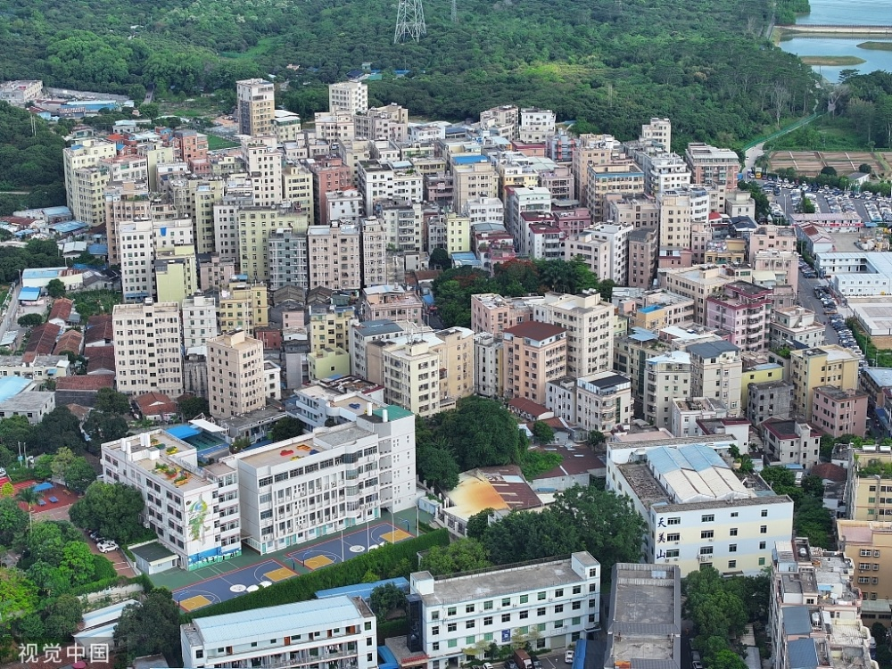

# 深圳白芒村“统租改造”暂缓签约，住建局表态改造后租金以不涨为原则

_2023年5月3日，深圳，航拍白芒村。
视觉中国 图_

近日，据媒体报道，深圳南山西丽街道白芒村“统租改造”签约已经暂缓，之前已经签约的还在推进相关工作，后续是否继续签约暂时未知。

6月14日，澎湃新闻从南山区西丽街道办事处获悉，白芒村的“统租改造”工作确已暂缓。南山区白芒村综合整治项目指挥部工作人员表示，目前是暂停的，再启动时间暂未确定，需等待进一步安排。前述人员未透露具体的暂缓原因。

深圳南山区西丽街道的白芒村，是正在推进品质化改造提升的城中村之一。公开信息显示，白芒村共有757栋房屋，原计划纳入规模化品质化改造的房屋共有584栋。

据央广网，近期，白芒村部分租客对“统租改造”产生了很多疑问。比如：房东发出通知要求限期搬离；部分租客孩子上学受到影响；受改造影响周边房租在上涨等。

对此，南山区西丽街道办事处在6月3日发布的《致居民朋友的一封信》中显示，对于居民朋友近期收到的“要求在6月30日前限期搬离的通知”，西丽街道办事处表示，该通知为个别房东的要求，指挥部已调查并责令整改。居民可根据各自寻找房源的情况自行安排，对于不具备搬离条件的居民不强制搬离并维持房屋原租金标准。

西丽街道办表示，将对愿意搬离的居民给予搬迁补助，并将积极梳理周边房源的信息供有需要的居民参考，协助寻找房源。

对于能否保障学位的问题，西丽街道办事处表示，符合入学条件在南山区内就读的学生，无论搬离与否都将为其提供保障。

“统租改造”城中村，是深圳市多渠道供应保障性租赁住房的一大创新，即深圳市相关部门在全市范围内就城中村住房进行筹集并开展城中村保障性住房规模化品质化改造提升。

按照计划，2021-2027年深圳全市将累计新增建设筹集保障性住房100万套（间），覆盖约350万-400万人。预计到2035年，深圳全市保障性住房覆盖人群将达到约500万人，约占全市常住人口的26%。

今年6月5日，深圳市住房建设局相关负责人指出，城中村保障性住房规模化品质化改造提升由政府主导筹集，改造后的租金以不涨为原则，单套租金原则上与改造前基本持平，即便个别房源因改造成本高、投入较大、建筑结构复杂，也必须严格控制成本、严格控制价格、严格加强价格监督。

深圳市住房建设局相关负责人提到，今年，深圳全市计划通过城中村规模化品质化改造提升，筹集保障性住房5.2万套（间），约占全市城中村租赁住房总量的1%。

上述负责人指出，“我们不会在深圳所有的城中村开展规模化品质化改造提升筹集保障性住房。进行改造提升的城中村，占全市城中村中的较小部分。城中村保障性住房规模化品质化改造提升，将在充分尊重原业主意愿、维护城中村原有的居住生态、尽量降低对居住者生活的影响的前提下有序推进。原则上不要求对整村进行改造提升，结合实际需求，合理确定改造比例。确实需要整村进行保障性住房规模化品质化改造提升的城中村，要进行充分协商和严格论证。”

对于房源收储后对原租户如何进行安置的问题，深圳市住房建设局相关负责人表示，我们要求各区在城中村保障性住房规模化品质化改造提升实施过程中，对原租户进行妥善安置。一是在城中村改造现场，辖区街道办会同改造项目实施主体成立现场租户安置综合服务中心，回应市民群众关切，妥善解决租户搬迁、学位等方面诉求。二是辖区政府积极开展改造的城中村周边房源梳理工作，在周边区域摸排一批大小合适、租金合理的房源供居民选择，研究分批收储腾挪方案。三是辖区街道办搭建业主与租户的沟通平台，并监督业主依法依规对租户进行补偿。四是辖区街道办充分摸清原租户生活情况。确实无法搬迁的租户，可协调暂不搬迁。五是进行规模化品质化改造提升的城中村房源，原则上预留3-6个月搬迁过渡期。六是在搬迁过渡期，另行寻找房源存在困难的，由辖区政府协调解决。七是原租户家庭子女上学问题不因城中村改造而改变。八是改造后，原租户有意愿回迁原城中村的，可回迁原城中村租赁居住。

