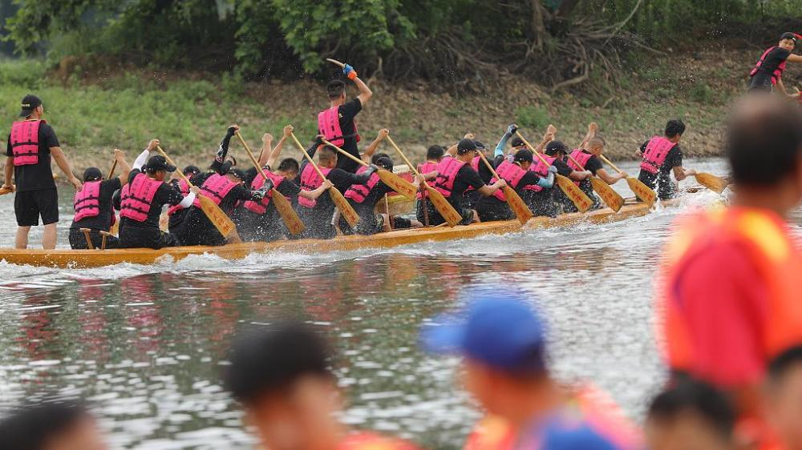

# 温州村民擅自组织龙舟活动被行拘，专家：民俗文化应鼓励民间自由传承

浙江温州两人因擅自组织民间划龙舟被行拘一事近日引发关注。

温州瑞安当地警方6月11日通报称，9日和10日，塘下镇村民黄某（男，62岁）、李某（男，57岁）分别擅自组织人员在河道内进行民间划龙舟行为，9日的活动中龙舟沉水，船上人员均落水，经救援无人伤亡。警方依法对黄某、李某分别予以行政拘留9日、7日的处罚，案件正进一步调查。

事实上，因认为民间划龙舟活动存在摊派、低俗、迷信、无序等现象，瑞安已在全市禁止民间划龙舟多年，并同时举行官方比赛。不过，有网友评论称，民间划龙舟是传统活动，政府可以好好引导，加强安全保障，没必要“一刀切禁止”。

有民俗学专家在接受澎湃新闻采访时指出，划龙舟是民间传统，应该鼓励社区、群体民众根据自己需要自发自由地传承龙舟精神，不宜因有负面问题就一概否定。

**竞技龙舟取代民间传统龙舟**

中国新闻网2014年一篇题为《浙江瑞安竞技龙舟取代民间传统龙舟》的报道称，清末民初以来，当地多次发生由划龙舟引发的冲突、械斗。2008年6月，有村民因划龙舟产生纠纷，互扔矿泉水瓶、舟桨等并引发冲突，一些店铺玻璃被打碎，此外，民间龙舟活动还存在摊派、低俗、迷信等现象。当年，瑞安市政府在大范围征求意见后，决定禁止民间划龙舟活动。

2023年4月30日，温州瑞安市政府在其政府官网发布通告称，鉴于民间划龙舟活动存在摊派、低俗、迷信、无序等现象，决定2023年继续在全市范围内禁止民间划龙舟活动。严禁任何单位、个人以任何理由擅自组织和举办民间划龙舟活动（包括开龙舟鼓，建、修、借、租、买龙舟，组织龙舟上水，竞划民间龙舟等），严禁借建造龙舟或划龙舟的名义进行寻衅滋事、封建迷信、强制摊派、变相敛财等活动。

通告指出，对违反通告规定，不听劝阻，擅自组织、举办民间划龙舟活动（包括传统龙舟和小龙舟），违反治安管理行为的由公安机关依法处罚，构成犯罪的依法追究刑事责任。

禁止民间划龙舟活动的同时，瑞安也在举办官方比赛。

瑞安市政府在上述4月30日发布的通告中提到，“市政府继续支持有序发展体育竞技龙舟运动，坚持‘规定时间、划定区域、限定队数’的原则，完善龙舟基地建设，引导发展龙舟协会(俱乐部)，以各有关乡镇(街道)体育竞技龙舟分会为单位报名参加活动;市体育事业发展中心要按有关要求，严格把关，规范审批，加强管理。”另据微信公众号“瑞安发布”5月18日消息，瑞安市第九届竞技龙舟大赛将于2023年6月30日举办。有媒体报道称，目前报名参赛的队伍是15支。

6月14日，瑞安市莘塍街道龙舟队一位队员告诉澎湃新闻，当地及周边私自划龙舟的人并不多，管理较为严格。平日龙舟队有训练时，会在政府规定的地点进行训练，不能划出该区域。

该队员说，现在划龙舟的人员素质普遍变好，平日训练的资金都是自己队员凑起来，队员们也很节约。

**民俗学专家：传统来自民间，应该鼓励民间自发传承**

对于瑞安市严禁民间划龙舟，澎湃新闻发表评论认为，作为端午节的传统活动项目，划龙舟也源自民间，已有上千年的悠久历史，不仅富有观赏性，民间参与热情也一直旺盛。不宜因出了点事，有负面问题就一概否定。

6月13日，民俗学专家、浙江省非物质文化遗产研究基地名誉主任陈华文告诉澎湃新闻，地方政府因为出过事就禁止民间划龙舟，有懒政之嫌。

陈华文说，龙舟本身来自于民间，并不是来自官方，所以从非遗保护和传统文化传承角度来说，需要特别提倡和鼓励民间划龙舟。

“尤其是社区和族群，需要传承自身的龙舟文化精神。从联合国《保护非物质文化遗产公约》到保护非遗伦理原则的角度来看，都是（应该）鼓励社区、群体民众根据自己需要自发地传承龙舟精神。”陈华文称。

陈华文认为，如何引导在办活动时不出安全事故，才应该是地方政府需要重视和思考的问题。

陈华文观察到，近些年一些地方在城市化的进程中，过往的传统环境和传统村落发生改变，民间组织划龙舟的活动在逐渐减少。但也有些地方正在恢复划龙舟活动。

在陈华文看来，龙舟竞渡是一种传统，在许多地方已经列入国家、省市县各级非遗名录进行保护，龙舟的文化精神也是中华民族精神的一种象征，需要弘扬和传承，如果当中与现代文化有一些冲突或不融洽的地方，也应该以引导为主。

如何健康发展民间龙舟文化？陈华文认为，按民间自愿和自发的形式在地方传统基础上自由发展是最好的。同时，地方非遗项目的研究者和管理者能够参与其中会更好。

河南泽槿律师事务所主任付建认为，地方政府想要阻止因为划龙舟而产生的械斗、赌博等不良现象的出发点是好的，但是也要考虑到民间传统。划龙舟是我国为了纪念伟大诗人屈原而流传千古的民俗活动，“一刀切”的管理方式显然有损民众的心理预期。此外，根据“法无禁止即自由”的原则，政府规章不能在法律规定的范围外给人民多附加义务，从这个角度看，“禁止民间组织划龙舟”的规定也不合理。

澎湃新闻检索发现，浙江龙港、安徽芜湖鸠江、江西多地曾发布通知严禁任何单位和个人以任何理由擅自组织和举办划龙舟活动；也有多地于近期端午节前夕发文规范民间竞渡活动，对民间划龙舟活动有限时限水域等要求。

如江西上饶余干县融媒体中心微信公众账号“余干之窗”于6月9日发布《关于加强民间游划龙舟安全管理通告》（以下简称《通告》），《通告》指出，龙舟须在指定的日期（6月22日、6月30日）、指定的水域（各乡镇场、城市社区划定内活动；此外，龙舟须经所属乡镇场（城市社区）政府确认同意，并报所在地派出所备案后，方可下水。

江西上饶信州区人民政府于6月13日发布《关于加强辖区民间自发划龙舟活动安全稳定工作的公告》，该《公告》列举出八项禁止行为。其中包括，严禁以划龙舟名义敲诈勒索、强行摊派、变相敛财、非法集资和强拉赞助等非法活动；严禁未成年人、年老体弱、不熟水性、饮酒及不宜剧烈运动的人员上龙舟等。

