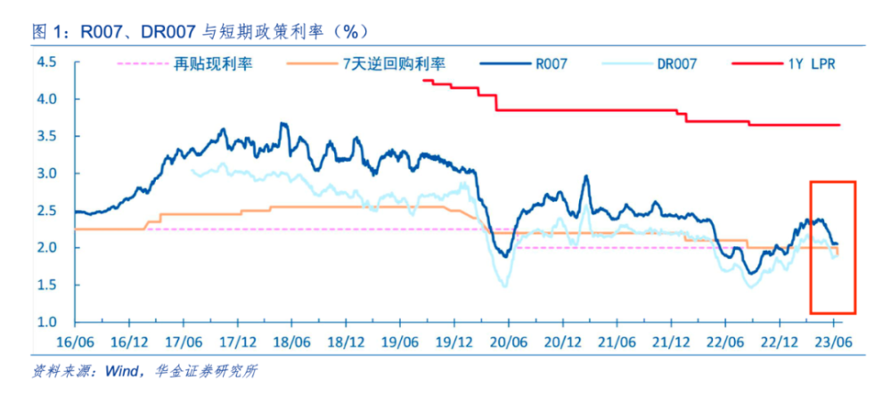
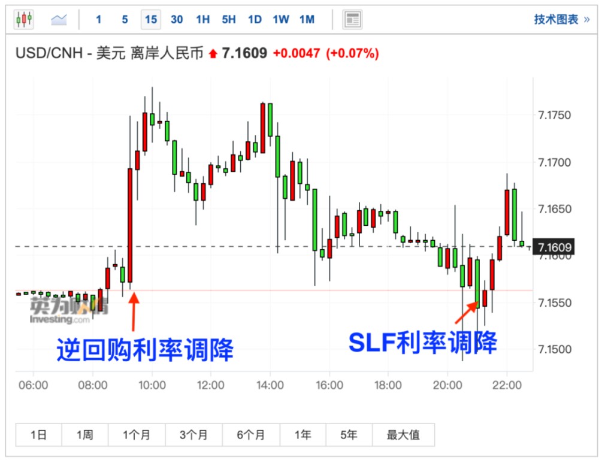

# 罕见！一天内两次“降息”，刺激政策火力全开

**一天之内两次“降息”，刺激政策火力全开。**

6月12日，早上9点，央行操作一笔20亿7天逆回购，中标利率下降10个基点至1.90%。

6月13日，晚上8点，央行公布常备借贷便利（SLF）利率表显示，隔夜、7天、1个月品种，均下调10个基点。

自6月13日起，常备借贷便利利率隔夜品种为2.75%，7天期品种为2.90%，1个月期品种为3.25%。

在此前的2022年8月15日，央行公布的隔夜、7天、1个月常备借贷便利利率分别为2.85%、3.00%、3.35%。

一般来说，完整的降息周期，“逆回购利率调降—MLF利率调降—LPR调降”。

现在，市场预期，MLF利率和LPR利率，大概率会跟随调降。

如果能够实现，那么就是2天内3次“降息”，一周之内4次“降息”，这种刺激力度将是史无前例。

除此之外，各种刺激政策也在路上。

6月13日下午，国家发改委、财政部、人民银行等部门又发文，推出一揽子刺激政策：

1、2023年底前，对月销售额10万元以下的小规模纳税人免征增值税，

2、对科技创新、重点产业链等领域，出台针对性的减税降费政策。

3、推动经营主体融资成本稳中有降。

4、延续实施阶段性降低失业保险、工伤保险费率政策，实施期限延长至2024年底。

为什么要刺激经济？很明显，经济确实需要刺激了。

今年还没过半，宏观经济预期就大起大落，从年初的谨慎乐观，到3、4月份的信心爆棚，再到5月份的信心回落，该刺激经济了。

**关键是，为何一天内两次降息？**

一般情况下降息有两个原因：主动降息和被动降息。

主动降息，原因是，政策利率太高了，为了刺激经济，通过拉低政策利率，拉低市场利率。

被动降息，原因是，市场利率已经下降了，降低政策利率，趋向市场利率。

本次调降7天逆回购利率，就是被动降息，市场利率已经降下去了，政策利率调降只是趋向市场利率。

刚开始，信贷大规模投放，叠加季度末，货币市场资金利率有所抬升，但是4-5月份之后，货币市场资金利率开始下降。

R007、DR007中枢已经从2.35%、2.10%左右迅速下降至2.05%左右和1.90%以下。

早上9点，央行7天逆回购利率调降后，市场乐观情绪并未及时起来，反倒是人民币汇率立马贬值。

直到10:30后，深成指和创业板指才开始向上，沪指一整天都比较克制。

这说明，市场对调降逆回购利率的反应，一般。

紧接着，央行公布了5月份的金融数据，数据不是太好。

1、5月新增贷款1.36万亿元，市场预期1.45万亿元，同比少增5418亿元。

这意味着， **5月实体信贷需求不足** ，加上今年信贷投放提前，新增贷款同比明显少增。

2、5月社会融资增量1.56万亿元，市场预期1.99万亿，前值1.21万亿元，同比少增1.31万亿元。

社融余额同比从10%降至9.5%， **位于历史次低水平，社融增长明显放缓** 。

3、5月人民币存款增加1.46万亿元，同比少增1.58亿元。

存款增加下降，不是居民拿去消费和投资了，而是存款利率下行，居民提前还贷了。

4、5月M2同比11.6%，较上月下降0.8个百分点；M1同比4.7%，较上月下降0.6个百分点；M0同比9.6%。

**5、居民部门贷款需求仍然处于底部。**

5月居民新增贷款3672亿，仍明显弱于疫情前5550亿的均值水平（5年平均），并没有明显反弹，居民买房的需求并没有恢复。

相反，居民继续增加储蓄，5月居民存款新增5364亿，较于疫情前1593亿的平均水平显著增加。

**6、企业中长期贷款，开始慢慢回落。**

一季度天量的企业中长贷并未延续，反而再度趋弱，当月新增7698亿，同比多增2147亿，多增幅度再度明显收缩。

原因可能是，去年政策性开发性金融工具对信贷的撬动作用，接近尾声。

在金融数据公布之后，央行又调降了SLF利率，加码刺激的信号非常明显。

我们再看一下，调降SLF的含义。

从本质上讲，SLF利率类似于央行作为最后贷款人向流动性暂时不足的商业银行提供融通的惩罚性利率。

对于银行性金融机构来说，银行间市场回购利率，无论是正回购还是逆回购，尽量不能高于对应期限的SLF利率。

中国央行也明确提出，根据货币政策调控需要适时调整利率水平，探索常备借贷便利（SLF）利率发挥货币市场利率走廊上限的功能。

也就是说，在央行看来，SLF利率就是利率走廊的上限。

央行降低利率走廊上限，意味着什么？就是人为的压低利率中枢。

换言之，如果说调降逆回购利率，属于被动降息，政策利率回归市场利率；

那么调降SLF利率就是主动降息，压低利率中枢，刺激信贷需求。

**在我们看来，降低利率的意义什么呢？减轻债务压力。**

看两个数据：

1、去年28万的M2仅带来6万亿的GDP新增；今年一季度15万亿M2下去，仅带来1.35万亿GDP新增。

2、张斌、朱鹤、钟益文章测算，如果政策利率降到0，全社会利息下降约为7.1万亿元。

分部门来看，居民、非金融企业和广义政府部门的利息支出将分别下降1.48万亿元、3.22万亿元和2.4万亿元。

短期来看，我们已经进入新的周期，政策刺激火力全开。

