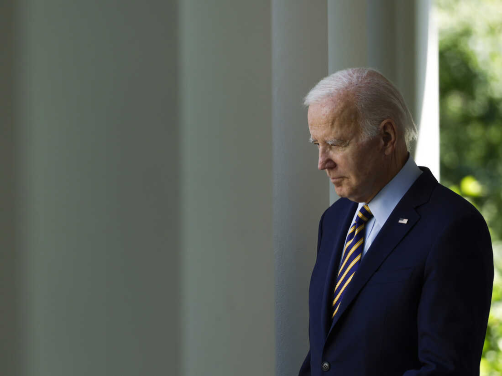

# 美媒放风对华芯片限制有松动，台积电三星可能得到“豁免”

【环球时报综合报道】“拜登政府打算延长豁免，允许韩国和中国台湾地区半导体制造商保持在中国大陆业务。”《华尔街日报》13日报道称，美国商务部负责工业和安全事务的副部长艾伦·埃斯特维兹上周在一个行业会议上表示，拜登政府打算延长一项出口管制政策的豁免期，这项政策旨在限制美国以及使用美国技术的外国公司向中国出售先进制程芯片和芯片制造设备。一些分析人士认为，此举将削弱美国在芯片上对中国出口管制政策的效果。去年10月，美国政府升级了对中国芯片业的打压政策，禁止将使用美国设备制造的某些芯片销售给中国，这使得以中国大陆为重要芯片市场的韩国等受到冲击。《华尔街日报》13日报道的这个消息，大大提振了三星电子、SK海力士以及台积电这三家芯片企业当天在资本市场上的表现。13日接受《环球时报》记者采访的专家认为，虽然美方尚未公布具体细节，但“延期豁免”是意料之中的事，因为美国遏制中国芯片发展的种种措施不但效果有限，而且遭到反噬。

_美国总统拜登 资料图_

**韩国芯片企业“松了口气”**

在美国政府去年出台芯片禁令后，韩国、中国台湾地区等都无法再向中国大陆出售美国规定的先进制程芯片以及芯片制造设备。韩国三星和SK海力士是全球存储芯片生产的领头羊，台积电是非存储芯片的头号厂商，它们都在中国大陆建有工厂。美国的禁令意味着这些企业在中国生产基地的技术升级受阻，其国际竞争力也被大大削弱。在三星和SK海力士强烈反对下，美国对韩国企业实行了为期一年的出口管制方面的豁免，一直到今年10月。台积电也被列入豁免名单。

根据《华尔街日报》13日发布的报道，多名参加上述行业会议的人士透露，艾伦·埃斯特维兹称，这些豁免在可预见的未来将会继续。报道称，这将允许上述国家和地区维持在中国大陆现有的芯片业务，而不会遭到美方的报复。至13日本报截稿，美国商务部尚未对此说法予以置评。

“三星电子、SK海力士松了口气”“韩美正寻求一种长期解解决方案”……美国将允许韩国半导体制造商保持在华业务的消息引发韩媒广泛关注。韩联社13日报道称，韩国半导体业界人士对此表示欢迎。一名韩国半导体业界人士表示，虽然美国尚未宣布具体细节方案，但感觉总体上正在向着好的方向发展，值得肯定。另一名韩国业内人士也表示，目前在中国投入启动的存储器生产线若想持续运转，就需要技术升级，而美国若出台允许这种技术升级实现的措施，将大大消除未来的不确定性。

韩国《朝鲜日报》称，过去几个月，韩美当局围绕“延长出口管制豁免期限”开展紧密协商，接下来，美国商务部将研究出台适用于韩国半导体企业对华技术装备出口的长远政策，以此取代现有“以年为单位延长豁免期限”的措施。一名韩国产业部（工业部）人士进一步透露，为了消除韩国企业对华投资的不确定性，韩美当局正持续沟通与商讨出台一种长远解决方案。若这种长期方案正式出台，预计将实行不同于现有出口管制政策的新措施。

“美国有可能延长豁免”的消息一经发布，在韩国首尔以及中国台北股市上，三星电子、SK海力士以及台积电三家企业均报以大涨。截至13日收盘，三星电子上涨1.41%，SK海力士升幅达到4.09%。在芯片板块的推动下，韩国股市13日以红盘报收。中国台北市场上，截至当日收盘，台积电上涨3.31%，股价直逼600元新台币。

**美国变相弱化强硬立场**

《华尔街日报》称，外国政府和企业正密切关注这些豁免期的状况，以了解美国的出口限制在今年秋季之后会对中国的投资产生怎样的影响。

此前报道显示，美国国内和外国芯片制造商对美国政府限制其与中国开展业务的做法非常不满并予以抵制。亚洲和欧洲的一些国家政府也进行了回击。最强烈的批评来自韩国。中国是韩国最大的出口市场，遥遥领先于韩国其他贸易伙伴。分析认为，在政治层面，韩国政府可能想与美国同步，但在经济利益方面，并没有放弃中国市场的意愿。

台湾“中央社”引述分析人士的观点评论称，美国有意延长豁免期，拉拢盟友意味浓厚。美国需要联合盟友对抗中国，因此需照顾到盟友的商业利益；若美国延长芯片出口管制政策的豁免期，韩国芯片制造商可因此受惠。美国也希望韩国等国家和地区在其他政策上配合美国。

中关村信息消费联盟理事长项立刚13日接受《环球时报》记者采访时表示，美国延长豁免期的一个重要的原因就是来自盟友的压力。他说，三星电子和SK海力士一季度都出现史上罕见的业绩暴跌，如果再遵从美国打压中国的政策，未来业绩将雪上加霜。而美国在限制盟友的同时，却堂而皇之为自己“放水”，英特尔和高通等都继续向中国出口芯片。这种损人利己的做法势必会遭到更强烈的反对和抵制。

项立刚对记者表示，美国拉拢盟友试图组建封锁中国半导体的联盟，目前来看效果并不明显，美国及其盟友反而因此蒙受巨大损失。在这种情况下，美国骑虎难下，又不能撤销所谓“制裁措施”，只能以延长豁免的方式，变相弱化其强硬立场。

与此同时，中国芯片产业正开足马力加快发展。英伟达创始人兼CEO黄仁勋5月称，美国一连串禁令让中国的芯片公司开始生产自己的AI芯片，与英伟达现在傲视全球的游戏、绘图和人工智能处理器等产品进行竞争。受美国管制措施影响，英伟达“手脚被绑住”，难以在该公司最大的市场之一销售若干先进AI芯片。

黄仁勋强调，中国“若没办法买到想要的东西，就会自己做，所以美国势必要谨慎面对”。

不过，台媒提醒称，美国有意延长芯片出口管制政策的豁免期，不代表美国放松对中国的半导体限制。

**要对中国搞科技“脱钩”比预想的更困难**

据美媒报道，有美国芯片行业的企业高管称，美国商务部计划延长豁免期，而非逐渐减少甚至是终止豁免以强化对中国芯片出口管制的做法，意味着美国政府认识到，在一个高度一体化的全球产业中，要对中国搞科技“脱钩”比预想的更困难。

报道提到，美国政府多名高官最近接连表示，美方并不寻求与中国“脱钩”。美国总统拜登4月谈到《芯片与科学法》时表示，该法“不是用来伤害中国的”。美国贸易代表戴琪称，本届美国政府内部已形成共识，与中国“脱钩”不是目标，也无法实现。美国财长耶伦多次表示，与中国经济完全分离对两国都是灾难性的。

一些国际媒体称，中国经济长期稳中向好，在全球不断增加的不确定性中，中国经济表现出来的韧性更加明显，高科技产业高速发展凸显出中国经济高质量发展的成效不断显现，中国成为全球持续看好的投资热土。这些都让更多的国家和企业看到，与中国在经贸领域进行合作才能共享中国经济发展红利，共同维护全球产业链供应链安全稳定与畅通。

中国商务部近期发布的数据显示，今年前4个月，中国实际使用外资金额达到4994.6亿元人民币，同比增长2.2%。流向高技术产业的外资同比更是大幅增长了12.8%，其中高技术制造业增长37.1%，高技术服务业增长6%。业界认为，高技术产业吸收外资增速明显高于整体吸收外资增速，意味着我国高技术产业的市场发展空间大以及投资环境的不断优化。

【环球时报驻美国特约记者郑可 环球时报记者 倪浩 王聪 戚席佳环球时报特约记者 金惠真 宇扬】

