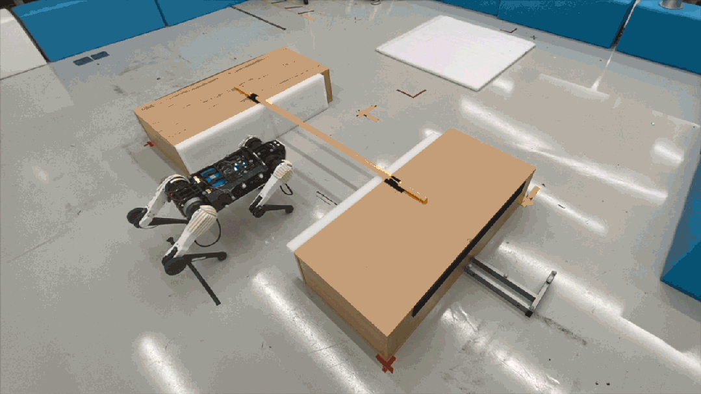
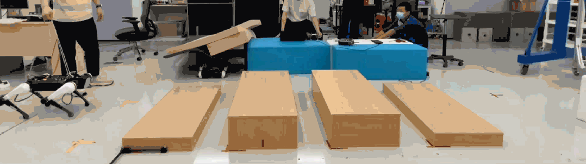
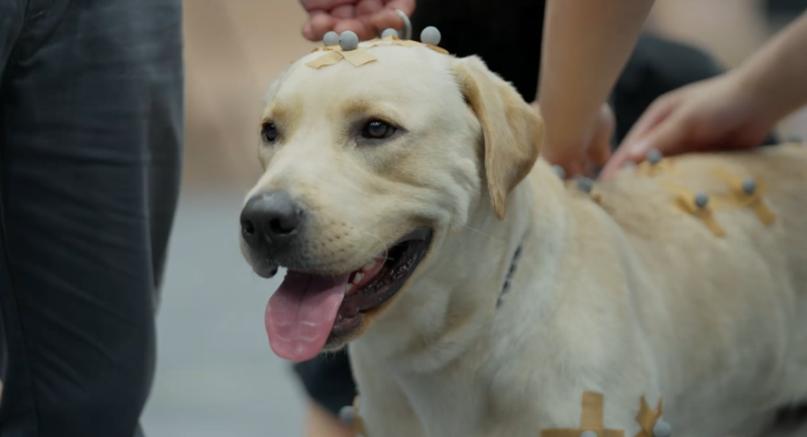

# 腾讯机器人最新动态：跟真狗学“奔跑跳跃”

Hi，大家好，我是Max，还记得我吗？

腾讯自主研发的多模态四足机器人。（大家也可以叫我机器狗Max）

这次是和大家的第三次见面了。

理由一样，想你们了（不是）我又升级了。

上次是走梅花桩。

这次是 **学真狗** 。

用实验室的专业术语说就是：将预训练和强化学习技术应用到机器人控制领域。

翻译一下，我在常见的动物行为数据集上进行表征学习，将学到的潜在表达存放在深度神经网络中，让我的动作和行为都接近动物。

这是之前的我↓↓↓

这是现在的我↓↓↓

再翻译一下，就是，我去学习了真狗的动作（走、跑、跳、站立等动作），然后灵活运用这些姿态去解决新的各种障碍的任务（匍匐前进、跨栏跑、障碍物之间的跑酷穿梭等）。

再对比一下现实中狗狗的动作↓↓↓

这样看，是不是觉得我学习得不错？

我知道，你一定会好奇我是怎么做到。

因为它↓↓↓

**首先，收集动作数据**

我们找来了一位专业的“动捕演员”，在主人的全程陪同和引导下，完成动作数据收集。

_（狗狗身上贴着用于动捕的标记点）_

通过腾讯游戏的动捕技术收集一定数量的动物狗在平地上常规的运动姿态数据，包括走、跑、跳、站立等数据，游戏研发制作过程中积累的多元动捕素材也为此提供了帮助。

再利用重定向技术，可以让这些数据在仿真引擎准确和高效的映射到机器人本体。

_（通过动捕绑定机器狗的骨骼）_

**然后，学习动作数据**

利用这些数据，在仿真器中构建了一个模仿学习任务，将这些数据中的信息学习并表达到我的神经网络上。（就像在脑子里植入了一本“武功秘籍”）

**再然后，拟真世界受控训练**

在拟真世界，感知自身的关节状态，并按照随机指令在平地练习和适应自身的动作。（在脑海里，练习武功招式）

游戏技术以及数据对基于物理仿真的智能体训练以及真实世界机器人策略部署也起到了一定的辅助作用。

**再再然后，加入外部环境训练**

在拟真世界里，加入复杂环境因素。

训练我对动作数据的熟练度，并感知外部环境，运用学到的动作去应对外部环境造成的各种障碍。（加入假想敌，和他们不停地过招。）

**最后，就是大家看到的我了。**

是的，整个过程都在虚拟世界里面训练而成，不需要进行实机训练和调整。

接下来，派出两个我的实体分身，来一段追逐游戏给大家展示下学习成果。

游戏规则讲解：我和我的分身分别扮演 **追踪和逃避** 的角色，双方触碰到旗子后，身份立即转换，谁先抓到对方，便获胜。

**好，游戏开始！！**

↑↑↑追逐——转换——追逐（双方你追我赶，互换着身份）

↑↑↑当追踪者意识到自己在逃避者碰到旗子之前已经无法追上它的时候，追踪者会放弃追踪，而是在远离逃避者的位置徘徊，目的是为了等待下一个重置的旗子出现。

↑↑↑因为最后一次旗子出现的位置太远，逃避者判断出旗子的位置被追踪者拦在了中间，逃避者判断不可能绕过逃避者去碰旗子，所以它会往角落里钻，尽量拖延自己输掉比赛的时间。

↑↑↑加入障碍后，我们也能顺利穿越障碍，完成游戏。

当追踪者即将抓到逃避者的时刻，它跳起来向着逃避者做出一个"扑"的动作，非常类似动物捕捉猎物时候的行为。

“是不是觉得机器狗还能玩游戏很神奇？”

我能像动物般地玩游戏，是因为我还特地学习了策略层面知识的网络参数，这个参数可以让我学会游戏规则、懂思考、懂判断。

最后，你一定会问，机器狗越来越像狗了，意义是什么？

其实，我刚刚诞生时，使用相对机械僵硬的动作，也能完成很多任务。

但随着我的成长，会发现，如果不借鉴任何动物、生物体的特性，这种僵硬的动作，想要去处理复杂的任务是很困难的。

就像生物都会逐渐进化成最合理的形态，去适应复杂的生存环境。

未来，我想要完成更高难度的任务，例如搜寻和援救等紧急的工作。

我还要不停地进化和适应，变得更灵活、跳得更高，去自主完成更困难的任务。

当然，相对冰冷的机械，大家肯定也更喜欢和接受拟真一点的可爱小机器狗吧~

对了，如果大家还想看更多技术详解，可以戳文字查看~

好了，今天就到这了，我得继续去训练了。

我是Max，期待下一次进化，再和大家见面。

