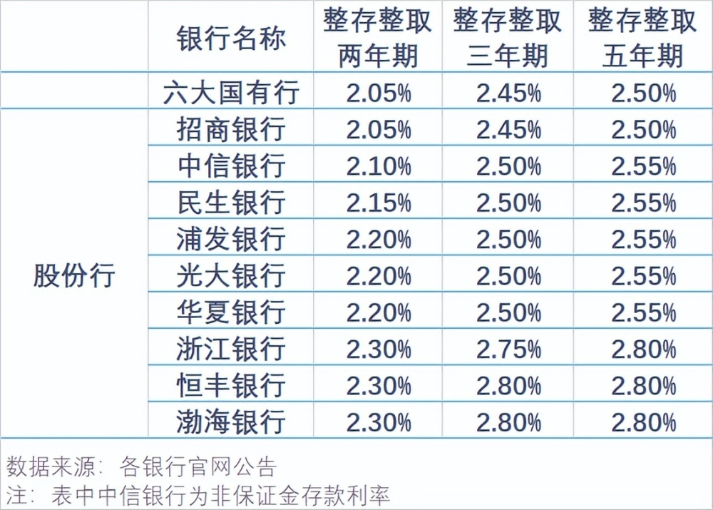
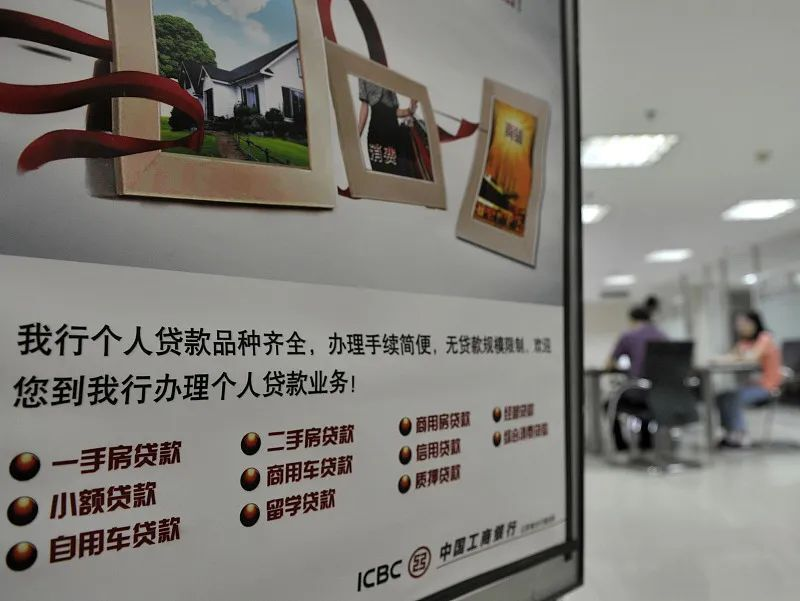

# 银行“动刀”定期存款：存期越长，降得越多

又降息了！上周起，六大国有银行纷纷宣布下调存款挂牌利率，12日，股份行也跟上了大行降息的步伐。

市界投资汇观察到，此轮降息潮的重点是中长期存款利率，且期限越长降幅越大。其中国有大行五年期挂牌利率下调至2.5%，调降幅度达15个基点，股份行五年期定存最高利率仅剩2.8%。

而此次降息“最狠”的定期存款，恰恰是储户的“最爱”。数据显示，过去的两年时间内，银行的定期存款猛增四成。

银行磨刀霍霍，杀向定期存款，这对储户来说固然不是一件值得高兴的事情，但对宏观经济来说，却未必不是利好。

存期越长，降得越多

从降息具体情况来看，工商银行、农业银行、建设银行、中国银行、交通银行、邮储银行六大行公告称，自6月8日起，活期存款挂牌利率较此前下调5个基点，从0.25%降至0.2%。

定期存款方面，两年期定期存款利率下调10个基点至2.05%，三年期定存利率下调15个基点至2.45%，五年定期存款利率下调15个基点至2.5%。

此外，三个月期、六个月期、一年期挂牌利率保持不变，分别为1.25%、1.45%和1.65%。零存整取、整存领取、存本取息、通知存款的挂牌利率保持不变。

去年以来，国有大行此前已进行了两轮存款利率下调。

第一轮是2022年4月，下调一年期以上期限定期存款和大额存单利率；第二轮是2022年9月，三年期存款产品均降15个基点，其他期限降10个基点左右。此轮降息，期限较长的存款再成重点。

对此，中央财经大学证券期货研究所研究员、内蒙古银行研究发展部总经理杨海平分析称，目前存款定期化成为影响银行付息成本下行的主要因素，特别是近期市场利率定价自律机制对协定存款和通知存款利率加点上限进行约束之后，存款定期化对付息成本的影响进一步凸显。

“一般而言，银行定期存款利率，期限越长利率越高，中长期定期存款对付息成本的影响更大，因而成为调整的重心。”

众所周知，挂牌利率指银行对外公布的当前存款或贷款的利率，它并不等于实际利率，有银行经理告诉市界投资汇，“银行往往先对挂牌利率进行调降，但为了吸引储户，实际执行利率要比银行官网上公布的存款利率高一些。”

过完一个周末后，6月12日，股份行跟进了国有行的降息脚步。招商银行、浦发银行、中信银行等先后在官网更新了人民币存款利率表。

与国有大行相同的是，各家股份制银行的三个月、六个月、一年定期存款利率均没有调整。人民币活期存款利率从0.25%降至0.2%，与国有大行一致。

整存整取定期存款利率方面，招商银行两年期、三年期、五年期利率分别下调至2.05%、2.45%、2.5%，与六大国有银行亦一致，其余股份行则高于招商银行。

_▲（国有行及部分股份行调整后的定期利率。图/市界统计）_

例如，调整之后，中信银行整存整取定期存款利率两年期、三年期、五年期分别为2.1%、2.5%、2.55%；浦发银行、光大银行、华夏银行整存整取定期存款利率两年期、三年期、五年期则分别为2.20%、2.50%、2.55%；渤海银行、恒丰银行整存整取定期存款利率两年期、三年期、五年期分别为2.3%、2.8%、2.8%。

两年定存猛增四成

值得注意的是，银行重点“动刀”的定期存款，对应体量目前在银行中占比较大。

梳理央行对外公布的数据显示，2019年12月末，住户定期存款为518304.63亿元。

2020至2022年，定期存款数目一路攀升，分别为599223.20亿元、682107.56亿元和819484.61亿元。两年时间猛增了近四成。

央行在2022年4季度城镇储户调查问卷中提到，倾向于“更多消费”的居民占22.8%，与上季基本持平；倾向于“更多储蓄”的居民占61.8%，比上季增加3.7个百分点；倾向于“更多投资”的居民占15.5%，比上季减少3.7个百分点。

而居民最偏爱的投资方式中，“银行、证券、保险公司理财产品”类目占比第一，为44.1%。

用英大证券研究所所长郑后成的话说，“居民将原本用于投资的资金存入了商业银行，最终形成超额储蓄。”

时间来到2023年，央行公布的数据显示，居民和企业的定期存款占比仍在快速上升。截至2023年4月末，个人存款中的定期及其他存款占比升至71%，较2022年末提升近3个百分点。企业存款中的定期及其他存款占比升近68%，较2022年末提升近2个百分点。

擅长商业银行领域的看懂APP联合创始人由曦称，在当前形势复杂的外部环境下，人们更倾向于将资金存入银行以获得更稳定的收益，而定期存款相对于其他存款方式具有更高的稳定性和保障性。

至于定期存款为何流动性和灵活性差还能受到青睐，有专家分析称，居民是抱有利率继续下行的担忧，提前锁定利率。

进一步避免套利，服务实体

据中金证券统计，2023一季度，商业银行净利润同比增长1.3%，同比增速环比2022年下降4.2个百分点。

其中国有行/股份行/城商行/农商行净利润同比增速分别为-1.5%/-1.4%/+21.4%/-3.0%，同比增速环比2022年-6.5百分点/-10.2百分点/+14.8百分点/-0.7百分点。一季度国有大行净利润同比增速为-1.5%，为2020年之后再度出现负增长。

杨海平向市界投资汇表示，本轮降息是针对存款定期化趋势进行的主动管理，可能会在一定程度上给存款热适当降温，有利于商业银行在净息差基本稳定的前提下，更好地服务实体经济。

在广发证券分析师钟林楠看来，降息将缩减实体部门资金空转套利空间。

早在今年4、5月份，媒体上就出现过“贷款最优惠利率与理财收益率出现倒挂”的相关新闻。起因是不少银行通过“以价换量”的方式争夺贷款客户。

_▲(图源/视觉中国）_

有股份行业务人员透露，一些优质企业贷款招标利率甚至可以做到3%以下，资质条件好的消费贷利率最低可到3.2%。

这一点，在央行发布的《2023年第一季度中国货币政策执行报告》也有所体现，2023年3月，新发放贷款加权平均利率为4.34%，其中企业贷款加权平均利率为3.95%，均处于历史低位。3月一般贷款中，36.96%的贷款利率低于贷款市场报价利率（LPR）。

与贷款利率走低相对应的是，部分银行理财产品利率相对较高。普益标准数据显示，理财公司存续开放式固收类理财产品（不含现金管理类产品）4月年化收益率的平均水平为4.00%，环比上涨5.81个百分点。

空转套利的可能性由此滋生。

钟林楠指出，息差缓释后，银行利用盈利补充资本的能力提升，资本约束会得到缓释，信贷供给的能力与积极性也会提升。杨海平认为，“本轮由大行开启的利率下调，为LPR下行提供了空间。”

不过，由曦也表示，降息也可能促使资金流向银行以外的市场，引发资产泡沫等风险，需要银行加强风险管理和监管。此外，降息也可能引发资金外流和汇率波动等问题，需要政策协调和应对措施。

**作者 |** 陈畅

**编辑 |** 孙月

