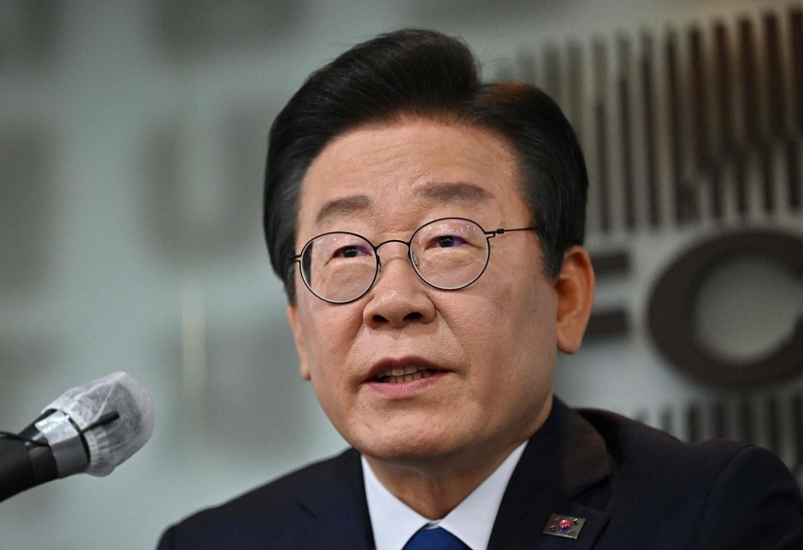

# 韩媒：韩总理称福岛核污染水可饮用，被在野党党首批像“日本发言人”

【环球网报道 记者
朱嘉琪】据韩联社报道，韩国最大在野党共同民主党党首李在明14日抨击了韩国总理韩德洙关于“福岛核污染水可饮用”的言论，称后者表现得像“日本的一个发言人”。

_韩国最大在野党共同民主党党首李在明
资料图 图源：视觉中国_

报道称，在12日韩国国会质询政府外交工作会议上，韩德洙称，如果日本福岛核电站排放的水得到科学处理，达到国际可饮用标准，那么就可以饮用。

此番言论引来了李在明抨击。报道称，李在明在14日党务会议上表示，“如果水是可以饮用的，那日本为什么要把水排进海洋?”“韩国总理正在扮演日本发言人的角色。这样对吗?”李在明还表示，太平洋沿岸的一些国家正在考虑就日本核污染水排海向国际法庭提出申诉，并敦促韩国政府也表示反对。

福岛核污染水排海设备6月12日上午开始试运行。当天下午，韩国渔民举行“先不打渔了，去首尔！”大规模游行示威活动，强烈反对日本政府将福岛核污染水排放入海。对于日本开始实施试运行核污染水排海，中国外交部12日表示，日方不应出于一己私利，而要让国际社会来承担整个海洋受到污染破坏的代价，这是极其自私和不负责任的行为。日方这种为了本国私利，损害全人类共同利益的做法，说服不了国内外的民众，只会让日本蒙羞，让周边国家和太平洋岛国的民众受害，让日本进一步失信于国际社会。

