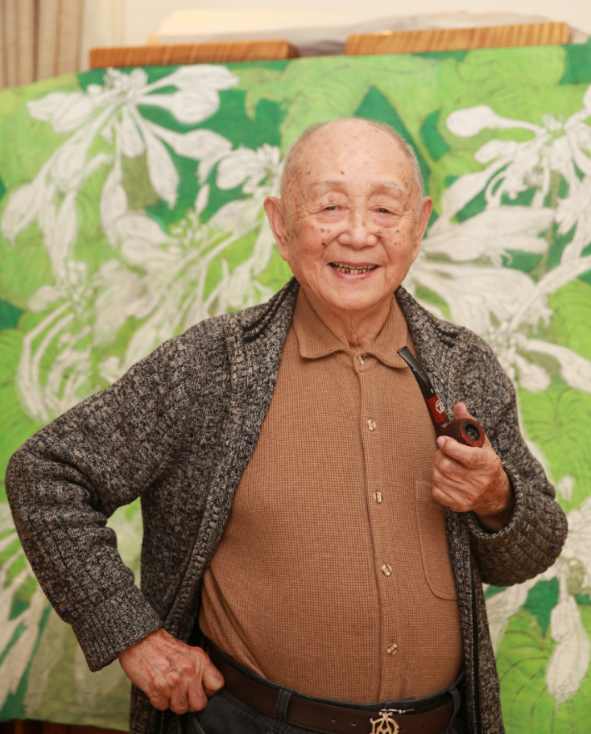
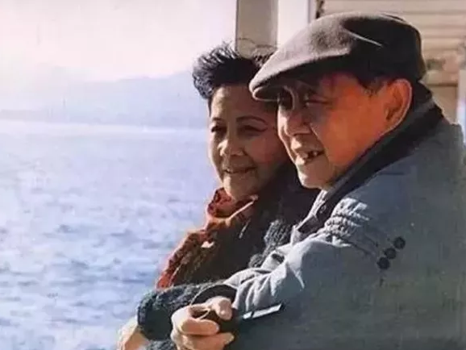
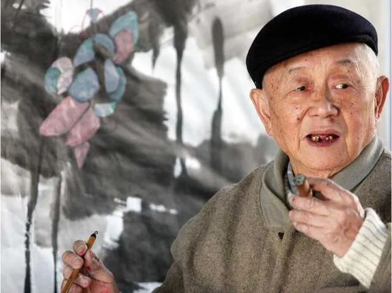
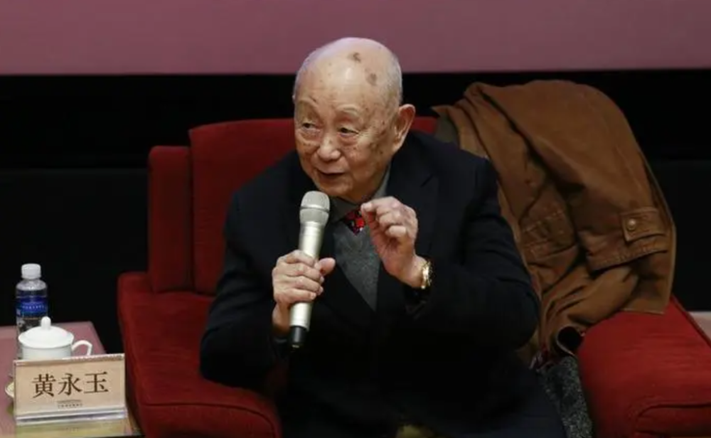
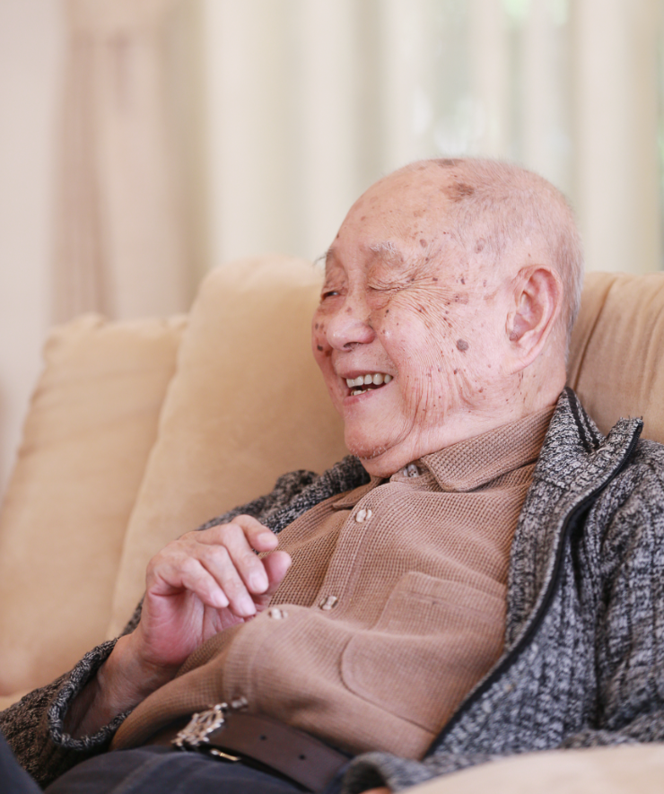

# 黄永玉去世，曾说“不要把死亡看得太重”

**朋友想他的时候，“看看天、看看云嘛”。**

作者：许陈静 李璐璐

2023年6月14日，下班晚高峰，行色匆匆的人们收到一条手机弹窗新闻，“黄永玉逝世”。

据央视新闻客户端消息，中国国家画院院士、中央美术学院教授黄永玉昨天凌晨逝世，享年99岁。报道称，黄永玉先生子女黄黑蛮、黄黑妮、李洁琴携孙黄香、黄田今日敬告：

我们的父亲黄永玉因病于二O二三年六月十三日三时四十三分离去。我们尊重他的意愿：不举行任何告别、追悼仪式。

《环球人物》记者曾在2018年专访过黄永玉。

那天他刚过完95岁虚岁生日。时间似乎并未在他身上留下太多痕迹，这位被称为“鬼才”的老人虽然听力大不如前，周身依然散发着灵气。

_2018年9月21日，黄永玉在北京家中接受本刊记者专访。（《环球人物》记者
侯欣颖 /摄）_

和记者交谈时，他眼里时不时闪现出几许狡黠，或是随口一句妙语，逗得人哈哈大笑。是的，这是人们印象中的黄永玉。但相对而坐，谈的时间越久，越会捕捉到丝丝缕缕的不一样，眼前这位老先生不是用“好玩”“鬼才”可以轻易概括的。

**爱美的老头，**

**“我的夫人、女儿、朋友都很美”**

黄永玉论“美”，自有一套独特的看法，“我年少在香港时，认识一位非常漂亮的姑娘，半个多世纪后，我再次见到了她，那时她已经80多岁了。旁人问我，你知道她是谁吗？我怎么会想到，当年那么漂亮的姑娘，现在完全认不出了！你看，好看的外表，最多保持20年。所以人呢，最美好的东西是品行、气质。在我眼里，我的夫人、女儿、朋友都很美。”

顺着黄永玉的目光看过去，女儿黑妮正在把一块月饼切成均匀的几瓣，她抬起头笑一笑，纤瘦又沉静。父女都是艺术家，家中的柜子、桌子上，自然不乏藏品和珍品，但最抢眼、最美的还是黄夫人张梅溪的照片。

黄永玉和张梅溪的爱情故事，多年来一直传为佳话：美丽聪颖的将军之女爱上了刻木刻的流浪小伙，在全家人的反对下，姑娘毅然与小伙子私奔结婚。

_黄永玉与张梅溪_

“很多人问我是怎么追求她的，想看我写的情书，其实吧，很简单。”黄永玉嘴角上扬，讲起了这段感情的开端。

有一天，他大胆问张梅溪：“假如有一个人爱你，你怎么办？”张梅溪说：“那要看是谁了。”黄永玉脱口而出：“就是我了。”她则回答：“你要是早问，我早就答应了。”就这样，一辈子了。

忆及与妻子的往昔，黄永玉的目光不自觉转向黑妮：“你看，我的女儿没整过容，也没化妆，却是这么漂亮。”

在艺术创作上，黄永玉也有着自己独特的美学欣赏。他画荷，浓墨重彩、色彩斑斓而又有着清新脱俗之感。他建房，凤凰古城的“夺翠楼”“玉氏山房”，北京的“万荷堂”，都充满了中国古典园林元素。

“作为艺术家，您喜欢什么样的美？”

“我喜欢完美的美。”黄永玉不假思索地说。“所有的画本我都很喜欢，没有特别偏好哪一种，只要是好的，我就去学习和吸收，没有陈见，也没有国界。”

**勤奋的老头，**

**“我的生活不好玩，只有工作”**

有着“老顽童”名号的黄永玉，惊人之举迭出。

他90岁开画展、迷跑车，还出了书。2013年，他的自传体小说《无愁河的浪荡汉子》第一部《朱雀城》出版，他在为这本书作的序《我的文学生涯》中写道：“这小说，一九四五年写过，抗战胜利，顾不上了……重新动笔，是一个九十岁人的运气……”

重新动笔，是一个90岁人的运气，也是一个90岁人的勤勉。《无愁河的浪荡汉子》最初在《收获》杂志上连载。每期，黄永玉用纸笔撰写3万字文稿，再自画10多张插图，这一写一画，就是11年。

他很骄傲，“11年来我从没拖过稿”。不拖稿哪有什么窍门，就是勤奋。他每天工作八九个小时，上午写，下午画，晚上还读书，一日三大事，唯一的消遣就是看电视转播的重量级拳击比赛。

记者来访时，客厅的墙壁上正挂着一幅未完成的玉簪花图，这是他最近的作品。“你看，我一天就是坐在桌旁，用钢笔在格子上写字，然后画画。我的天地很小，我的生活很简单。”

《无愁河的浪荡汉子》计划写3部，黄永玉刚完成了第二部《八年》（下卷）。

很多人好奇地问，这3部著作什么时候能全部写完？黄永玉自己也不知道。“我写书是没有提纲的，想到哪就写到哪。就像序中所说：‘我为文以小鸟作比，飞在空中……人已经九十了，不晓得写不写得完？写不完就可惜了，有甚么办法？谁也救不了我。’”

_黄永玉_

在小说里，黄永玉写到了很多现实中的人。记者问：“他们当中，有看了小说后对号入座的吗？”

黄永玉“哈哈”一笑：“有！当然有。我一般都不采用化名。有个别要用一下，虽然他本人已经去世了，可我怕他的子女来找我打官司。”

他讲起小说中一个熟人的故事：“我的一个初中同学，家境富裕，但很顽皮。他最大的特点是非常爱请客吃饭，可请完客又舍不得花钱，常常是当众后悔。他这次请完大叫不出钱，但下次还是要请，请完又说不掏钱，一直到老也这样，几十年就这样过去了。我写到他的时候，就把他的名字改了一个字。我的儿子认识他的儿子，有一次我儿子遇到他儿子，就直言相告：我爸爸写你爸爸时，怕你看了后找麻烦打官司，就把名字改了个字。谁知他儿子立马说：爱怎么写就怎么写！我知道我爸爸，他就是这个样子。你看，真有意思啊！”

旧日时光中的人和事在黄永玉的眉宇间飘呀飘，他畅快地笑起来。

记者问他：“每天这样长时间工作，觉得辛苦吗？”

黄永玉抱着烟斗说：“我不怕辛苦。唯一的就是年纪大了，体力弱了。工作不辛苦，哪叫工作。其实玩也辛苦，比如打牌，又累又花时间。我不会打牌，我也不喝酒，下棋也不行。我生命中最重要的就是工作，我没有浪费时间在别的东西上面。对了，我快要出一本谈美的书信的书。”

“这样的生活，好玩吗？”

“谈不上好玩，就是干活。”

“要是给您放一天假，您想怎么玩？”

黄永玉眼里的光一闪一闪：“我有个年轻点的小朋友叫李辉，我跟他说，等我100岁的时候你带我到城里头走一走，我想逛逛三联书店。”

**心骄傲孤独的老头，**

**“老友都去世了，就剩我自己了”**

这个“年轻点的小朋友”也62岁了，退休前是人民日报高级记者，和黄永玉的友谊已跨越40年。

“李辉两口子很喜欢来我家吃饭，每次说来，都是5点多，6点吃饭，这两个家伙！”黄永玉乐得调侃“小友”几句。他前半生行遍大半个中国，识人无数，挚友的名字可以列出长长的一串。

1946年，黄永玉辗转到上海，生活贫苦，住在巴金的文化生活出版社宿舍。在这里，他发表了很多文学和美术作品，也认识了唐弢、汪曾祺、黄裳、萧乾、臧克家、冯雪峰等作家，李桦、陈烟桥、野夫、王琦、麦秆、杨可扬、邵克萍等木刻家。“可惜他们全去世了。”

1997年，黄永玉正在意大利家里楼上画画，女儿大叫：汪曾祺伯伯去世了。黄永玉很平静：嘿！嘿！他怎么会这么快死呀？

“和我同一代的朋友，香港的、上海的、北京的，一个都没有了。我曾经和黄苗子、郁风去凤凰，那时郁风刚做完手术，缝的线都没拆。我们在凤凰一起画画，她说，留几笔给我，等回北京再画。回北京不几天，她就去世了。”

“还剩下两个朋友，许麟庐和黄苗子。我说，现在就剩下咱们仨了。几天以后，许麟庐就去世了。我跟苗子说，你看，就剩下咱们俩了。几天后苗子也去世了。”

他仰头大笑起来，仿佛这是一桩趣事，感染得我们也笑了。但笑声散到空气中，我们年轻人，却比不上他的通达，只觉得笑到尽头，惆怅涌了上来，心里涩涩的。

_黄永玉_

黄永玉看了我们一眼，指指茶几上一张香港明星李丽华的照片。“李丽华是我的老友，和我同龄。她的戏演得很好，可惜去年去世了。现在真的就剩我一个了。”

一只黑猫灵巧地跳到了黄永玉的膝上。如今，整日与黄永玉相伴的，就是家里的这些猫和狗。

“它们呀，一点都不听话。”黄永玉宠溺地说，“我这里的狗大都是捡回来的流浪狗。有一只养了一年多了，还不敢见我，只在吃东西的时候才找我。女儿还捡回一只被汽车碾伤的小母狗，后来和家里的狗生了10多只狗崽。我们家现在有20多只狗了！”黄永玉酷爱动物，他为1980年庚申年画的猴生肖邮票，就是根据一只名叫伊喔的猴子画的。

黄永玉轻抚着小猫，沉吟道：“想起那些曾经的朋友，我都很快乐，就像我回想起过去的生活。当然也有讨厌的人，也有艰辛的时候。但人生就是这样，怎么过，取决于你本身的心态。”

**洒脱的老头，**

**“不要把死亡看得太重”**

湖南乡间有句俗话，“人老成精”。

我们只觉得眼前这位黄老头，不热闹，但是真豁达，真洒脱。这点，从他的画作中就能体会到。

_2018年9月21日，黄永玉在北京家中接受本刊记者专访。（《环球人物》记者
侯欣颖 /摄）_

他喜欢画幽默漫画，旁边配上寥寥几句说明，让人忍俊不禁。他画自己家的鹦鹉，配文：鸟是好鸟，就是话多；朋友来家中做客，人人都在低头玩手机，他就画了一套以猴为主题的挂历，其中一幅画是孙悟空在花果山开会，旁边大字写道：不准用手机；90岁时，他画了一幅自画像“比我老的老头”，是个赤脚、光肚脐，手舞足蹈，烟斗掉在脚边的形象。萧乾曾这样形容黄永玉：“浮漾在他粗犷的线条间的正是童稚、喜悦和奔放。”

他的这份童真，来源于生活的磨炼。

黄永玉的少年时代，正逢抗日战争，十二三岁时，他便离开家乡，四处流浪，“自小捡拾路边残剩度日”，靠着木刻，在战乱中求生存。日本飞机来轰炸、少吃少喝，都不要紧，只要包袱里还有木刻刀、木板和书，就安心了。

“我流浪的包袱里什么书都有，古典的、现代的、翻译小说……有些老人家看到后就说：你看这孩子，流浪还带着书！”

他流落到福建山区小瓷作坊做小工，长大后来到上海、台湾和香港，当过中学教员、剧团美术队员、报社编辑……“一听流浪，很多人都觉得浪漫好玩，其实一点也不好玩，很苦的。不管是精神上还是身体上，都是磨炼。”

在动荡时代里漂泊，黄永玉练就了一身本事，他自学了美术、文学，终成一代名家。1952年，黄永玉在表叔沈从文的劝说下，偕夫人张梅溪从香港前往北京，到中央美术学院任教。

对于世间种种烦恼，黄永玉的解决之道是创作。“画画解决不了的事情，我就用雕塑，雕塑解决不了，我就写作，用文字解决。”

有朋友问他，你从流浪时开始，当了几十年“左派”，怎么没入党呢？

其实，黄永玉有过一次入党机会。那是在香港，党的一位领导同志问他有什么要求。黄永玉以为是要提高他的待遇，立马说不要客气，我没有什么要求。多年以后，那位同志告诉他，当时是问他想不想入党。“我说，哎呀，你当时为什么不明说呢？我最初学木刻就是响应共产党的号召，后来也都是和‘左派’的朋友来往，我一天到晚想入党，偏偏那时候在香港不能明说。”

如今，黄永玉感到欣慰：“80多岁的牛犇都入党了。想想解放前在上海、香港的电影厂，他还是个小孩子呢！”

近几年，黄永玉已经很少回家乡凤凰了，主要是因为“工作太多，没有闲暇时间”。他50多岁那会儿，曾陪着80岁的表叔沈从文回了趟老家凤凰。叔侄俩去看了就读过的文昌阁小学，又回到了老宅。

回到北京后，病榻上的沈从文抓住黄永玉的手说：“谢谢你，带我回凤凰。”沈从文去世后安葬在老家，黄永玉给他补了石碑，上书“一个士兵，要不战死沙场，便是回到故乡”。

_沈从文（左）与黄永玉，两人是表叔侄。_

黄永玉说，自己百年后会用一种不同的方式。他说，我已经写好遗嘱了，死后骨灰不要了，“跟那孤魂野鬼在一起”，朋友想他的时候，“看看天、看看云嘛”。

这话，他曾在一个节目里说过，立即上了热搜、刷了屏。这一次，他又补充说：“我劝你们不要把死亡看得太重。就算是皇帝，费尽心思修了地宫陵寝，几百年几千年后，还不是被后人挖了出来？”说着，他又大声笑了起来。

“来，我带你们四处看看。”黄永玉兴致勃勃地站起来，带我们先看他的玉簪花图，“这里，这灰色的地方，还差几笔，再画几天就画好喽！”再看他的书房，房子里堆满了书籍、烟斗和藏品，像个博物馆一样。

“这些书，我拿起哪本就看哪本。”他略为得意地指着书桌前的一把椅子说：“这是美国前总统老布什驻华时坐过的椅子，我在拍卖行花了25块钱买来的。”

然后是看挂在餐厅墙上的一幅字，章草，“这是1982年我的表叔沈从文写的”。

最后是看客厅墙上一张张照片：“这是瞿秋白的学生，这两个是他的孩子。”“这是黑妮小时候，在颐和园拍的。”……看着这些照片，他喃喃道：“一晃，几代人就过去了。”

（原文刊载于2018年第21期《环球人物》杂志）

总监制： 吕 鸿

监 制： 张建魁

主 编： 许陈静

编 审： 凌 云

