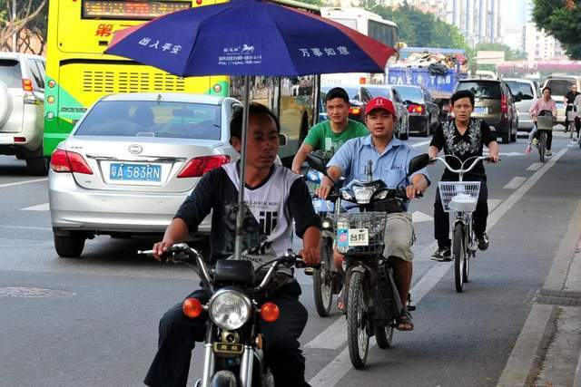

# “天下苦‘电鸡’久矣”：保有量近500万辆的广州，要限电动自行车了

近几年，电动自行车问题让不少城市“头痛”。而一线城市广州，则拟推出对电动自行车的限制政策。

最近，《广州市人民政府关于电动自行车通行管理措施的通告（征求意见稿）》发布，提出对电动自行车实行分路段分时段限行。

根据公告，全城不少路段被列入限行，而限行时间包括全天限行、白天早7点半到晚7点半限行和早晚高峰限行，限行路段集中在天河区、海珠区、越秀区和白云区这几个中心城区。

一石激起千层浪，不少广州市民支持这一措施，称“天下苦‘电鸡’（广东话的电动自行车）久矣”。

但出行即将受到影响的市民，也对这一新政提出强烈反对，提出“交通拥堵为什么不禁私家车”的反问。

广州预计在7月10日，对电动自行车限行问题，召开听证会。

**为什么是广州**

此次广州拟限行电动自行车的路段，主要集中在城市核心区，特别是天河CBD区域，基本被纳入全天限行的路段。此外，东风路、黄埔大道两条城市大动脉全天限行；包括沿江路、滨江路、艺洲路、阅江路等路每天早上7点半至晚7点半限行。

与不少城市相比，广州的电动自行车数量称得上非常庞大。

截至2023年3月底，广州仅登记上牌的电动自行车的数量就达322万辆，不过实际保有量可能更高。

2021年，广州市电动自行车行业协会统计数据显示，广州市电动自行车社会保有量或超400万辆。而最近，广州公安公众号预估的数据显示，广州电动自行车保有量接近500万辆，且“涨势”不断。

而近年来电动自行车的违法行为，呈快速上升状态。

广州交警发布的数据显示，2021年广州全市共查处电动自行车交通违法行为112万多宗，同比上升169%。

而到了2022年，广州交警全年查处电动自行车交通违法行为逾160万宗，与2021年相比仍然大幅度增长。广州公安公众号发文称，甚至这一数据已是“综合治理、宣教引导后的结果”。

_广州新港中路，有电动自行车在机动车道上逆行。图/中新图片_

有广州交警向中国新闻周刊表示，相比私家车，目前交通法律法规对数量庞大的电动自行车没有形成有效限制，所以其在执法过程中，“违规根本抓不过来，就算抓住了罚款较轻，很多人根本不在乎”。

与此同时，广州购买电动自行车保险的人则“寥寥无几”，仅约24万。

2023年广州两会，广州市人大代表、广州大剧院副总经理梁丽珍提出了“加快推进划定广州市电动自行车限行区域，加强电动自行车人行道违法通行执法”的建议。

具体而言，梁丽珍表示，目前广州核心中心城区人口集中，如珠江新城建筑密度大，道路通行压力较大。多数道路狭窄，暂时难以满足大量电动自行车安全通行、户外停放和集中充电的要求。而像花城广场、临江带状公园、广州塔等市民娱乐休闲的场所，不适宜电动自行车通行，应划定范围，制定限、禁行管理规定。

到了3月下旬，广州开始加快研究电动自行车限行的方案，比如广州天河区人大常委会组织14名省、市、区三级人大代表开展加强电动自行车管理工作专题调研。

**谁具有优先路权？**

在不少业内专家看来，广州电动自行车目前存在的问题，在全国具有普遍性，而造成这一问题的关键点在于现有道路设置。

目前，符合国家规定的电动自行车，被纳入非机动车管理范畴。

国家发改委综合交通运输所城市交通中心主任程世东告诉中国新闻周刊，在城市中，道路优先权从前到后分别是行人、非机动车和机动车。他说，“换言之，电动自行车的路权，其实是优先于私家小汽车的”。

“此外，电动自行车本身是一种绿色出行方式，应该被鼓励而不是限制。但目前部分城市的道路设置，其实没有为电动自行车出行创造较好条件。”程世东说。

清华大学交通研究所副所长杨新苗以北京为例介绍，北京电动自行车保有量大，但是北京与广州不同的是，其非机动车道从上世纪七八十年代便开始建设，目前已相对完备，最宽的自行车道还能达到5米。

“北京许多道路为三块板道路，即中间是汽车道，两边是非机动车道。非机动车道与机动车道之间设置了绿化或护栏等形式的隔离带，避免了机动车占用非机动车道，非机动车混入机动车道和人行道等问题。因此，健康的交通系统首先要做到‘各行其道’。”杨新苗对中国新闻周刊表示。

相比而言，不少业内专家坦言，广州、深圳等城市在设置非机动车道方面，存在一定短板。

在两会上提出相关建议的梁丽珍也表示，目前，广州大部分电动自行车道路建设不完善。电动自行车与行人、与机动车抢道，容易造成交通安全隐患。

最近几年，不少城市也在着力解决非机动车道路不足的问题，从之前将道路空间留给机动车，到现在保障机动车出行需求的前提下，把更多的空间留给非机动车。

而在国家层面，2022年5月，交通运输部办公厅、国家发改委办公厅联合发布了《关于做好绿色出行创建行动考核评价有关工作的通知》，明确将北京、天津、杭州、三亚等109个城市列为绿色出行创建城市。

“建更多非机动车道当然是有效解决的办法之一，但现在广州路网早已成熟，不少狭窄的道路根本没办法改造，即使改造也要花费较大费用，所以短时间基本很难改变。”上述广州交警说出了自己的观察。

**不规范使用问题仍亟待解决**

此外，不少支持电动自行车被限的市民，核心原因在于目前在使用领域，电动自行车存在较多不规范。

“电动自行车横冲直撞，不遵守交通规则”、“天下苦‘电鸡’久矣”的网络留言屡见不鲜。

甚至有网友留言称，如果城市对电动自行车出行进行严格限制，其数量必然大大减少，相关交通问题也将迎刃而解。

程世东分析，目前不少地区由于警力有限，面对电动自行车的种种违规行为，在末端执法层面依然会感到吃力。

此外，目前对电动自行车的处罚力度，也远远不如机动车。

目前，广州针对电动自行车擅闯非机动车交通信号灯者，处以警告或者20元罚款；驾驶未经登记的电动自行车上道路行驶的，处警告或者50元罚款。

而其他大城市，情况类似，比如北京，驾驶未经登记的电动自行车上道路行驶的，对驾驶人处20元罚款；已经登记的电动自行车未悬挂号牌、临时标识上道路行驶的，对驾驶人处警告或者20元罚款。

与此相对应的是，根据《道路交通安全法》规定，驾驶机动车违反道路交通信号灯通行的，一次记6分，罚款200元。而上道路行驶的机动车未悬挂机动车号牌的，或者故意遮挡、污损、不按规定安装机动车号牌的，一次性记12分，罚款200元。

在程世东看来，所谓电动自行车带来的交通混乱，其实是一个综合性问题，要从道路设置、法规完善以及末端执法等多方面去改善，仅仅限制并不是长久之计。

目前，以外卖员、快递员等为主的即时配送员群体，不少都在使用超标电动自行车。

有来自广州的外卖员告诉中国新闻周刊，作为外卖员，每天午饭和晚饭时段最忙，使用符合国家标准的电动自行车，需要多次充电，而且速度跑得太慢，超标车则不用，所以很大一部分同行会改装电动自行车。

据中国新闻周刊了解，在广州，外卖员每天接单量少则40单，多则70到80单，配送距离大多数在500米至5公里之间。

有业内人士测算，以48V/12A的“新国标”电动自行车为例，充一次电能跑40公里左右，完全无法满足外卖员的日常需求。

超标的电动自行车，不仅电池容量成倍扩充，时速也可达每小时40公里以上，有的甚至能达到每小时70公里以上，远超国家规定的每小时25公里。而一旦使用超标电动自行车，显然更易造成交通事故。

杨新苗看来，从行业层面推广轻量化的电动自行车配送外卖，是解决相关问题的重要途径。

“不仅要加强对违规电动车的执法力度，更要发动雇佣外卖员的平台和相关行业协会，共同解决这一问题。”程世东说。

作者：赵越

