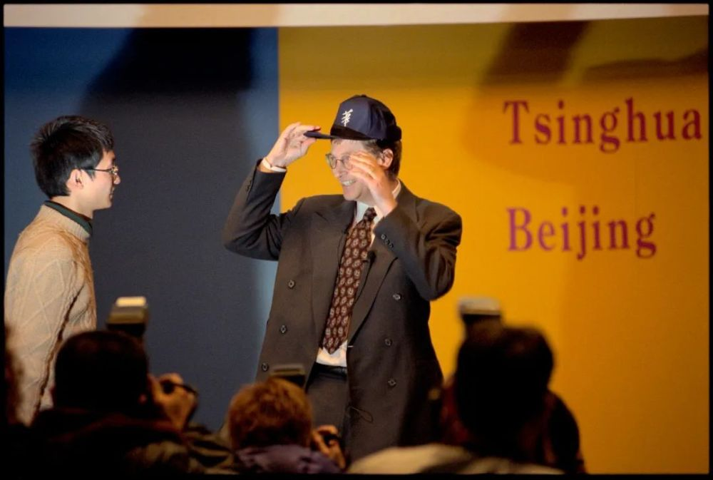
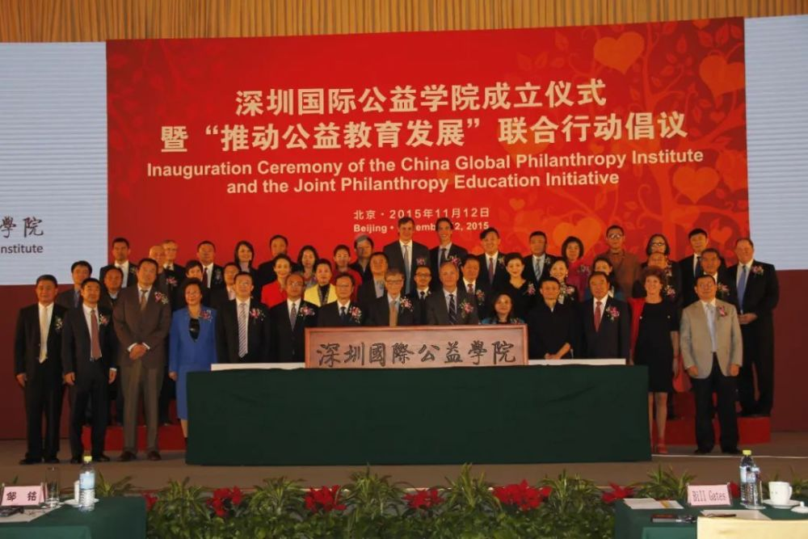

# 专访比尔·盖茨：我很想念中国

**划重点**

  * _1_ 盖茨已抵达北京，这是他自1994年以来的第十八次访华，也是自2019年以来的第一次访华。
  * _2_ 谈新冠：我们应该开发更好的诊断方法、更好的药物和更好的疫苗，并且要具备大规模生产这些工具的能力，以备不时之需。
  * _3_ 谈AI：任何一个新技术的出现，总是伴随着益处与风险。我们还需要做大量的工作，才能使之不断完善。
  * _4_ 谈中国：就营养、教育和预期寿命而言，中国都有了显著的进步。实际上，中国应该是过去50年中在这些领域中进步最快的国家之一。
  * _5_ 谈访华：我非常希望回到中国，拜访我们的合作伙伴。我很想念中国，我也希望和伙伴们一起交流，在哪些领域我们取得了进步，而在哪些领域遇到了挑战。我对此非常期待。

我希望未来有更多的慈善家追随这份事业。

_2019年11月19日，阿布扎比，比尔·盖茨参加“Reaching
the Last Mile”论坛。图/Gates Archive/Christopher Pike_

6月14日晚，微软创始人、比尔及梅琳达·盖茨基金会联席主席比尔·盖茨抵达北京。

这是盖茨自1994年以来的第十八次访华，也是自2019年以来的第一次访华。

作为初代技术巨鳄，盖茨是微软的创办人，也是当今站在科技潮流尖端的ChatGPT的投资人。作为全球最知名的富豪之一，他曾连续十三年蝉联全球财富榜榜首的世界首富，在连年巨额捐赠后目前仍以1040亿美元的个人财富占据福布斯全球亿万富豪榜第6位。他另一个重要的身份是慈善家，多年来致力于消除全球发展不平等，曾联同沃伦·巴菲特发起“捐出半数身家”倡议，引发了人类历史上最慷慨的一次捐赠行动。

在此次到中国访问之前，盖茨在西雅图通过视频接受了《中国慈善家》总编刘婉媛的专访。采访内容涵盖人类发展难题、AI、慈善、中国以及他个人。

“我很想念中国。”盖茨在采访中说。

**关于全球健康**

**《中国慈善家》：盖茨先生，过去三年我们经历了一场新冠大流行危机，您认为这场危机已经过去了吗？您曾经预言过它的发生，那么这三年我们所经历的一切您都曾想到过吗？**

**盖茨：**
新冠疫情是一场巨大的灾难，导致全球2000多万人死亡，并造成了需要很长时间才能弥补的巨额经济损失，以及（这一代儿童与青少年）重大的学习损失，就连医疗卫生系统也不能很好地完成诸如保障疫苗接种覆盖率之类的工作。因此，我们仍然看到不少差距。

我希望不会再出现新的病毒变异株，带来更多问题。目前看来可能性不大。虽然当前还有一些确诊甚至死亡病例，但是和之前新冠在全球蔓延时相比，病例数已大幅下降。总体而言，世界大部分地区都已经走出疫情。

我对新冠疫情的主要看法和我在2015年的演讲基本一致。当时我预测可能会发生疾病大流行，而我们亟须做的就是提早投入、做好准备，以便能够迅速应对。

这次疫情给我们带来很多经验教训，比如：我们应该开发更好的诊断方法、更好的药物和更好的疫苗，并且要具备大规模生产这些工具的能力，以备不时之需。

现在正是关键时期，我们仍然对疫情记忆犹新，应该借机展开全球讨论，加强创新与合作，因为下一场大流行的死亡率有可能会远高于新冠。即使疫情不会频繁发生，但我们必须确保有充足的资源和演练，做到未雨绸缪。

虽然我们如今并不再需要整个世界都聚焦在疫情之上，但是各国仍应探讨全球（比如世界卫生组织）应对疫情的整体能力、各国应如何提高快速响应能力，以及疫情期间如何协调配合。

我认为明年是非常重要的一年。我们要趁着人们对疫情记忆犹新的时候，抓紧落实这些体系。我们当前拥有良好的应对地震、火灾和其他自然灾害的体系。而疫情往往发生的几率很低，这本身是一件幸事，但也正因如此，新冠疫情发生时我们并没有完备的应对体系。

**《中国慈善家》：在前一段时间的采访中您曾提及，与其去火星旅行，还不如把钱用来购买麻疹疫苗，每1000美元就能拯救一个人的生命。在您看来，我们人类所面临的难题，对抗疾病比移民火星更迫切是吗？仰望星空和脚踏实地，似乎您更倾向选择后者？**

**盖茨：**
对我而言，全球健康面临的挑战是如此巨大。比如非洲一些地方的孩子五岁前死亡的概率比富裕国家高50倍！我们应该将资源优先投入到抗击疟疾、结核病等造成严重健康不平等的领域。盖茨基金会正在与其他慈善组织和政府开展合作，优先推进这些方面的工作。我认为在把目光投向火星旅行之前，应该先推动全球健康领域的重大进步。

_比尔·盖茨。_

**《中国慈善家》：ChatGPT最近大热，但也有不少人质疑它所代表的AI可能会带来的风险。就连我9岁的儿子也想问您一个问题：AI和病毒，哪个对人类的未来发展威胁更大？**

**盖茨：**
任何一个新技术的出现，总是伴随着益处与风险。比如汽车的问世，直到今天仍有很多死亡事故是汽车造成的。人工智能有很多好处，比如促进教育。盖茨基金会支持的可汗学院正尝试利用人工智能技术提供个性化学习辅导。基金会还在研究如何通过人工智能技术为缺医少药的贫困国家提供医疗服务。

还有一个例子是人工智能超声检测，这项服务的费用未来将会变得十分低廉，可以甄别高风险的孕期状况，从而帮助准妈妈决定何时应该到医院寻求专业帮助。

现在的人工智能可以让计算机完成基本的读写任务，而这仅仅是个开始。我们还需要做大量的工作，才能使之不断完善。但即便如此，人工智能已经可以帮助提高很多人的工作效率，并解决一些重大的不公平问题。这些正是盖茨基金会关注的重点。当然，我们在利用这一重大技术进步的同时，也需要考虑安全问题。

**关于中国**

**《中国慈善家》：据媒体报道，您在今年1月接受访问时曾说，中国崛起是世界的巨大胜利。您这样认为的理由是什么?**

**盖茨：**
如果你回到八十年代，中国的人均收入并不比非洲高多少。如今，就营养、教育和预期寿命而言，中国都有了显著的进步。实际上，中国应该是过去50年中在这些领域中进步最快的国家之一。因此，我认为既然我们关心全人类，那么这其中的一些成功经验将使我们更好地支持非洲国家。那里的营养、教育和预期寿命与中国相比还有差距。

当不同的国家都得到提升时，当他们不断改进各自的教育、经济和卫生系统时，我们可以互相学习，让彼此的生活都变得更好。从造福每个人和全人类的角度出发，我们应该做到这一点。

在健康领域，没有一个国家能做到尽善尽美。同时，我们在帮助其他国家方面还可以更加慷慨一些。因此，我会把健康放在首位。以结核病为例，全球每年仍有约150万人死于这种疾病。十多年前，中国是世界上结核病死亡人数最多的国家，这些年中国在结核病防治领域取得了长足进步，死亡人数大幅下降，现在降到了世界第三。这很好地说明了中国在改善本国国民健康方面的成果也将惠及全世界。

再举一个例子。我们一直希望研发出更好的结核病药物，因为现在的患者治疗需要服药9个月，很难坚持下来，因此常常导致疾病复发。盖茨基金会正在和位于北京的全球健康药物研发中心（GHDDI）等伙伴一起，开发能够缩短疗程、避免产生耐药性的新药。创新是如此的重要。

中国在结核病领域已经取得重大进展，也能够通过贡献创新成果，如结核病药物，让全世界受益。

_2010年9月30日，北京，沃伦·巴菲特（左）与比尔·盖茨在Dairy
Queen新店内。_

**《中国慈善家》：距离您上一次访华已经有4年时间了，您对再次来中国访问有什么期许吗？目前中国的哪个领域的发展是您最为关注的？**

**盖茨：**
我非常希望回到中国，拜访我们的合作伙伴。我很想念中国，我也希望和伙伴们一起交流，在哪些领域我们取得了进步，而在哪些领域遇到了挑战。我对此非常期待。

盖茨基金会最大的两个工作领域是健康和农业。我们希望借助创新的力量，与各方协作，帮助非洲和其他地区的一些国家。我们与中国的合作伙伴关系让我们能在这方面大有所为。非洲国家对此也很有兴趣。这是我们首要的工作。

**《中国慈善家》：作为一位慈善家，您如何看待和评价中国慈善事业的发展？**

**盖茨：** 我对美国的慈善行业比较熟悉。在美国，慈善拥有非常强大的力量，能够为诸如以推动农业技术进步为目标的绿色革命，以及学校教育等众多领域提供资助。

很显然，中国的慈善行业会有自己的发展道路，而盖茨基金会将全力提供所需的支持。今年如果我能够访问中国，我希望能有机会和伙伴们坐下来，好好听一听大家对慈善的看法。和美国不一样，很多国家的慈善行业规模并不大。例如在欧洲大陆，慈善并非一支强大的力量，并且其慈善活动大多集中在文化领域，如博物馆等等。

我个人很热衷于慈善，很多国家也都提倡慈善，尤其是在那些有很多成功人士的国家，他们往往会通过回馈社会获得成就感。这样的做法是否得到了激励？哪些领域鼓励慈善的参与？我很期待了解人们如何看待慈善在中国的发展，以及基金会如何可以提供支持。

_1997年12月12日，北京清华大学，计算机系学生向比尔·盖茨赠送太阳帽。_

**关于基金会**

**《中国慈善家》：盖茨基金会2023年的预算达到83亿美元，这是基金会历史上最大规模的年度预算。根据计划，你们的目标是在2026年将年度支出提升到90亿美元。这样的规划目标是基于什么判断？对于基金会如何花钱、花多少钱，您在决策时觉得最大的挑战是什么？**

**盖茨：**
基金会在增加年度支出，因为多重全球危机的叠加正在减缓、甚至逆转健康、粮食安全和发展领域的进展。数百万人的生命受到威胁。面对我们这个时代的重大危机，所有人都需要付出更多的努力。过去二十年里，全球在消除可预防疾病和减少贫困方面取得了长足进步。而如今至关重要的是，如何不失去这一积极的发展势头。

危机带来的影响，也波及到了对我们所关注的相关领域的资源投入。对全球经济更加悲观的预期正在给政府预算带来严重压力，尤其是在中低收入国家。他们面临权衡与取舍，使得对社会服务，以及重要的健康和教育项目的预算投入面临缩减的风险。

这些不是慈善组织凭一己之力就可以应对的挑战，但至少通过增加基金会的支出，我们可以加快推进一些重要工作，从而填补短期缺口，并为之后的长期进展铺垫道路。

**《中国慈善家》：您能谈谈对基金会长远未来的规划吗？您预计这项事业会持续多久？您是否计划在几十年后找一位继任者把这项事业继续下去？**

**盖茨：** 我们基金会的管理文件有相关规定，就是基金会的资产将在梅琳达、沃伦·巴菲特或我本人去世后的 20
年内使用完毕。这是我们从创立之初就做出的设定。

梅琳达和我认为，正确的方式是将基金会的工作重点放在 21
世纪，并在应对当前的挑战上发挥我们所能发挥的最积极影响。盖茨基金会的一个主要目标是终结导致世界不公平的疾病和贫困，慈善对于这些努力至关重要。

我希望未来的慈善家能够追随，并为应对明天的挑战贡献他们的能量和资源。

_2015年11月12日，北京，比尔·盖茨参加深圳国际公益学院成立仪式。摄影/本刊记者
张旭_

**关于个人**

**《中国慈善家》：恭喜您刚刚当上了姥爷。您曾如此写道，“光是在电脑上打出‘我当姥爷了’这句话都让我感到激动”。这个新的身份对您来说意味着什么？**

**盖茨：**
当有了孙辈以后，你会更清楚地认识到那些关乎全球未来的问题有多重要，不论是环境问题，还是健康或教育问题。我的孙辈会长大，他们很可能会见证下一个世纪的到来。因此，像气候挑战这类影响全球未来的问题，就变得非常严峻。如果我们没能解决好，环境就会严重恶化。这将为我们的子孙后代留下一个困难重重的未来。

这让我深刻地意识到，就算有些长期项目在我有生之年都无法完成，但它们仍然有着深远的意义。盖茨基金会致力的很多领域都需要深耕数十年，比如治愈艾滋病、根除疟疾和应对气候变化等等。当你意识到自己所爱的人未来将会经历这些挑战时，你就会获得解决这些问题的强大动力。

**《中国慈善家》：大家都觉得您特别成功，那么您有没有挫败感？您会如何处理这种情绪？**

**盖茨：**
我有一些自己擅长的领域。我有幸接受了良好的教育，擅长解决数学、科学等类型的问题。但有很多领域，我并不擅长。因此，我必须有意识地搭建团队，广纳各领域的人才。

早年在微软，我就聘请了很多杰出人才；现在在基金会，我们拥有具备更多元背景和专长的员工，大家朝着远大的目标共同努力。我必须保持谦卑，时刻明确自己应扮演的角色和所擅长的工作。

我们面临的很多挑战，比如根除脊髓灰质炎，是我们希望在十年前就解决的问题。我们必须常常扪心自问：我们能否成功？如果我们能够很好地利用手中的资源，就能拯救数百万人的生命。但如果选择了根除脊髓灰质炎这样的目标却无法实现，那就意味着资源配置发生了严重的偏差。我必须自我反省：这些决定是否正确？是否考虑了所有不同的观点？我是否对一些做法过于固执己见？

不论是在微软，还是在盖茨基金会，有很多事未能取得成功。这让我反问自己：为什么会失败？我能否在这个领域有所改善？

有一点是，我一直以来都一刻不停地工作。现在随着年龄慢慢增长，我对待工作的方式也更加平和。过去几十年，我改变了很多。

**《中国慈善家》：中国的很多年轻人，尤其是年轻的创业者，把您当作他们的偶像和榜样，您对他们有什么建议？除了努力工作，成功的关键因素还有哪些？**

**盖茨：** 我仍然认为科学创新将产生最深远的影响，不论是人工智能，还是气候、健康或者教育辅助科技。我刚才提到人工智能很可能将为教育提供帮助。

如果在中国，有人对健康、气候相关的科技或人工智能有热情，哪怕年龄还小，我也会鼓励他们潜心钻研。我非常幸运在自己13岁的时候，就开始使用电脑。随着我的思维不断成长，我得以在这个领域持续扩展。我在那段时间积累的软件开发经历，为我后来创立微软打下了良好的基础。

因此，找到一个复杂的难题，把它变成你的兴趣，成为这一领域的专家，深入了解前沿知识。虽然解决问题需要拥有不同技能的人一起合作，但在改善世界方面，我认为科学和工程仍具备最大的潜力。

作者：刘婉媛

图片来源：视觉中国

图片编辑：张旭

值班编辑：邱宇

