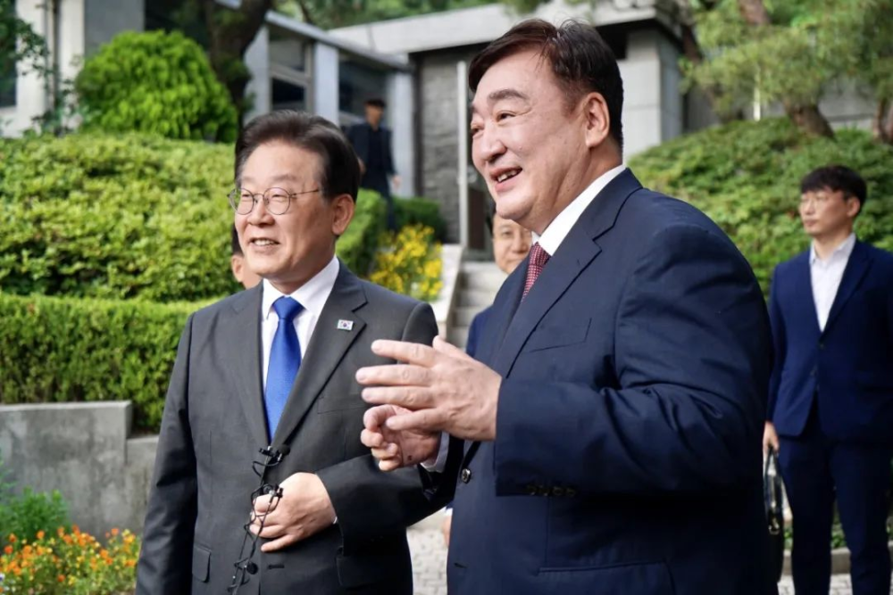
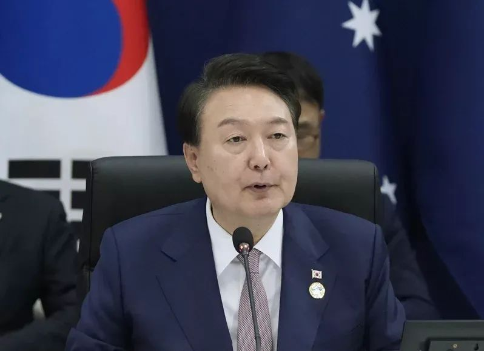
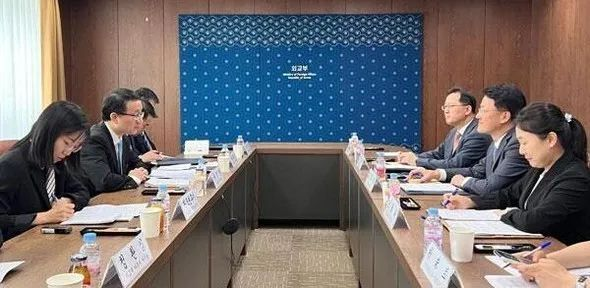

# 中国大使一番大实话，为啥让尹锡悦政府急眼？

韩国政府这两天很激动。

韩国外交部第一次官张虎镇9日召见中国驻韩国大使邢海明，抗议邢大使前一天会见韩国最大在野党共同民主党党首李在明时关于中韩关系的言论。

接下来，韩国外交部长官朴振以及国家安保室室长赵太庸、第一次长金泰孝等总统府高级官员纷纷跳出来。13日，总统尹锡悦更是“亲自”下场，在闭门国务会议上质疑邢海明身为外交官是否具备“相互尊重和增进韩中友谊的态度”，称邢大使的言行令韩国国民不悦。

**邢大使到底说了什么话，让韩国政府如此急眼？**

根据中国驻韩大使馆网站发布的新闻稿，邢大使同李在明就中韩关系、朝鲜半岛问题等进行交流，说了七段话，将近1600字。令韩国政府和保守派媒体最为气急败坏的，是这几句：

“美国正竭力打压中国，有的人赌美国赢、中国输，这显然是误判，没看清历史大势……现在赌中国输的人今后一定会后悔。”

这番大实话，可能是一下子戳到了尹锡悦政府痛处，以致于韩政府官员接连出场，指责邢大使“发表歪曲言论”“干涉韩国内政”“批评韩国政策”，甚至警告“一切后果须由大使本人承担”。保守派执政党国民力量党甚至有人鼓动驱逐邢大使。

尹锡悦去年3月当选时说“将在相互尊重的基础上发展韩中关系”，如今指责邢大使没有“相互尊重”的态度，但其自身所作所为却没有表现出对中国的应有尊重。

韩国政府应深知，台湾问题是中国核心利益中的核心，但在今年4月20日，尹锡悦接受路透社采访时，照着美国的台词，妄称台海紧张局势因中国“试图用力量改变现状”而产生。尹锡悦还错误地把两岸关系与韩朝关系相提并论，声称台湾问题不单纯是两岸之间的问题。

这一言论对韩中关系造成严重负面影响。中国外交部发言人回应： **解决台湾问题是中国人自己的事，不容他人置喙。**

在尹锡悦看来，只有加强韩美同盟才能让中国“尊重”韩国。中方尊重韩国的外交政策，对韩方同美国、日本及其他国家发展关系不会干涉。但韩美关系的发展不能以损害中韩关系和中国利益为代价。

**从韩国近期亲日媚美“一边倒”外交看，尹锡悦就是引狼入室，试图与中国为敌。**

尹锡悦4月访美期间，美韩发表《华盛顿宣言》，多处直指中国。美国承诺扩大对韩“核保护伞”，包括向朝鲜半岛附近海域机动部署战略核潜艇。这将是自1991年冷战结束以来美军战略核潜艇首次重回韩国。

尹锡悦政府本月7日发布的新版韩国“国家安保战略”文件称，“韩美军事同盟已经进化为包括核武器在内的新模式”。然而，这种做法是在制造紧张局势，损害他国战略安全利益，与维护半岛和平稳定、推进半岛无核化目标背道而驰。

尹锡悦政府在加强韩美同盟的同时，把自己绑上了美国的反华战车。

**相互尊重还离不开信守承诺，包括韩方在萨德问题上的承诺。**

韩国上任总统文在寅执政时期，为避免韩中关系因萨德问题持续恶化，代表韩国政府作出“三不一限”承诺，即韩方承诺不追加部署“萨德”，不让韩美日安全合作发展为三方军事同盟，不参与美国主导的导弹防御体系，对已经在韩部署的“萨德”系统限制实际使用。

尹锡悦上台后，韩国外交部称“三不一限”是文在寅政府所说，希望中方不要频繁提起，否则对两国关系发展不利。后续，尹锡悦政府公然宣称“三不一限”不是韩方作出的承诺、也不是韩中达成的协议，并着手推进“萨德”系统部署的“正常化”。

就在本月初举行的香格里拉对话会上，韩美日举行三方国防部长会谈，商定年内实现关于朝鲜导弹预警信息的三方实时共享。

三方实时共享、信息系统互联，意味着韩美日安全合作向三方军事同盟、整合进美国反导体系迈出了一大步。 **尹锡悦政府正在一步步掏空“三不一限”承诺。**

中韩经济关系也同样遭遇逆风。

韩国连续15个月出现贸易逆差，对华出口连续12个月萎缩，对华贸易逆差扩大。韩国保守派媒体《中央日报》说，由于中美贸易战，全球价值链正在被歪曲或瓦解，韩国中间产品渗透中国市场的缝隙越来越窄。韩国的技术优势也在动摇。韩业界有言论称：“现在（韩国对华贸易）只剩下半导体了。”

然而，就是这唯一的优势，也因为尹锡悦政府不顾本国企业利益加入美国围堵中国的“芯片四方联盟”而一路下跌。正如邢大使所说，
**韩国对华贸易逆差扩大，一方面有全球经济形势不佳、半导体进入下行周期因素等客观原因，更主要的是有些人试图推动“去中国化”所导致。**

《韩民族日报》认为，在尹锡悦政府看来，如果今年下半年以东道主身份举办第九次韩中日领导人会议，与中国的矛盾就会自然解决，可迄今连工作磋商日期等对话头绪都还没有找到。尹锡悦的发言就像是为了向美国证明忠诚而刺激中国，从而不断加剧韩中关系紧张。

**需要指出的是，对于韩方种种不友好举动，中方迄今保持克制，仅仅在外交层面予以告诫。**

本月6日联合国大会选举2024-2025年度安理会非常任理事国时，中国对韩国投了赞成票。韩国却得意忘形，外长朴振9日声称要敦促中国和俄罗斯在安理会为应对朝鲜挑衅发挥作用。

据《韩民族日报》报道，上月访韩的中国外交部亚洲司司长刘劲松在韩中外交司局级磋商中向韩国政府传达了“四不可”立场。

对于这个消息，韩国总统府高官断然否认。中国外交部发言人毛宁对此表示，最近中韩关系面临困难和挑战，责任不在中国。

正如邢大使所说，中国巨大市场摆在那儿，对外开放的大门始终敞开。希望韩国在处理与中国关系时摆脱外部因素的干扰，相信只要韩方坚定对华合作信心，顺应中国市场和产业结构变化，及时制定并调整对华投资战略，就一定能继续分享中国经济增长的红利。

相反， **看不清历史大势，把韩国国运拿来赌美国赢、中国输，今后一定会后悔。**

来源：“伍之管见”微信公众号

