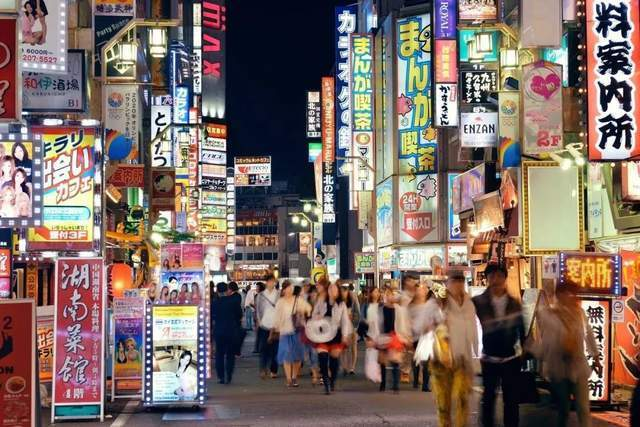

# 低欲望的日本人，正在走出“失去的30年”

**日元的避险属性以及“巴菲特效应”，吸引了大量外资进入日本股市。增量资金入场，直接推动本身就具有估值优势的日本股市，走出了这一轮轰轰烈烈的大牛市。**

**冰川思想库特约撰稿丨周隆斌**

在全球经济一片阴影之下，有关高通胀、衰退的话题不绝于耳，但是日本的表现却显得“鹤立鸡群”。

6月14日，日经225指数收涨1.47%，报收33502.42点，为连续第四个交易日收涨。本周二，日经225指数自1990年以来首次突破33000点。

**今年以来，日本股指“一路狂飙”** ，日经225指数迈入牛市，累计涨幅超28%，秒杀一众年内涨幅不足20%的欧洲主要股市指数，牛冠全球。

_▲日经225月线图（图/网络）_

2021年元旦，《日本经济新闻》一则报道提到，按历史周期理论和康波理论，今年或将成为日本历史新阶段的开端。

日本能否率先复苏，走出“失去的30年”，日本股市的表现或可窥见一斑。

01

回顾日本过去三十多年的经济发展，让人感觉一直是踯躅不前，甚至连天空都是灰蒙蒙的色调。走在街头上的男女，看着都是一副低欲望的模样。

三十多年，这个国家坐上了一趟落差巨大的过山车，从高潮直接跌落谷底，影响了整整几代人。

二战后，日本在美国的经济援助下，进入了一段经济发展的黄金时期。

直到1985年，日本为了推动日元国际化，签订了《广场协议》。 **随后，在不到三年的时间里，日元对美元升值了一倍。**

作为典型的出口导向型经济，日元升值令出口产品物美价廉的优势迅速消失，对出口贸易带来了灾难性的打击。无奈之下，日本政府采取了一系列的财政刺激政策，大规模“放水”，希望刺激内需以提振经济。

事与愿违，流动性过度充裕的日本经济开始脱实向虚，楼市和股市接纳了大量热钱后一路飙升。

日本富豪当时宣称，我们可以买下整个美国的房产，然后再把它们高价租给美国人。1990年，仅东京都区域的地价就相当于美国全国的总地价。

彼时，他们还没有意识到， **所有命运馈赠的礼物，都早已在暗中标好了价格。**

_▲日本东京的东京塔（图/图虫创意）_

1990年3月，日本大藏省发布《关于控制土地相关融资的规定》，对土地金融进行总量控制，日本央行也开始缩紧银根，主动刺破经济泡沫。

楼市暴跌，股市崩盘，银行不良资产率激增，债务危机在日本蔓延。据日本野村证券首席经济学家辜朝明测算，日本企业和家庭在随后连续15年内，都将主要收入用于还债，经济发展自然无从谈起。

直到2012年，第二次担任日本首相的安倍晋三上台，推出了“三支箭”政策，即宽松的货币政策、积极的财政政策和结构性改革。

安倍的政策刚开始来看似乎是失败的。在他执政期间，日本GDP平均增速为0.9%，远低于2%的预设目标。并且，日本老龄化问题凸显，整体科技水平缺乏创新突破，部分科技产业出现了明显滑坡。

**但是，通过这一套“安倍经济学”，日本成功走出长期通缩。**
安倍是日本执政时间最长的首相，这也使得政策保持了连贯性，逐渐扭转了社会对于经济增长停滞的预期。

与此同时，日本上市公司的ROE（净资产收益率）开始缓慢提升，盈利能力同步修复。受限于疲软的宏观经济，日本股市长年被低估，成为全球股市的“价值洼地”，这给现在的一路上涨奠定了基础。

02

日本人怎么也没有想到，日股的“白衣骑士”居然是来自大洋彼岸的一个92岁老头。

2020年8月，全球股市受疫情影响重创后，“股神”巴菲特动用约60亿美元买入日本五大商事集团的股票。

今年4月，巴菲特访问日本时向媒体透露，伯克希尔·哈撒韦在伊藤忠商事等日本五大商社的持股比例已从2020年的5%左右上升至7.4%。
**这是公司在美国以外的最大投资。**

巴菲特对日本股市毫不掩饰地看好，迅速吸引了一众华尔街大佬相继造访日本，大量外资流入日本股市。

日本股市开始春潮涌动。

_▲沃伦·巴菲特（图/图虫创意）_

这些资金只是在追随“偶像”的步伐么？当然不是。

当影响全球金融体系的事件发生后，日本投资者会通过出售国外资产换回日元，增大了日元需求，从而推动日元汇率上涨。

而日本央行长年维持零利率甚至负利率，日本国内通胀水平也一直不高，这意味着借入日元所需成本微乎其微。

作为世界第三大经济体的日本，拥有高度发达的金融市场以及充足的外汇储备，这为日元提供了良好的流动性。

**这三者因素相叠加，让日元成为一大避险货币。**

从去年开始，欧美经济体可能滑向衰退的警报响起。于是，大量海外资金购入日元避险。本着“金钱永不眠”的原则，部分资金开始流入日本股市。今年3月，欧美银行危机爆发，更是加速了这一进程。

2023 年 3 月 31
日，东京证券交易所发布《关于实现关注资金成本和股价经营要求》。其中明确提出，鼓励上市公司进行股票回购，进行市值管理，注重资本回报率。

监管部门下场喊话，成为这轮日股牛市的最后一块拼图。

日元的避险属性以及“巴菲特效应”，吸引了大量外资进入日本股市。增量资金入场，直接推动本身就具有估值优势的日本股市，走出了这一轮轰轰烈烈的大牛市。

03

证券教父安德烈·科斯托拉尼在著作《一个投机者的告白》中提到，有一个人牵着绳子出门溜狗，狗一会跑到主人前面，一会跑到主人后面，很少有同步的时候。但只要人牵着绳子一直往前走，狗最后还是会跟着一起到达终点。

这恰如其分地表达了股市与经济的内在关系，来回奔跑的“狗”代表着股市的上下波动，而“主人”则是经济形势。

**日本这次牛市背后最大的逻辑，恰恰是日本经济多年以来出现了难得的复兴迹象。**

从2021年4月起，日本CPI（消费者物价指数）同比增速一路小幅上行，今年4月同比增速达到4.1%，创下1981年以来的最高值。

CPI上行，意味着日本通胀率走高。需要说明的是，通胀并不是什么“洪水猛兽”，温和的通胀表明宏观流动性略多于商品，货币小幅贬值会提高居民消费意愿，毕竟谁也不希望手中的钱“不值钱”了。

消费增多带动需求提升，企业扩产信心提高，从而提振劳动力市场表现，增厚居民收入，反过来又促进居民消费意愿增强，形成一个良性循环。

所以，全球多数央行将2%定为CPI目标， **日本央行过往使出浑身解数都无法提振的CPI，如今终于有了一些起色。**

每年3月，日本公司都会与工会举行工资谈判，敲定新财年的员工工资调整方案。这场“春季工资斗争”，被日本民间称为“春斗”。

据悉，今年预计“春斗”的结果，可能会出现26年来的最大涨薪潮。任天堂此前已经宣布将全体员工基本工资统一上涨10%，优衣库更是为员工最高上调工资40%。

另外，根据《日本经济新闻》调查，2023年4月入职的大学毕业生的起薪同比增长了2.2%，是2010年以来的最高涨幅。

_▲日本东京歌舞伎町（图/图虫创意）_

从衡量经济最直观的数据GDP上看，日本内阁府公布的一季度实际GDP终值为环比增长0.7%，折合年率增长2.7%，远高于市场预期值1.9%。

从上面种种数据上看，日本经济展现出了多年未见的复苏迹象。

**不过，这并不意味着，日本的经济发展从此后就是一路坦途。**

对于早已进入人口负增长阶段的日本，长期停滞的经济，让年轻人早已习惯用“躺平”的方式，对现实妥协。当年安倍未能解决的很多问题，时至今日依旧存在。

“人类从历史中学到的唯一的教训，就是没有从历史中吸取到任何教训。”日本股市火了，经济出现复苏迹象，这会不会又只是一轮资本的短暂狂欢？

