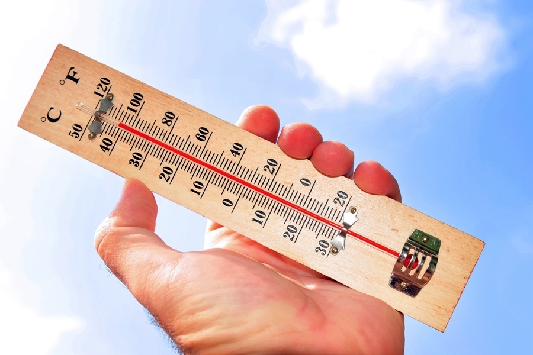

# 冲击40℃！28省份可领高温津贴：海南连发7月，多地10年没涨

中新经纬6月15日电 (熊思怡)炎夏来袭，多地“打工人”6月起可领高温津贴，快看看你能领多少？

中央气象台14日预报，未来三天，华北东部、黄淮及新疆、甘肃西部、内蒙古西部等地
**部分地区有35~39℃的高温天气，新疆吐鲁番等地最高气温将超过40℃。**

国家安全监管总局等规定，用人单位安排劳动者在35℃以上高温天气从事室外露天作业以及不能采取有效措施将工作场所温度降低到33℃以下的，应当向劳动者发放高温津贴，并纳入工资总额。

多地月标准达300元

据不完全统计，28省份已公布高温津贴发放标准，多数按月或按天发放。其中，河北省较为特殊，按小时发放高温津贴：室外露天作业的劳动者2元/小时；没有防暑降温设备或有设备但达不到降温效果的室内劳动者1.5元/小时。

**对比月标准，江西“打工人”高温津贴最高！室外高温不低于300元/月**
，室内非高温不低于200元。此外，上海、江苏、浙江、广东、广西5省份“打工人”高温津贴可达300元/月。

**对比日标准，陕西“笑傲群雄”达25元；新疆紧随其后，高温津贴上限可达20元；**
四川位列第三，日津贴上限为18元；另有不少省份日标准在10~15元区间。

值得一提的是，青海省人社厅2021年曾在官网发文称，由于属于高原大陆性气候，夏季平均气温偏低通常达不到35℃以上的高温天气，
**青海省尚未出台过防暑降温费和高温补贴发放的相关政策** 。

6月14日，中新经纬致电青海省人社保障服务热线12333，工作人员确认，由于夏季平均气温较低，近年依然没有高温津贴相关政策发布。

海南连发7个月

从发放时间来看，多数省份在6-9月发放高温津贴，海南、广东等省份发放时间更长。

其中， **海南省连发7个月高温津贴**
：每年4月1日至10月31日，用人单位按10元/人·天的标准向在35℃以上(含35℃)高温天气从事室外露天作业以及不能采取有效措施将工作场所温度降低到33℃以下(不含33℃)的劳动者发放高温津贴。

**广东、福建高温津贴发放时长可达5个月**
，但时间稍有差异。其中，广东明确，6~10月每人每月可领300元。福建则规定，5月按实际高温天数，依照12元/天标准计发；6~9月按260元/月或12元/天标准。

_资料图：温度计 图源：包图网_

部分省份10年未上调

在已公布高温津贴的省份中，部分省份发放标准已多年没有上调。根据湖南当地媒体5月报道，该省至今沿用2005年制定高温津贴标准；新疆、云南等省份尚在执行2012年或2013年制定的标准。

**高温津贴是否该涨涨？**
首都经济贸易大学劳动经济学院副教授、中国新就业形态研究中心主任张成刚接受中新经纬采访时表示，高温津贴本质上是企业为补偿劳动者在高温中福利损失的补偿性支付，其用意在于约制企业在高温条件下过度使用劳动力，从而减少高温给劳动者带来的伤害，是一种社会性保护措施。

张成刚认为，高温津贴应根据劳动者工资水平进行上调，以发挥补偿性作用。公共部门应根据地方劳动力市场运行情况对高温津贴进行调整，以达到保护目的。

盘古智库高级研究员江瀚告诉中新经纬，高温津贴是保障劳动者权益的一种措施，其目的是缓解高温天气对劳动者身体和生产生活的影响。然而，由于长期未进行调整，部分省份高温津贴的标准已经无法满足当前的实际情况，应该适时调整。

需要注意的是， **高温津贴是劳动者的法定报酬待遇，并非用人单位自设的“福利”。**
对于享受高温津贴的劳动者，用人单位若出现拖欠、未足额支付等情形，劳动者可依法申请仲裁、向法院申请支付令或向劳动监察大队等相关部门进行投诉。(中新经纬APP)

**中新经纬版权所有，未经书面授权，任何单位及个人不得转载、摘编以其它方式使用。**

