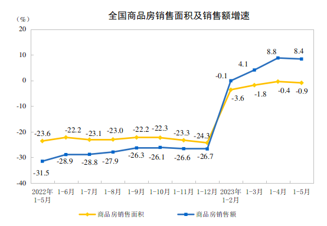

# 国家统计局：1-5月房地产开发投资同比下降7.2%，商品房销售额增长8.4%

**一、房地产开发投资完成情况**

1—5月份，全国房地产开发投资45701亿元，同比下降7.2%（按可比口径计算，详见附注6）；其中，住宅投资34809亿元，下降6.4%。

1—5月份，房地产开发企业房屋施工面积779506万平方米，同比下降6.2%。其中，住宅施工面积548475万平方米，下降6.5%。房屋新开工面积39723万平方米，下降22.6%。其中，住宅新开工面积29010万平方米，下降22.7%。房屋竣工面积27826万平方米，增长19.6%。其中，住宅竣工面积20194万平方米，增长19.0%。

**二、商品房销售和待售情况**

1—5月份，商品房销售面积46440万平方米，同比下降0.9%，其中住宅销售面积增长2.3%。商品房销售额49787亿元，增长8.4%，其中住宅销售额增长11.9%。

5月末，商品房待售面积64120万平方米，同比增长15.7%。其中，住宅待售面积增长15.9%。

**三、房地产开发企业到位资金情况**

1—5月份，房地产开发企业到位资金55958亿元，同比下降6.6%。其中，国内贷款7175亿元，下降10.5%；利用外资13亿元，下降73.5%；自筹资金16267亿元，下降21.6%；定金及预收款19878亿元，增长4.4%；个人按揭贷款10354亿元，增长6.5%。

**四、房地产开发景气指数**

5月份，房地产开发景气指数（简称“国房景气指数”）为94.56。

**附注**

1.指标解释

房地产开发企业本年完成投资：指报告期内完成的全部用于房屋建设工程、土地开发工程的投资额以及公益性建筑和土地购置费等的投资。该指标是累计数据。

商品房销售面积：指报告期内出售新建商品房屋的合同总面积（即双方签署的正式买卖合同中所确认的建筑面积）。该指标是累计数据。

商品房销售额：指报告期内出售新建商品房屋的合同总价款（即双方签署的正式买卖合同中所确认的合同总价）。该指标与商品房销售面积同口径，也是累计数据。

商品房待售面积：指报告期末已竣工的可供销售或出租的商品房屋建筑面积中，尚未销售或出租的商品房屋建筑面积，包括以前年度竣工和本期竣工的房屋面积，但不包括报告期已竣工的拆迁还建、统建代建、公共配套建筑、房地产公司自用及周转房等不可销售或出租的房屋面积。

房地产开发企业本年到位资金：指房地产开发企业报告期内实际用于房地产开发的各种货币资金及来源渠道。具体细分为国内贷款、利用外资、自筹资金、定金及预收款、个人按揭贷款和其他资金。该指标是累计数据。

房屋施工面积：指房地产开发企业报告期内施工的全部房屋建筑面积。包括本期新开工的面积、上期跨入本期继续施工的房屋面积、上期停缓建在本期恢复施工的房屋面积、本期竣工的房屋面积以及本期施工后又停缓建的房屋面积。多层建筑物的施工面积指各层建筑面积之和。

房屋新开工面积：指房地产开发企业报告期内新开工建设的房屋面积，以单位工程为核算对象。不包括在上期开工跨入报告期继续施工的房屋建筑面积和上期停缓建而在本期复工的建筑面积。房屋的开工以房屋正式开始破土刨槽（地基处理或打永久桩）的日期为准。房屋新开工面积指整栋房屋的全部建筑面积，不能分割计算。

房屋竣工面积：指报告期内房屋建筑按照设计要求已全部完工，达到住人和使用条件，经验收鉴定合格或达到竣工验收标准，可正式移交使用的各栋房屋建筑面积的总和。

2.统计范围

有开发经营活动的全部房地产开发经营法人单位。

3.调查方法

按月（1月份除外）进行全面调查。

4.全国房地产开发景气指数简要说明

全国房地产开发景气指数（简称“国房景气指数”）遵循经济周期波动的理论，以景气循环理论与景气循环分析方法为依据，运用时间序列、多元统计、计量经济分析方法，以房地产开发投资为基准指标，选取了房地产投资、资金、面积、销售有关指标，剔除季节因素的影响，包含了随机因素，采用增长率循环方法编制而成，每月根据新加入的数据对历史数据进行修订。国房景气指数选择2012年为基年，将其增长水平定为100。通常情况下，国房景气指数100点是最合适的景气水平，95至105点之间为适度景气水平，95以下为较低景气水平，105以上为偏高景气水平。

5.东、中、西部和东北地区划分

东部地区包括北京、天津、河北、上海、江苏、浙江、福建、山东、广东、海南10个省（市）；中部地区包括山西、安徽、江西、河南、湖北、湖南6个省；西部地区包括内蒙古、广西、重庆、四川、贵州、云南、西藏、陕西、甘肃、青海、宁夏、新疆12个省（市、自治区）；东北地区包括辽宁、吉林、黑龙江3个省。

6.同比增速说明

房地产开发投资、商品房销售面积等指标的增速均按可比口径计算。报告期数据与上年已公布的同期数据之间存在不可比因素，不能直接相比计算增速。主要原因是：（一）加强在库项目管理，对退房的商品房销售数据进行了修订。（二）加强统计执法，对统计执法检查中发现的问题数据，按照相关规定进行了改正。（三）加强数据质量管理，剔除非房地产开发性质的项目投资以及具有抵押性质的销售数据。

