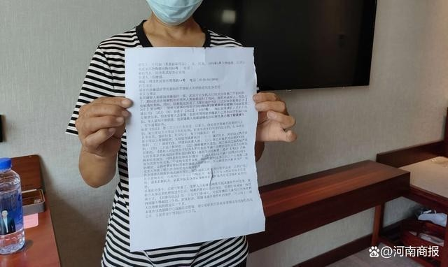

# 女子称13岁时遭强奸后怀孕引产，报案近3年嫌疑人尚未受审

河北武安女孩小花（化名）在网络上反映称，2020年底，时年13周岁的她遭男子郭某某强奸，后怀孕引产。事发至今已近3年时间，郭某某仍未受审。

为小花提供法律援助的一名律师告诉澎湃新闻，案发后武安市公安局进行了刑事立案。另有知情人士称，检察机关当时没有批捕嫌疑人郭某某，原因是郭某某当时不知小花不满14岁，郭某某后被取保候审。

6月14日，小花向澎湃新闻表示，数天前她收到武安市检察院送来的审查起诉阶段的未成年被害人诉讼权利义务告知书；有当地政府部门人员向其透露，郭某某已被羁押。

针对小花上述说法，澎湃新闻多次联系武安市公安局及武安市检察院，截至发稿未获回应。

_@河南商报 图_

**女孩称13岁时遭强奸**

小花称，其出生于2007年6月。她告诉澎湃新闻，她与郭某某是在社交软件上相识的。2020年11月28日，两人相识约一个月后，郭某某以帮助她找工作为由约其见面。

“当时给我打好车了让我过去，我上了车就被拉到了一个电竞酒店。”小花称，进入房间后，郭某某强行与她发生了性关系，“他拽着我”，小花称，郭某某当时知道她的实际年龄不满14岁，她并不知道郭某某的具体年龄，“但肯定是成年的”。

小花告诉澎湃新闻，郭某某与她在一起待了近半个月时间，“从第一个电竞酒店出来之后，又去过三四个宾馆，他还把我带到过他家。”

她称，在郭某某家中，她见到了郭某某的父母、弟弟及一个男童，后来她询问得知，男童系郭某某的孩子，郭某某已离异。小花称，当时郭某某并未向家人介绍她的身份，“他家里人应该问了，但他（郭某某）没当着我的面跟他们介绍我。”

小花说，在这近半个月的时间里，她的家人一直联系不上她。那时父母确实多次联系她，但她没有接听电话，“我害怕，郭某某威胁我说要把这个事告诉我家里人。”

据顶端新闻此前报道，一份小花父母的回忆笔述显示，2020年11月28日下午，他们发现孩子丢失；2020年12月12日，他们找到小花。

小花告诉澎湃新闻，郭某某最后联系了她的姑姑，并把她送回了姑姑家。至于郭某某为何能联系到其姑姑，小花称已记不清细节。

**得知怀孕后报警**

小花说，回到家后的她没有告诉父母实情。直到事发半年，2021年6月，父母发现她已怀孕7个月，她才告诉父母，父母随即向当地公安局报案。

“我不知道自己怀孕了，那段时间也没再和郭某某联系过。”小花说。医院记录显示，2021年6月24日，小花腹中的孩子被引产。

为小花提供法律援助的一名律师告诉澎湃新闻，当时武安市公安局进行了刑事立案。

澎湃新闻获悉，2021年12月14日，武安市检察院曾分别向小花及作为其法定代理人的母亲牛某某，发送了针对郭某某涉嫌强奸罪案的询问及到场通知书。此外，武安市检察院还向小花父母发了一份《督促监护令》。其中写道，武安市检察院在办理案件中发现小花家庭经济一般，父母忙于工作，怠于履行监护职责，且忽视教育重要性，致使其过早辍学，踏入社会的洪流，结交不良朋友，容易受人引诱，没有树立正确人生价值观及恋爱观，导致行为偏差，最终耽误自己青春。武安市检察院督促小花父母履行相应监护职责。

武安市检察院在本案审查逮捕阶段，还曾向小花下发了《未成年被害人法定代理人诉讼义务权利义务告知书》。有知情人士告诉澎湃新闻，后来检察院没有批准逮捕郭某某，理由是案发时郭某某不知道小花不满14岁，后郭某某被取保候审。

2022年6月份，武安市公安局向小花父母出具了一份鉴定意见通知书，通知书显示，经DNA鉴定，郭某某是小花腹中胎儿的生物学父亲。

小花称，大约在2022年，郭某某母亲曾来联系她妈妈，希望小花能出具谅解书，被小花母亲拒绝，此外两方再没有过其他联系。6月14日，小花母亲表示没有留存郭某某母亲电话，未能提供给记者。

**嫌疑人“已经被关起来了”**

让小花一家人不解的是，事情发生至今已经近3年时间，警方也出具了证明郭某某是小花腹中胎儿生父等证据，郭某某却仍未受到审判。

小花向澎湃新闻表示，她此前曾向有关部门递交过举报信，日前也曾在网上公开反映自己的遭遇。

小花称，6月8日左右，武安市检察院人员曾上门送来审查起诉阶段的未成年被害人诉讼权利义务告知书。6月13日，有政府工作人员上门表示，郭某某“已经被关起来了”。

针对小花上述说法，澎湃新闻6月14日向武安市公安局及武安市检察院核实。

武安市公安局袁姓办案民警得知记者询问此事后表示要接听另一通电话，随后澎湃新闻再次向其致电、发短信，均未获回复。

同日，武安市检察院工作人员告诉澎湃新闻，此事需向市委宣传部咨询，了解情况后再回电。但截至发稿时，未再回应。此外，澎湃新闻多次致电武安市检察院相关负责人，电话一直无人接听。

**强奸幼女案的“明知”标准**

最高法2015年2月作出的《关于“与十四周岁以下幼女发生性关系是否要明知才构成犯罪的咨洵”问题的答复》指出，关于与不满十四周岁的幼女发生性关系是否要求明知才构成犯罪的问题，我国司法实践及有关规范性文件一直坚持区别对待的原则：对于以暴力、胁迫等强制手段与幼女发生性关系的，不论行为人是否明知被害人是幼女，都应当依法认定为强奸罪，这是司法实践一贯作法。对于未采取强制手段与幼女发生性关系的案件，我国刑法实践及理论一直坚持罪过责任原则，即行为人应具备明知认识。

2013年最高人民法院、最高人民检察院、公安部、司法部《关于依法惩治性侵害未成年人犯罪的意见》进一步明确了“明知”的认定原则标准，实际执法办案中，应根据最新的指导意见规定，充分考虑特殊保护幼女的刑事政策导向，合理把握认定明知的标准。

具体而言，与不满12周岁的被害人发生性关系的，一律认定行为人“应当知道”对方是幼女。对实际年龄已满12不满14周岁的被害人，如果从其身体发育状况、言谈举止、衣着特征、生活作息规律等观察，该被害人可能是幼女，而实施奸淫等性侵害行为的，也应当认定行为人“明知”对方是幼女。需要指出的是，对此类案件中行为人辩解“不明知”被害人是幼女的例外情况应当从严把握：一是必须确有证据或者合理依据证明行为人根本不可能知道被害人是幼女；二是行为人已经足够谨慎行事，仍然对幼女年龄产生了误认，即使其他正常人处在行为人的场合，也难以避免这种错误判断；三是客观上被害人身体发育状况、言谈举止、衣着、生活作息规律等特征确实明显更像已满十四周岁。比如，与发育较早、貌似成人、虚报年龄的已满12不满14周岁的幼女，在谈恋爱和正常交往过程中，双方自愿发生了性行为，确有证据证实行为人不可能知道对方是幼女的，才可以采纳其不明知的辩解。相反，如果行为人采取引诱、欺骗等方式，或者根本不考虑被害人是否是幼女，而甘冒风险对被害人进行奸淫等性侵害的，一般都应当认定行为人明知被害人是幼女，以实现对幼女的特殊保护，堵塞惩治犯罪的漏洞。

