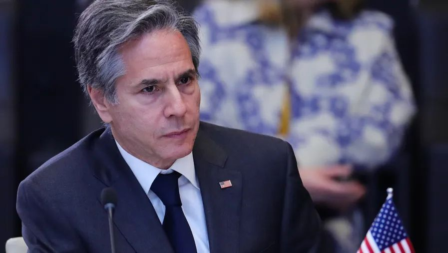

# 布林肯将访华，中美关系能否出现小幅改善窗口期？专家：不能过于乐观

经中美双方商定，美国国务卿布林肯将于6月18日至19日访华。随着中方14日“官宣”这一消息，布林肯备受关注的访华之行终于“敲定”。

此访将是美国拜登政府迄今级别最高官员的来访，也将是美国国务卿时隔四年多再次访华。在中美关系遭遇困难、双方近期加大互动的大背景下，布林肯此访受到极高关注，也成为观察未来中美如何相向而行的重要窗口。

关键时刻，关键接触

去年11月，中国国家主席习近平同美国总统拜登在巴厘岛会晤并达成重要共识，为推动中美关系校准航向、重回正轨创造了来之不易的积极势头。两国元首同意“双方外交团队保持战略沟通，开展经常性磋商”。

作为落实两国元首会晤共识的重要举措，布林肯访华之行开始酝酿。当时不少分析人士认为，这将有助于中美关系的转圜改善。

然而，美方此后的一系列错误言行导致两国高层交往陷于停滞。尤其是今年2月，中国民用无人飞艇意外误入美国领空事件，成为布林肯单方面宣布“推迟访华”的借口，两国关系再遇寒冰。

直到最近，“寒冰”才有所“消融”。今年5月，美国国家安全顾问沙利文和中国中央外办主任王毅在维也纳进行了长达八小时的闭门会谈。此后，中美高级官员互访创造了更多实质性沟通机会，包括中国商务部长访美与美方官员会谈，以及美国中情局局长伯恩斯前往北京与中方官员会面，等等。

6月以来，中美高层互动势头不减。2日，中国新任驻美大使谢锋会见美国财政部副部长。5日，美国国务院亚太事务助理国务卿康达、白宫国安会中国事务高级主任贝莎兰访华，与中方几位高官举行会见、会谈。而就在布林肯此次访华消息“官宣”的当日，中国国务委员兼外长秦刚还应约同布林肯通电话。

不过，相比外交和经贸领域，中美防务领域的高层交往并未恢复。在新加坡香格里拉对话会上，中国国务委员兼防长李尚福并未与美国防长奥斯汀举行正式会谈。中国国防部新闻发言人此前表示，对话不能没有原则，沟通不能没有底线。当前两军交流面临的困难，责任完全在美方。

外界普遍将布林肯访华视作近期中美高层互动的延续。美国媒体在谈及此访时指出，这将是布林肯2021年1月就任国务卿以来首次访华，他也将成为拜登政府成立以来首位访华的内阁官员。上一次美国国务卿访华，还是在2018年10月蓬佩奥任职时期。

美国舆论还用“稳定”“重启”形容布林肯此行对中美关系的意义，认为尽管中美关系紧张，两国仍希望保持高层外交。德国马歇尔基金会亚洲项目主任葛莱仪说，“这是双方继续表达关切的机会，也许还能找到解决分歧的方法。”康达则称这是“在两国关系的关键时刻进行的非常关键的接触”。

寻求稳定的窗口期

复旦大学国际问题研究院院长吴心伯表示，美国前几任国务卿上台后，往往几个月内就实现访华，这是中美高层对接的正常外交模式。但拜登执政以来2年多后才派国务卿访华，有两个原因。

一是，拜登政府将加强盟友关系放在优先地位，急欲重新修复特朗普时期受到破坏的这一最重要战略资产。况且，拜登政府的对华政策，以拉拢盟友和伙伴开展大国竞争为主，所以不急于同中国直接接触。

二是，拜登政府上台后，认为此前美国对华接触政策失败了，今后同中国打交道不能为接触而接触，因此故意摆出姿态，对华冷淡，保持距离。

“那么现在布林肯为什么又决定访华？”吴心伯说，“因为形势比人强——拜登执政以来，虽然认定对华接触政策失败，但外交接触本身依然不可或缺。通过接触，美国一是想拉中国在美国关切的问题上提供支持，具备对华合作需求。二是美国认为中美关系风险上升，需要进行管控。这也是中美元首巴厘岛会晤以来，美方主动提出打算派布林肯等内阁部长访华的原因。”

吴心伯说，今年2月美国炒作“飞艇事件”，美国国内对华政治气氛变得歇斯底里。拜登政府担心派国务卿访华会受到国内政治压力。另一方面，访华不是美国单方面说了算，也取决于中方的意愿以及日程安排。因此延迟了4个月一直到现在。

清华大学战略与安全研究中心主任达巍指出，中美关系过去几年紧张感和竞争性加剧，中美元首去年巴厘岛会晤期间寻求稳定中美关系，于是有了去年12月中美在河北廊坊的工作层级会谈。此后，“飞艇事件”对双方高层接触造成消极影响，但今年5月以来中美关系出现一些局部企稳迹象——虽然结构性问题仍然突出，但短期内开启了寻求稳定的窗口。双方感觉目前气氛比较合适，是时候重启工作，推动落实元首有关稳定两国关系的共识。

有分歧也有合作

吴心伯指出，布林肯访华期间，中美在议程方面会有不同侧重，也会有共同聚焦的领域。

对中方而言，首先关注中美关系指导原则问题。去年两国元首一致认同确立中美关系指导原则的重要性，责成双方工作团队跟进磋商，争取在迄今已有共识基础上尽快达成一致。

吴心伯说，中方认为，美国以竞争定义中美关系并作为美对华政策指导思想，是不可接受的。中方坚持按照习主席提出的相互尊重、和平共处、合作共赢三原则来处理中美关系。这也是秦刚14日应约同布林肯通话时再次强调的。

其次，中方还关注涉及切身利益的重大问题。首先，可能就台湾问题等中方核心关切阐明严正立场，强调美方应予尊重，停止干涉中国内政。另外也会要求美方纠正错误做法，包括在经贸、科技等领域对华遏制和打压、在国际上拉帮结派针对中国、在中美人文交流方面设置障碍等等。这些领域中方都会提出关切。

从美方来讲，可能延续在台海、南海等问题上的论调，拿“改变现状”“航行自由”等问题说事。布林肯还可能谈及中国对美光公司的调查、芬太尼问题等。美方的关注点还包括能否推动两军恢复交往。

除了一些显露分歧的议程，中美也会共同聚焦一些潜在合作领域。

“一是宏观经济政策协调问题。尽管布林肯并非专管经济，对这一话题不会有所深入，但在美国经济表现不佳之际，这是中美双方可以对话的一个领域。”吴心伯说，“二是气候变化。三是就地区性问题交换看法，包括乌克兰危机、朝鲜半岛问题等等。不一定能达成一致，但会在这些问题上寻求合作或协调的可能性。”

推动高层接触？

对布林肯此行，路透社援引美国官员的话称，华盛顿并不期待一份“长长的可交付成果清单”，但希望与北京保持高层沟通渠道畅通，“以降低与北京的竞争演变成冲突的风险”。

《纽约时报》则称，外界仍在猜测布林肯此访会否与中国领导人习近平会面。两国政府都希望此访能促成美国高级官员在今年夏天对中国进行一系列访问。潜在的访客包括财政部长耶伦、商务部长雷蒙多、气候问题特使克里等。这些访问可能为习主席11月前往旧金山参加亚太经济合作组织（APEC）领导人非正式会议铺平道路，拜登也将参加此次会议。

在评估布林肯此行意义和效果时，吴心伯认为，第一，这表明拜登执政两年多后，重新认识到对华接触的重要性。第二，拜登政府原本一味强调对华竞争，现在也表示要寻找潜在合作领域，开始变得务实。第三，布林肯访华后，预计中美高层交往会比较频繁。另外，可观察一些具体问题是否有望取得进展，例如中美人文交流。

吴心伯补充道，在美方希望破局的两军交流领域，一切仍取决于美方是否以实际行动展示诚意，纠正错误。但不排除中美海上军事安全磋商机制会议等一些工作层面的机制未来会部分恢复。

达巍认为，美国国务卿作为美国国务院最高领导人，时隔四年多再度访华，意义不言而喻，也表明中美逐步走出“飞艇事件”对两国关系的干扰。但想要通过布林肯一次访问解决中美诸多问题，显然不切实际。比较现实和可期的是，中美能否达成或重启一些对话机制，恢复工作层面、部委层级的接触，为后续更多交流打开大门。

听其言，观其行

吴心伯认为，当下，中美关系仍处于低位波动，低位是指拜登执政两年来中美关系没有明显的止跌回升。波动是指中美关系易受各种事件冲击而产生不稳定性，出现新困难新挑战。究其原因，美方把中国视作主要战略竞争对手，国内存在强大的反华政治势力，这些都是中美关系改善和发展的最大障碍。

一段时间以来，美方仍在中美关系上发出自相矛盾的信号：一方面寻求沟通，一方面对华打压遏制小动作不断。包括侦察机蓄意闯入我军在南海的训练区域实施侦察干扰，驱逐舰企图穿越台湾海峡，以及签署所谓“美台21世纪贸易倡议”首批协议、挑战中国底线……因此对于美国的种种说辞，还是要听其言、观其行。

吴心伯判断，接下来直到明年美国大选前，中美关系可能出现小幅改善的窗口期。但由于美国国内对华政治“逆风”，作为弱势政府的拜登政府仍会将国内政治考虑放在首位。“简言之，中美关系的改善，有机会，没把握。对此不能过于乐观。”

达巍指出，有理由相信中美关系下半年会比较稳定，但各种问题依然存在，不排除出现意外的可能。中美都有让中美关系稳定的主观意愿，至于客观结果，要看美方是否愿同中方相向而行，停止以竞争为名损害中方主权安全发展利益，采取实际行动推动中美关系重回健康稳定发展轨道。

**解放日报·上观新闻原创稿件，未经允许严禁转载**

作者：张全

