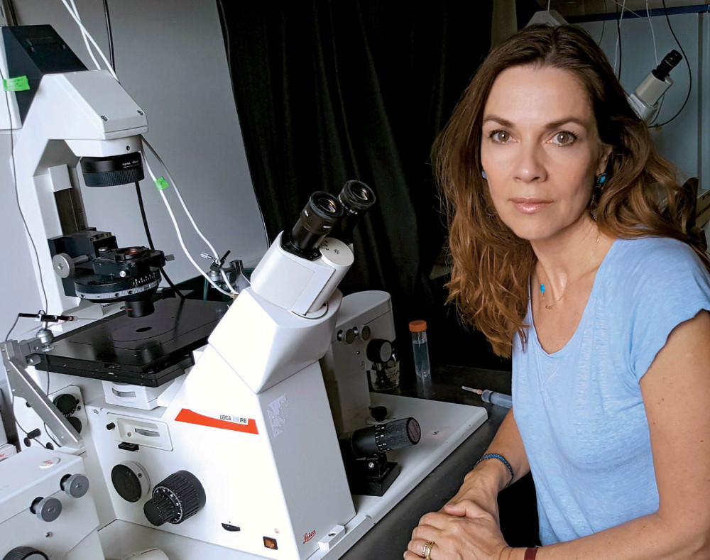

# 英美科学团队称已创造出合成人类胚胎模型，或引发严重道德和法律问题

【文/观察者网
熊超然】“科学家们利用干细胞制创造出了合成人类胚胎，这是一项突破性的进步，避免了胚胎对卵子或精子的需求。”当地时间6月14日，英国《卫报》在其刊发的一篇独家报道中这样写道。

报道援引科学家们的说法称，这些合成人类胚胎与人类早期发育阶段的胚胎相似，可以为研究遗传疾病的影响和反复流产的生物学原因提供一个重要机会。然而也必须注意到的是，
这项工作成果也引发了严重的道德和法律问题，因为实验室培养的合成人类胚胎并不在英国以及其他大多数国家的现行法律管辖范围内。

_英国《卫报》报道截图_

据报道，英国剑桥大学和美国加州理工学院的玛格达莱娜·泽尼克-戈茨（Magdalena Żernicka-
Goetz）教授，当地时间6月14日在波士顿举行的国际干细胞研究学会年会全体会议上，介绍了这项工作成果。她说：“我们可以通过重新编码（胚胎干细胞），来创造类似人类胚胎的模型。”

据介绍，这些合成人类胚胎模型与人类早期发育阶段的胚胎相似，没有心脏和大脑的雏形，但包括继续形成胎盘、卵黄囊和胚胎本身的细胞。

目前，将这些合成人类胚胎用于临床的短期前景并不乐观，将它们植入患者的子宫是非法的，且科学家们目前还不清楚这些结果是否有可能在发育的最初阶段之后继续成熟。

报道称，这项工作起初旨在让科学家们了解所谓的“黑匣子”发育时期，因为科学家们只被允许在实验室培养胚胎，法定限制时长最多为14天。随后，科学家们通过观察孕期扫描以及为研究捐赠的胚胎，进一步了解发育过程。

英国伦敦弗朗西斯·克里克研究所（Francis Crick Institute）的干细胞生物学和发育遗传学负责人罗宾·洛弗尔-巴奇（Robin
Lovell-
Badge）说：“这个想法是，如果你真的用干细胞模拟正常的人类胚胎发育，你就可以获得大量关于人类如何开始发育、可能出现的问题等信息，而不必使用早期胚胎进行研究。”

_资料图：玛格达莱娜·泽尼克-戈茨_

《卫报》介绍称，此前，包括泽尼克-
戈茨的团队和以色列魏茨曼科学研究所的一个团队都证明过，可以用小鼠的干细胞“自我组装出”具有肠道、大脑和心脏的早期胚胎结构。从那以后，一场将此研究成功转化为人体模型的竞赛就已经展开，若干个团队已经能够复制出最早的发展阶段。

有关剑桥大学-加州理工学院实验室最新研究的全部细节尚未发表在期刊论文上，但在会议发言时，泽尼克-戈茨描述了将胚胎培养到相当于自然胚胎发育14天以上的阶段。

这些模型结构，每一个都是由单个胚胎干细胞生长出来的，达到了被称为原肠胚形成的发育里程碑的开始，此时胚胎从连续的细胞片转变为形成不同的细胞系，并形成身体的基本轴。在此阶段，胚胎还没有跳动的心脏、肠道或大脑的雏形，但该模型显示出了原始细胞的存在，即是卵子和精子的前体细胞。

《卫报》最后强调，这一进展突显出，该领域的科学发展速度已经超过法律完善速度，英国和其他地方的科学家们已经开始着手起草“自愿指导方针”，以管理合成胚胎的工作。

“如果这些模型与正常胚胎非常相似，那么在某种程度上，它们应该受到同样的对待。”洛弗尔-巴奇指出：“然而目前在立法中，并没有，人们对此感到担忧。”

**本文系观察者网独家稿件，未经授权，不得转载。**

