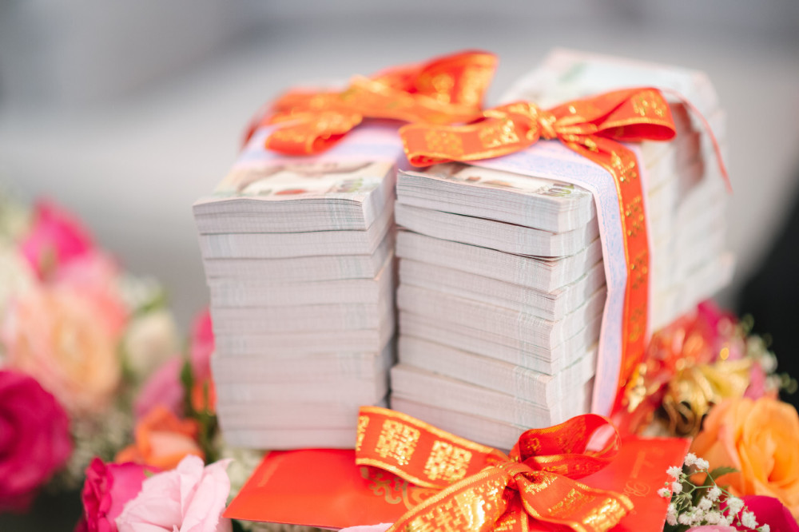
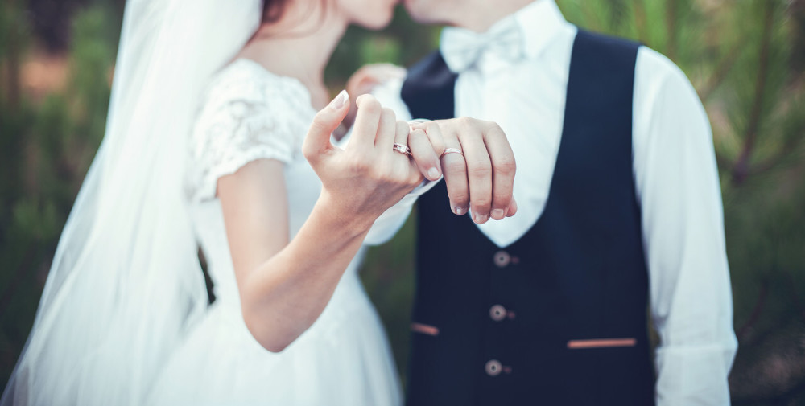

# 这个最愿意结婚的省份，一年结婚登记量少近11万

本文来源：时代周报 作者：丁远泓

步入婚姻的人正在变少。

根据民政部近日公布的统计数据，2022年中国结婚人数为683.3万对。

这个数据，创下民政部网站自1986年公布数据以来的新低，也是自2013年结婚人数达到1346.9万对的峰值后，结婚人数连续9年下降，下降幅度近半。

不少省份的结婚人数也在随之下降。

以河南为例，该省2021年结婚登记为59.65万对，是这一年里全国结婚登记最多的省份。但据《大河报》消息，当地民政部门数据显示，2022年河南全省结婚人数48.92万对，相较于2021年，减少了超10万对。

也就是说，河南这个曾是最愿意结婚的省份，短短一年内结婚登记量下降超过六分之一。

这些年来，年轻一代的婚姻观念已经发生改变。未来，结婚的热情如何被激发？

**河南结婚登记量少近11万**

“在我看来，婚姻不是生活的必需品。结婚不一定会让我的生活变得比现在好。”吴丽（化名）是河南安阳人，她向时代周报记者坦言。

吴丽今年23周岁。不过按照老家的习惯，“虚岁”加上逢过年便增一岁，吴丽在她父母眼里已经25岁了，结婚必须纳入短期规划。

她这两年有试着相亲，试着恋爱，但最后无疾而终。“一方面是没办法找到自己真正喜欢且共频的人，一方面是（看到）身边已婚朋友的生活质量好像也没有明显变好。”

“我现在的状态是，我妈让相亲的话我不会拒绝，但我也基本不抱希望，因为爱情太稀有了，我碰不上。所以我不想谈恋爱也不想结婚，现在一个人在北京的生活很自由。”吴丽说。

_年轻人面对选择单身还是结婚的难题
图源：图虫创意_

不想结婚的不止吴丽。大河网援引河南省民政部门的统计数据显示，2022年，河南结婚人数与2021年相比，下降约10.7万对。

事实上，国家统计局数据显示，河南省在2013年结婚登记达到峰值126.24万对后，近年来一直呈现下降趋势。

北京两高律师事务所律师、婚姻家事法律专家张荆告诉时代周报记者，河南省结婚登记不断下降的最重要原因，是女性受教育程度不断提高。现在情感需求的出口较多，人们对于是否步入婚姻的态度越来越理性。“尤其是现在物质条件好了以后，大家可以通过互联网等方式寻找倾诉对象，这其实满足了人们对于婚姻的一部分功能性需求。”

张荆说，结婚登记对数下降与个人进入婚姻的动机明显减弱有关。“大家开始强调自我，对理想婚姻保有很高期待，会衡量结婚以后的生活是否比现在更好。这是社会进步的一种表现，同时也会影响生育率和社会稳定性。”

这种趋势也与全国的结婚登记情况相符，尤其近三年来全国结婚人数一路走低。

2019年，中国结婚人数跌破1000万对，2020年跌破900万对，2021年跌破800万对，到2022年跌破700万对。

_双方确定婚姻关系
图源：图虫创意_

在河南省2022年所有的结婚登记中，河南省初婚(即第一次结婚)人数为761334人，其中，男性395287人，女性366047人，初婚登记平均年龄为男性29.9岁，女性28.8岁。

而2021年，全省初婚人数为915771人，其中，男性为474671人，女性为441100人。初婚登记平均年龄为男性30.5岁，女性29.4岁。

也就是说，河南省初婚人数有所下降，但初婚登记平均年龄均有所提前，男性和女性均提前了0.6岁。

不过，河南省不同地市的初婚登记平均年龄表现不同。

具体而言，郑州市的初婚登记平均年龄稍有“推后”，其余地市几乎都是“提前”，尤其是安阳、许昌等地市，男、女初婚登记平均年龄均提前了1.5岁左右。

在张荆看来，这种明显的地区差别是一种普遍情况。像郑州，省会城市的年轻人经济条件较好，受教育程度较高，选择婚姻会更加谨慎与理智。相较于郑州，河南其他地级市普遍有更传统的传宗接代、成家立业的观念。

“大家都会认为年纪大了就不好找对象。尤其农村地区女性，长大以后就要么出去工作，要么很早就订婚。所以一直待在农村的男性和女性都更希望早点定下来。”张荆解释道。

**政府出手整治天价彩礼**

除了不想“将就”步入婚姻，还有人会因为没有能力负担结婚的花销而迟疑。毕竟，酒宴、婚车、彩礼等等，都是一笔不小的开支。

尤其是在一些地方，除了婚房外，男方还需要给女方家庭的彩礼少则二三十万，多则四五十万。这些年，因天价彩礼而分开的情侣不在少数。

为了解决这一部分人的结婚顾虑，2018年，民政部将婚俗改革作为一项重点工作进行研究部署。2020年，《民政部关于开展婚俗改革试点工作的指导意见》印发，在试点地区对天价彩礼、铺张浪费、低俗婚闹、随礼攀比等不正之风进行整治，推进社会风气好转。

_准备彩礼与嫁妆 图源：图虫创意_

2022年，河南将开封市，平顶山市宝丰县、叶县，濮阳市，商丘市永城市，信阳市潢川县，济源示范区等20个地区定为全省婚俗改革实验区，集中整治高价彩礼、攀比随礼等不正之风。

张荆也表示，从政府层面出发进行婚俗改革是非常必要的。过高的结婚成本会造成一定的社会矛盾，比如有些家庭会出现“人财两空”的情况，有些家庭更是因为结婚陷入到极度贫困当中。“高彩礼与婚姻的长久与幸福并不能划等号，但各种各样的攀比裹挟着大家向前走，想停下来也没有办法。这就需要国家出台政策进行倡导和规范。”

目前，商丘市宁陵县规定，婚事饭菜加烟酒，每桌花费不超300元，订婚彩礼不超3万元；焦作市孟州市通过调查研究，提倡城乡居民彩礼不高于6万元。开封市城乡一体化示范区杏花营农场班村制定了红白事统一操办标准，每桌宴席价格控制在200元以内，酒水不超过40元/瓶，香烟不超过100元/条，除亲属外，本村乡亲随礼最高不超过50元。

今年年初，开封市还组织红娘培训，通过红娘进而提升化解高价彩礼、低俗婚闹、大操大办等婚姻矛盾的水平，将杜绝铺张浪费、弘扬文明节俭的新婚姻理念传递给适婚家庭。

_新人举行婚礼
图源：图虫创意_

**与此同时，婚姻登记也越来越便捷**

近日，国务院批复同意扩大内地居民婚姻登记“跨省通办”试点。自6月1日起，北京、天津、河北等21个试点省（自治区、直辖市）实施内地居民婚姻登记“跨省通办”。据民政部统计，试点范围扩容首日，截至当日21时，试点地区“跨省”办理婚姻登记881对。

河南省作为试点省份之一，当地民政厅规定，双方一方户籍在河南的，可到省内任意一个县（市、区）的婚姻登记机关办理婚姻登记（结婚登记或离婚登记）；双方均非河南省户籍的婚姻登记（结婚登记或离婚登记）当事人，可以在河南省一方居住证发放地婚姻登记机关申请办理婚姻登记（结婚登记或离婚登记），或者选择在一方常住户口所在地办理婚姻登记（结婚登记或离婚登记）。

在张荆看来，下一步，社会应该加强对于婚姻本身性质的宣传，比如可以在高校里开设相关课程，帮助年轻人树立正确的恋爱观与婚姻观。

“在婚姻恋爱中，我们应该有一种不怕受到伤害的勇气，不能因为可能会受到伤害就连投入也不投入了。毕竟，已经有多项数据表明，幸福的亲密关系可以在很多方面帮助我们发挥价值。”

