# 那个“中国最擅长打架的画家”，中央美院唯一最高小学学历的教授走了

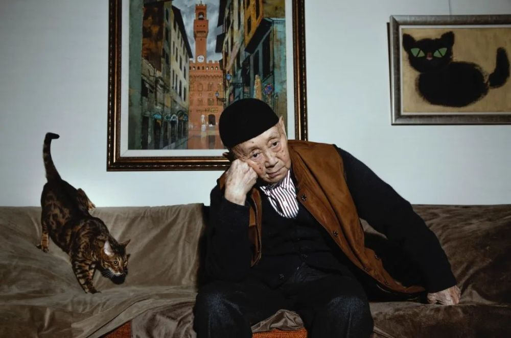

2023年6月13日凌晨三点四十三分，黄永玉去世，享年99岁。从现在开始，我们再不能和他一起听贝多芬，不能听他讲莫奈如何理解光，晚上的拳击比赛少了一个观众，而他攒了一辈子的笑话，再也讲不完了。他去世的这一天，北京的傍晚是漫天迷人的晚霞，可惜的是，“平行四边形的落日”究竟是什么样子，以后不会有人为我们讲解了。

《人物》在经历了一年的采访后，在2022年刊发了黄永玉的封面报道。稿子刊发后的日子里，我依然常常想起他。我想起和黄永玉的每一次告别。因为他走路不方便，每次他都只能留在客厅沙发上，冲客人挥挥手。有次一起看完拳击比赛，临走时我扭头望向还在客厅里的黄永玉，他突然笑了，高高地举起右手，像拳击手入场那样，振臂一挥。这后来成为我们打招呼的方式，像两个约定下次打一架的拳击手，重逢和告别，都是挥起手臂，传递力量。这就是我认识的黄永玉，一个在告别的时候都要笑的人，握紧拳头，充满力量。

我很庆幸自己有机会见证了一个人在99岁的力量。99岁生日那天，黄永玉刚刚大病一场，但坐下来聊天，他还唱了歌，他要画画，他要写无愁河。99岁的第二天上午，我收到了信息，他要听贝多芬的《田园》。这就是黄永玉，一种永不枯竭的生命力。我希望这种力量能活在更多人身上，爱那些为你付出真心的伙伴，恨所有伤过你的混蛋，不相信任何人说的谎话，不原谅，不饶恕，专心走自己的路，像一朵花一样活下去，想开就开，想败就败，不服从任何人的命令，在太阳底下肆意盛放，活自己的命。

以下就是发表于《人物》杂志2022年6月刊的稿件。这是他生前很喜欢的一篇文章。发稿后我见到他，他说我送给了他一个摇篮，一边说一边高兴地比划，讲这篇稿子让他变成了小婴儿，引得很多人凑过来看他。这个比喻让我们笑了一整个下午，还唱起了“摇啊摇，摇到外婆桥”，聊起了故乡、河流、小时候的家，还有妈妈。这是我一直想要分享给读者的一个瞬间，因为你们善意的存在，一个老人在99岁的时候感受到了童年般的温暖。

今天，我们重发这篇文章，纪念曾与我们共同生活在这个时代的黄永玉，希望他身上的力量和诸位身上的温暖，都能永远存活下去。

**文｜** 李斐然

**编辑｜** 槐杨

**摄影｜** 尹夕远（除特殊标记外）

**我就揍他**

黄永玉是中国最后一个侠客，这句话差一点就成真了。老家院子里有一个打拳的道场，他5岁在这里拜师学功夫，从小逃学，打过老师，打过恶霸，打过警察，上课熟读《江湖奇侠传》。12岁那年，他站在沙包架子底下做了决定——湘西汉子黄永玉，这辈子要当侠客，浪迹天涯。

然而，人生在想当侠客那天下午拐了弯。妈妈突然宣布，家里孩子太多，他得离开这个家，打包行李，明天就走。这是一个母亲无奈的决定，也是一个时代的宿命。家族败落，父母失业，跟随父亲离家，几个月后，抗日战争爆发，后来投奔叔叔，中学打架退了学，他和家人失去联系，开始流浪。

现在的他是一个画家、作家、诗人、雕塑家、偶尔的菜谱创作者和长期的拳击爱好者。他平生最讨厌的一个词叫做“历史必然性”，被他称为“屁咧的历史必然性”。最好的证据就是他自己，以下两份迥然不同的人生履历都属于黄永玉：

黄永玉，湖南凤凰人，中央美术学院教授，中国画院院士，曾任中国美术家协会副主席，三次获得意大利政府官方授勋，其中包括最高等级的大十字骑士勋章。代表作包括木刻作品《春潮》《阿诗玛》、水墨画作品《墨荷》《天问》、毛主席纪念堂巨幅壁画《祖国大地》，还有很多无从归类的作品，共和国第一张生肖邮票猴票、湘泉酒和酒鬼酒瓶的设计、电影《苦恋》的人物原型。

黄永玉，湘西流浪汉，爱好打架、逃学、偷吃爸爸做的鹌鹑脑壳，初中留级5次，因打人退学，烧过瓷器，做过棺材，在小学、中学、大学当过老师，抗战期间在战地服务团画过海报，在香港写过电影剧本，打猎、做烟斗，60多岁在动物园门口制服了三个抢劫的小伙子。80岁时说自己还是想组织一个侠客队伍，劫富济贫，伸张正义，“比打官司解决问题好”。

出生于1924年的黄永玉是另一部中国百年史，教科书里不写的那种。他是中国最擅长打架的画家，中央美术学院唯一一个最高学历小学毕业的教授，中文公开作品中出现“他妈的”“混蛋”“杂种”“小兔崽子”词频最高的艺术家。他说自己没有学历，所以不相信书本上的历史分期，他只认两个历史时期，一个是新时代，一个是旧时代。让人平安快乐的日子叫做新时代，让人挨饿害怕的时候叫做旧时代，“毋论唐汉，毋论纪年”。

黄永玉相信古老的中国道理，相信因果，重视情义，讲究礼尚往来、知恩图报，他靠具体的生活经验活着，任何后天学的理念、主义都没有大于这种质朴的人生法则。他这辈子只在吃牛肉的时候喊过万岁，见最高领袖说的是“祝你健康”。直到今天，他骨子里依然活得像百年前的侠客，按照江湖规矩过日子，待朋友赤诚，见长辈谦卑，和三教九流交朋友，佩服有本事的，敬畏有学问的，搭救落难的，只有一种人他不来往，“害我是不行的”，这是闯江湖的底线问题，“我就揍他”。

再有两个月，黄永玉就要99岁了，该有老人模样了，可他没有。他的画室门口挂了一个拳击沙袋，写作的桌上依次摆着一支钢笔，一叠草稿纸，还有一把匕首。他每天早起画画，中午写作，下午见朋友，晚饭后窝进沙发里，抱着一只小猫，看电视上的拳击比赛。

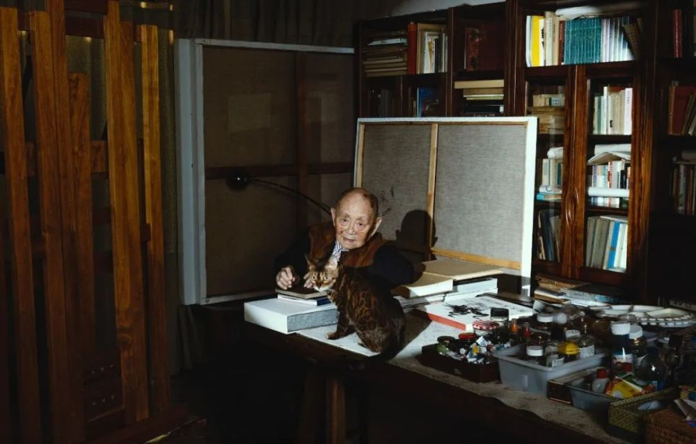

《人物》在过去一年采访了这位老人，记录了一个人即将到来的99岁。这一年的最大感受是，黄永玉始终是黄永玉，他有一种强大的内在力量，大于时代，大于命运，大于痛苦，大到足以让他扭转结局，把悲剧写成喜剧，把苦变成笑话。黄永玉做梦遇到鬼，从来都是他追着鬼跑，吓得鬼到处躲。他的梦想是有一天把鬼捉住，挠他痒痒，看看鬼会不会笑。这样的黄永玉没有同类，他是一个会画画的齐天大圣，一个偶尔参加组织生活的孙悟空。

认识之初，黄永玉给了我一张他自己印的名片。他听人说名片是身份的象征，头衔越大权力越大，他不服气。他的名片上没有电话，没有单位，没有官职，只有一个他自创的头衔：

黄永玉

享受国家收费厕所免费待遇

（港、澳、台 暂不通用）

其实他本可以有很多真的头衔，但他愿意出名，乐意挣钱，唯独不想当领导。他不会喝酒，讨厌开会，痛恨人打牌和麻将，开大会上台发言，他把“四个现代化”讲成了“三个现代化”。退休之后，晚辈想给他申请一项国家级荣誉身份，他当场回绝，并狠狠训了他。有人想给他搞一个“黄永玉画派”，他把人从国外千里迢迢叫回来，骂他没出息，“狼才需要结党”，而黄永玉认为自己是狮子，狮子干自己的事，一个人也能称王。

和这样的黄永玉聊天是一场绝对自由的愉快旅行。我们听不同版本的贝多芬第六交响曲《田园》，打赌一场拳击比赛里谁会赢，听着Beatles讨论《世说新语》，研究蜘蛛的活法。那段时间他在准备一幅新画，一只小小的黑蜘蛛捕住了一只折翼的蝴蝶，画名《价值的判断》。黄永玉动笔前除了要准备颜料和画纸，还要解答问题：蜘蛛那么小，却可以吃掉蝴蝶、捕住麻雀，战胜远大于自己的对手，它到底是怎么赢的？

画家的答案是时间，“蜘蛛不是靠进攻战胜对手的，打是打不过的，它有耐心，等。造一张密密的网，等待猎物落网，用网束缚它，用毒针刺它，等对手耗尽力气了再去降服。”这个结论让我们都笑了：原来蜘蛛还懂《孙子兵法》呢，知道强敌是不可战胜的，胜的唯一方法是躲起来活着，等敌人自行灭亡。

有时候，我们也讨论恐惧。我告诉他，我最大的恐惧是苦会再来。他让我记住两句话：第一句是，历史不会重现，因为改变往往会以我们想象不到的样子发生；第二句是，一切都会过去，“你要记住，任何苦都会灭亡，只是这件事有个时间问题。我是看不到那一天了，但你可以，你要好好活着，好好吃饭，做好自己的事，活到那一天。这个过程你可能会遇到难处，遇到很多荒谬和可笑……你就把它当作一种观察，人还能这样呢？还能有这样的事呢？你要把它们当成笑话记住，等到将来写出来，讲给人们听，日子过去是这样的呢，多有意思！”

黄永玉不思考“为什么”，人为何作恶，恨从何而来，江湖人不琢磨这些，人心险恶，是非多变，这本就是江湖底色。黄永玉信奉的是一种打架的哲学：不必分析拳头为何挥过来，重点在于应对，见招拆招，把命活下来。在每个难关都想办法笑，把痛苦熬成笑话，这就是他的活法，一种笑的方法论。

小时候放学回家，他围观弟弟打架，局面一度激烈胶着，弟弟挨了不少拳脚。事实上，打架从来都是这样，挨一拳，回一脚，一边受伤，一边求胜。最后弟弟打到满脸伤，终于赢了，把对手死死压在地上，可他不知道为什么，赢了还在抡拳，一边打一边哭。讲到这里，黄永玉出场，故事终于变成了笑话——哥哥拉开难过的弟弟，小声传授给他胜者的规矩：“打赢的人不哭。”

这是黄永玉的笑话，或许，也是他的信念。黄永玉是一个真正意义上“笑到最后”的人，他的人生或许是一种提醒：不管你遇到了什么，只要活下去，眼前经历的一切困顿、绝望、无可扭转的败局，都会在活到99岁的时候变成笑话。人只要笑，就没有输。黄永玉的存在证明了一项不会磨灭的人性真理——人生苦，但人大于苦。

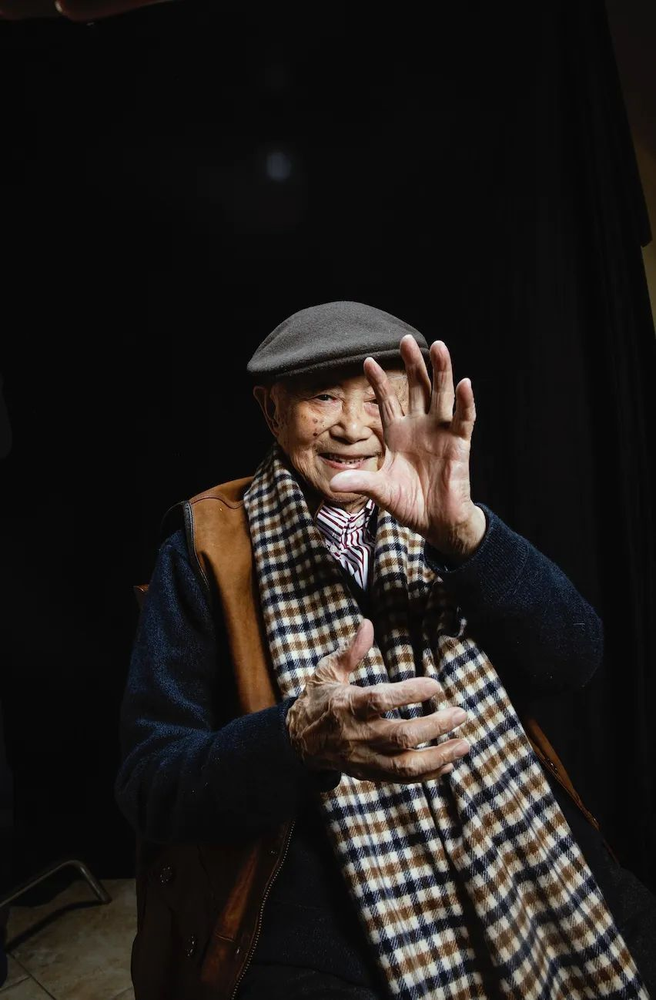

**来的是谁**

见黄永玉只要带着耳朵就行了，他准备了很多热闹等着你。第一次见面那天，他刚刚交上自己连载小说《无愁河的浪荡汉子》的最新一章，从书房扶着助步器走出来。黄永玉忙得很。客厅柜子上压着一幅颜料还没干的新画，桌上的草稿纸有一首还在圈圈改改的新诗，沙发边的书摞成小山，最上面那本中间夹着纸巾做的书签，读了一半。他谈的每句话都有典故，像一堂眼花缭乱的历史课。看到墙上那幅小像吗？那是周令钊画的二十三岁的黄永玉，现在这幅画叫《小鲜肉》。今晚吃的这种葱是王世襄的做法，还有餐桌旁的那幅屈原的《九歌》，注意看落款：从文时年整八十岁。

黄永玉人生三大爱好依次是读书，打架，侃大山。过去腿脚还能跑的时候，他闲下来最爱骑个小摩托逛潘家园市场，往热闹人堆里扎。他喜欢买东西，可他不会讲价，整天兴高采烈地往家里搬一堆上当受骗的证据：虚高价的花瓶，缺一只眼睛的画眉鸟，名不副实的老字画。来子是他的年轻朋友，到家里看望他，进屋一看都是陌生面孔，坐他家里喝茶、看画、侃大山，每人手里一根他的雪茄。热热闹闹招待了一下午，把人送走了才知道，全是下午在官园买鸟认识的路人。

“你认识他们？”

“不认识。”

“那他们来干嘛？”

“好玩！”

后来摔倒受伤，聊天升级为一个老人最大的娱乐。高兴起来有时候说粤语，有时候说凤凰话，他还会说很流利的闽南语和从星期一数到星期天的英语，这都是流浪时学会的语言技能。其他的语种他只会一两个单词，比如日语会说鸡蛋（tamago），因为讲笑话的时候用得上，“他妈的”。

历史在他的讲述里变成一个个具体的笑话。齐白石招待客人的点心是放了多年的月饼，李可染练字把垫在下面的毯子都练出一个坑，毛主席纪念堂一进门的壁画是他画的《祖国大地》，草稿是在废稿纸上画的。当时出了几个方案都不通过，最后找到黄永玉，黄永玉就随手捡了别人的稿纸，在背面画了大河山川，寓意“问苍茫大地，谁主沉浮”。

他喜欢讲述家乡的故事，湘西的水、湖、山，还有表叔沈从文。小时候在老家只见过一面，流浪的时候没有联系，他刻木刻，表叔在一本诗集里看到插画，找到了他。表叔总是不慌不忙，厚厚的眼镜片后面是笑的眼睛。新中国成立后，表叔写信劝他北上，他带着妻子和七个月大的儿子从香港搬来北京，到中央美术学院当老师。一见面大家都笑了，那是北京的二月份，一对南方长大的年轻父母也对北方毫无概念，没给孩子穿袜子。他们后来笑话自己和北方的格格不入，大概是湘西人的特点。

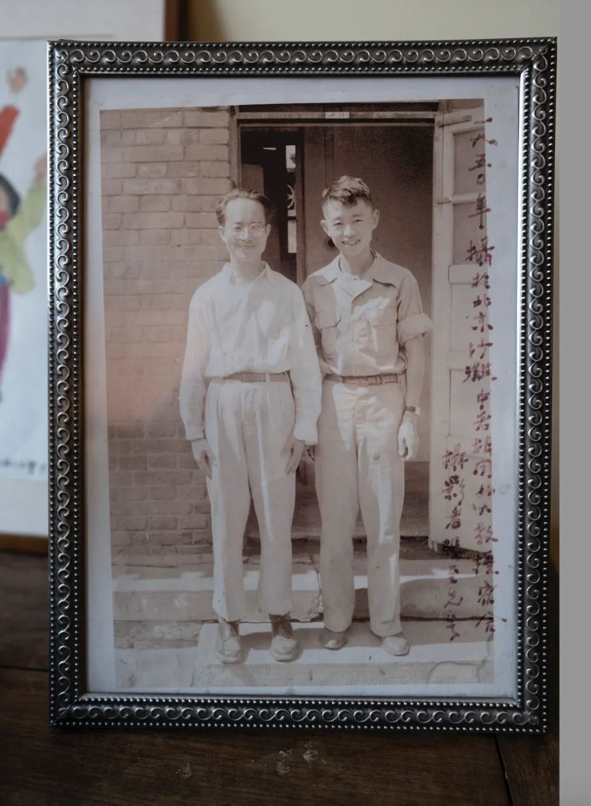

_黄永玉与表叔沈从文_

还有一类喜欢讲的故事是在美院的经历。黄永玉一家在大雅宝胡同甲二号住了好长时间，这里是中央美术学院的教工宿舍，那时候，住了一院子画家，包括齐白石的两名弟子李可染和李苦禅，还有画了《开国大典》的油画家董希文。大雅宝的孩子们管他叫黄叔叔。其他爸爸教孩子写生、素描、调颜色，只有黄叔叔陪孩子们玩，斗蛐蛐，舞狮子，举着小旗子带全院二三十个孩子去动物园。

黄大刚是黄苗子的小儿子，小时候跟着父亲去黄永玉家做客，大人们总是聚会，一起看黄永玉画画，一起讨论他当时听不懂的艺术问题，拉奥孔为什么用极致的美表达悲剧，罗丹的《地狱之门》跟现实相比还是肤浅了。不过他记住的是黄永玉和孩子们的聚会，胡同里的男孩子们都围着黄永玉，挨个跟他学招式。黄大刚也被拉着学了两招，理由是马上开学了，会打架才能好好上学。黄永玉到学校开家长会，儿子上学打了架，他见面第一句话是：“打赢了没？”

那时候聚会的还有汪曾祺，他总是一个人来家里吃饭。家里留着绳子系着的豆腐干，是给汪曾祺下酒吃的。孩子们也都知道，好吃的要等汪伯伯来了才能吃。黄永玉给汪曾祺打电话，叫他到家里吃饭，接电话的人告诉他，汪曾祺现在正被打成右派，黄永玉还是同一句，让他来家里吃饭。但是，汪曾祺的故事只能讲到这里，再往后讲，黄永玉就会摆摆手，“不说了。”

晚上九点半，客人们和黄永玉告别。他已经没法站起来送他们了，只能远远招招手。房间里安静下来，小猫定点跳上沙发，窝在他旁边，跟他一起看晚上的拳击比赛。关上电视，他有时候直接睡觉，有时候还要自己再写一会儿文章。书桌前只剩下了一个老人，和翻滚了一下午的回忆。

往事给他一种复杂的感受，里面有很多感情，又有很多情感的淤泥。故事里有很多他想不明白的地方，到现在也懵懵懂懂，比如命运。沈从文刚发现黄永玉的时候，为他写了一篇文章《一个传奇的本事》，里面预言了他在黄永玉身上看到的命运，“由强执、自信、有意的阻隔及永远的天真，共同作成一种无可避免悲剧性的将来”。

沈从文当时写，这是他们共同的命运。黄永玉不理解这份悲观，那时候更容易感受到的是新时代的快乐，他在天安门看游行，哭得眼睛看不见路，街上见到穿制服的警察，都觉得像解放军一样亲切，会上去跟人握手。他将喜悦刻在了自己的作品里，木刻画里的革命者像天使一样，可以飞起来。表叔劝他北上的时候，他也没有察觉到表叔刚刚经历了一场自杀未遂的绝望。每次见到沈从文，他看到的都是一个老人的从容，日子的确辛苦，住在小房子里，吃穿用度都很拮据，但他总是用微笑，用沉默应对一切。1967年的晚上，沈从文依然在听贝多芬。

然而渐渐的，他的生活里也开始加入了新的感受，从喜悦开始，困惑、矛盾、愤怒、恐惧，还有一味藤黄。这是一种用来画花蕊的颜色，也是一味致命的毒剂。最绝望的时候，黄永玉说，不如煮锅牛肉，放了藤黄，吃下去，人生就不再苦了。

女儿走过来，小声地说：“爸爸，你别自杀，我没进过孤儿院啊，怎么办？”

黄永玉开始说另一句话，“死前面，还有好多路。”

复杂的情绪淤积在一个老人身上，最典型的例子就是《无愁河的浪荡汉子》（以下简称《无愁河》），喜悦、痛苦、悲伤、希望，所有情绪在同一部作品里共存。他喜欢写《无愁河》，一开始写的时候在房间里哈哈大笑，吓得女儿跑去看望他，后来边写边感慨，七八十年前的事情，有的记得很清楚，有的变得完全模糊，最近，写《无愁河》越来越难受，女儿给他测血氧，写到往事的时候，血氧值一直往下掉。后来，黄永玉生病入院，出院后发现，小说没法交稿了。《无愁河》写的是自己的经历，刚刚发表的章节写完了自己流浪的日子，再动笔，黄永玉就要携家带口上北京了。恰恰在这个关口，故事写不下去了。

写不下去的时候，黄永玉就去画画。画是黄永玉的情感表达，所有情绪都泼洒在画纸上。他的画里装着赤诚的喜悦，天真的希望，有时候恨也会突然而来。荷花在初生的太阳下盛开，背后的一池墨色，映衬着荷花红得炽烈。黄永玉喜欢画花，花是最自由的自我表达，想开就开，想败就败，不用服从任何命令。

落笔的时候，淤积在心里的情感同时释放，里面有一个激烈的黄永玉，脾气急，性子刚烈，有江湖匪气，想要打架，要报仇，要动手。但在这样的时候，另一些平静的力量也会出现。最常浮现的是一个回忆，黄永玉在胡同里远远见到了沈从文，两个人像陌生人一样，谁也不打招呼，迎面走过来，只在错身而过的几秒钟里，表叔突然开了口，用并不标准的普通话，平静地留下一句老人的叮嘱：“要从容。”

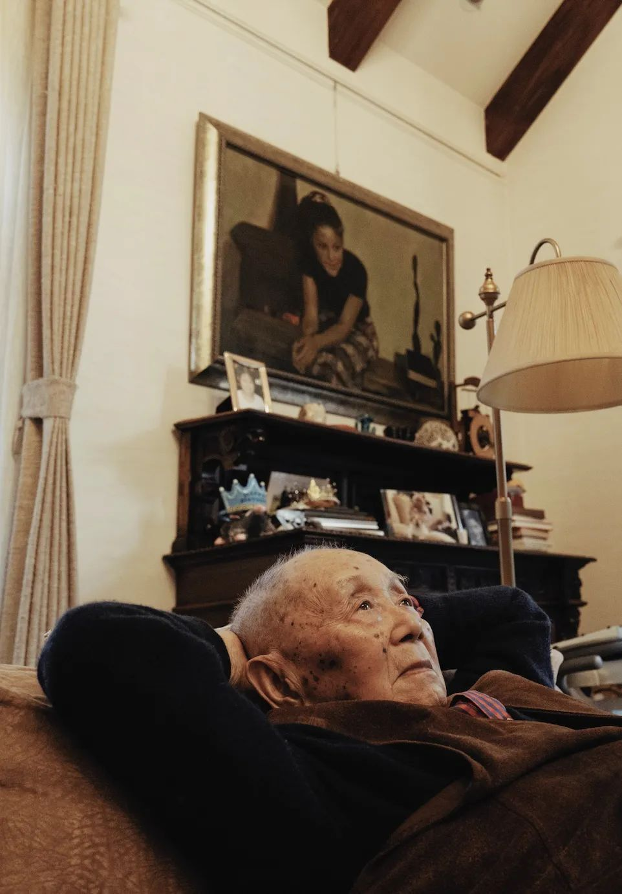

**星星在黑暗之中**

黄永玉打算在100岁那一年办一场百岁画展，全用新画。为了这件事，他每天早起勤奋地画画。

这样的画展他已经办过两次了，八十画展、九十画展，每一次展览也都是用近10年间的新画。王明明是北京画院前任院长，小时候跟黑蛮黑妮兄妹俩一起参加绘画比赛，他有时候管黄永玉叫老爷子，有时候叫他黄叔叔，直到他也成为画家，今天也到了70岁，才明白黄叔叔画画的独特之处。

“我分析了很多前辈画家，晚年都是画不准的。黄胄60多岁的时候就不能站着画画了，身体不好，都在案子上画，画的透视角度都不对，画的人都偏了。程十发70多岁的时候，连画变形的东西也画不准了。齐白石衰年变法，可真正晚年90多岁的时候也是不灵的，最后的作品他已经糊涂了，但他还在画。”王明明说。“黄老挑战了人生年岁的一个极限，他画那么大的白描，还能够画那么精细，那么准确，他给美术界创造了一个奇迹。现在的画是他的人生境界。”

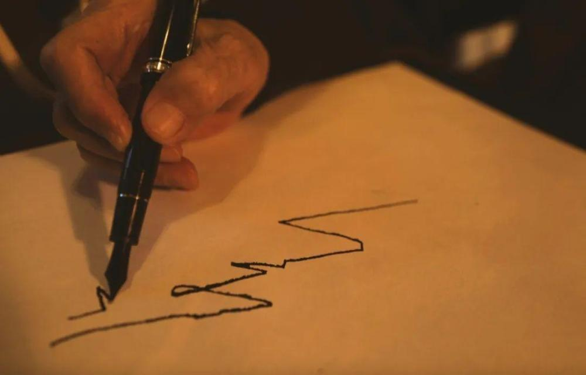

_黄永玉打草稿_

百岁画展有一幅尚未公开的作品，画了一只孤雁。黄永玉的题款像是一句说给自己听的提问，“雁啊雁，你为什么留下来？”

他最近出了一本诗集，里面是自己一辈子的诗，他给每一首诗配了插画。其中一首叫做《被剥了皮的胜利者》，“这是我的自画像。”

这首诗写的是一个希腊神话故事，主人公是一个爱唱歌的小牧童，大家都喜欢听小牧童唱歌，阿波罗知道了，要和小牧童比赛。小牧童答应了，他忘记了，他的对手是神，阿波罗不能输。小牧童的歌声打动了人心，可是他被判定输了，失败者被剥了皮，但苏醒过来，还在唱着歌。

香港导演杨凡第一次看到黄永玉的画，“我的眼睛突然间好像打开了另外一道门”。那是1979年，他从香港第一次到广州看黄永玉的画展。“那个时候『文革』刚刚过去，所有东西都一片灰暗，你看见他的那个彩色，荷花、樱花、所有的花，就等于是百花齐放，所有的颜色都出来了！我就很惊讶，一个中国画家怎么会有那么多的西洋色彩在里面。”

“黄永玉的艺术，完全是按照自己的个性发展。甭管什么时期，反右时期、『文革』时期，他都保留了自己的个性。怎么样的变化都没有把他最根本的东西磨灭掉。你看其他的，有些东西不行，那么我就隐逸了，可是黄永玉属于不信邪的。有些东西不行，我给你改过来，就算我改不过来，你过你的，我过我的，黄永玉始终是黄永玉。”

“黄永玉是一个无法归类的人，哪个画派他都不是，他就是他自己。一直在江湖上闯荡，最后归到美术学院，他也根本没按美术学院那个套路进行创造。什么都没有拴住黄永玉，黄永玉始终是黄永玉。他的艺术成就就像一棵大树似的，树形非常大，有些枝子不见得好看，但是它长成了这样大的树，别人几乎没有过。”王明明说。

黄永玉至今不知道自己有多少作品，他没数过，也不记得。只是每天干活，创作各种各样的作品，他前半生刻木刻，七十年代画水墨，八十年代画线描，九十年代在意大利开始画油画和雕塑，回国后他做过陶瓷，画紫砂壶，与此同时，他还在每年写诗、写散文、写小说。给儿子写信说，自己的半辈子是一刀一刀地铲，“文革”以后，一笔一笔在画，后来，一个字一个字在写。这一辈子就是这样。

_1962年在校尉营美院宿舍，黄永玉正在刻「繁花」
受访者供图_

也正因此，他有很多被人遗忘的作品。雷锋最知名的肖像是一张木刻版画，它自发表之后作为宣传被广泛转载使用，但很少人知道它的作者就是黄永玉。他最大的作品应该是毛主席纪念堂的壁画《祖国大地》。这幅绒绣壁画宽24米，高7米，但进入这里的观众很少会专门注意壁画，更难像欣赏作品一样品读创作用心。

在黄永玉家里还有另一个小牧童，和另一种被遗忘的作品。张梅溪曾经是儿童文学作家，但几十年间，她没法写作，承担起很多具体的生活。他们的小房间没有水龙头，她每天拎着桶出去打水、做饭、洗衣服，把针管煮在锅里消毒，定点去给沈从文打针。她喜欢唱歌，喜欢花，喜欢漂漂亮亮的东西。张梅溪最喜欢下雨天，黄黑妮记得，每个雨天都像个节日，这个南方来的妈妈带着孩子上街，去稻香村买二两排叉，一起吃甜甜的点心，一起踩水，一起庆祝一个下雨天。

女儿黄黑妮说，那时候总感觉父母好像跟这个世界脱节。他们明明知道外面的混乱，全家还是要一起穿得漂漂亮亮地上街。他们好像也不懂得忧愁，周末晚上给孩子们一块糖，两个人手牵手去大会堂跳舞，他们像年轻人谈恋爱那样，每个星期都要约会，一起看电影。自她有记忆的时候，家里一直有花，妈妈总是在家里唱歌，外面的日子很动荡，但只要回到家，就觉得每一天不管怎么样都是很好的。

难过在这个家里只存活很短暂的时间。沈从文去看望黄永玉，土渣从天花板上掉下来，墙壁上也是脱落的砖石，房间没有窗户，白天也昏暗无光，黄永玉就在墙上画了一个窗户，画里的窗外是盛开的鲜花。张梅溪从外面拎水回家，北京的冬天太冷了，拎回来时水已经冻成冰，根本没法用，她却依然开心，点一支蜡烛，把冰反扣过来，一家人兴奋地围着它笑，“看，冰灯！”

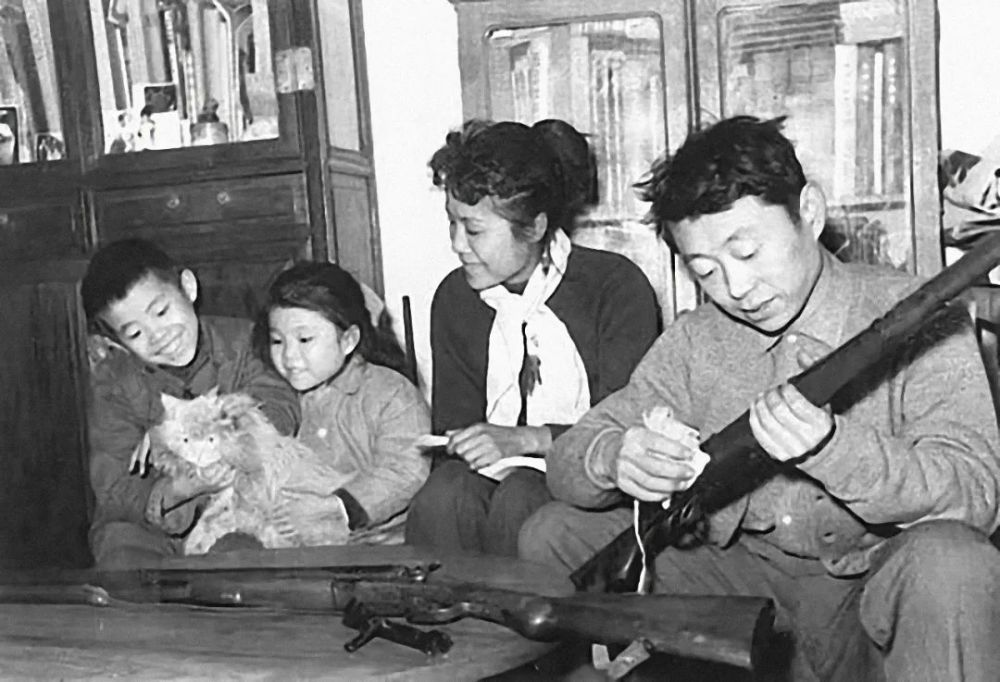

_1961年，黄永玉一家和小猫大白，各有各的喜悦
受访者供图_

漫长的几十年间，这对年轻父母都没有代表作，但他们在共同创作一个作品。黄黑蛮今年70岁了，他记住的童年时代是那时候的书、音乐和电影，“你读过《孤筏横渡太平洋》（注：现译名《孤筏重洋》）吗？就是那时候刚译出来，特好看，你一定要看！还有《人·岁月·生活》，爱伦堡的，写得太好了，我们都爱看。那时候Beatles出的专辑，我找来给我爸听，特别好……”后来女儿从香港给家里带回当时世界上最流行的那些歌，黄永玉把磁带藏在家里。把门锁好，关上窗户，一家人竖着耳朵听。他们最喜欢的一首歌叫做《忧愁河上的桥》（Bridge
over troubled water）。

这个作品也留在了学生身上。画家广军是黄永玉在美院的学生，直到今天，他都记得黄永玉教给他的一句话。那是1963年，毕业创作到林区“体验生活”之前，黄永玉告诉他：“你一定会遇到很多困难，到时候你就想，嘿，这么难的事让我碰到了，这多有意思！你看我怎么把它解决了！记住，一定要这样想。”

黄黑蛮推荐的那些书讲了许多不同时间、不同国家、不同背景的故事，但它们的内核却是共同的主题——世界简单至极，星星在黑暗之中。

这是与表叔沈从文一致的脉络。发现黄永玉的时候，沈从文在文章里对黄永玉的命运有一个悲剧的预言，他的个性在一个时代将被视为个性鲜明，在另一个时代就会格格不入。不过，他也写下了应对方法：

“不妨勇敢地活下去，不必求熟习世故哲学，不必八面玲珑来取得成功，毫无顾忌地接受挫折，不用作得失考虑，也不必作无效果的自救。”

这是沈从文50岁的时候留下的经验，黄永玉后来的写作、木刻、绘画、雕塑，一切的人生抉择都践行着这个统一的规则。小说讲究起承转合，他的文章如流水，从不写大纲，想到哪儿写到哪儿，几百万字里连一个“但是”都没用过；国画讲究用墨，他直接拿丝瓜瓤刷颜色，最亮的白色不是调色调出来的，用的是修正液。“文革”时候，造反派问他怎么把浪花画出动态，他的答案是拿一块抹布，蘸上颜色后卷起来一抹就行。写作技巧、笔墨讲究，他并不是不知道规矩的存在，但是他不在乎，黄永玉的作品里，每一根线条都叫黄永玉，横七竖八地肆意活着，它们是一种新的规矩：我管它呢！

1982年，黄永玉和沈从文一起回家乡凤凰。沈从文住在舅舅的老屋，对着山喝豆浆。两个人在吉首大学作讲座。沈从文先上台讲，他说自己毫无成就，算不得什么作家，也算不得什么考古学家，是一个“假的知识分子”，最大的天赋是“穿单衣过冬不怕冷”，什么坚强也说不上的。“我有一个习惯，我向前走了，我就不回头”。第二个讲话的是黄永玉，黄永玉摆摆手，“手艺人，不会讲”。

这一年，沈从文80岁，黄永玉58岁。下着雨的春天，黄永玉找来朋友一起听湘剧高腔《白兔记》，主角李三娘出场，唢呐一响，院子里的几个老人都哭了，因为唱的是，“不信芳春厌老人。”

这是沈从文最后一次返乡，5年后，沈从文去世。在人生的最后，他修改了自己的预言。在《一个传奇的本事》修订版里，他将自己的失败归结为“一切不出所料”，而关于黄永玉的悲剧预言是“一切近于过虑”。临终病榻前，黄永玉听他跟后辈讲道理，只要做好自己的事，“别的，时间和历史会把它打发走的……”

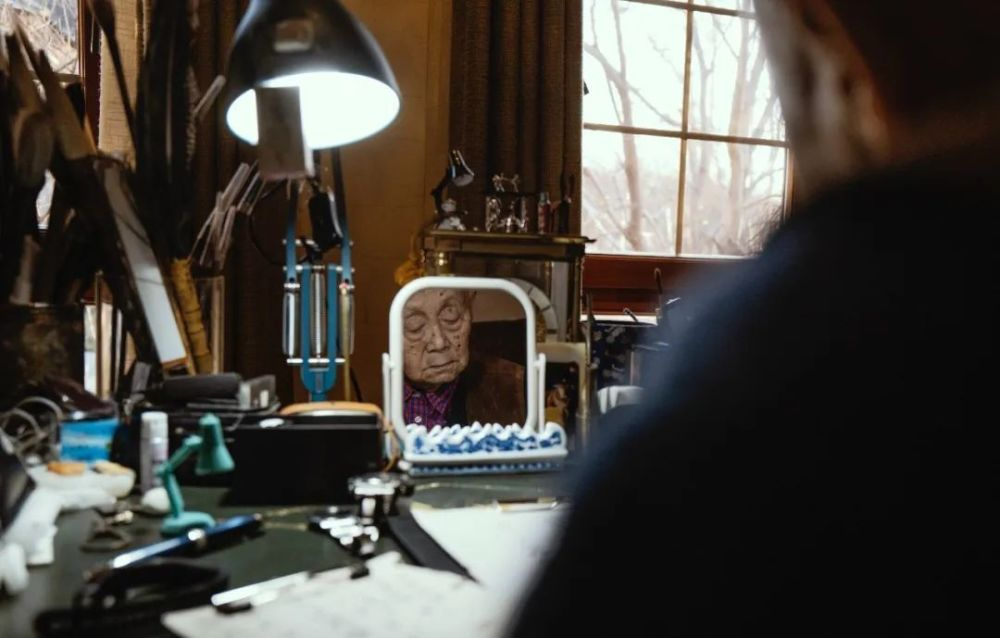

**钱，热闹，江湖**

评论黄永玉的画常见的关键词有：好玩、新奇、大胆、鲜艳，不过艺术最受欢迎的成就或许是——有钱。

黄永玉并不讨厌穷，流浪时穷得叮当响，他也过得很快乐。但他同样喜欢挣钱，他的很多快乐也需要钱来实现，他喜欢请朋友吃饭，喜欢给张梅溪买新衣服，很多新鲜玩意他也想要，五十年代就有唱机，七十年代末能穿牛仔裤，他的工作室还有数不尽的新书和唱片，这些快乐都需要钱。这个问题年轻时好办，他有使不完的力气，工资花光了，他就熬夜加班刻木刻，挣稿费继续花。后来回到多年前生活的香港，黄永玉从早到晚闷在工作室干活，不再有力气刻木头了，那就画画。香港喜欢色彩鲜艳的画，那就画得五彩缤纷。香港人喜欢买大画，越大越值钱，那就画大画，越画越大。

荣宝斋艺术总监雷振方在香港见到了90年代的黄永玉，一个将近70岁的勤奋新画家。这时期他画了很多作品，最著名的作品是《山鬼》，迥异于此前的作品，用色大胆，画幅巨大。它们给人的冲击感很强，产生了一种对国画的颠覆性认识：画还可以这样画吗？

更多大胆的作品署名黄永玉出现了。家里的小猴死了，他把小猴画在了共和国第一张生肖邮票上，最初面值8分钱，后来成为邮票史上价格最高的作品，一度实现“一枚猴票一辆车，一版猴票一套房”。家乡的酒厂找他出主意，他拿猴票挣来的稿费给他们出了酒瓶的设计方案，后来最出名的一款酒就是红极一时的“酒鬼酒”。

金钱、声名、艺术、人情，在黄永玉身上是混沌的边界。这位艺术家勤奋地画画，但他也真诚地喜欢钱，喜欢大宝石，喜欢最新的跑车。成为他的朋友其中一项标志是，他会热情地拉着你去书房参观他的宝贝。拉开抽屉，里面是一枚红宝石戒指、一个手表，还有一沓写着“黄永玉
收”的信封，那是每一次作品发表后寄来的稿费，全是现金。但他的快乐仅限于展示，关上抽屉，黄永玉还是黄永玉，穿70年前买的风衣，用小木匠给他做的木刻刀，喜欢吃女儿做的腌黄瓜。

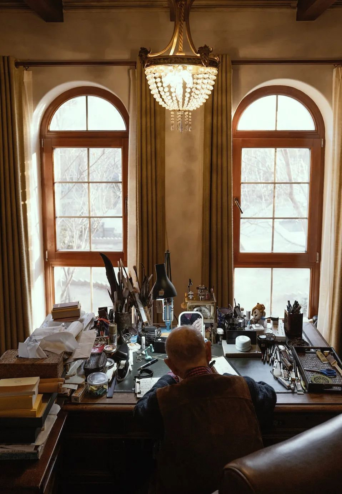

这份混沌的顶峰是万荷堂。这是从诞生就充满了江湖色彩的名利场。1995年，黄永玉再次回到北京。在此之前，他用画画挣的钱，天涯海角买房子，老家的、中国香港的、意大利的。这次他不想买了，他要自己盖房子。

于是，黄永玉以黄永玉的方式创造了一个建筑。他告诉我，万荷堂是他自己设计的，最初的蓝图也是他自己画的。我找到了这份蓝图，是一个画在卷尺包装盒背后的涂鸦。负责盖房子的柳运宠至今记得接到任务时的痛苦，“就巴掌大的纸盒”，黄永玉的要求不容置疑，“就盖这个房子”。

最终落成的万荷堂占地8亩，里面有一个12米宽的大画室，3亩的荷塘种满了各式各样的荷花，院子一角装下过一整个戏班子演出，另一角可以同时招待500人聚会，厨房的烤炉烤过全羊，烤过鹿，旁边的停车场依次停着不同款式的跑车，他的另一个交通工具停在画室门口，是一架德国运回来的马车，黄永玉偶尔会赶着马坐马车转转。

万荷堂有以下特征：自由、烧钱、三教九流。其中自由是最要紧的，艺术家在这栋建筑里追求无拘无束，荷塘里的花不允许修剪，野草不准拔，院子里的狗也不拴绳，想怎么跑就怎么跑。荷塘院子里的房子不允许使用一根钉子，一切都要按最自然的方式来，树长成什么样，盖房子时就用什么样。唯一抗议这种自由的是施工队。工头一次次跟黄永玉吵架，他们用经验跟他讲道理，盖房子不能追求纯天然，砍下来的树没有标准尺寸的，一头大一头小，拿它们当大梁，房子会塌。

黄永玉在万荷堂有自己的规矩。他养了一院子的狗，其中有两只，一只叫科学，一只叫民主。在这里，卖画不讲价，讲价放狗。

“他有他霸气的一面，一般画家不好意思谈钱，但他就是大方地告诉你，你不能少给了他。”王明明说。“他接触的人多了，这是他在用自己的方式告诉别人，我不缺钱，我那边开一个劳斯莱斯，你就不能把钱拿少了去买我的画，明白吗？对着这些世俗的人，他只能是这样。他知道怎么对付不同的人，对很多老朋友，他绝对是真情的，作品里也没有任何金钱。这是他的智慧。”

这里见证了北京城21世纪初最鼎盛的热闹。黄永玉喜欢聚会，万荷堂进进出出不同身份的人，画家、官员、商人、学者、厨师、服务员、戏班子、舞狮队、弦乐队……王明明是一个见过大场面的人，黄永玉送给他的字是“举重若轻”。采访全程，他只在回忆万荷堂盛况的时候扛不住了：“在万荷堂上百人来了，一坐一下午，我去我真闹心。”

“像咱们觉得这么多人，心里头一两天都乱糟糟的，可他高兴。黄老做人，能放能收。他高兴完了，热闹完了，第二天早上还是做自己的事儿，什么都没耽误，马上沉下来，第二天还是照样写，照样画，我觉得这是他最伟大的地方。大家看他光鲜，但没看他用功，艺术上没有过那一关，再聪明的人也不可能到达那个境界。他刻骨铭心地记住，但又没变成负担。”王明明说。

许多作品都是在热闹之后的第二天画出来的。他的画室有一架升降机，巨幅画布钉在墙上，他常常从早到晚对着一面墙画画。他喜欢上了画大画，画室最高容得下5米的画布，他就有了越来越多5米高的作品，5米高的荷花，5米高的荷塘，5米高的《春江花月夜》。

万荷堂里的黄永玉是一个艺术家最复杂的时刻——十分艺术，十分江湖，十分黄永玉。他只请过“文革”期间给他送花的花匠给画展剪彩，从此以后画展没有剪彩仪式，八十画展请柬上还标注着“恳辞花篮”。作家北岛办杂志筹不到钱，在黄永玉家做客的时候谈了自己如何碰壁，黄永玉转身去房间拿了一幅刚画好的画给他，让他拿去卖钱。这样的他也受过骗，给家乡捐赠，给酒厂做设计，捐钱修建学校，钱没了，事没办好。他生气，画画，骂人，然后忘了，继续上当受骗。

万荷堂最热闹的地方曾经是门口的亭子，取名“侃亭”，父老乡亲都能来这里跟他闲聊，海阔天空，侃侃而谈。这种人际乌托邦只短暂存在于没人认出他的那段时间，后来知道了住这儿的老头儿是黄永玉，万荷堂就开始隔三差五遭小偷，偷他的画，偷他的摆设，最后偷走了他给侃亭题名的匾。后来黄永玉发了狠，把“侃亭”两个字刻在大石头上。他很得意地告诉我，再也没有人能偷走他的字了。在万荷堂门口，我见到了没了匾的侃亭，的确没人能偷走他的作品了，只是在黄永玉的刻字旁边，多了一堆陌生人的署名——“×××到此一游”。

他也知道，自己的画不再只是一种艺术表达。现在见了老朋友，想念至极，想送他画，有时候刚答应了送一幅，颜色还没调好，站旁边等着画的老朋友就开口了，“哎呀，我家是两个孩子。”

80岁那年，他改写了孔子的话，“三十而立，四十而不惑，五十而知天命，六十而耳顺，七十随心所欲不逾矩，八十脸皮太厚刀枪不入。”到了90岁，三米的长卷上是他的感慨：“世界长大了，我他妈也老了。”

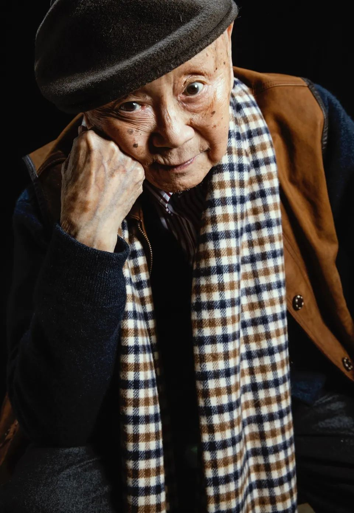

**两个老头儿**

黄永玉在新年画了一幅画，画好了撕，撕了再画，来来回回五次了。他请了很多人看，每次得到的都是赞美，只有他不同意，颜色不好，比例不好，细节不好。他找不到艺术上势均力敌的朋友给他提意见，画纸前只剩下老人自己做判断，一个人在画前摇头，不好，还不够好。

以前，他的第一个读者通常是张梅溪，夜里刻完木刻，两个人泡咖啡，边吃点心边看作品。接下来，他会邀请朋友们来家里看画，给他出主意，老朋友故去，这个名单越来越短。

名单上曾经还有汪曾祺，刻《海边的故事》的时候，汪曾祺看了不满意，黄永玉把里面的翘脚小男孩来来回回改了五遍。但他很早就从名单上消失了。

1997年，汪曾祺去世。那时候，黄永玉旅居意大利，女儿跑上楼，“汪伯伯去世了！”他没哭，也没说话。后来出书，写了他所有的老朋友，唯独没有汪曾祺。作家李辉问他为什么，“他在我心里的分量太重，很难下笔。”

他只认识前半生的汪曾祺，对这个朋友知根知底，见过他的父亲，一起熬过艰难的日子。这曾经是他最熟悉的名字，找曾祺看画，找曾祺吃饭，找曾祺聊天，找曾祺看他的文章。后来，这友谊渐渐变成了“听说”，听说他上了天安门城楼，听说他现在是干部了，从文表叔怕汪曾祺找不到工作，还给巴金写了信，后来才知道，那时候他已经决心投身革命事业了。

在这段过命的友谊里，汪曾祺是逐渐消失的。黄永玉被划为黑画家，朋友大半夜偷偷来看望，花匠也给他送花，让他放宽心，唯独没有见到汪曾祺。黄永玉挨了打，也没有见到汪曾祺。到最后，这个名字成为一个老人最孤独的记忆，一个无从询问的困惑：为什么在自己最黑暗的日子里，最好的朋友消失了？

他们是彼此最早的知音，汪曾祺写信给沈从文，他发现了一个小天才，“我以身家担保”，请老师帮忙找人推荐黄永玉的木刻。黄永玉想要回家乡，汪曾祺拦住了他，鼓励他留下来，“在狗一样的生活上做出神仙一样的事”。受委屈的时候，汪曾祺把沈从文对他的教诲送给了黄永玉：“做自己的事情。你有一支笔，怕什么！”

他们的晚年毫无交集，汪曾祺写给朋友的信时常提到黄永玉，“听吴祖光说”，“听王世襄说”，“听人说”。黄永玉的信写的是，“实在是想念他”，“你想念他，他不想念你，也是枉然”。

汪朗是汪曾祺的儿子，他从小知道一个黄叔叔，小时候给他画过画，被父亲一直挂在房间里，但他直到前几年才第一次见到了黄永玉。几乎所有人都说黄永玉热闹，只有汪朗说他“寂寞”，“老头儿现在挺闷得慌，没朋友了，能跟他说到一块儿去的人没了，没人跟他真的聊天。”

热闹里的黄永玉很像他的父亲。晚年的汪曾祺很受欢迎，社会活动很多，今天参加笔会，明天出去采风，还有无休无止的应酬、答谢、吃喝饭局。“老了，喜欢有人捧着，但他也知道自己几斤几两。”热闹，但骨子里真的孤独。

他把父亲也称为“老头儿”，“老头儿一直心里都有黄永玉，”汪朗说，“只不过就是……各种原因吧，没能够像过去那么亲密，这个（疏远）他也觉得挺遗憾的。”“他对黄永玉的东西一直是在关注的，而且一直是肯定”，“但是这个事儿，他又不能去跟黄永玉解释。”

黑画事件之后，汪曾祺非常着急，想要去看黄永玉，但他的妻子不同意。她是一个小心的人，害怕出事，不允许汪曾祺和这样的人来往。这并不是汪曾祺唯一一次软弱。儿子下乡回来，接济了受迫害的朋友，这对父母的第一反应也是怕出事。汪曾祺后来写道，是儿子教他理解了什么是义气。他也试图弥补过，80年代，他登门找过他，拜访那天张梅溪关着门，不愿意出来见他。后来的汪曾祺用沉默回应这段关系，命运的十字路口上，低了头的是自己，往回退缩的是自己，失去这份友谊是他自领的惩罚。

再去见黄永玉，我看到了另一个老人的负气。他能背诵汪曾祺写过的文章，包括没有发表的作品，但他讨厌汪曾祺的晚年作品，“他是一个写小说、写散文的人，老写吃吃喝喝，炒菜做饭，好多能力他都没有发挥出来！”他说起来就生气，“曾祺后来写的，我都不再看了！”声音提高了，开始发脾气，“我的文章，曾祺也没看过！”说完他犹豫了一下，想了想说，“后来的文章，（他）应该没看，没有系统看过。”又沉默了一会儿，他问我，“曾祺看过吗？”

但汪曾祺看过。这是汪朗记得很清楚的细节，在父亲的书柜里，放着一本翻旧了的《沿着塞纳河到翡冷翠》。那是黄永玉旅居意大利出的第一本散文游记。

荒唐的日子过去了，剩下了两个老人的各自孤独。黄永玉不知道的是，他再次回国后的几乎每一场画展，汪曾祺都去看了。作为一个普通观众，默默买票进去，参观老朋友的新作。看完满腹感慨，无人分享，只能回家一股脑儿倒给儿子，教儿子欣赏黄永玉的荷花，教他看懂老朋友的用笔，“一笔到底，足见功力”。他专门去纪念堂看了《祖国大地》，一眼看出画的用心，“这种场合不好画，这么画完全压得住这种场面，大气！”给朋友写信也忍不住夸了《祖国大地》，“此公近年可谓哀乐过人矣。”汪曾祺的书房里，一直挂着黄永玉刻给他的木刻《高尔基》。

黄永玉听到这件事后，不再说话。房间里只有水池里的流水声。几天后再次拜访，一见面他就要我看新画，那是一幅淡墨荷花，题名《一梦到洞庭》。他指着上面的荷花，“曾祺看了会开心的。”

这是一朵墨色的荷花，也是汪曾祺经常画的一类主题。他的很多作品都是墨色的，因为他只有一盒彩色颜料。“他不会用水墨浓淡，这张要是给曾祺看看，他就开窍了。他的画不开窍，他画画要是我在，讲两句给他听，他会解放，这是真的。”黄永玉说，“要是他掌握了这个，他就开心了。”

_《一梦到洞庭》_

这幅淡墨荷花大概是写给汪曾祺的回信。1954年，刚到北京的黄永玉拜访了齐白石，刻了一幅流传至今的齐白石木刻。这幅木刻起稿很难，黄永玉当时30岁，既没有刻过这样的人物，也不知道怎么理解齐白石。汪曾祺为他专门写了一篇文章《一窝蜂》，这篇文章从未发表，读者只有黄永玉一个人，好朋友用文字教他理解画家。

汪曾祺纪念馆建成，书迷们提议请黄永玉为汪曾祺纪念馆题字，黄永玉答应了，把汪家后代叫到家里拿字。和50多年前一样，黄永玉提前三天准备的菜，坐下来的第一句话是，“哪一个是小老虎？”汪朗笑着回答第一次见到的黄叔叔，“现在已经是老老虎啦！”

见到了黄永玉，汪朗觉得，父亲的人生有了很多答案。汪曾祺只抽卷烟，但他却有一个当成宝贝收起来的烟斗，现在终于知道，那是黄永玉送给他的礼物。他们去看了黄永玉的木刻展，找那幅因为汪曾祺改了五遍的木刻。他们从《无愁河》里摘出汪曾祺的段落做了剪报，那是他们所不知道的父亲的过去。

这是一段近似乡愁的友谊。而对黄永玉来说，很多名字都在时间里变得复杂。上海有老艺术家去世，电视台请黄永玉出来说几句话。草稿纸上留下了一个老人复杂的修改痕迹：“××是我在中央美术学院时的朋友”，划掉“朋友”，改成“同事”，再划掉，改成“同行”。最后落在纸上的正式回复只有短短几句，大意是相识甚浅，无从谈起。

很多名字都还能再回来，一种常用的理由是，“都过去了。”一切的确都过去了，如今所有人都是老人了。万荷堂搞聚会时，女儿拿着学生名单，一个一个跟黄永玉商量，这个人动过手，那个人砸过家里的东西，可是名单没法这么算，最后黄永玉说，让他们来吧，他们过去是打过我，但是这些人不算坏。

晚年的丁聪话越来越少，总是笑眯眯地坐在人群里，望着身边的朋友，一坐一下午。大家七嘴八舌地笑话他，“你怎么不说话了？怎么这么安静？”坐在一辈子的朋友旁边，丁聪老了，眯着眼睛不回答，直到最后才慢悠悠地解释了自己的沉默，“这就是人生哪。”

人生如此之长，黄永玉和汪曾祺最终却没有机会，坐在一起享受这份沉默。

**不要扶，不要服**

2021年的万荷堂空空荡荡，院子里住着年迈的“科学”，“民主”已经去世了。画室锁着门，里面的升降机前没有了大画布，门口的拳击沙袋外层晒脱了皮，悬挂沙袋的金属链生出厚厚的锈。荷塘里的荷花全败了，柳运宠偶尔跟新来的客人们讲解这里曾经的热闹，数得上名字的名贵荷花最初都种在这里，大明湖的荷花、颐和园的荷花、洞庭湖的荷花，但最后是无名无姓的野生荷花活了下来。

黄永玉依然坐在古雨厅的大桌子前，现在他需要放一台吸氧机在身旁。

万荷堂的热闹是一点一点消失的。2002年，张梅溪搬回香港，和儿子一家生活，后来的日子，有时住在山上的家里，有时住在医院。缺席聚会的朋友也越来越多，理由是老了，病了，去世了。2009年，丁聪去世。年底，王世襄去世。次年，华君武去世。黄苗子出院找黄永玉吃饭，两个人对着安静下来的万荷堂，黄永玉告诉老朋友，“现在就剩咱俩了。”那是他们最后一次在万荷堂吃饭。2012年，黄苗子去世。

整个万荷堂只剩下了一个老人。生活开始变得不方便，院子里的石板路推不动轮椅，画室门口的门槛也成了障碍。女儿找了新房子，90岁以后，他们搬到新住处生活。

布置新家的时候，女儿决定安装能上下楼梯的轮椅，他的第一反应是用不着。受伤住院后，女儿请人夜间看护，他生气了，抗议这个决定。他走路走不稳，旁人伸手扶他，他会瞪眼睛，一边颤颤巍巍地走，一边大声反抗，“不要扶！不要扶！”

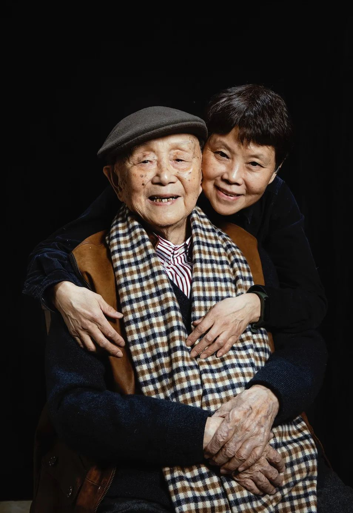

_黄永玉与女儿黄黑妮_

新家依然要办聚会，每天下午三点半，客人坐在他对面，听他讲笑话。他喜欢讲述一种帅气的衰老，最常讲的例子是他的弟弟。故事是这样讲的：他回凤凰老家，弟弟带他吃饭，两个人在路边等出租车，一个年轻人骑摩托车冲出来，冒冒失失地撞倒了弟弟。请注意，弟弟当时80岁了，被摩托车撞飞，弹出去一人多高，摔倒了，人没事，自己爬起来，恶狠狠地走过去，左一拳右一拳，把年轻人痛打一顿，教训他以后小心看路。打完解了气，一毛钱也没要，放年轻人走了，两兄弟继续打出租车。上车后连司机都佩服弟弟，80岁了还这么潇洒，司机一路跟哥俩打听，你们真的80了？今天不收你们的钱，我要回去跟我哥们说，80的人是怎么教训小年轻的。

这个笑话讲过很多次，赢得了很多笑声。柳运宠见证了这场交通意外，故事大致属实，只有部分细节问题：老人摔倒后并不是自己爬起来的，很多人搀扶着才站了起来，他也的确挥了拳，可每一拳都挥空了，毕竟，他已经80岁了。一个热血的老人确实存在，但他的衰老并不帅气。

真实的衰老是一种越来越具体的悲哀。老朋友住上海，临终之际给黄永玉打电话，想再见他最后一面，他在北京的电话一端急了，“你千万不要死，要死也等我来了再死。”他坐飞机赶到了上海，老朋友却已在火葬场了，人生只剩一场告别仪式。黄永玉没去参加仪式，一个人跑去停尸房，见了他最后一面。

显然，黄永玉不喜欢这种结局的衰老故事。衰老不应该是这个样子的，他和朋友讨论过的，在老朋友都还活着的时候，死亡就是一个他们具体讨论过的话题，大家还专门为此聚会，畅谈死了以后怎么办。丁聪、黄苗子、华君武，都发了言。他们有的说拿骨灰种花，有的说拿骨灰撒回大海，还有人提议骨灰直接冲到马桶里，一了百了。张梅溪不同意，嫌弃骨灰会堵住下水道。黄永玉说，那就包成饺子。

他见识过朋友的衰老，有骨气的老，从容的老，就像黄苗子那样的老。当时他病了，黄永玉去医院探望，躺在医院里好几年，可他还总是笑眯眯的，在病房里面写字，看书，和朋友对诗，做完透析找人吃溜肥肠，在病床前吃涮羊肉庆祝生日。黄永玉一直欣赏黄苗子身上的从容，性格从容，宠辱不惊，自得其乐，“连害病都害得那么从容”。

人生最后的日子，黄大刚怕他受不了闲话，拔了家里的网线，不让他看到外面的诽谤。直到父亲去世后才知道，老人早早找了人接上了网线，所有的说法，他全看到了。但他此后的每一天依然过得坦荡，睡得好，吃得下，该怎么过怎么过。他指着儿子住的方向，告诉当时身边的人，“他们太小看我了。”

有一次病危抢救回来，黄苗子醒过来的第一句话是，拿笔来，要写字。黄大刚只好在护士休息室拼了两张桌子，铺上宣纸，研了墨。他发现，父亲站不住，但拿笔的手始终不抖，“根本不像一个病人写的，很霸气”，写于朝阳医院病房里的字是他这辈子最苍劲有力的作品——“万紫千红”。

这才是黄永玉能接受的衰老。小牧童老了，病了，被痛苦剥了皮，但他还要唱歌，在地狱里也要唱歌。

这一次，轮到黄永玉老了。医生跟他谈话，他一句话也没听进去。胆坏掉了，肺坏掉了，血管坏掉了，心脏上有个小盖盖也坏掉了。他喘不上来气，医生让他住院，他带着书、颜料、画笔、画纸住了进来。住了几天他就生气了，医院里怎么有这么多不准——不准熬夜，不准劳累，不准吃辣椒，到处都是不准。

他的身体变得不像黄永玉了。摔倒了要住院，感冒了要住院，只是多吃了一顿涮牛肚，痛风就犯了，还是要住院。他不喜欢医院，医生讲话不公平，只对年轻的病人说“完全康复”，老人生病只能听到“这样就挺好”，仿佛痊愈是一种仅属于年轻人的特权，一个老人总是得到另一种人生真相——办不到，再也办不到了。

回到家里，黄永玉生气了。他不喜欢衰老，一点也不喜欢。这辈子还有很多事情要做，要当侠客，要刻木刻，要画画，要写《无愁河》，好不容易把苦日子熬过去了，怎么就老了呢？老天爷办事真不公平。

黄永玉老了，这事他不同意。他开始用黄永玉的方式反对自己的衰老。摔倒伤了骨头，住院动手术，往骨头里钉了钉子。医生安慰他，人老了，不能走路很正常，做这种手术之后要是还想走路，三天之内就得下地练习，这是年轻人才做得到的事，下地练习那么疼，老人不必勉强。然而，三天之后，黄永玉站起来了，老不老他不管，他要重新走路。

家里的餐桌前挂着一副对联，他在题跋里写道，“人老不怕，就怕颓废和意志消沉。看我们今天多带劲！所以今天我写这副不对仗的对联来长长我们老头老太太的志气，什么七十不留宿，八十不留饭的混蛋话！”

这副对联写的是：

人说八十不留饭

大伙喫给他们看

上面密密麻麻的是平均年龄80岁的老朋友签名，都是北京人艺来万荷堂吃饭的老艺术家，包括时年88岁的郑榕、85岁的蓝天野（已故）、82岁的朱旭（已故）、77岁的张曼玲、72岁的吕中和徐秀林，还有从美国回来的卢燕，当时也已85岁。

他近乎赌气地想要证明，衰老偏偏可以很帅气。一个老人也可以像年轻时一样活着，还有爱情，还有友谊，还有作品，还有希望。

_黄永玉98岁时作的画，上面题着「我九十八了，活该请您来万荷堂喝一杯。」_

于是，黄永玉成为了北京城最年轻的老头儿。他喜欢坐敞篷跑车出门。住院醒来的半夜里，他坚持要喝一瓶雪碧。他还要给张梅溪打电话，耳朵听不到了，他们就写信。两个90多岁的老人照样要谈恋爱。他们在同一个笔记本上写下给对方的话，笔记本的边角上是卡通画，一只小狗和一只小猫笑眯眯地手拉着手。女儿在香港北京两地飞，负责给两个老人传递情书。

晚年的张梅溪忘记了很多事，黄永玉就把他们的故事写进了自己的小说里。女儿在病床前给她读《无愁河》，写到他们的19岁，写到了最初的相识，一到这种时候，张梅溪会醒过来，想起同一时期的细节。她已经没办法握住笔，本子上的字歪歪扭扭，不同段落常常重叠在一起：

我最亲爱的好爸：
我很挂念你……我十分想念你，你来这里住，好吗？……你的画，很好，我一看就知是我爸爸，爸爸你一定好好中意我吔！我们都十分中意你，挂念你！你来！！我天天炒菜给你。
今日下雨，我中意下大雨，好好玩啊！ 亲亲你好爸爸。 你的大头女， 梅溪

然而，衰老是一条越走越窄的路，前路少有坦途，多得是无能为力。2019年，香港机场交通阻断，黄永玉困在北京。他只能这样回信给他的爱人——

梅梅妈妈： 你说这个世界好不好笑？香港今天变得这么混乱，我原本想回来看看你，都办不到了，只好等香港早一天平安，好让这两个九十岁的人见见面。
我自从摔了那一跤之后，人完全和以前不一样了，生龙活虎的人，走路都慢慢一拐一拐地了。有什么办法呢？
不过脑子和手依然灵活。要不然文章和画画都弄不成了。感谢上天。 我仍然祈求老天让香港早早恢复正常秩序，以便我能早日回香港看你。 吻你！ 老爸，北京

这封信没有回信。两个月后，新冠疫情在全球爆发，再等两个月，香港政府实施了入境限制，又过了两个月，黄永玉接到了一则来自香港的消息。北京的家里很安静，旧烟斗整齐地摆在柜子上，小猫窝在沙发上晒太阳，房间里摆满了花，正如女主人喜欢的那样。一个人的时候，黄永玉用正楷工工整整写了一张纸条，这是他写的最后一封关于张梅溪的信：

梅溪于今晨六时三十三分逝世于香港港怡医院，享年九十八岁。多年的交情，因眼前的出行限制，请原谅我们用这种方式告诉您。

身边的人们看得出他伤心，但没有人见到他哭。他请人把张梅溪15岁的照片装在镜框里，放在每天看得到的地方。剩下的时间，他的日子还是一样，早上画画，中午写字，晚上抱着小猫，一个人看电视。

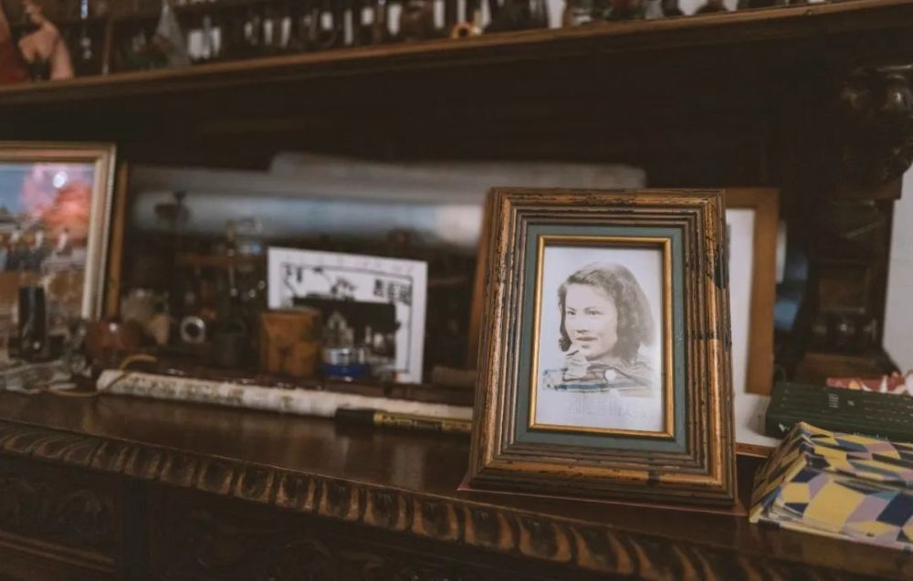

和他聊天的节奏越来越慢，故事讲到一半常常会停下来。他还是喜欢讲笑话，讲梅溪遇到小混混，俩人一起去教训他们，把人吓跑后哈哈大笑。他最喜欢讲第一次见到的梅溪，她穿着白色裙子，背对着自己，在房间里和着钢琴伴奏，唱Ave
Maria（圣母颂）……

这是一个他没有讲完的故事，因为讲到这里，他就停了下来，仰头望着天花板，盯着灯光发呆，他不再说话，所有皱纹渐渐舒展开来，大概在记忆里见到了谁，最后一个人自顾自地笑，“嘿嘿！”

**我是在跑万米**

黄永玉最近重读了《了不起的盖茨比》，但他看的版本是自己年轻时读的《大亨小传》。他又翻出来《万象》杂志的过刊，重读了胡适。他开始找过去的音乐听，手机排行榜上都是老歌，后来我放给他一首歌，他侧过身子用还能听得见的耳朵听，听出来是《忧愁河上的桥》，第一反应是兴奋地招呼女儿过来，“妹妹！妹妹！”两个人凑在一起听过去的旋律，直到今天，他还唱得出《Bridge
over troubled water》：

When evening falls so hard,

I will comfort you.

I’ll take your part.

When darkness comes,

And pain is around,

Like a bridge over troubled waters,

I will lay me down.

黄永玉有很多珍藏的宝贝，他也乐于分享。他说他把自己在《诗经》中最喜欢的一首诗刻在了木头上。在万荷堂的画室里，我看到了这六块大木头，那是朋友从云南送来的金丝楠木，黄苗子也欣赏这首诗，爬上梯子直接给他题写在木头上：

诞寘之隘巷，牛羊腓字之。

诞寘之平林，会伐平林。

诞寘之寒冰，鸟覆翼之。

这是《大雅·生民》里讲后稷的故事。后稷名“弃”，这也是一则名副其实“弃”的故事，后稷一出生就遭受抛弃，所幸每次都能得救，被弃置在窄巷里，牛羊避开他走，不伤害他，后来扔在树林里，樵夫救走了他，最后放在寒冰之上，大鸟用羽毛盖住这个孩子，保护他长大。

与他共鸣的似乎都是“弃”的故事。贝多芬音乐强力但是底色悲凉，肖邦有背井离乡的离国恨，拉赫马尼诺夫的底色是悲哀，帕格尼尼也并不是一个快乐的人。《紫苑草》讲了一种底层现实：纵然努力对抗命运，却依然负担着人生的无奈和沉重。

黄永玉说，他有很多话要告诉我，有些事现在能讲，有些事要很久之后才能讲，他讲出来不是为了发表，也不求出名。说这句话的时候，他眼睛红了，他说自己所希望的是，再过100年，至少有一个人知道黄永玉是一个什么样的人，“一个没有奴性的人”，“一个没有低过头的人”。

我问黄永玉，为什么喜欢画荷花。他显然不是为了荷花的高洁而画了一辈子。“出淤泥而不染”，他一遍遍在画里题跋反驳周敦颐，“没有淤泥，荷花如何活下来？”

关于荷花，他曾经这样解释：小时候在外婆家住，闯祸后常常躲在荷塘里，一躲一下午，也顺势看了一下午荷花。他发现荷花不像君子们画的那样干干净净，真荷花里面有泥苔，周围也很热闹，青蛙、水蛇、蜗牛、螺蛳、蜻蜓，全在一块儿。他喜欢这种热闹，这是一种人生的妙。

但这一次，他重新解释了荷花。他在笔记本上画了花的解剖图，荷花杆是中空的，但它足以顶起一朵盛放的大荷花。荷花杆的内部切片里是无数个小管，整整一把圆管聚在一起，狂风暴雨过来，荷杆固然柔软纤细，但既不会断，也不会倒。它的特质不是与世无争，而是不可摧毁。它就像是沈从文画给自己的小船，在小小的波浪中也动荡不止，但是到了大浪里也不会翻沉。于无声处坚韧怒放，这就是黄永玉的荷花。

“我能忍受你想象不到的那种委屈，那种痛苦，我能忍受。不是一件事，是多少个。这一点我不讲给别人听，是我心里得意的地方。人同人之间的那些问题，受到一点委屈，受到苦，很苦的。我当天感觉有点不好受，第二天就做别的事了，不太去想它。想它一点用处也没有，真是好苦，但是这一辈子，这种苦同我的努力，同我的用功，不能比。”黄永玉说，“我是在跑万米，不像跑一百米那么好看。跑万米绕圈的，不太有人看。我就是一个跑万米的人，要是有人说我跑得不好看，跑得慢，你不必停下来说道理，那就浪费了。让这个生命远一点，跑到终点是我们的目的。”

_黄永玉家门口挂着一幅工笔荷花_

最后一次拜访黄永玉，窗外满是太阳，丝毫没有要下雨的样子。阳光从彩色的玻璃照进来，大黄狗和小猫一起窝在桌子底下睡午觉，黄永玉还是在讲笑话。

“『四人帮』垮台了，我那时候正在画毛泽东纪念堂的壁画，住在华侨大厦。有人告诉我，有一个人在南京跟着你们走了一路，是他报告的江青，现在就住在华侨大厦，跟我们住在一起。我说，太好了！找几个人打他！”

这时候，他的女儿拿来了一盒喉糖，他拿出一颗，递给听笑话的客人，“你吃一个糖，这个糖是我的家糖，我最爱吃的。”嘴里嚼着糖，他很开心，笑着继续讲，“这个事情现在不会有了，那个时候有机会还会动动手。”“贺敬之管文化方面的事，他打电话给华君武，说，黄永玉在华侨饭店打人了，你知不知道？华君武说，我不知道啊，怎么可以打人呢？”他模仿领导的正经口气，“华君武就打电话给我，说你打人了，有这事儿吗？我说有，他说，贺先生说以后不要再打了，这样不好。我说，知道了。”口气在这里突然变了调，笑话来了，“接着他问，哎，你是怎么打的，快讲给我听听。”

说完客厅爆发了大笑，黄永玉看着客人们一起笑。

第一次见到黄永玉，聊天中，他突然停下来问我：“如果有一天不让你笑了，你怎么办？”

他说，他已经把办法写进了一首诗里，但他脾气又急起来，要告诉我许多办法：在家里藏一本大英百科全书，把喜欢的唱片放在柜子后面，好看的书要用东西包起来藏在床底下，一个人的时候再拿出来，读书、画画、听音乐。他还花了10分钟讲解如何煮出最好吃的绿豆，拿一口小锅慢慢熬，用冷水把绿豆皮滤掉，这是他下放时候摸索出来的方法。胡同里的沈从文又一次在故事里出现了，讲到错身而过的瞬间，他一字一顿地重复着那则代代传递的经验：“要从容。”

后来，我找到了他留在诗里的办法，那是作于85岁的《笑》——

挖个洞，把笑埋进土里，

到春天，种子发芽，

长成一棵大树，

像座高高的钟楼，

风来了，

满树都响着

哈！哈！哈！哈！

2022年新年第一天，他完成了撕毁五次才画完的那幅画。这幅画悬挂在客厅里，湛蓝的天空下星星点点，家家户户亮着灯，守着一汪平静的湖水，花尽情绽放，题名《今夜》。画前题字是这样一段话：

“愿上天给人间每个人都有美好的今夜，天天如此，月月如此，年年如此，十年如此，百年如此，告诉子孙们，人应该拥有如今夜之权利，过宁馨如今夜之日子……比如考古学家举它对未来的某一天如今夜的观众说，这幅画是个九十多近一百岁的老头画的，水平虽然算不得高，留传至今，起码能给后人一点欢喜，告诉我们，那时候人们是如何打发日子的。”

他还想写《无愁河》，命运里像是总有一个阻力挡着，不让他写这部小说。第一次动笔是在1945年，在抗战和动荡中停笔，第二次续写是在80年代末，写满一年又停了下来。86岁那一年，他重新动笔，这次还是有很多力量让他写不下去，生病、住院、衰老、离别、伤痛，但他这次继续写，13年间写了262万字，一直把故事写到了1949年。

书里很多故事早已出现在他的其他作品里，但这里每个故事写得很细。写到少年时代见到李叔同，过去他只讲如何在他面前摘玉兰花，这一次他写的是，看到弘一法师圆寂后，回去的路上默默哭了起来。

他的心里并不是没有波澜，只是人老了，伤心是一种秘密。他和年轻时一样，听老歌会哭，读诗会哭，想起朋友时也哭，看到新闻莫名伤心了，不敢让女儿知道，躲在被窝里偷偷哭。他只能把这些说不出口的感情画到画里，写到书里。

他连人生最后的细节都想到了，到时候送去火葬场，送过去就行了，不用想着领骨灰回来，“不好分，怪累的”，他打算跟孤魂野鬼一起过，大家一起热闹。他对于死只有一个要求，“到时候胳肢我一下，看看我笑不笑，”这是他的生死标准，“笑了，我就还活着。”

活了一辈子，黄永玉只是黄永玉。这是他在《世说新语》里最喜欢的一句话：“我与我周旋久，宁作我。”

再有两个月，这个人就要99岁了，人生再来个一百年，结局或许还是同一样——天地不仁，白云苍狗，但管它呢，我与我周旋了一辈子，黄永玉永远是黄永玉。

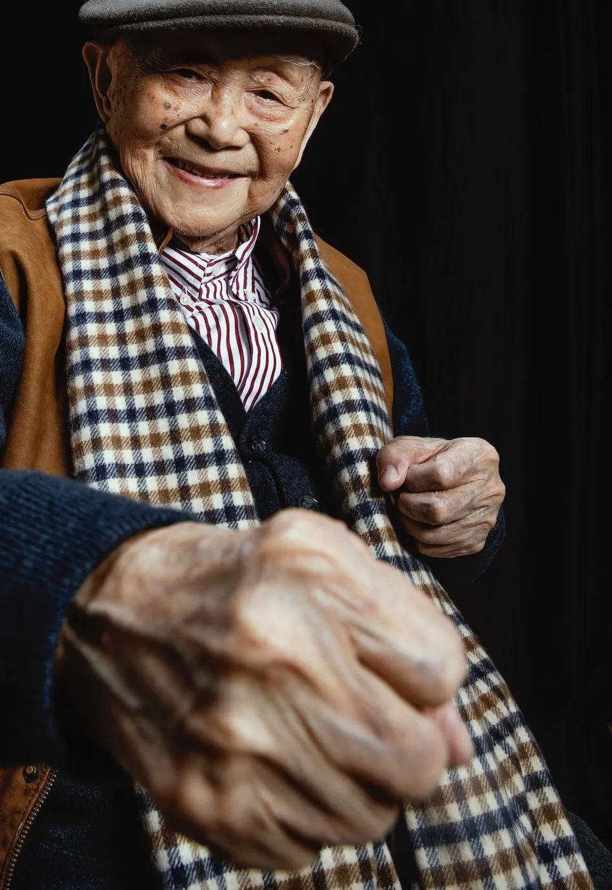

（王贻芳、张新颖、吴洪亮、李庚、杨超、孟斐璇、超仁、汪朝、齐方对本文亦有贡献，感谢瞿中华对本文的帮助）

