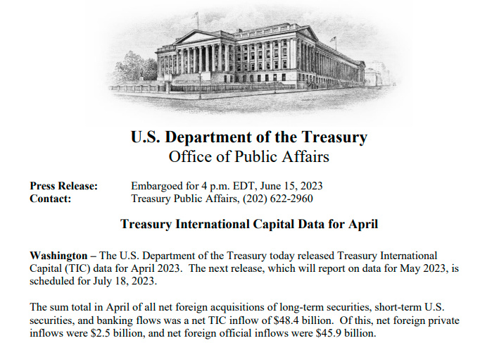

# 3月增持只是“昙花一现”？中国4月又开始重新减持美国国债

**财联社6月16日讯（编辑 潇湘）**
当地时间周四(6月15日)，美国财政部公布了2023年4月的国际资本流动报告(TIC)。报告显示，外国投资者持有的美国国债规模在4月小幅增加。而其中最受瞩目的无疑是，美债第二大海外“债主”中国在3月罕见出现增持后，4月重新减持了美国国债规模。

**数据显示，中国4月持有的美债规模小幅下降了4亿美元，至8689亿美元，这是过去一年时间里出现的第十次月度减持。**

今年3月，中国的美国国债持有量曾出现了自2022年7月以来的首次上升，打破了之前“七连降”的下行态势。不过随着4月中国再度对美债进行了减持，3月的增持如今看来似乎只是整体减持过程中的一个“小插曲”。

值得一提的是，自去年4月算起，中国的美国国债持仓目前已连续13个月低于了1万亿美元。

整体来看，4月份外国投资者持有的美国国债规模从上月的7.564万亿美元小幅升至了7.581万亿美元。

不过， **在美国前八大海外“债主”中，有五个——中国、英国、比利时、瑞士、开曼群岛在4月出现了减持，仅日本、卢森堡和加拿大出现了增持。**

其中，日本在4月仍是最大的美国国债海外持有国。当月日本持有的美国国债规模从上月的1.0879万亿美元减少至了1.1272万亿美元，环比增加了393亿美元，持有规模创下了去年八月以来的最高水平。

基准的10年期美国国债价格在4月份上涨，收益率则在当月下跌——从4月初的3.524%降至了月底的3.424%。整个4月，10年期美债收益率的月内低谷是4月6日时录得的3.253%，月内峰值则是4月19日录得的3.639%。

美国金融市场在3月发生了惊动全球的区域银行业危机。硅谷银行(SVB)在3月10日被FDIC接管，成为了(当时)自2008年次贷危机以来倒下的最大金融机构。此后，虽然在4月美国金融市场的动荡程度虽有所缓和，但仍未彻底走出银行业危机事件的余波。

**TIC报告的其他亮点**

美国财政部发布的国际资本流动报告(TIC)内容还显示，4月份外国对美国长期、短期证券和银行流水的净买入额为484亿美元。其中，外国私人资金净流入为25亿美元，外国官方资金净流入为459亿美元。

4月份，外国居民增加了对美国长期证券的持有量；净买入额为976亿美元。外国私人投资者的净买入额为594亿美元，而外国官方机构的净买入额为373亿美元。美国居民减少了他们对长期外国证券的持有量，净卖出302亿美元。

若将国际长期证券和美国长期证券均考虑在内，外国4月对美国长期证券的净买入额为1278亿美元。外国居民4月减少了449亿美元的美国国库券的持有量，外国居民持有的以美元计价的短期美国证券和其他托管负债则减少了141亿美元。美国银行系统自身对外国居民的美元计价的净负债减少了652亿美元。

（财联社 潇湘）

