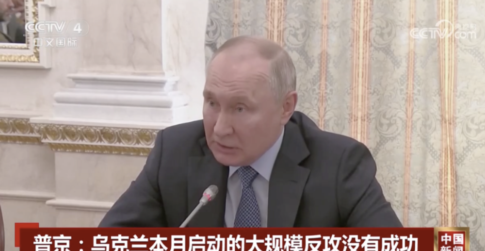
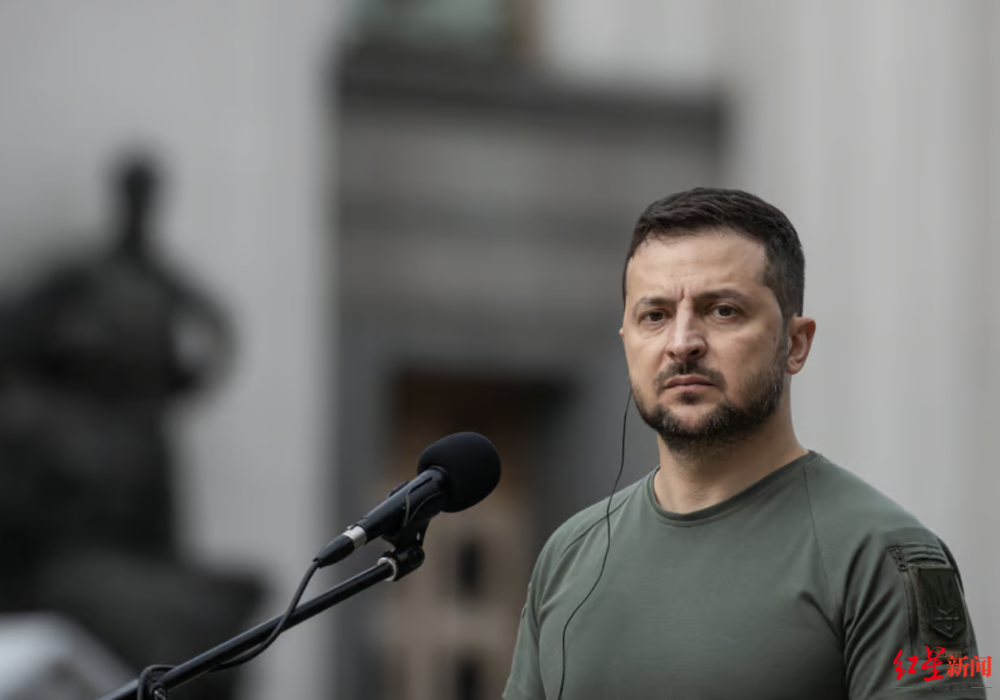

# 俄在乌建立“二战以来欧洲最广泛防御工事”？乌防长：西方要降低反攻期望值

乌克兰总统泽连斯基10日在记者会上证实，乌克兰已开始反攻。而俄罗斯总统普京12日也对俄多家媒体表示，乌军反攻于本月4日开始并持续至今，这是一次大规模反攻，乌军还动用了后备力量。

尽管两国领导人都证实乌克兰的反攻已经开始，但关于乌克兰的反攻进展，俄乌双方却各执一词。乌方称在多地取得进展，而普京14日则称，乌军本月开始的大规模反攻没有成功，反倒是遭受了几倍于俄军的损失。美媒认为，进攻难度比防守大，在俄罗斯已有准备的情况下，乌克兰的反攻行动可能并不容易，现在很难衡量乌克兰的反攻进展。

_↑俄罗斯总统普京14日称，乌军本月开始的大规模反攻没有成功
图源：央视新闻_

此外，按照乌军官员的说法，鉴于俄罗斯强大的防线，乌反攻行动只能循序渐进。不过按照美媒的说法，乌克兰的西方盟友正在慢慢失去耐心。

**普京：25%-30%援乌武器装备被俄摧毁**

当地时间6月12日，乌克兰国防部副部长汉娜·马利亚尔称，乌军自发起反攻以来，已从东部顿涅茨克和南部扎波罗热地区约100公里的战线上“夺回了7个村庄”。对此，俄罗斯国防部回应称，俄军已击退乌军在东部顿涅茨克和南部扎波罗热地区的全部攻势。

当地时间6月15日，马利亚尔再次表示，乌克兰的攻势正在多个地区“逐步推进”。按照她的说法，乌军在南部地区正在“缓慢但稳步推进”；在东部巴赫穆特地区，乌军已经在过去10天内推进了3公里。乌克兰武装部队总参谋部发言人安德烈·科瓦洛夫也表示，乌军在巴赫穆特方向发起了进攻并取得了进展。俄罗斯国防部则在15日表示，其击退了乌克兰军队在扎波罗热地区的进攻。

在宣称乌军在反攻中取得进展的同时，马利亚尔也强调称，乌军部队面临着对方地雷、无人机攻击的威胁。“俄方正在巴赫穆特发力，以阻止乌方的进攻。”

有分析称，俄方已经在东部和南部的俄控区域建筑了防御工事，做好了防守准备。非营利性研究机构战略与国际研究中心（CSIS）国际安全项目部门负责人、军事分析专家塞斯与其他两人于6月9日发表文章称，俄罗斯军方已经在乌克兰建立起了“二战以来欧洲地区最广泛的防御工事”。

_↑军事分析专家塞斯_

美媒称，反攻行动中乌军已经在人员和装备上出现了损失。美官员还表示，鉴于防守比进攻容易，一般而言进攻方的人员损失比防守方大，为此俄方的损失可能比乌方小。据报道，乌克兰在过去几天内损失了16辆美国提供的“布拉德利”步兵战车。俄罗斯国防部则公布了一段“俄军在战斗中缴获了乌军装备的德制‘豹’式坦克和美制‘布拉德利’步兵战车”的视频。

据俄媒报道，俄罗斯总统普京当地时间周三（14日）向俄罗斯战地记者表示，基辅在最近几天的行动中，已经损失了至少160辆坦克和360辆装甲车。普京估计，在西方国家援助乌克兰的所有武器装备中，已有“25%-30%”被俄罗斯军队摧毁。

**乌防长：建议盟友降低对反攻的预期**

有分析指出，乌克兰选择此时发起反攻可能有两个原因：第一，反攻所需装备准备基本完成；第二，进一步争取西方的支持。据了解，北约将于7月在立陶宛首都维尔纽斯举行峰会。泽连斯基此前表示，西方国家若不在此次峰会上向乌提供安全保障，“就是背叛乌克兰”。

_↑乌克兰总统泽连斯基
资料图_

尽管美国总统拜登及其西方盟友此前一再强调“只要乌克兰需要，就会提供支持”，然而乌克兰官员却表示，乌方近日来向美国提出的有关未来承诺的相关问题都并未得到回应，美国官员只会简单回答“先看看反攻情况”。乌克兰前副总理伊凡娜·克利姆普什-
钦察泽对此表示“很焦虑”，其在接受采访时表示，美国现在的态度让自己担心在（9月底）美国本财年结束后，美国是否会保持与此前同样的力度支持乌克兰。

在反攻开始前的一段时间，泽连斯基及其政府一直在向西方盟友解释其为何迟迟不开展反攻行动。而在反攻行动开始后，乌克兰国防部长列兹尼科夫却担心西方盟友对于乌克兰的反攻进展抱以过高的期望。“我们每个人都想取得胜利，但我还是建议西方盟友降低期望值，以避免失望。”他说道。

英国皇家联合军种研究所的分析师杰克·瓦特林认为，到目前为止，乌克兰的反攻较为困难。按照他的说法，乌军应先找到俄军的弱点并加以突破，而届时“突破速度”将是至关重要的。“当突破可能性达到最大时，（乌）就可以发起进攻。”他分析道。军事分析专家塞斯也认为，乌克兰正在试探俄罗斯防线的薄弱环节，“乌军现在从多地发起进攻，就是在寻找俄方的弱点。”

据悉，有乌克兰匿名军事官员表示，俄方的防线非常强大，乌方只能循序渐进。有分析指出，乌克兰可能将展开长期攻势，而其西方盟友现在应该保持耐心。随着美国总统选举日期步步临近，美国对乌克兰的援助强度可能难以维持；而在欧洲，尤其是乌克兰的邻国波兰，也已经对这场持续了超过一年的冲突产生了“厌倦”心理。

红星新闻记者 黎谨睿

编辑 郭宇 责编 李彬彬

