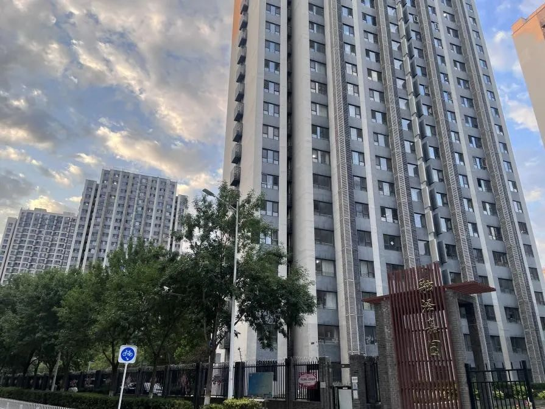
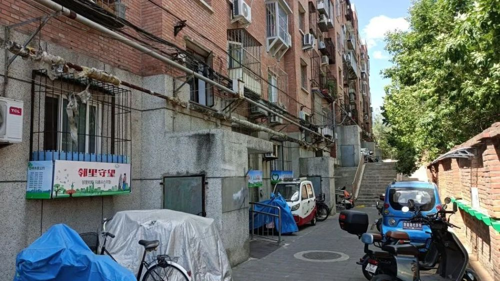
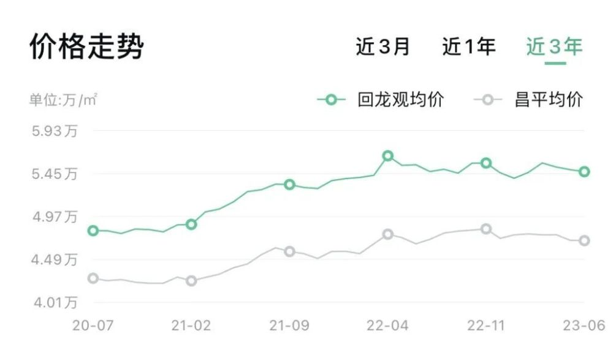

# 北京房价见顶了吗？老破小领跌，豪宅学区房依然坚挺

_融泽嘉园。摄影：《财经》记者
刘昕_

**文 | 《财经》记者 刘昕 实习生 任德辉 王文彤**

**编辑 | 王博**

自年初开始回温的北京二手房市场，在5月按下暂停键。

6月15日，国家统计局发布5月份70个大中城市商品住宅销售价格变动情况。北京的二手住宅销售价格指数比上月降低0.6，这是今年以来首次出现环比下跌。

房产经纪人对北京楼市降温的感知更早，不少经纪人告诉《财经》记者，2月楼市小阳春没持续多久，3月中下旬开始，房子又不好卖了。

进入5月，楼市的悲观情绪继续蔓延。挂牌量、降价数字刺激着购房者的神经：

“北京二手房挂牌超12万套”；

“北京二手房市场急转直下，有业主割肉80万”；

“北京燕郊房价下跌50%，房子白送没人要”。

真实的市场情况如何？到底有哪些房子在降价？《财经》记者调查多个小区后发现，北京市场呈现出分化趋势。

五环以里的确有部分30年左右的老旧小区在大幅降价；北五环外互联网大厂周边的房子受裁员及新盘冲击，降价也较突出；京郊的房价继续萎靡不振。

但总体看，这场降价潮中，北京城区楼龄在10年左右，区位和物业品质较好的小区比较“抗打”，挂牌价及成交价并未出现明显波动，部分优质豪宅仍在“偷偷”上涨。

**改善需求成主流，老破小降价求卖**

年轻人大都不买房了，北京楼市也正转变为置换型市场，这导致刚需购房者占比越来越少。根据贝壳研究院对经纪人的调研，目前，北京的改善换房需求占比超过7成。这意味着，首套上车的刚性需求不超过30%。

“卖旧买新”的业主为了买二套房，需要将手中的刚需房出手。这类房源包含大量老旧小区，具有总价低、地理位置相对核心等优势，但在居住条件、保值性方面存在劣势。《财经》记者调查了多个此类小区，挂牌量一直居高不下。

面对这类房源，刚需购房者上车意愿在下降。多位链家中介透露，朝阳区、海淀区的一些刚需盘，4月-5月前来看房议价的人并不少，但是相较2月-3月谨慎了很多，“看到市场不好，大家都想观望一下，看房价能不能再降。”

过量的供给，碰上收缩的需求，让很多刚需房业主不得不降价甩卖。

以东四环附近的朝阳区八里庄北里小区为例，该小区1981年建成，临近十里堡地铁站，主要户型为两居室，目前在贝壳App上挂牌135套。该小区一套56平方米的精装两居室，6月初挂牌价为305万元，一位小区中介表示，同类户型今年2月的成交价基本在360万元以上。

地震局宿舍小区位于石景山区，1986年建成。一套95平方米的三居室于4月上架，初始挂牌价510万元，6月初，业主将挂牌价降至499万元。中介介绍，同栋楼相同户型的另一套房子，去年1月以570万元的价格售出。

_（位于北京西五环的地震局宿舍小区，楼龄约37年。摄影：任德辉）_

为何老旧小区越来越难出手？中介表示，一是市场供大于需，老旧小区楼盘品质比较低，相同的价位在相邻位置可能会找到楼龄更新、物业更好的房子。其次，老旧小区的增值空间已经到顶，以后若出手，上涨空间几乎没有了，除非是有学区光环，否则投资价值根本拼不过新小区。

**互联网大厂撑起的回龙观，房价也降了**

回龙观是近10年来北京置业需求最旺盛的区域之一。一位回龙观区域的链家中介告诉《财经》记者，去年下半年，回龙观已经有房价下跌的迹象，今年2月涨回来一些，3月下旬之后，市场又不好了。相比今年2月，目前整个回龙观地区的成交价差不多降了8%。

回龙观靠近西二旗、望京两大互联网公司聚集地。虽在北五环外，但周边有腾讯、百度、网易、新浪等大厂，交通、商业等配套设施也相对完善，成为互联网从业者买房的首选之地，房价曾一路水涨船高。

_（回龙观近三年房屋均价走势。来源：安居客App）_

回龙观的二手房源主要分为两类，一类是2000年前后建的经济适用房，例如龙腾苑、龙博苑、龙跃苑。另一类是2010年之后交付的次新房（年代较近的二手房），例如融泽嘉园、首开国风美唐。

一位融泽嘉园的链家中介告诉《财经》记者，近一个月，该小区成交价普遍下跌了10万元左右。如果跟今年一二月相比，降幅甚至能达到近50万元（见头图）。

该链家中介向《财经》记者展示了一份93平米户型房源成交记录。如果只看中层房源，去年9月，一套8层、中等装修的房子成交价为631万元。今年2月，一套9层、精装修的房子成交价降到603万元。5月底，553万元便可买到一套9层、简装的房子。

另一个次新盘首开国风美唐也在降价。根据链家中介提供的成交记录，今年3月，该小区一套中层、92平方米的房屋成交价为690万元。5月底，一套条件类似的房屋成交价为629万元，下降约60万元。

年代稍远的经济适用房小区也是如此，一位龙华园的链家中介告诉《财经》记者，73平方米的二居室目前成交价400万元左右，比2月-3月大约降了20万元。

多位中介认为，回龙观房价下跌，与互联网公司裁员有一定关系。曾有西二旗的互联网从业者告诉《财经》记者，因为担心被裁员，打算暂时搁置买房计划。

除此之外，回龙观周边新楼盘多、价格有吸引力，也让二手房业主倍感压力，“想成交就得降价”。

贝壳App上，融泽嘉园的参考均价从5.9万元/平方米到6.4万元/平方米不等，而融泽嘉园往北约1.5公里的新盘文源府，参考均价为6.2万元/平方米。

首开国风美唐的参考均价从7万元/平方米到7.8万元不等，距离国风美唐不到5公里的新盘北清橡树湾和紫金书院，参考均价分别为6万元/平方米和6.4万元/平方米。

有中介表示，尽管这些新盘各自存在一些问题，例如离地铁站稍远、噪音更大、户型面积较大、由小开发商操盘，但因价格有优势，仍对有意在回龙观购房的人形成不小的吸引力。

回龙观附近新盘仍在持续入市。8号线和昌平线朱辛庄地铁站附近的越秀星樾于4月开盘，开盘当天期房全部售罄。同样是朱辛庄地铁站附近的大华昌平朱辛庄地块，今年3月土拍时吸引了超40家房企拍地，备受购房者关注。这些新楼盘，无疑仍将给二手房市场带来冲击。

**产业支撑弱，京郊房价继续下降**

除了互联网大厂周边，远离城区的京郊房价也不乐观。

根据中指研究院数据，延庆区、密云区等北京非核心城区，二手房房价近两年一直处于下跌状态，近期下降趋势稍有减缓。具体来看，下降较明显的是延庆区，去年5月同比下降近5%，今年5月同比下降超3%。

_（2022年5月
&2023年5月北京房价地图。来源：中指研究院）_

究其根本，京郊小区没有成熟的产业创造工作机会，很大程度上只能承接来自核心城区的外溢住房需求，或者依托自然条件发展康养地产。

然而，随着经济下行、疫情缓慢恢复，核心城区的购房人群普遍观望情绪重，京郊的房子又处于下跌通道，买涨不买跌的心理下，京郊成交量更加惨淡。以密云区为例，链家中介表示，二三月时该区单月成交量在360套左右，但5月成交量下跌至340套。

**由于没有扎实的产业支撑，京郊的房源更容易受政策影响，产生价格波动。**

例如，位于延庆区主城区之外的城建万科城，2015年建设完成，当时已经宣布北京将在2022年举办冬奥会，该小区距规划中的延庆冬奥村32公里，车程约30分钟。购房者们根据北京奥运会后房价一飞冲天的经验，尽管小区周围并没有冰雪产业规划，基础设置配套也不尽完善，还是纷纷投资盼其升值。但受疫情影响，该小区周边始终没有发展出较为成型的产业，未能达到购房者的投资预期。

《财经》记者从链家城建万科城房产中介处了解到，当初购买城建万科城的业主不惜亏本纷纷降价抛售，去年9月以来已有10套出售。买入时房子均价为2.5万元/平方米，成交价仅1.5万元/平方米左右。一套80平方米、6层的两居室于4月26日成交，降到1.2万元/平方米，跌破新低。
**“挂牌价基本就是成交价，挂得太高根本无人问津。”** 中介对《财经》记者说。

怀柔情况又不尽相同。虽然有影视城规划，但受影视寒冬影响，影视城的发展受限；科学城的建设也受制于已经成熟的丽泽、昌平产业园、海淀等区域，发展较缓慢；而同属于生态涵养区，怀柔与密云、延庆相比区别不大。链家怀柔区中介表示，目前怀柔的房价一直处于下跌趋势，可能会延续到今年年底。

怀柔主城区内，房龄在15年左右的老小区多为无电梯的学区房，近期成交单价在2.7万元/平方米左右，每平方米下降近3000元；房龄较短的小区多带电梯且临近商业街，近期成交单价在3.7万元/平方米左右，每平方米也下降近3000元。

总体而言，降价幅度大的还是交通不便的老旧小区，若楼龄新、近高铁站或地铁站，小区的抗跌能力也较强，甚至还有隐隐上涨的趋势。如延庆区上都首府家园小区，由于距延庆火车站较近，房价比较稳定。根据安居客数据，6月挂牌均价为2.5万元/平方米，环比上升1.88%，但成交价基本持平。

多位房产中介向《财经》记者表示，目前京郊的小区房价虽然还处于下跌趋势，但下降空间已经不大。“毕竟房地产市场是国家重点关注的产业，破价太严重的话国家会出手干预的。若选择投资升值，购买京郊的房子确实不划算，但若是自住养老，现在出手是一个不错的选择。”

**分化的市场**

整体来看，北京房地产市场是分化的。这种分化不仅出现在区域之间，也出现在区域内、甚至一个楼盘内。

根据中指研究院数据，5月朝阳区、东城区、通州区、大兴区、顺义区5个区的二手房价格环比均有上涨，但涨幅不高，集中在0.03%-0.1%。其他区的二手房价格持平或微跌，最大环比跌幅出现在平谷区，为0.82%。链家的房产经纪人告诉记者，像朝阳区这种核心城区，购房者的热情一直比较高涨，随着市场回暖还可能有小幅上涨，近期不太可能有大幅降价。（详见上图：2023年5月北京房价地图）

部分非核心城区的小区成交价浮动不大，是因为价格已经跌到很低，没有继续下降的空间。一位延庆区龙聚山庄的链家中介告诉《财经》记者，2020年之前，该小区一套两居或三居室差不多能卖到190万元，如今挂牌价只有80万元到110万元不等，部分房源均价还不到1万元/平方米，“再降就比外地的房子还便宜了”。

另外，部分品质较好、租售比高的刚需房，价格也保持平稳。例如位于海淀区西三环、西四环之间的京投银泰琨御府，目前在售的一居室商住房挂牌价普遍在240万元以上，近三个月的交易价在236万元左右，挂牌价与成交价相对稳定。中介表示，该小区楼龄新、物业管理完善、租售比较高，小户型的租金在每月6800元到9000元之间。业主可以选择将房源边租边卖，不着急出售，所以很少出现大幅降价的情况。

《财经》记者发现，豪宅的成交价也相对稳定。原因是豪宅成交周期长，客户群体少，受市场波动也小。例如位于海淀区五道口地铁站附近龙湖唐宁one小区的四居室豪宅，今年5月挂牌价5800万元，比同楼层房源此前的成交价高出220万元。中介表示，虽然上述业主定价时参考了先前的成交价，留出了一定议价空间，但也能看出高品质豪宅价格坚挺。

另外，学区房仍然具有保值属性。有链家中介告诉《财经》记者，西北旺互联网大厂附近的春晖园、夏霖园、秋露园、冬晴园等小区，2003年左右建成。虽然楼龄较老，小区环境也一般，但因为临近中关村二小（百旺校区），带学区属性，近两月价格变动不大，前两个月价格还上涨了。目前，这几个小区均价在9万元/平方米上下。

成交价稳定的房子还能坚挺多久？价格下跌的房源是否会继续下跌？现在无从定论。可以看到的是，北京市场上，买卖双方的博弈正在发生微妙变化。“一房难求”的时代已经过去，更多的卖家开始让步了。

