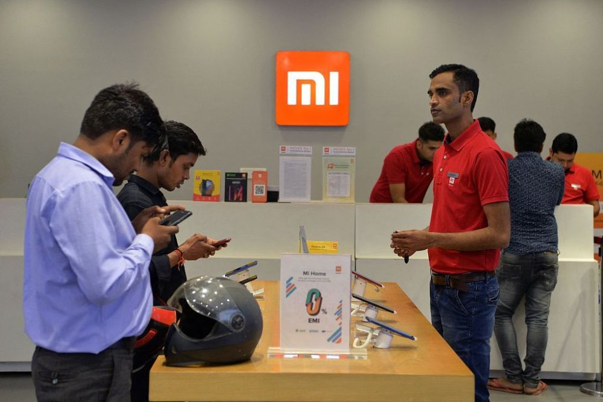
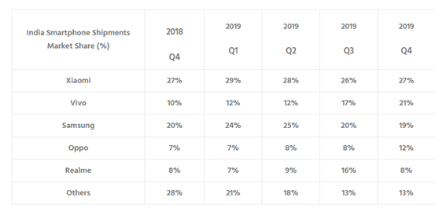
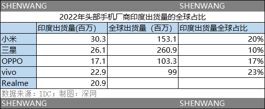

# 印度明抢中国手机供应链：小米50亿天价罚款、OV交出公司控制权

作者 | 张睿

编辑 | 康晓

出品｜深网.小满工作室

逐鹿印度的中国手机公司遭遇至暗时刻。

继利用《外汇管理法》、《防止洗钱法案》、追缴税款等方式打压小米、OPPO、vivo等中国手机厂商在印度的业务后，印度政府计划直接将中国手机厂商收入囊中。

**一位专注东南亚市场的投资人告诉《深网》，“印度就是要在全球抢中国的手机供应链，已经杀红眼了。”**

据印度《经济时报》13日报道，印度政府对进入印度市场的中国智能手机制造商提出了多项新要求：

  * _1_ 包括小米、OPPO、Realme和vivo在内的中国智能手机厂商在其当地业务中引入印资股权合作伙伴，印度资本在合资公司中持股51%；
  * _2_ 公司的首席执行官、首席财务官、首席运营官、首席技术官等关键岗位要由印度籍人士担任；
  * _3_ 希望中国厂商将合同制造业务外包给指定的印度合作制造商，提升本地制造能力至零部件水平，扩大印度的出口规模；
  * _4_ 雇佣印度本地的分销商。

报道称，小米、OPPO、vivo等中国公司参与了会议，具体执行时限还未公布。

**对此信息，《深网》咨询以上中国手机公司，截至发稿均未得到回复。**

由于小米OV已经在印度投资建厂，雇佣本地员工，并在印度实现本土生产制造，这次对中国企业影响较大的条款是持股比例、关键岗位要由印度籍人士担任。这意味着，印度籍高管会进入中国手机印度公司的管理层和董事会，对公司具有控制权。

过去十年，中国手机公司在印度的投资逐渐打好本土供应链基础，如今一夜之间却面临转手易人的结局。一位熟悉中企在印度情况的人士表示，印度政府的这种行为是“霸凌”，等于“变相收购中国企业”，而上述东南亚投资人表示，“中国投资者早就该撤出印度了，可一直抱有幻想。”

**从“使绊子”到“明抢”**

自2014年进入印度市场以来，小米、OPPO、vivo等手机厂商已经在印度市场深耕了近10年。从出货量及市占率上看，2014年至2019年是中国手机厂商和印度市场相互成就的“蜜月期”。

根据IDC统计，2014年，印度智能手机出货量仅为0.8亿台，2019年就增长至1.525亿台，接近翻倍。印度能在2019年超越美国成为仅次于中国的全球第二大智能手机市场，离不开中国智能手机厂商的“推波助澜”。

_图为2018年Q4-2019年Q4印度手机市场市占率的变化；来源：Counterpoint_

据Counterpoint数据显示，2019年第四季度，印度市场市占率前五的手机品牌分别为小米（27%）、vivo（21%）、三星（19%）、OPPO（12%）、Realme（8%），4家中国手机厂商的出货量就占了印度手机市场68%的市场份额。

转折点发生在2020年。

2020年3月，印度总理莫迪开始实施“对华产业替代”政策，这一政策包括三方面：以生产挂钩激励计划（PLI）为代表的产业政策、以全球范围内寻求“中国替代品”及签订新双边自贸协定为代表的经贸政策、以融入美西方创新链和价值链为代表的新经济政策。

其中，PLI政策是重中之重。该计划至少包含高关税刺激、精准定向财政补贴及“合规”稽查等重要内容。

在高关税刺激方面，自2016年起，印度政府连续五年针对不同手机零部件上调关税，最高税率达20%。

**为打破关税限制，节约成本，小米、vivo、OPPO自2015年起开始在印度投资设厂，启动本土化生产。**

据公开资料显示，小米在印度已有7家制造工厂，其在印度销售的小米手机99%都在印度生产；vivo在印度的雇员约1万人，年产能约为6000万部手机；OPPO每3秒就有一部智能手机在
OPPO 印度大诺伊达超级工厂生产。

在精准定向财政补贴方面，政策推行之初，印度政府就表示用19.7万亿卢比（约合260亿美元）支持包括半导体、光伏、电子设备、制药、医疗器械、汽车等14个关键行业的生产。近日，印度政府又批准了扶持印度本土电子制造业发展的生产相关激励计划（PLI）2.0总体方案，预算支出约1700亿卢比（约合145亿元人民币），计划执行期限为6年。

在“合规”稽查等方面，印度相关执法部门打着查税、外汇管理、防止洗钱等相关旗号对在印度的中国企业实施突袭式“审查”。

**据《深网》统计，从2022年初，印度当局至少对小米、vivo、OPPO展开至少8次突袭，目的只有一个：以各种理由冻结、扣押上述公司在印度账户的资金。其中，最大一笔扣押资金来自小米。**

据印度执法局（ED）6月9日发布文件显示，因小米涉嫌违反该国《外汇管理法》，宣布扣押了小米共555.1亿卢比资金（约6.8亿美元），约合48.2亿元人民币。

财报显示，小米集团2022年经调整净利润为人民币85亿元，也就是说，这笔资金相当于小米去年净利润的57%。

需要指出的是，在去年6月被指控“向外国实体非法转移资金”时，小米印度公司已经做出解释，“超过84%的部分是付给美国高通集团的特许权使用费，以及小米印度版智能手机中的知识产权等”，但也未改变印度执法局对小米的指控。

小米之外，vivo及OPPO也是印度当局“稽查”的重点。就在小米被指控违反《外汇管理法》一个月后，印度当局又先后对vivo和OPPO发难。

2022年7月7日，印度执法局指控vivo涉嫌违反《防止洗钱法案》，封锁了vivo的119个银行账户，并冻结约46.5亿卢比（约合3.9亿元人民币）的现金等资产。一周后，印度税收情报局（DRI）指控OPPO逃避关税近439亿印度卢比（约合37.18亿元人民币）。

从小米、vivo的遭遇看，为了扶持印度本土电子制造业发展，印度当局已经到了“无所不用其极”的状态。不过，从市占率上，这些强制手段确实开始见效。

_图为2021年Q4-2023年Q1印度手机市场市占率的变化；来源：Counterpoint_

据Counterpoint数据显示，自2022年第二季度开始，备受钳制和打压的小米在印度的市占率明显下滑。不过，小米下滑的市场份额并没有让渡给印度本土的手机厂商，而是让三星“占了便宜”。

2022年第四季度，三星再次以20%的市占率成为印度第一手机品牌，小米手机在印度市场的市占率则从2022年Q1的23%降至2023年Q1的16%。

从印度政府对中国智能手机厂商提出的新制约要求看，印度当局已经不满足抢占市场，他们更希望“空手套白狼”，直接掌控中国手机厂商在印度的产业链。从这个角度看，中国手机厂商在印度市场几乎退无可退。

**印度是中国手机不想放弃的市场**

既然印度当局已经对小米、OV等手机厂商表现出“不友善”的一面，且斡旋的余地不大，那么，中国手机厂商能不能直接退出印度市场？

事实上，除小米、OV、Realme外，部分中国手机品牌及手机产业链公司已经选择放弃印度市场。

去年7月，继小米、OPPO、vivo接连遭遇印度税务及合规审查后，荣耀CEO赵明宣布荣耀团队已撤出印度，仅保留了部分与合作伙伴的相关业务。

“不仅仅是荣耀这样的大型企业最后选择退出印度市场，国内许多位于印度的手机产业链工厂80%都倒掉了，剩下没有倒闭的，也有不少选择退出印度市场。而诸如OPPO、vivo、小米等依然在印度坚持经营的企业，也因为当地政府的打压，在印度十分不好过。”赵明说。

对于荣耀退出印度市场，有行业人士对《深网》解释，“荣耀宣布退出印度市场是因为其本身在印度的市占率就很小。虽然印度目前对国内手机厂商要求严苛，但作为仅次于中国的全球第二大智能手机市场，印度是国内手机厂商全球化的重地，谁也没法保证印度市场忽然冒出一个全新手机品牌，所以即使困难重重也要守住。”

从小米、vivo、OPPO印度手机出货量与全球手机出货量占比看，眼下，三家公司都很难承受失去印度市场带来的损失。

据IDC数据显示，2022年，小米、OPPO、vivo全球手机出货量分别为1.531亿台、1.033亿台、0.99亿台，而印度手机市场的贡献率分别为20%、17%、23%。

直接退出印度手机市场不仅意味着要损失20%的市场份额，更关键的是，无论是小米还是OV都无法在短期内再找到新市场来填补退出印度市场带来的空缺。

不过，印度要扶持本土电子制造业的发展同样离不开中国手机厂商。中国手机产业链在印度的繁荣，不仅为印度创造了税收、就业，还加速了印度制造业的发展。

中国是印度第一大贸易伙伴。据中国海关总署数据显示，2022年中印双边贸易额达到1359.84亿美元，2021年为1256.6亿美元。这说明，尽管印度在推行“对华产业替代”政策，但诸多中间产品依然需要从中国采购。

此外，印度当局对手机厂商的“稽查”并不止步于中国企业，随着三星重回印度手机市场第一的位置，三星电子印度公司已经成为印度政府“审查”的新目标。

据外媒消息，今年1月，印度税收情报局（DRI）指控三星电子印度公司对远程无线电头错误分类，试图规避172．8亿卢比进口关税。对此，三星电子印度公司回应称：“这是一起涉及法律解释的税务纠纷。”

在印度扶持本土电子制造业发展的路上，市占率前五的手机厂商都是打压目标，此次明抢中国公司背后，是印度在全球抢夺手机上下游产业链的野心。

