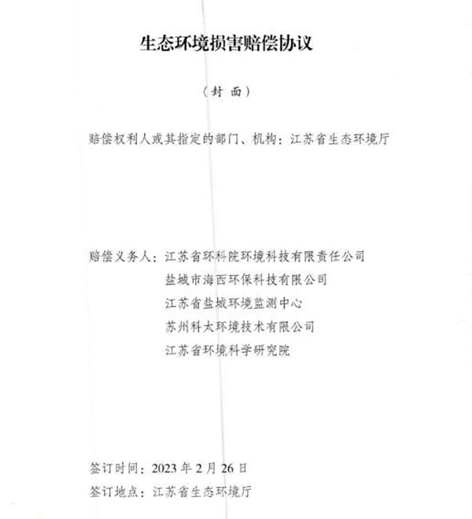

# 响水爆炸事故环境损害赔偿总额逾4亿，5家担责环评机构已达成赔偿协议

日前，南京中院以公告形式发布了“3.21”响水爆炸事故《生态环境损害赔偿协议》，协议显示，江苏省生态环境厅已与江苏省环境科学研究院等五个赔偿义务人达成赔偿协议，这五个赔偿义务人应当合并承担合理比例的生态环境损害赔偿责任（包括履行修复义务、缴纳或补充缴纳赔偿金），合计赔偿额度不低于1000万元。

2019年3月21日14时48分许，位于江苏省盐城市响水县生态化工园区的天嘉宜化工有限公司发生特别重大爆炸事故，造成78人死亡、76人重伤，640人住院治疗，直接经济损失19.86亿元。

事故调查组查明，事故的直接原因是天嘉宜公司旧固废库内长期违法贮存的硝化废料持续积热升温导致自燃，燃烧引发爆炸。事故调查组认定，天嘉宜公司无视国家环境保护和安全生产法律法规，刻意瞒报、违法贮存、违法处置硝化废料，安全环保管理混乱，日常检查弄虚作假，固废仓库等工程未批先建。相关环评、安评等中介服务机构严重违法违规，出具虚假失实评价报告。

生态环境部南京科学研究院出具的《响水“3.21”爆炸事故现场环境损害评估报告（备案稿）》认定，因非法储存危险物质行为导致爆炸事故造成的生态环境损害赔偿数额（不包括其他合理费用）为40383.01万元。

2023年2月26日，赔偿权利人江苏省生态环境厅与赔偿义务人江苏环科院环境科技有限责任公司、盐城市海西环保科技有限公司、江苏省盐城环境监测中心、苏州科太环境技术有限公司、江苏省环境科学研究院签订生态环境损害赔偿协议。

赔偿协议显示，经刑事判决认定，江苏环科院环境科技有限责任公司、盐城市海西环保科技有限公司、苏州科太环境技术有限公司、江苏省环境科学研究院故意提供虚假证明文件，江苏省盐城环境监测中心严重不负责任，出具的证明文件重大失实，导致事故企业（即天嘉宜公司）硝化废料重大风险和事故隐患未能及时暴露，干扰误导了有关部门的监管工作，是爆炸事故发生的重要原因。

上述五家机构均为适格的赔偿义务人，应当对生态环境损害承担一定的赔偿责任。

根据相关方案及职责分工，经各赔偿义务人磋商，结合各自的业务能力，以从事修复事宜等方式积极主动承担责任，按照磋商方案和损害发生地响水县政府的有关要求，赔偿义务人制定并修改完善了相应的修复方案。

赔偿协议显示，天嘉宜公司无视国家环境保护和安全生产法律法规，长期违法违规贮存、处置硝化废料，企业管理混乱，是事故发生的主要原因。考虑到协议所涉五个赔偿义务人行为与生态环境损害之间的关联性等因素，赔偿义务人应当合并承担合理比例的生态环境损害赔偿责任，合计赔偿额度不低于1000万元。

经友好磋商，结合各赔偿义务人意愿，分别承担如下责任：

江苏省环科院环境科技有限责任公司，因编制《江苏天嘉宜化工有限公司环保设施效能评估及复产整治报告》，赔偿额度不低于人民币526万元。

盐城市海西环保科技有限公司，因编制《建设项目变动环境影响分析》报告、《固体废物污染防治专项论证报告》，赔偿额度不低于人民币184万元。

江苏省盐城环境监测中心，因出具竣工验收监测报告。赔偿额度不低于人民币132万元。

苏州科太环境技术有限公司，因编制《建设项目变动环境影响分析》报告，赔偿额度不低于人民币105万元。

江苏省环境科学研究院，因编制《固体废物污染防治专项论证报告》，赔偿额度不低于人民币53万元。

同时，该协议还对赔偿义务的履行方式、履行期限、监管要求、修复效果评估等进行了约定。

此外，由于天嘉宜公司等本协议未涉及的赔偿义务人，由于未表示同意磋商，由江苏省生态环境厅配合江苏省司法厅向有管辖权的人民法院提起诉讼。

前述五个赔偿义务人中，江苏省环科院环境科技有限责任公司承担的赔偿额度最高，达526万元。

《响水“3.21”爆炸事故现场环境损害评估报告》显示，地块内地下水受到损害，部分区域超过相关标准需要运用抽提技术，经暂存后转运至当地污水处理厂进行治理修复，部分区域超过基线需要开展管控，定期监测。

在此背景下，江苏省环科院环境科技有限责任公司根据相关管理要求，编制该场地地下水长期监测方案，通过监控场地地下水自然衰减趋势，为场地综合环境管理提供支持。

