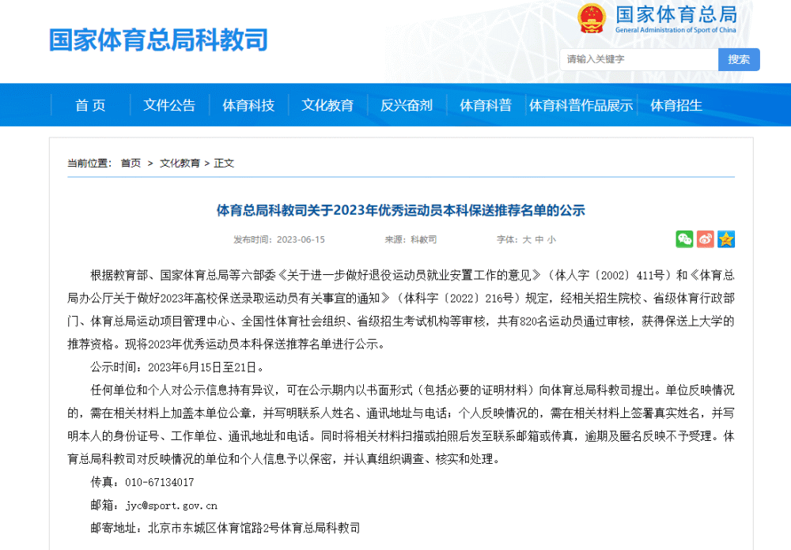
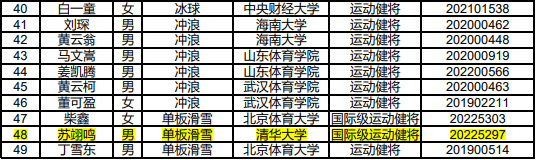
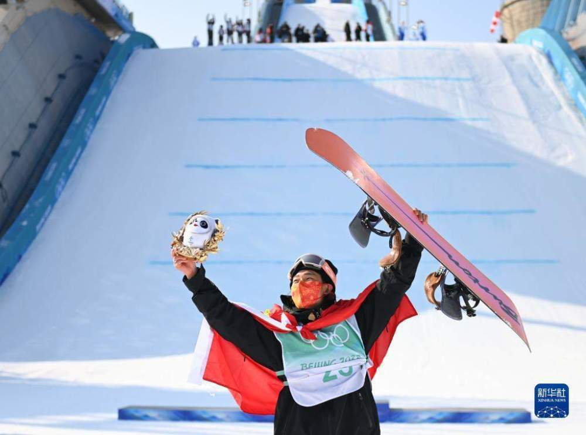
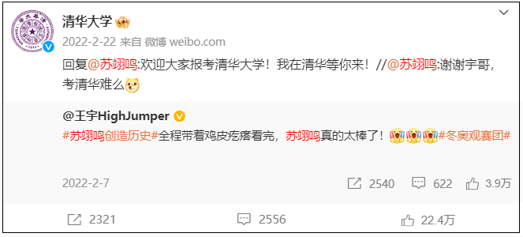

# 国家体育总局：单板滑雪运动员苏翊鸣拟保送清华大学

体育总局网站6月15日消息，国家体育总局科教司就2023年优秀运动员本科保送推荐名单进行公示，其中，单板滑雪运动员苏翊鸣被拟保送至清华大学。

2004年出生的小将苏翊鸣曾在北京冬奥会上成功摘得中国单板滑雪冬奥首金，并最终获得一金一银。

_中国选手苏翊鸣在单板滑雪男子大跳台决赛夺冠后庆祝。来源：新华社_

当时，苏翊鸣曾转发2018世界杯跳高亚军@王宇HighJumper 的微博，并留言：“谢谢宇哥，考清华难么”。

清华大学官方微博也发布跟评：“欢迎大家报考清华大学！我在清华等你来！”

