# 女明星自曝100斤穿不上大码，现在的女装尺寸小得有多离谱？

到了夏天，可能一些女生会有这样的发现，“我真的胖了，买的衣服和以前同样的尺寸都穿不下了。”

先别急着办健身卡，你有没有想过，可能是衣服变小了？

女明星也有相似的烦恼。张馨予发微博说，有个牌子的衣服很喜欢，但是大码她都穿不上。

“女装比童装还小”，这个段子可能已经成为现实。连身材匀称的女明星都穿不上，女装尺码现在小得有多过分？

现在的女装尺寸到底多小

如果你常逛淘宝女装店，或许会发现，一些店甚至不做L码的衣服了。

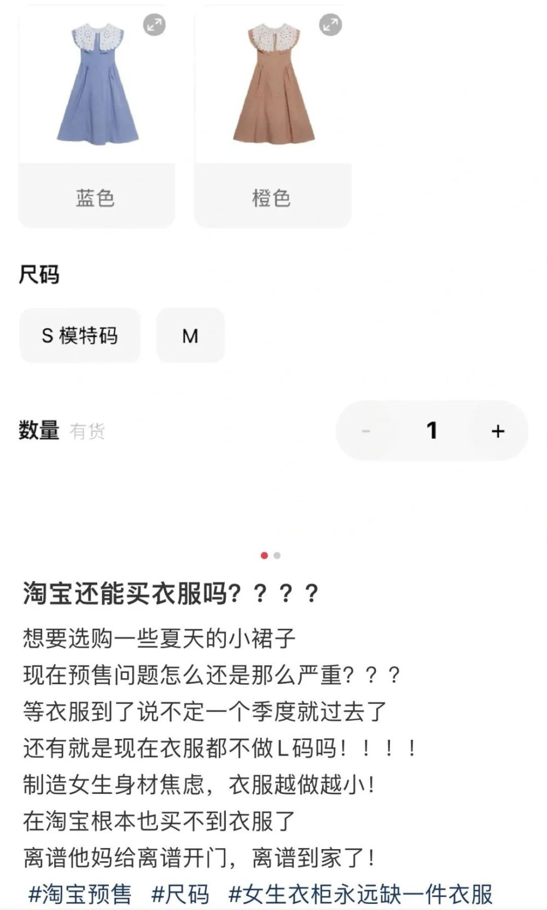

我们找了5家不同风格淘宝店铺，看看他们的连衣裙尺码设置。

5家店中，有4家设置了XS码，还有1家是从XXS码开始的，剩下的一家只卖均码。

但是，其中只有1家店涵盖了XL码。有1家店连普通的L码也不卖。或许他们觉得L码应该归为大码女装吧。

至于那家只卖均码连衣裙的店，66cm的腰围和80cm的胸围，明显是XS、最多S码的大小。

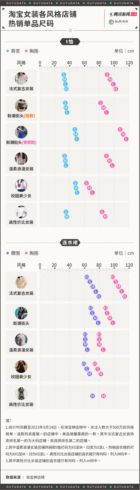

作为夏天最百搭的单品，越来越小的女装T恤也会给人不小的压力。在我们研究的5家女装热销店铺里，只有2家店卖的T恤最大码胸围超过了100cm。需要知道的是，童装的胸围最大也可以做到100cm。

除此之外，还有些店铺或品类，码数并不能代表真实大小。比如“校园美少女”榜单中的热销单品，L码甚至比其他店的S码胸围还要小。

更有意思的是，随着紧短小的BM风格流行，同一家店、同一个链接的T恤，也可以分为常规款和短款，短款的各种尺寸都明显比常规款小一圈。

小红书上，#离谱的衣服尺码 话题下面，就有不少无语事件。

比如有博主说自己身高172cm，120多斤，明明是正常身材，之前穿M或者L码衣服就行，今年发现很多XL的衣服也穿不上了。

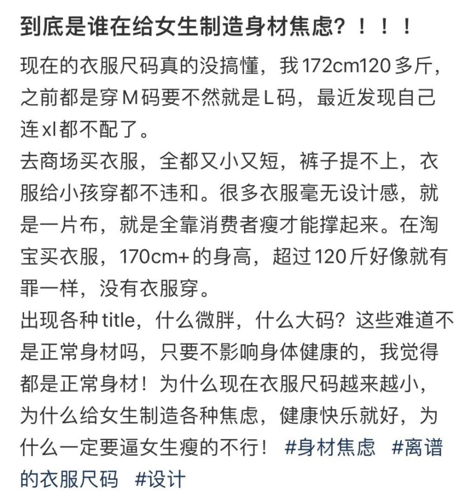

有博主170cm的身高，从200斤减肥到112斤，以前穿2XL或3XL的衣服就行，现在居然在有的店里也要穿2XL的衣服，减了80多斤，结果还要穿同个尺码的衣服，就说离谱不离谱。

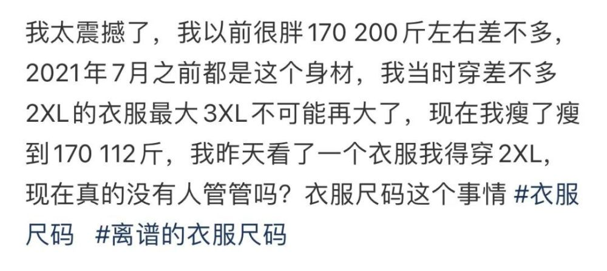

还有90斤的女生，以前穿S就行，现在网购买的衣服M也穿不下了，不禁怀疑到底现在的衣服是做给谁穿的。

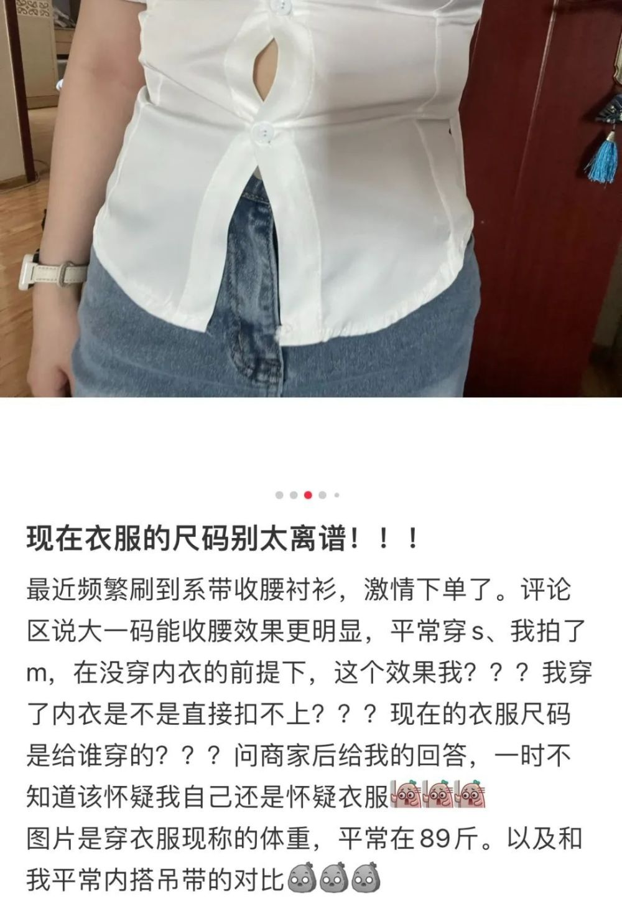

除了网店，线下店女装越做越小也是个潮流。只卖一个尺码的BM就不说了，即便是在码数通常做的比较大的欧美市场，他们的衣服最多也就是S码大小。

其它常见的快消品牌，优衣库、UR的剪裁设计也开始比照网红店，比几年前的尺码要小。

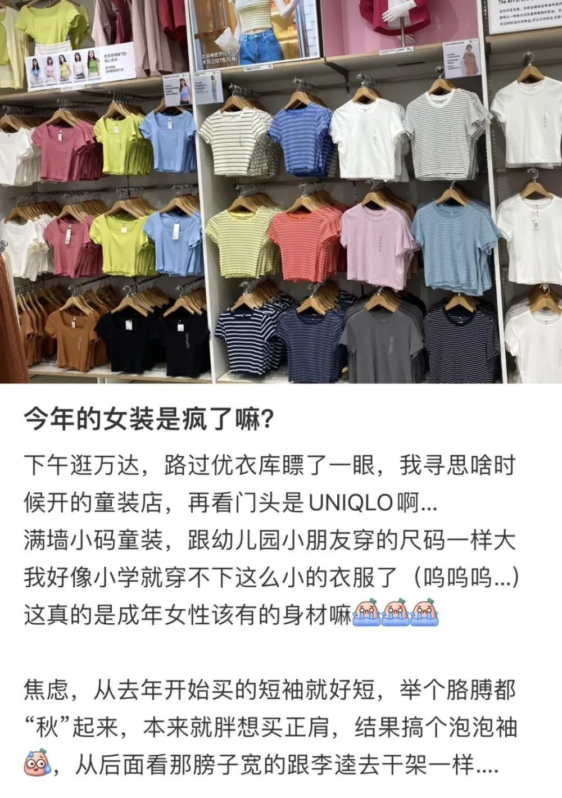

优衣库今年的新款T恤不再是舒适随性的正肩基本款，而是直接上架了一排BM风的短款。

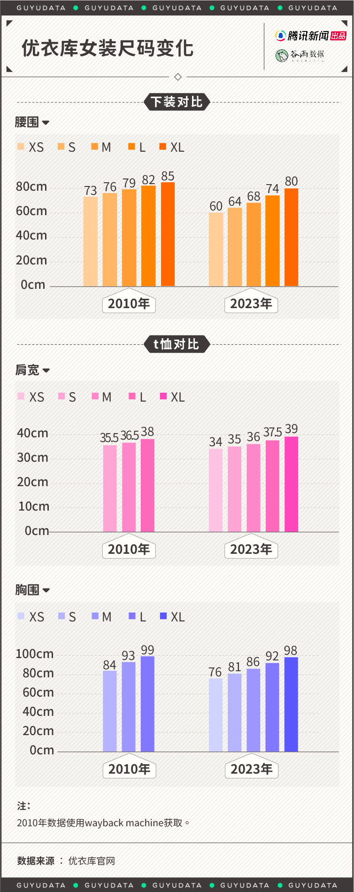

只有价格稍贵（单价在200到1000元），欧美简约风格的COS，尺码依旧做得够大。优衣库和UR的XL码，在COS这里相当于M。

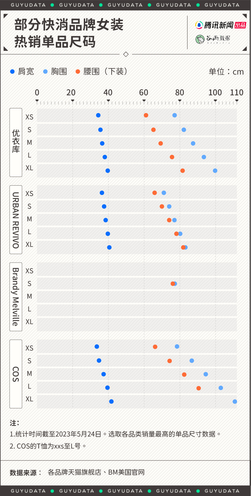

女装尺码离平均身材很远，离童装更近了

网上的衣服看多了，让人怀疑现在的女生是不是人人都有A4腰、直角肩？但是只要去人多的地方观察下，就会发现事实不是这样的。

中国成年女性的身材，即便是最小的年龄段（20到24岁），在平均身高刚过160的前提下，平均体重也超过了110斤。而且腰围的平均值也有将近73cm。更不必说，随着年龄段的增长，平均腰围和体重是会逐渐增加的。

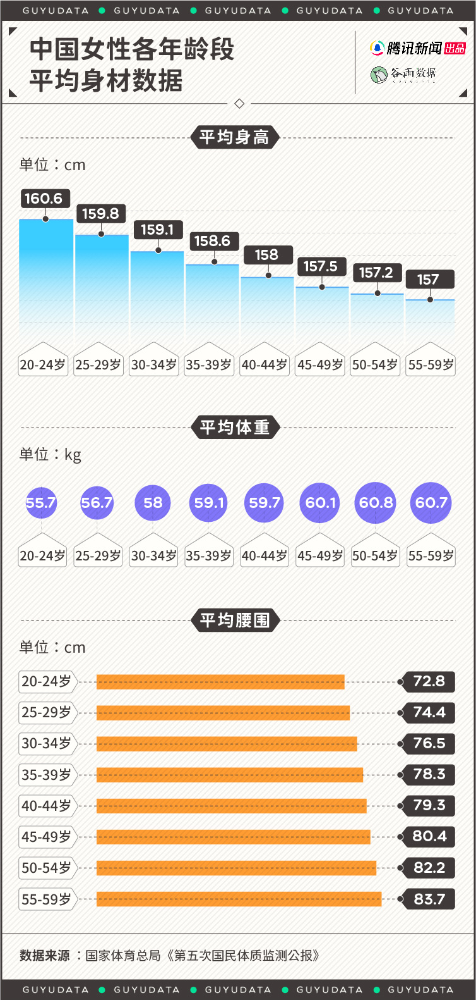

有的网店只做一个所谓“均码”，但均码的尺寸呢，跟中国女性的平均身材基本上没什么关系。跟备受争议的BM差不多，实际上只是XS或者S码。

所以，如果你买的衣服穿不上，不要焦虑。不少网红店的尺码设置，根本就不是给平均身材的人穿的。

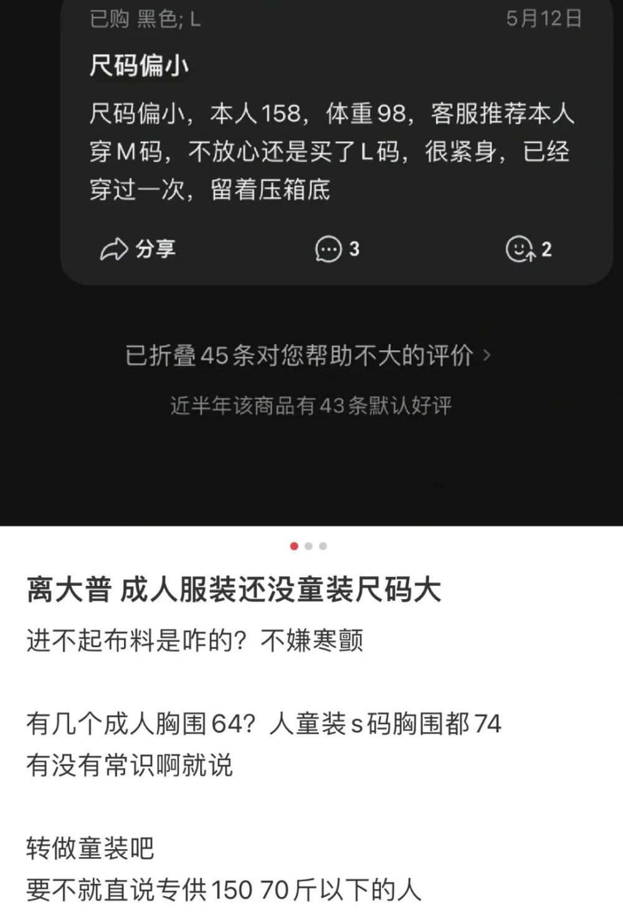

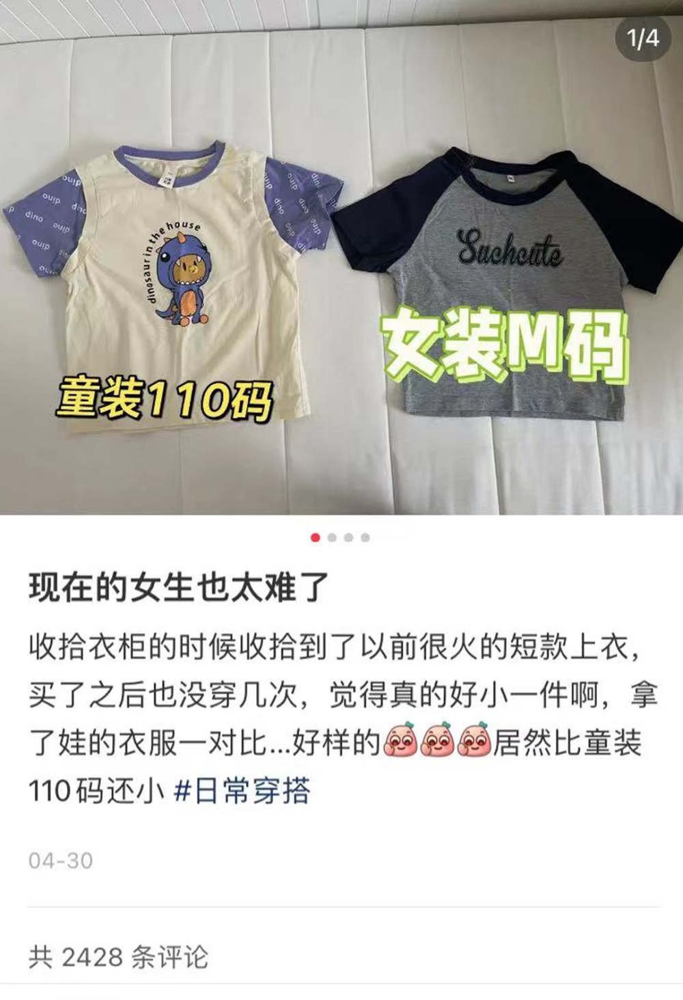

一些女装比童装做得还小。有博主晒出自己M码的女装，就比自己孩子110码的童装T恤还要小。有人在售后评价里留言，身高158、98斤的体重，已经要穿L码还觉得紧。

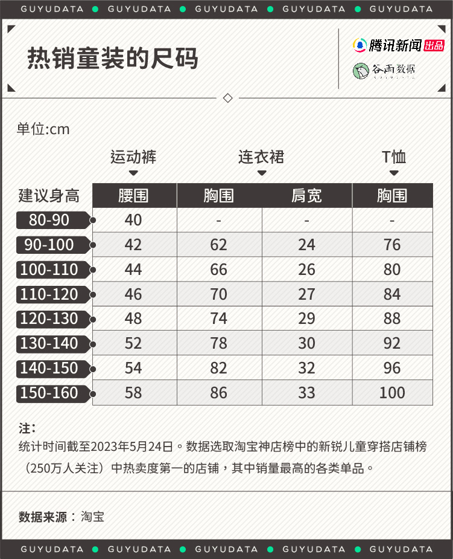

女装不仅尺寸大小完全可以跟童装比拟，花色、设计也很接近童装。以至于不乏女生直接改换思路，开始去优衣库试穿童装。

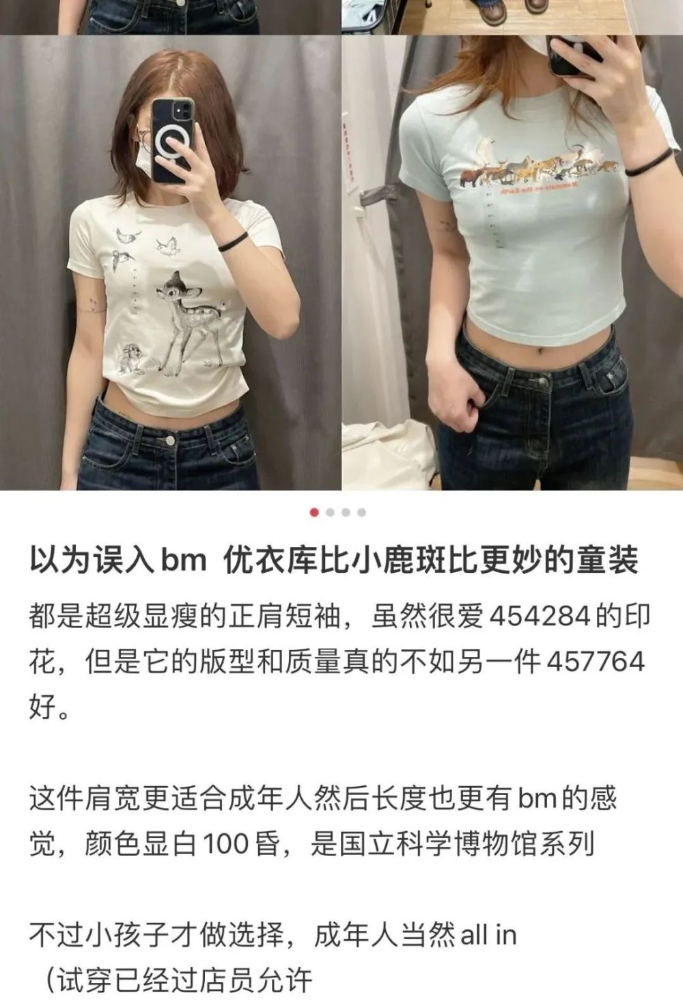

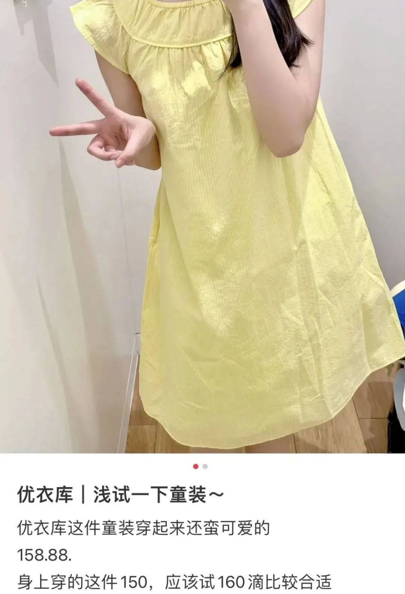

在各家女装店追求小码时，出现了一个讽刺的现象。可能是太多身材正常的女生被划为微胖，名称中带有大码的店铺成为了法式复古风榜单的热销第一，店里的衣服是从M码起卖的。

现在，女装的款式看似越来越丰富，但风格越来越“白瘦幼”，越做越同质化。

网店的衣服，还不是瘦了就能穿的

一个更奇特的现象是，网店里卖的很多衣服，也不是够瘦了就能穿的。

在B站视频“女装尺码太离谱！！！！停止散播身材焦虑！！！！！”的评论区，就有不少吐槽。可以说，几乎所有身材的女生都对现有的女装尺码和版型设计不满意。

一方面是尺码小，明明是身材非常标准的女生，也要买XL号的衣服（如果这家店有这个码的衣服卖的话）。

另一方面，很多衣服的版型设计极其不合理，剪裁根本不适合正常成年女性。即便腰围合适，胸围、臀围也做得太小，只有竹竿人才能穿得好看。

有评论说自己163、88斤，真的算很瘦了，正常的衣服穿S码都大，但是一些网店的衣服把她整迷惑了，因为就连自己这样的身材也不会胸围只有70cm，“就那么小的衣服根本不是给人穿的”。

还有个子比较高的女生，就算够瘦，也很难买到合适的衣服。有评论说自己身高175、体重才60kg，要穿XL的裙子三围合身，但是长度又不符合自己的身高。

有评论直言，“就是在散布身材焦虑，很多S码的衣服根本不是为小个子女生设计的。”不乏一些身高150+的女生，说自己在网上买衣服，版型也穿得不合适。

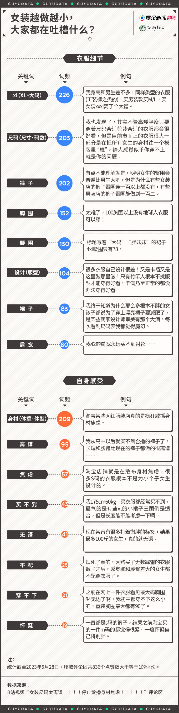

这个世界无时无刻不在给女性制造新的焦虑。

相比起男生，BMI在正常范围内的女生，更多会感到身材焦虑。根据澎湃新闻的调查，有将近一半（47%）的BMI在正常范围内的女生自认为身材偏胖，相比之下，体重正常的男生只有17%以为自己胖。

不过，越来越多人已经意识到了女装尺码的圈套。

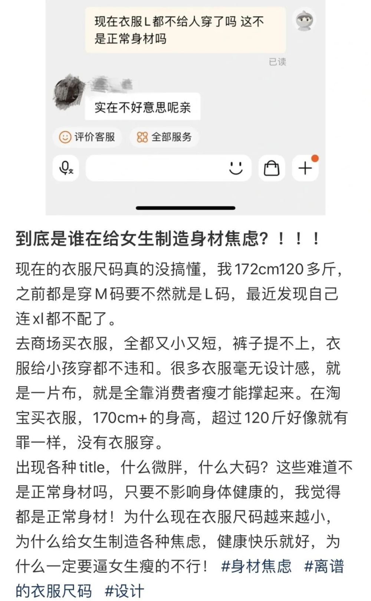

穿不下所谓的均码衣服，套不进奇怪的版型，就是该减肥了？不够美了？别开玩笑了。没有人告诉她们，责任并不在女性。

“白瘦幼”或BM风格并非不能存在，但当所有女装的设计和剪裁都朝这一条道上走，女性要么无止境地规训自己的身材，要么放弃追求适合自己的美。但话说回来，美这种东西，本来不就是不一样的吗？

参考资料：

[1] 女生买男装背后：除了紧短小 还有正常女装 https://mp.weixin.qq.com/s/Z_TTPccsk-4saETZG_1JOA

[2] 15岁少女减肥至24.8公斤去世，什么加剧了身材焦虑
https://mp.weixin.qq.com/s/Px11mcuSLCR7eYvBxu8I7g

[3] 我们问了近千人，只有一位微胖小哥完全不care身材焦虑
https://mp.weixin.qq.com/s/1IxUwwpi1V1TKpfy_ErBZg

作者｜Heather 设计丨镝数王玉君 编辑丨郝库 出品丨腾讯新闻 谷雨工作室

腾讯新闻出品内容，未经授权，不得复制和转载，否则将追究法律责任。

