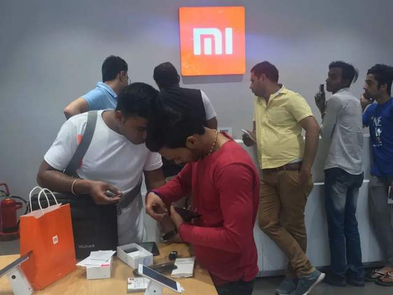

# 被认为是“全球最难做生意的国家”之一，印度为何成了“外企坟场”

印度执法局扣押了小米555.1亿卢比资金，约合人民币48.2亿元。据称这是印度当局迄今为止最大数额的扣押。如今，48亿元还存在被没收的风险。

据英国路透社消息，印度执法局6月9日发布文件称，已经向小米技术印度私人有限公司、小米印度分公司、部分高管，及花旗、汇丰、德意志等三家银行发出正式通知，称其涉嫌违反印度《外汇管理法》。

印度指控小米在当地的部门通过冒充“特许权使用费”向外国实体非法汇款。小米相关人士对媒体回应称，对该案的态度与之前保持一致。此前针对法院驳回申诉的消息，小米方面表示：“正研究该事项，并等待书面判决。在此重申：在印度的业务，符合印度的相关法律和规定。”

不到一周，印度又提出了新要求。

_印度执法局扣押了小米555.1亿卢比资金，约合人民币48.2亿元。图/中国新闻图片网_

据印度《经济时报》13日报道，印度政府要求中国小米、OPPO、realme和vivo等智能手机制造商任命印度籍人士担任首席执行官、首席运营官、首席财务官和首席技术官等职位。

此外，印度政府还指示这些企业将合同制造工作委托给印度公司，开发有当地企业参与的制造流程，并通过当地经销商出口。

该报道称，政府官员特意指示中国公司要遵守法律，不得在印度逃税。印度ABP新闻网报道称，印度政府官员是在电子和信息技术部最近举行的会议上与小米、OPPO、realme和vivo等中国智能手机制造商讨论了这些问题。

**48亿元罚款从何而来？**

此次小米被开罚单，还要追溯到去年4月开始的“非法汇款”纠纷。

当地时间2022年4月30日，印度金融犯罪打击机构表示，在发现小米科技印度私人有限公司向小米集团及另外两家外国实体汇出外币后，没收了小米银行账户资产。

小米集团当晚迅速做出回应，发布声明称：“小米印度所支付的这些专利使用费是用于我们印度版本产品的授权技术和IP，小米印度支付这样的特许权使用费是一种合法的商业安排。”

小米集团在声明中还表示，作为一个致力于在印度发展的品牌，所有的运营都严格遵守当地的法律法规。“我们仔细研究了政府当局的命令。我们相信我们支付给银行的版税和账单都是合法和真实的。不过我们会与政府部门紧密合作，以澄清任何误解。”

随后，小米向印度南部卡纳塔克邦的高等法院提起诉讼，反对印度打击金融犯罪机构的决定。去年8月，小米2022年第二季度财报分析会上，时任小米集团总裁王翔还表示，正在积极应对印度政府的调查，一切在印度的业务还在正常进行中，并且已经成功解冻了7亿多美元的被冻结资金。

然而，事情很快又发生反转。2022年10月，印度当局拒绝解冻小米相关资金。今年4月，小米印度公司对印度执法局扣押资产的申诉被印度法院驳回。

作为双方争论的关键，“特许权使用费是跨国企业进行合理税务筹划过程中的常用方式，分歧主要出现在对费用的认定上。”长期为中国企业赴印度投资提供法律服务的律师李钦对《中国新闻周刊》分析说，小米这场汇款纠纷的本质是税务问题，在用特许权使用费计算税基时，企业和当地政府对税法中成本的解释出现了争议。

举例来说，企业认为“特许权使用费”是合理的税务筹划，或是正常的服务贸易而将资金汇出，但当地政府认为企业的做法是对税法的滥用，将利润汇到境外，又涉及到相关外汇管理法。

印度金融犯罪打击机构此前曾在一份声明中表示，小米印度公司汇款给另外两个身份不明的、无关美国的实体，也是为了“小米集团实体的最终利益”。

小米则反驳称，小米印度支付的这些专利许可费都是为了印度版本手机上的授权技术和专利，并指出执法局扣押的数目中有超过84%是支付给高通公司的特许专利费。

今年6月9日，印度执法局再次发出正式通知，并补充声明，之所以通知银行，是因为据称它们在没有进行尽职调查和获取必要文件的情况下批准了被称为“特许权使用费”的外国汇款。

“目前事情还没到尘埃落定的地步。”李钦分析，根据印度《外汇管理法》，如对行政机关意见不服，可继续向外汇管理专门法庭及高等法院上诉。

**印度成了“外企坟场”？**

遭受“特别关照”的中资手机企业，远不止小米一家。

2022年7月，OPPO被指控逃避关税439亿印度卢比，约合人民币38亿元。印度税收情报局称，OPPO在进口手机零部件时错误使用了关税豁免，并在计算进口货物交易价值时未包括特许权使用费。

同一个月，vivo的119个印度相关银行账号被印度执法局封锁，总额达46.5亿卢比，约合人民币4亿元。印度执法局在相关声明中指控称，vivo印度公司为逃避纳税，将6247.6亿卢比（约合人民币455亿元）汇往中国等地，金额相当于该公司一半左右的营收规模。

在严格监管外资企业这件事上，印度是“一视同仁”的。

2008年，印度税务部门给微软开了张70亿卢比的“罚单”，IBM印度也曾在2013年被当地监管部门要求补交535.7亿卢布欠税税款，折合8.66亿美元。印度媒体称，印度监管部门认为IBM谎报了2009财年的营收。

三星电子不止一次被印度政府处罚。2014年，三星在印度被罚税2亿美元。2023年1月，印度税收情报局指控三星对远程无线电头错误分类，试图规避172.8亿卢比进口关税，约合2.12亿美元。

印度官方公布的数据显示，从2014年至2021年11月，有2783家在印度注册的外国公司关闭了在印度的业务，约占在印跨国公司的六分之一，撤离的公司包括法国零售巨头家乐福、美国摩托车制造商哈雷戴维森和美国汽车公司福特等。

由于外企在印度频频遭遇打压，印度也被称作“外企坟场”。李钦曾撰文分析，外资企业在印度遭受的各种调查、处罚，很大程度上是由于“魔幻”的印度法律制度所致。印度的法律可以用十五个字来概括：“高标准立法，普遍性违法，选择性执法。”

“高标准立法并不是指印度的立法技术高，而是指印度的立法者要求守法者需要达到的标准非常高。”李钦举例说，印度《公司法》（Companies
Act）法案本体就有近30章500条，基本每一条后面都跟着罚金、监禁等违法后果，而印度的执法部门一般不会主动通知企业更正其不合规行为，一旦违法行为被行政执法部门发现，其就会从违规第一日起开始计算罚金。

种种因素堆叠下，印度在世界银行发布的《2020年全球营商环境报告》中依旧被认为是 “全球最难做生意的国家”之一。

**难以割舍的“印度市场”**

即便如此，大量外资企业，尤其国内手机厂商依旧将印度作为重要的海外市，并做出长期布局和规划。

“国内智能手机市场已趋于饱和状态，而产品端又没有革命性技术出现，不能刺激新的消费需求，国内手机厂商纷纷到海外寻找新的市场。”中印越电子协会（CMA）秘书长杨述成此前接受《中国新闻周刊》采访时表示。印度有14亿人口的消费市场，当时正处于从功能机升级到智能机的窗口期，“印度手机市场的空间与人口红利显而易见。”

2014年，小米进军印度。同期出海的还有vivo、OPPO等品牌，中资手机企业在印度一度占据七成以上的市场份额。

2017年第三季度，小米凭借920万台手机出货量以及23.5%的市场占有率，夺得印度市场占有率第一。与2016年同期相比，小米印度增长了约300%，成为印度市场发展最快的智能手机品牌。同时，印度也成为小米最大的海外市场。

然而，伴随“非法汇款”纠纷，小米在印度市场开始走“下坡路”。

据Canalys数据，2022年小米（含子品牌POCO）在印度市场出货量2960万部，较2021年的4020万部下滑超26%，尽管仍是印度市场的销量冠军，但全年市场份额已经跌至20%，较2021年的25%减少了5个百分点。

到了2023年一季度，印度市场销量排名出现较大变化。三星以20%市场份额排名第一，vivo以17%市场份额排名第二，小米以16%市场份额排名第三，OPPO和realme排在其后。中国手机品牌在当地市场约占50%的市场份额。

中国社科院亚太与全球战略研究院副研究员刘小雪对《中国新闻周刊》分析说，中国手机厂商在印度市场仍占据绝对优势，但印度更迫切地希望发展本土制造业，中资企业自然成了印度“以市场换技术”的首要目标。

不久前，印度政府再度向包括小米、OPPO、vivo、realme
等在内的中国手机品牌提出要求：在印度运营的中国手机品牌，应当任命印籍人士担任首席执行官、首席运营官、首席财务官和首席技术官等高管职位。

事实上，不少在印度运营的中国手机厂商已经任命过印度籍高管，如 realme 的印度首席执行官为印度人 Madhav Sheth。

“印度市场的多样性超出想象，为顺利打入当地市场，很多公司在这项要求之前就已经开始聘用印度籍高管。”刘小雪说，从企业角度，只要还能在新市场获利，便会继续发力。跨国公司开辟新的海外市场的战略不会因个别政策而轻易改变，小米的经历也不意味着外资企业将大规模撤出。

不过，印度政府前首席经济顾问、布朗大学高级研究员阿文德·萨勃拉曼尼安（Arvind
Subramanian）去年在《外交》杂志上发表文章《为何印度不能取代中国》指出：如果印度不解决“投资风险过大、政策内向性过强、宏观经济失衡过大”这三大障碍，或将错失跨国企业的投资以及承接产业转移的机会。

记者：李明子

