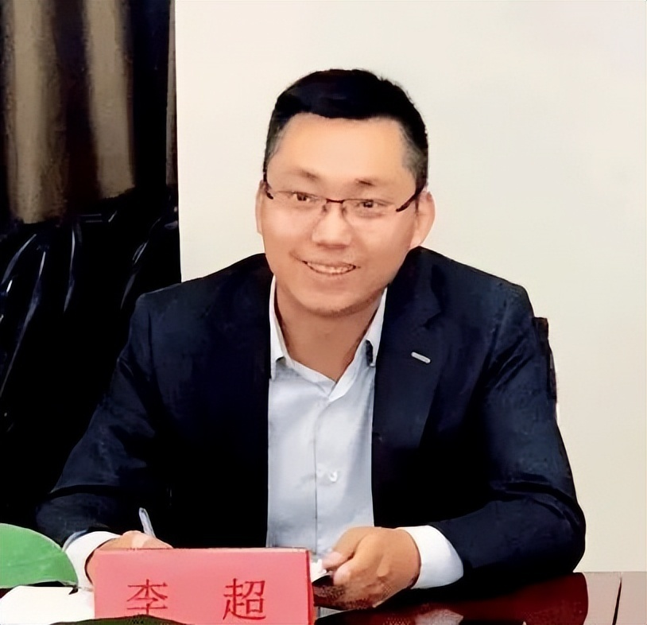

# “85后”厅官陆续亮相：从名校生到厅级干部

6月6日，福建省委组织部发布的一则领导干部任前公示公告引发关注。该公告透露，现任福建省龙岩市上杭县委书记王波，拟任设区市党政副职。

王波是清华大学工学博士，生于1987年5月。他29岁任上杭县县长，33岁成为全国最年轻的县委书记。此次公告意味着这名“85后”，即将晋升为厅级干部。

据《中国新闻周刊》不完全统计，目前，在福建、内蒙古、宁夏、四川、天津、黑龙江等多个省份都出现了“85后”厅级干部，他们的职位分布也非常广泛，包括设区市副市长、直辖市副区长、副厅级开发区正职、省体育局副局长、省属正厅级国企副总经理、团省委副书记等。

北京大学廉政建设研究中心副主任庄德水告诉《中国新闻周刊》，从年龄上看，“85后”厅级干部仕途步伐比同龄人快很多，因此，他们的个人形象、决策水平及治理能力都被放在聚光灯下，备受关注。从党的队伍建设看，一些优秀的年轻干部走上重要岗位，让他们更好地发挥自身的才能，是干部队伍更新迭代发展的需要，也是新时代推动中国式现代化建设的需要。

_图/视觉中国_

**今年已有9位“85后”晋升副厅级**

据《中国新闻周刊》不完全统计，今年以来，除了王波，至少还有8位“85后”晋升厅级岗位。

4月28日，内蒙古自治区党委组织部发布公告称，现任自治区党委组织部信息服务中心主任、一级调研员塔拉，拟提名为自治区党委委托盟市管理的副厅级开发区正职人选。

塔拉生于1986年6月，是一名蒙古族干部。半个多月后，塔拉以呼和浩特经济技术开发区党工委副书记、管委会主任的身份出席会议。他是目前内蒙古自治区最年轻的副厅级干部。

同样是4月，天津两位“85后”干部的职务调整也受到了关注。4月11日，天津市委组织部发布27位市管干部的任前公示，其中包括两位拟提名为有关区副区长人选的“85后”，分别是生于1985年9月的连欣和生于1986年7月的杨占雷。

半个月后，二人的去向明确，连欣被任命为东丽区副区长，杨占雷被任命为北辰区副区长，后者是目前天津市最年轻的副区长。

今年以来，还有多位“85后”出任团省委副书记或副省级城市团市委书记，他们也由此成为副厅级干部。

2月17日，生于1987年的李佳林当选共青团四川省委副书记。3月28日，均出生于1985年的张永意和李晓明当选共青团江苏省委副书记。

《中国新闻周刊》注意到，在全国的团省委副书记中，还有多位“85后”，如2021年出任共青团广西区委副书记的荣丽伟（1985年10月生）和2022年出任共青团湖南省委副书记的刘静（1985年4月生）等。

而在副省级城市的团委层面，今年有两位“85后”履新副厅级，分别是已到任共青团成都市委书记的王冬冬（1985年2月生）和已到任共青团哈尔滨市委书记的周成刚（1985年11月生）。

《中国新闻周刊》梳理发现，15座副省级城市中，“85后”团市委书记目前共有4人。除了周成刚和王冬冬，另外2人是徐辉（1985年6月生，2021年8月任共青团西安市委书记）和马荧波（1985年9月生，2022年9月任共青团宁波市委书记）。

值得注意的是，2023年6月8日，浙江宁波市委组织部发布任前公示显示，马荧波拟任市直单位正局领导职务。马荧波曾任宁波市鄞州区东胜街道党工委书记、市文化广电旅游局副局长等职。

《中国新闻周刊》注意到，“85后”陆续走上副厅级岗位，2021年是个重要的年份。

2021年2月，不到32岁的李超（1989年7月生），出任宁夏国有资本运营集团副总经理，成为全国最年轻的副厅级干部。当年年末，宁夏另一位走上副厅级干部岗位的“85后”也受到关注。12月30日，在石嘴山市第十五届人民代表大会第一次会议上，1986年10月出生的王宇翔当选该市副市长。

_宁夏国有资本运营集团副总经理李超。_

值得注意的是，2021年，有一位“85后”奥运冠军走上了副厅级干部岗位。2021年7月，金紫薇任江西省体育局副局长。她生于1985年10月，曾是中国赛艇运动员，2008年在北京奥运会获得女子四人双桨冠军。2013年退役，次年任江西省水上运动管理中心党委副书记，后同时担任江西省水上运动管理中心主任。

_江西省体育局副局长金紫薇。_

2022年也有“85后”晋升副厅级岗位。去年2月，1985年2月出生的孙乐出任内蒙古通辽市副市长。去年年底，1986年3月出生的贺业方出任黑龙江牡丹江市市委副书记。

据不完全统计，目前全国至少有三位“准85后”正厅级干部，他们均出生于1984年11月，分别是共青团福建省委书记李腾、共青团内蒙古区委书记乔礼和海南省委副秘书长、常委办主任周健。

**从名校生到厅级干部**

从“85后”厅级干部的履历看，他们普遍具有高学历和名校光环。仅今年晋升厅级干部岗位的9人中，就有4人拥有博士学位，王波、连欣、李佳林是清华大学博士，杨占雷是北京化工大学博士。

他们的仕途之路多与当地引才政策相关，被引入后，他们在当地取得一定的政绩，又被进一步提拔任用，因此晋升速度也普遍较快。

《闽北日报》曾报道称，2012
年开始，福建省采取以公开选拔方式选拔、以聘任制公务员方式引进、以下派挂任科技副职方式安排的办法，从北大、清华、人大、同济等著名高校选拔引进优秀毕业生来闽工作。

在上述背景下，2013年7月，26岁的王波在完成清华大学汽车工程系机械工程专业博士研究生的学业后，既没有回老家江苏工作，也没有留京工作，而是远赴福建龙岩，担任永丰新区管委会科技副主任、龙岩市汽车产业办公室科技副主任（兼），后来一步步晋升为上杭县委书记。

_福建龙岩市上杭县委书记王波。_

上杭县隶属龙岩市，位于闽西南，是著名的革命老区。王波上任县委书记之后，该县加快促进产业转型，县域综合竞争力取得了较大幅度提升。2022年，上杭县实现地区生产总值513.3亿元，比上年增长
7.3％。据《人民日报》报道称，上杭县入选“2022 年全国综合竞争力百强县（市）”，位列第96位，成为全国97个原中央苏区县中唯一入选县。

今年是王波扎根福建工作的第10个年头，他迎来了晋升设区市党政副职的机会。

作为王波的校友和同龄人，还有多名“85后”清华博士，也在一些地方的引才政策下，远赴他乡从政。

2013年，《宁夏日报》发表文章《三上清华求贤开启引才之梦》。该文称，石嘴山市是宁夏与清华进行人才战略合作的第一家。石嘴山市求贤若渴，三上清华大学引才。时任石嘴山市委书记彭友东说，引进高层次人才是任何一个地方的梦想。同时，清华大学也需要地方为学生提供施展抱负的舞台，“谋求共赢的双方一见面，竟有相见恨晚之感，各方面合作迅速升温”。

上文还透露，石嘴山根据经济社会发展和人才短缺的实际，与清华大学进行人才战略合作，迎来两批清华学子短期无偿为石嘴山工作，同时，还有一项实质性收获，清华大学研究生工作部部长助理王宇翔被任命为石嘴山市工信局副局长，适应期半年，他是清华人到石嘴山工作的第一人。

王宇翔是吉林汪清县人，清华大学毕业后，他留校工作。2018年4月，清华2004级校友毕业十周年纪念大会举行，此时已担任石嘴山市惠农区区长的王宇翔说：“清华精神指引我扎根西部，指导我稳步前行。正是学校多年来的教育和熏陶使我们能够淡定从容地面对世事，能够坚忍不拔地克服困难，立德立言，无问西东，在平凡的岗位上实现自我价值和人生理想。”2021年年底，王宇翔担任石嘴山市副市长，成为“85后”厅级干部。

作为全国最年轻的厅级干部，同在宁夏的李超也是在取得一定政绩后，得到了提拔。

据宁夏青年联合会2017年10月的一篇文章报道称，李超在中信银行银川分行工作期间，通过债券、结构化等创新产品为宁夏重大项目融资超过20亿元。在宁夏国有资本运营集团工作期间，累计为宁夏高铁建设融资超过100亿元，推动集团公司成为全区唯一银行间市场AAA评级企业。牵头完成城际铁路吴忠至中卫段PPP项目，引入社会投资人资本金22亿元，完成57亿元国开发展基金申请工作，注册各类债券125亿元。获取银行综合授信额度455亿元，与保险、证券、信托等各金融机构建立了全面合作关系。

与福建、宁夏等类似，天津也重视从名校“挖人”。《光明日报》报道称，2014年7月，天津市武清区和清华大学达成战略合作，人才合作是双方合作的主要内容之一。

刚刚被任命为东丽区副区长的连欣就是一个例子。连欣从清华大学博士毕业之后留校工作，后来到天津武清区挂职锻炼。原定挂职时间是一年，因为工作需要，挂职时间又延长了一年。两年的时间让连欣爱上了武清区，直言“在这里生活幸福指数太高了”。2018年，她把1岁的孩子和家人接过来，在武清安了家。

她后来曾感慨，自己“是被引进的人才，又在持续为引进项目和人才奔走，参与创建‘五平台’，优化营商环境、建立有效机制、解决各类困难，可以说已经扎根武清了”。

**要厚爱，也要严管**

越来越多的“85后”成为厅级干部，这一现象也被学界关注到。

中国社会科学院马克思主义研究院马克思主义发展史研究室主任孙应帅告诉《中国新闻周刊》，“85后”厅级干部的主要特点是高学历、专家型、干劲足，这有助于实现党提出的干部队伍革命化、年轻化、知识化、专业化的“四化”方针，也有助于形成老中青相结合的干部梯队合理结构。

他说，“85后”是伴随网络时代成长起来的“网络原住民”，具有视野开阔、头脑灵活、易于接受新鲜事物、包容多样性差异的普遍特点。高学历人才又在政治素质、科学素养方面得到过持久训练，创新意识和创新能力都比较强，其社会治理理念更容易与网络时代、智能时代的社会环境和网民思维相契合，能够运用现代公共管理知识和方法促进基层治理的范式转换。

孙应帅表示，地方政府从名校“挖人才”，有利于年轻干部勇于担当、积极干事、尽快成长，也有利于解决人才向发达地区和省会城市集聚，而中西部地区以及老、少、边、穷地区干部人才短缺的结构性矛盾。

庄德水也告诉《中国新闻周刊》，长期以来，名校毕业生“孔雀东南飞”现象比较明显。偏远落后的地方主动出击，去名校“挖人才”，有利于当地经济的发展和社会治理的优化。对国家来说，让这些优秀的人才到偏远一点的基层锻炼，有利于更全面地考察和培养干部。

他提醒说，“85后”厅级干部多是引进人才，到任后，可能会得到更大的权限，再加上他们年轻，会受到更多考验。因此，当地组织部门对他们要“严管加厚爱”。“严管”就是对他们提出更高的政治要求和廉洁要求，“厚爱”则是要给他们更多干事创业的机会，多一些包容，鼓励他们去创新、去试错。

中国廉政法制研究会常务理事、华东政法大学纪检监察学院教授魏昌东告诉《中国新闻周刊》，地方政府到名牌大学引进人才时，不应只看重他们的名校背景和高学历，更应考虑当地经济社会发展的需要，为一些专业性强的岗位物色合适的人才。

他告诉《中国新闻周刊》，他曾与多位引进生交流，发现一些从校门直接走向“机关门”的年轻干部，到岗一年、甚至更长时间，都没能找准定位，也没有发挥实质性作用。

魏昌东表示，为更好地用好管好这些引进生，组织部门不应“一引了之”，应做好前期的业务培训工作，还应制定建构一套引进生的科学评估制度，让这项政策发挥应有作用。

发于2023.6.19总第1096期《中国新闻周刊》杂志

杂志标题：“85后”厅级干部陆续亮相背后

作者：周群峰

