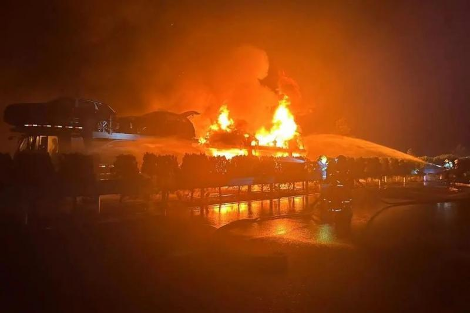
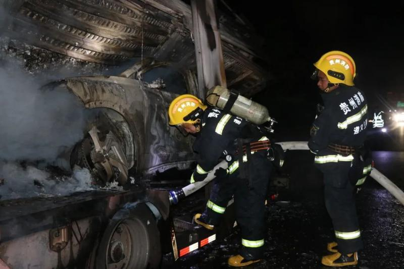
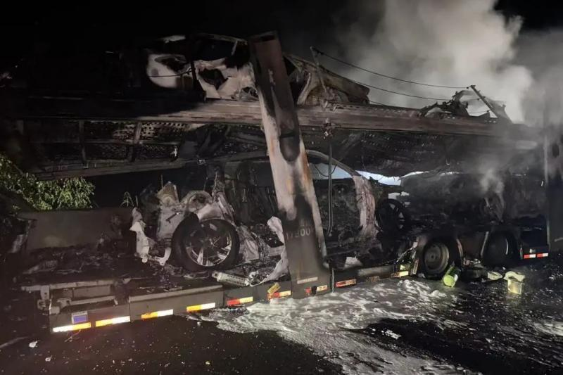
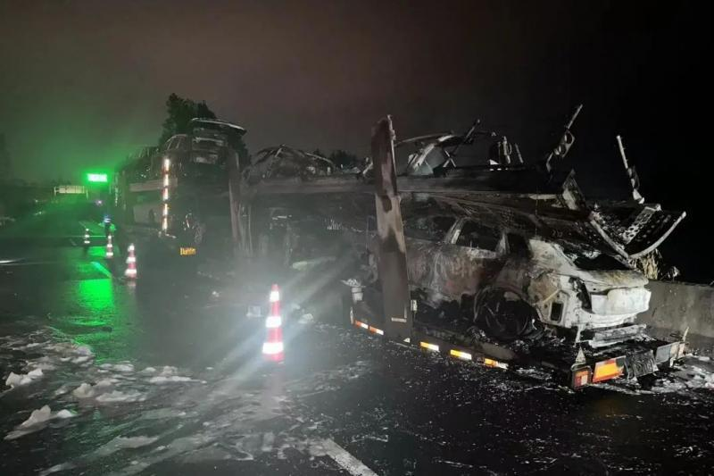

# 一拖车在高速上起火：所载8辆进口奥迪车中6辆被烧毁 损失超过300万元

据贵州消防救援总队6月17日消息，近日，一辆载有8辆奥迪车的拖车在余凯高速起火，司机求助消防部门将火扑灭，但由于火势迅猛，车上6辆奥迪车被烧毁，损失超过300万元。

“喂!请问是消防队吗，我的车在余凯高速上燃起来了，我用灭火器无法扑灭，请你们快点来帮我处理下……”

近日，一辆载有8辆奥迪新车的拖车在余凯高速上突然起火，需要紧急处置。余庆县白泥路消防救援站接到报警后立即出动处置。

现场情况为一辆载满轿车的拖车停靠在高速公路的应急车道上，火势已将尾部包围并且向车头蔓延。

救援人员在做好个人防护后立即分为两组展开行动，第一组协助交警进行安全警戒和车辆疏散，第二组迅速架设水枪、水炮进行火势压制，以及对油箱进行冷却保护。

由于车辆火势太大，消防水罐车水量有限，为迅速扑灭大火减少经济损失，救援人员立即启动应急联动方案，调集环卫水罐车进行增援。

经过近两小时的紧张处置，大火被完全扑灭。但由于火势过于迅猛，该车运载的8辆轿车6辆被烧毁，预估损失达到300万元以上，所幸未造成人员伤亡。

据了解，该拖车运载的均是进口奥迪电车，从广州开往重庆方向，车辆行驶至距离余庆收费站约1公里处时，司机发现尾部轿车突然起火，并且火势越来越大。司机多次尝试灭火无果后，立即拨打“119”火警电话进行求助。

文/北京青年报记者 戴幼卿

