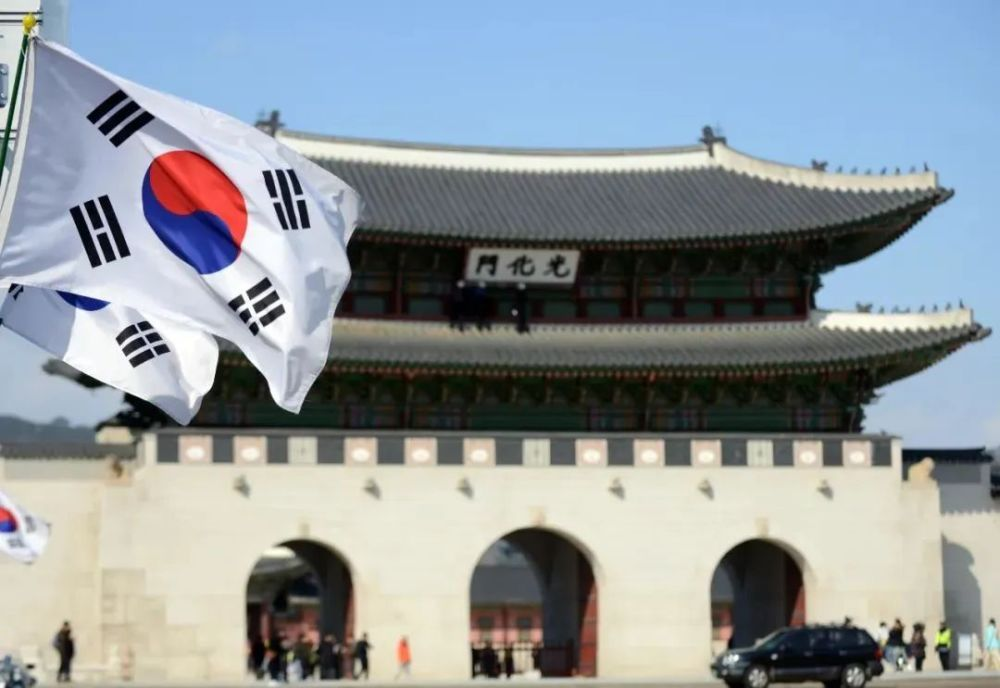

# 一股“楼市要崩”的恐慌情绪，正在韩国投资圈蔓延

**全文2823字，阅读约需5分钟**

**撰稿/陶短房（专栏作家） 编辑/何睿 校对/赵琳**

_▲韩国首尔，韩国国旗在光化门城楼前飘扬。图/新华社_

最近，韩国房价崩了。

据中国基金报报道，韩国楼市曾是全球最热的地区之一，此前房价连涨数年。过去5年，韩国房价整体涨了80%，2020~2021年最大涨幅超过40%，首尔更是超过50%，房价一度达每平方米15万元人民币，仅次于中国香港。

但在2021年8月，随着韩国央行开始加息，房价开启了崩盘模式，首尔实际交易房价暴跌25%，部分社区更是跌了三四成，跌幅达历史之最，成交量也暴跌超七成。

报道援引《亚洲日报》消息称，2023年，韩国公寓、多户型住宅等共同住宅的公示价格较去年平均下降了18.63%，降幅创下历史新高。在首尔，部分公寓价格下跌了30%-40%，成交量更是暴跌70%以上。

“韩国楼市要崩”的恐慌情绪，正如瘟疫般在韩国投资圈“传染”。而追随美联储的“输入性政策变数”，更加剧了韩国楼市的未来不确定性。

_▲韩国首尔城市夜景。图/新华社_

**“全年都将持续低迷”**

“负责任的预计，是韩国楼市2023年全年都将持续低迷，且首尔以外的情况会较首尔更严重。”

韩国楼市正面临的价量齐跌窘境，有“韩国楼市多头女王”之称的荷兰国际集团银行（ING）韩日市场高级经济师闵柱刚，也在5月24日发布的投资报告中承认，2023年的韩国楼市不容乐观。

而另一些业内专家则更加悲观。如有经济学家就认为，韩国楼市因前几年的过度投机业已饱和，且随着人口老龄化和人口减少，即便首尔，市中心公寓空置率也在上升，首尔以外还有严重的人口外流问题，楼市长线前景就更难乐观。

日前，韩国央行行长李昌镛在接受彭博社采访时表示，在房地产贷款拖欠率上升的情况下，金融部门的风险不断增加，“需要政府动用政策手段调节”。但闵柱刚却认为，政府的政策调节实际上帮了倒忙。

闵柱刚分析称，此前的文在寅政府追求“房屋可负担”，自执政以来不断推行抑制房地产价格的政策，包括限制房地产投资和对多个业主征收重税，目的是稳定房价，但此举反倒被炒房者解读为“房屋供不应求趁早抢购否则过时不候”，资金叠加杠杆，疯狂涌入楼市以期抢在更严厉政策调控之前。

而现任尹锡悦政府上台后，又亦步亦趋追随美国高利率，手忙脚乱以高利率应对通胀压力，结果导致住房负担能力指数从平均50左右直冲80——按照闵柱刚的计算，韩国住房负担能力指数一旦达到80，需求下降趋势就难以撼动。

_▲韩国首尔街头的艺术装置。图/新华社_

**“连房带钱血本无归”**

韩国是著名的出口导向型经济，尽管如此，住房和建筑在其内需部分的占比也是举足轻重的。

以 GDP 计算，韩国的建筑支出占 2022 年名义 GDP 总额的 15% 左右，包括建筑施工和土木工程。在工业生产中，建筑业约占整个韩国工业的
6%。而在韩国劳动力市场，建筑业在 2022 年创造了超过 210 万个工作岗位，相当于总就业人数的 7.6%。

就金融业而言，与房地产相关的信贷是金融体系的重要组成部分。由于房地产及其相关行业对大多数普通韩国民众的关联度、感知度远比外向型经济部门要高，因此楼市的风吹草动，对社会的震撼力要比上述冷冰冰的数据更加重要得多。

分析家指出，此前韩国楼市的大幅走热本身就极不正常，最终导致资金叠加杠杆疯狂涌入楼市。但自去年底，韩国被迫追随美联储高利率政策，陡增的信贷负担不但吓退了新来者，还压垮了大批存量投资者，最终导致了戏剧性的雪崩局面。

熟悉韩国楼市的人士更指出，韩国独有的“传贳”房屋租赁制度，既是去年7月前韩国房地产市场狂飙突进的主力推手，也是如今韩国楼市大崩盘的罪魁，可谓成也萧何，败也萧何。

所谓“传贳”，是韩国独有的一种房屋租赁模式，租户一次性支付大笔押金——通常约为房产价值的 70%，以支付两年的租金，房东在合同结束时返还押金。

这种独特的模式，介于租房和购房之间，其目的是让房东和租房者都能降低持有房屋的成本，同时降低自己在账面上的房屋信贷负担，便利从金融机构获得更多房贷——这也刺激了更多房东加入“传贳”房大盘的行列。

通常，在房价上涨、“传贳”市场正常运转的情况下，返还“传贳”押金不会造成大问题，因为新租客并不难找，而且押金也会随着房价上涨而相应增加。但一旦房价大幅下跌，房东就不得不降低“传贳”价格，并挪用自有资金填补缺口。

如此一来，原本掩盖在“传贳”繁华之后、悄然飙升的杠杆泡沫风险，便会如定时炸弹般轰然炸响。而“传贳”断链的不可抗力，还导致大量“传贳骗局”涌现。

公平地讲，发生在当前韩国、尤其首尔都市圈的所谓“传贳骗局”，绝大多数并非真的主观行骗，但问题在于租房者两年后“连房带钱血本无归”的客观事实是放在这里的，也必然导致租户越来越多远离“传贳”，客观加速和加剧了韩国楼市的崩盘。

_▲韩国首尔街景。图/新华社_

**“更担心杠杆泡沫堆积”**

面对当前的混乱局面，“韩国楼市多头女王”闵柱刚仍坚持认为，韩国房地产市场“还有救”。而其理由，包括需求仍在，如韩国全国约44%的家庭没有自己的住房，首尔这一比例更高达51%；房屋调控政策放松，浮动利率按揭比例下降，以及预期高利率政策将在2023年下半年结束等。

问题在于，韩国本轮从降息到加息的戏剧性反转，原本就是追随美联储的“输入性政策变数”，随着美联储重申将继续加息并维持高利率政策，韩国央行自行其是的悬念已经不大。

数据显示，2021年初以来，韩国个人债务重组申请数量同比大幅度增长，甚至已经达到2003年“信用卡危机”以来最高。这表明韩国普通民众的财务状况、尤其预期空前恶化。这对楼市而言，绝对是最坏的消息。

不仅如此，韩国决策层的考量也未必和房地产投资者在一个频道上。

如6月6日，韩国央行行长李昌镛在纪念韩国央行成立73周年集会上讲话，对楼市长期累积的金融风险公开表示担忧，宣称“从中长期来看，有必要与相关机构合作，找到一种让家庭债务顺利去杠杆化的方法，这样金融失衡就不会再次累积”。

李昌镛更特别反复提及，“随着非银行的重要性和系统的复杂性增加，仅针对银行很难实现整个国民经济的金融稳定目标”、“如有必要，应制订实现金融稳定目标的措施”——很显然，韩国央行的确如闵柱刚等“多头”所愿，在密集释放调控信号。

但是，韩国央行所释放出的信号，却似正与其所期待的背道而驰。决策层当然担心楼市崩盘，但更担心杠杆泡沫堆积压垮整个韩国经济和金融大厦，且他们或许还认为，任由“传贳”堆砌起越来越高、由杠杆组成的“通天塔”，或许是一种更危险的长期性风险。

由此观之，2023年的韩国楼市不容乐观，2023年之后是不是真如“多头女王”闵柱刚认为的“还有救”，其实也很难说。

**值班编辑 李加减 康嘻嘻**

**本文部分内容首发自新京报公号“新京报评论”**

**未经新京报书面授权不得转载使用**

