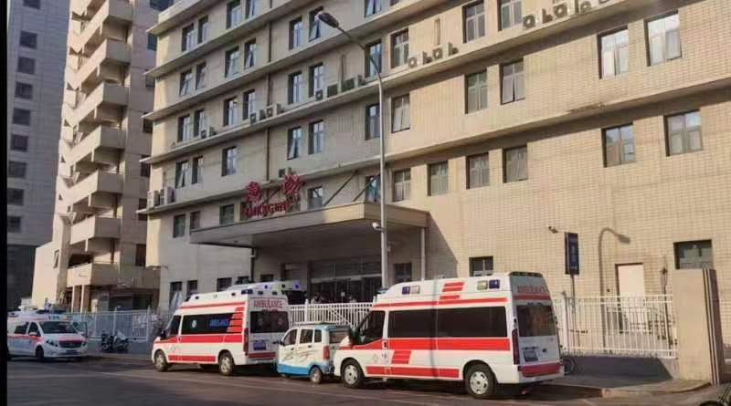

# 中暑后仍处于没开空调的西晒房间，北京一带娃老人因热射病去世

北京日报客户端 | 记者 孙乐琪 通讯员 钟艳宇

高温天仍在持续。17日一个白天，北京大学人民医院急诊科接诊了10名出现中暑症状的患者。该院急诊科副主任医师迟骋提醒：出现先兆中暑、轻度中暑一定要及时加以干预，否则症状将持续加重，如发展至热射病甚至可能导致死亡。

**炎热午后户外活动致热射病**

16日晚，一名57岁女性患者因出现严重意识障碍被送至人民医院急诊科。接诊时，患者处于昏迷状态，体温高于42摄氏度，被诊断为热射病。此后，很快出现了多脏器功能衰竭，经过近7小时抢救后，于17日凌晨离世。

“热射病即重度中暑，如抢救不及时死亡率高达70%至80%，但热射病通常不是突然发生的。”迟骋介绍，该患者午后带孩子在户外活动回家后，曾出现头晕乏力等先兆中暑的症状。但她并没有及时采取调适措施，而是继续处于没有开空调的闷热、西晒房间内。直至“叫不醒”才被家人发现、送医，此时为时已晚。

**及时干预，大部分中暑不会发展到热射病**

中暑分为先兆中暑、轻度中暑、中度中暑与重度中暑4个阶段。“先兆中暑与程度最严重的热射病之间，尚有一个进展过程。如果及时采取干预措施，大部分中暑患者是不会发展到热射病的。”

17日是周末，户外活动的人多起来。当天8时至18时，人民医院急诊科共接诊10名先兆中暑、轻度中暑患者。

**迟骋介绍，先兆中暑的主要表现为头晕、乏力、大汗、口渴、注意力不集中。此后体温升高、出现发热，但没有意识转变，则进入了轻度中暑阶段。如不加干预，体温将持续升高，可达40至42摄氏度的高热，并伴有四肢抽搐、意识障碍，则进入了中、重度中暑的阶段。最严重的中暑即热射病，通常合并多脏器功能衰竭，死亡率很高。**

**什么情况下需要送医？**

如发生先兆中暑、轻度中暑时，该如何处理呢？迟骋说，一旦发生中暑，要将病人转移到阴凉通风处，解开患者衣扣，并通过擦拭、冰敷等帮助患者降低体温。降低室内温度的同时，要给患者补充体液，推荐补充含有淡盐水等含有盐分的液体，补充中暑导致的体液和电解质丢失。“简言之：物理降温、降低室温、补水，就可能逆转或终止患者的中暑进程。”

什么情况下，需要送医呢？迟骋说，如果患者出现了体温升高、肢体抽搐或出现嗜睡、认知障碍等意识改变，就要及时送医救治了。

**高温天持续，专家提醒：**

高温天仍在持续，迟骋提醒市民：高温、高湿环境工作或学习者，一定要注意休息。“最好每30分钟左右就到阴凉通风处休息5到10分钟。及时补充水分，绿豆汤、凉茶等，都是推荐的防暑降温饮品。”

户外活动一定要避开最炎热的午后时段，“17日接诊的患者，大多是户外活动后出现中暑症状的。”迟骋建议，可选择一天中较凉爽的清晨或傍晚户外活动，并避免剧烈运动、不穿深色衣服，以防积热导致体温升高。

同时，要重视先兆中暑症状，一旦出现头晕、乏力、大汗、口渴等，要及时调整纠正。夏季饮食要尽量清淡，“辛辣刺激食物、抽烟饮酒等习惯容易加重湿热体质。湿热体质者更易中暑。”

