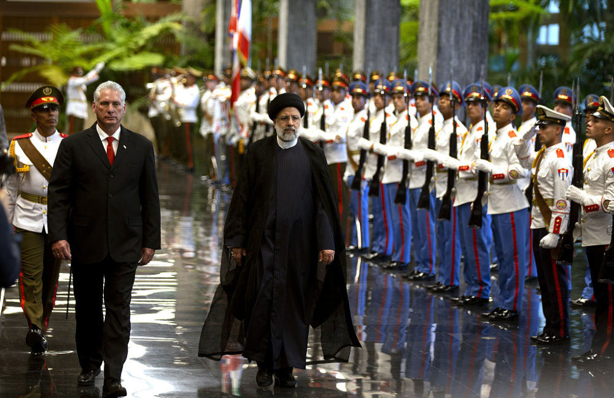

# 伊朗总统莱希访问古巴，“共抗美帝国主义”

【环球时报报道 记者
白云怡】据伊朗《德黑兰时报》报道，当地时间15日，伊朗总统莱希访问古巴，作为其拉丁美洲三国行的最后一站。在抵达哈瓦那后，莱希受到古巴国家主席迪亚斯-
卡内尔的热烈欢迎。在访问期间，两国签署了6项协议。

据报道，在欢迎仪式后，莱希与迪亚斯-
卡内尔举行会谈。随同莱希访问古巴的是一个高级经济和政治代表团，其中包括外交、石油、国防和卫生领域的负责官员。会谈后，在两国领导人见证下，伊古高级官员签署了6项合作文件和谅解备忘录，涵盖综合性的政治合作、海关合作、数字通信领域的合作等。“伊朗和古巴在地区融合发展方面处在先导地位”，报道称，两国可以在生物技术、医药、核能等许多领域展开合作。

_6月15日，古巴哈瓦那，伊朗总统莱希到访古巴，古巴国家主席迪亚斯·卡内尔（左）和伊朗总统莱希（右）检阅仪仗队。（视觉中国）_

另据古巴官方发布的新闻稿，迪亚斯-
卡内尔把莱希称为“亲爱的朋友”，并表示，莱希此行访问的委内瑞拉、尼加拉瓜、古巴3个拉美国家，都与伊朗一起“英勇、坚定地抵抗着美帝国主义及其盟友的制裁、压力、威胁、封锁和干涉”。

迪亚斯-
卡内尔同时强调，这次访问表达了“我们这些因试图建立与美国模式不同的社会而遭受美帝国主义禁运以及不公正、非人道和无理由制裁的国家之间的团结”，这将使这些国家在与美国的斗争中变得更强大。

本月11日，莱希开启对拉美三国的访问。有媒体形容称，这是“德黑兰出现在了华盛顿的后院”。伊朗官方通讯社伊通社称，“一大批拉美国家与伊朗有着密切和共同的政治与国际观点”，并称这次访问将见证德黑兰与这3个国家签署扩大双边合作的文件，是“加强与友好国家关系和提高经济、政治和科学合作水平的政策的延续”。

