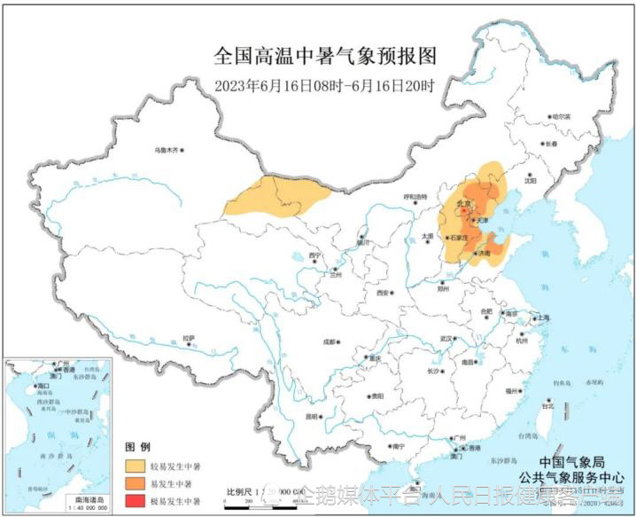

# 北方多地气温超40℃，“蒸煮模式”提前，专家：高温天气将日趋频繁

**人民日报健康客户端记者 王艾冰**

中国气象局公共气象服务中心6月15号发布了今年首个高温中暑气象预报，这一预报较常年平均首发日期提早13天。

“今天北京、天津等地的高温确实打破了有气象记录以来的同期最高记录，并且此轮高温持续时间较长，强度较大。”6月16日，中国天气网气象分析师胡啸告诉人民日报健康客户端记者，这一次高温主要受北方大陆暖高压脊的东移到我国的影响，受高压暖脊的下沉气流影响，华北、黄淮、内蒙古西部等地日照强烈，干燥少雨，气温攀升。

_6月16日，全国高温中暑气象预报，中央气象局公共气象服务中心图。_

15日、16日，本轮高温天气迎来鼎盛阶段，北方多地气温突破40℃，中央气象台预计，此轮高温天气过程将持续至18日前后，是华北、黄淮等地今年以来范围最广、强度最强的高温天气过程，波及北京、天津、河北、山东等10余个省份，河北、内蒙古等部分地区将冲击40℃，或打破历史同期最高气温记录。在6月17日、18日强度和范围都会逐渐减弱，6月19日可能会有降雨出现，此轮高温模式基本结束，不过端午前后，华北、黄淮仍有高温天气出现

今年以来，气温变化较为频繁，很多网友也表示，“最近天气变化好大，5月份还出现低温天气，结果6月刚中旬就这么热。”

“近几年，因为全球变暖，大气环流变化导致所致天气的起伏变化现象确有所增加，这一天气大起大落的新常态确实值得关注。”胡啸表示。

在全球变暖的大背景下，近年来极端高温天气日趋频繁，世界气象组织发布的1901-2021年亚洲逐年气温距平图显示，2000年以后，亚洲地区气温逐年变高，而且偏高的程度在2010年以后更加明显。同时，厄尔尼诺已经形成，也进一步推动全球变暖进程，带来全球变暖新高峰。5月17日，世界气象组织发布报告称，受温室气体积聚和自然发生的厄尔尼诺现象影响，全球气温未来五年可能会达到创纪录水平。

中央气象台提醒，高温天气持续一定要警惕热射病，热射病指的是因高温引起的人体体温调节功能失调，体内热量过度积蓄，从而引发神经器官受损，在中暑的分级中就是重症中暑。通常表现为高热、体温达到40℃以上、皮肤干热无汗、神志障碍、脏器衰竭等。

