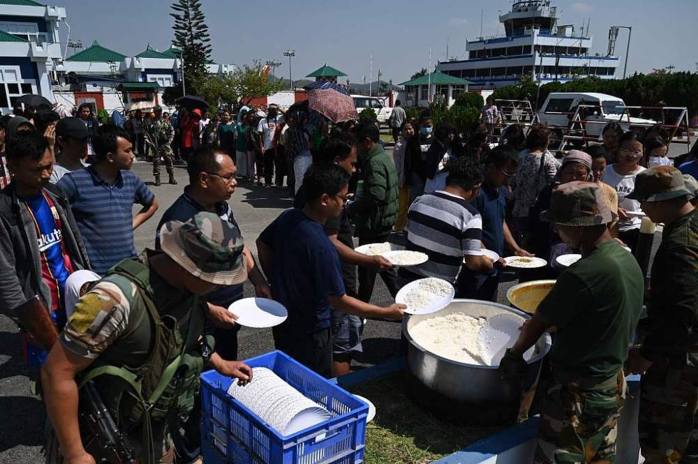
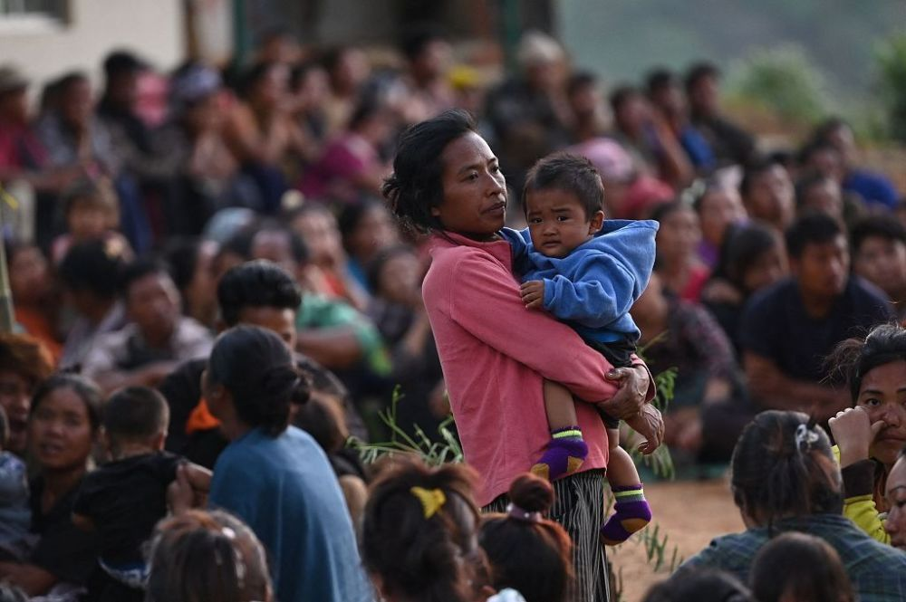
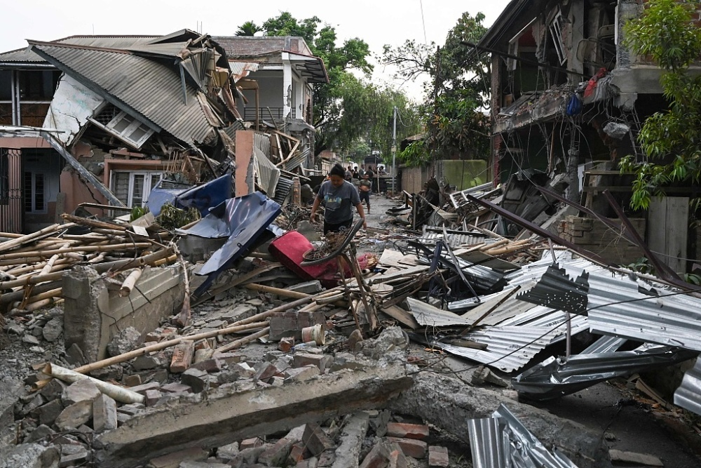
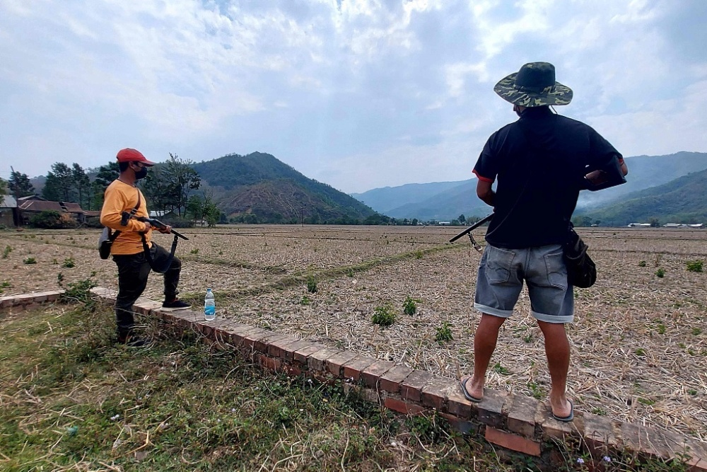

# 印度曼尼普尔邦陷族群冲突：高官房屋被烧毁，骚乱已持续一月

印度外交国务部长兰扬·辛格（Ranjan Singh）办公室6月16日证实，有一群“暴徒”焚毁了辛格在东北部曼尼普尔邦的房子。

据路透社6月16日报道，辛格的助理表示，对房屋的袭击没有造成人员伤亡。辛格对媒体表示，他对事件感到震惊，曼尼普尔邦“法律和秩序状况完全失控了”。

_当地时间2023年6月7日，印度新德里，库基部落的妇女们在简塔·曼塔天文台附近举着横幅，要求为曼尼普尔邦遭受暴力者伸张正义。视觉中国
资料图_

辛格的族群身份是曼尼普尔邦主要族群梅泰族（Meitei）。在辛格的房屋遇到袭击之前，生活在曼尼普尔邦平原地带的梅泰族和主要生活在该邦山区的库基族（Kuki，在缅甸被称为“钦族”）陷入了暴力冲突，已经持续了约一个月。

据印度《铸币报》6月17日报道，针对动荡局势，曼尼普尔邦政府已将邦内互联网的限制延长至6月20日。

**被忽略的冲突？**

目前，尚未有团体或个人对辛格住所遭到的袭击表示负责。据路透社报道，曼尼普尔邦两大族群梅泰族、库基族的族群冲突自5月3日爆发，持续至今。

印度内政部数据显示，自5月初骚乱爆发以来，已有83人在暴力事件中丧生，超过6万名当地居民流离失所。两大族群背景的民间团体均表示，各自族群受伤和无家可归之人有数百名。

_当地时间2023年5月8日，印度曼尼普尔邦，Senapati地区发生部落冲突，一名印度士兵正在检查遭暴徒纵火的房屋残骸。视觉中国
资料图_

不过，印度内政部的数据并未得到印度民间认可。印度政策研究中心高级研究员苏衫特·辛格（Sushant
Singh）6月13日刊登在《外交政策》的评论文章称，死于曼尼普尔邦骚乱冲突的人数超过130人。《铸币报》等媒体显示的死亡人数也在100人以上。

苏衫特·辛格称，当地局势非常严峻，有4000多把军械武器被人从警察武器库中偷走，还有250座教堂被摧毁。一些居民甚至选择逃到邻国缅甸，哪怕缅甸因2021年政局突变事件陷入了长期冲突。另外，尽管曼尼普尔邦遇到了如此“毁灭性”的事件，印度全国乃至全球范围内对当地局势的关注却不是很多。

美国有线电视新闻网（CNN）6月15日报道称，曼尼普尔邦近日已陷入新一轮的暴力冲突。在最近一起冲突中，有11人被枪杀、14人受伤。当地政府已将互联网服务封锁，人员行动受到限制。这意味着曼尼普尔邦近300万人口与印度其他地区陷入隔绝。

_当地时间2023年5月7日，印度曼尼普尔邦英帕尔，当地爆发部落冲突，人们在英帕尔机场排队等待印度军队发放食物。视觉中国
资料图_

_当地时间2023年5月7日，印度曼尼普尔邦，当地发生种族暴力事件，人们在被印度军队疏散后，在军营的临时避难所等待。视觉中国
资料图_

曼尼普尔邦的执政党是印人党。这引起反对派政客对执政中央政府的印人党与总理莫迪的批评。他们指责莫迪和印人党在处理有关问题上缺乏紧迫感，并且未能阻止流血事件的发生。

CNN称，几周来，莫迪对曼尼普尔邦局势没有发表公开评论，政府重要人物、内政部长沙阿虽然在5月底访问了曼尼普尔邦，但未能对平息紧张局势起到作用。令苏衫特·辛格感到不满的是，在曼尼普尔邦陷入骚乱的一个多月里，莫迪参与了卡纳塔克邦邦议会选举的竞选活动，对日本、巴布亚新几内亚、澳大利亚展开了访问，但就是没有关心曼尼普尔邦局势。

“在澳大利亚，莫迪要求澳大利亚总理采取行动，防止当地印度教寺庙遭破坏。与此同时，莫迪依然没有对曼尼普尔邦死亡事件表达悲痛，也没有提到该邦教堂遭到的破坏。莫迪仍然没有访问这里的计划。”苏衫特·辛格写道。

**“分蛋糕”的矛盾？**

据CNN报道，5月3日，曼尼普尔邦首府英帕尔爆发一场暴力事件。当时，数千名主要来自库基族的学生参与了一场集会，对梅泰族要求获得“特殊部落地位”（表列种姓）一事表达反对。梅泰族若获得这一地位，将能在该邦山地购买土地，并获得更多在政府部门工作的机会。

两大族群针锋相对的诉求逐渐演变成暴力冲突，局势最激烈时甚至有多达5万人涉入骚乱，一些地区出现了焚毁车辆、焚烧教堂、扫荡社区等暴力活动。曼尼普尔邦首席部长辛格（Biren
Singh）在冲突全面爆发后就向联邦政府提出派兵请求，但武警和军队的到来并未让局势走向缓和，印度军方“见到人即开枪”的姿态更引起强烈不满。

_当地时间2023年5月9日，印度曼尼普尔，暴力频发的丘拉昌普尔郊区的Khumujamba村，一名妇女走过一座被暴徒纵火和破坏的建筑残骸。视觉中国
资料图_

曼尼普尔邦位于印度最东端，其300万左右的人口规模相比印度其他地方，显得比较少。历史上，曼尼普尔邦发生了多次族群冲突与武装斗争事件，直到2008年有关势力签署停火协议，局势才得到缓解。

《外交政策》文章指出，梅泰族是掌握曼尼普尔邦政治权力的多数族群，而主要信奉基督宗教的库基人则受到源于英国殖民时期的宪法条款保护，库基人可以在自己聚居的地区行使自治权。印度独立后，曼尼普尔邦内依据印度宪法规定成立了山区委员会，保护库基人、那加人（Nāgā）等少数族群的权利。

据CNN报道，尽管梅泰族占据曼尼普尔邦人口约50%，并信奉印度最主要的宗教印度教，但他们多年来仍在争取被承认为表列部落（Scheduled
Tribe，缩写ST）。表列种姓与表列部落一同构成印度社会政策中的“落后阶层”，是印度因历史原因形成的、处于印度主流社会之外的、印度宪法规定的两类社会弱势群体的总称。

曼尼普尔邦的那加族、库基族共占据邦人口约40%，居住在更不发达的山区地带，也主要信奉印度少数派宗教基督宗教，均属表列部落。如果梅泰族与库基族、那加族一样成为表列部落，将被赋予政府部门工作和大学入学的特殊保留名额。对库基族乃至那加族而言，梅泰族的这一呼声如果成真，将挤占他们本就稀少的资源。面对反对声音，梅泰族社群“不甘示弱”，对库基族社群发起了暴力攻击。印度舆论认为，库基族和梅泰族之间的互信感已微乎其微。

**天平有所倾斜？**

英媒《金融时报》6月15日报道称，曼尼普尔邦过往的冲突一般只涉及武装分子，印度中央政府是明确的敌对目标。但近期的局势跟以往都有所不同，来自两大族群的平民深度参与了暴力冲突。

_当地时间2023年5月30日，印度英帕尔，曼尼普尔邦发生暴力冲突事件，Dolaithabi村村民武装站岗。视觉中国
资料图_

苏衫特·辛格认为，曼尼普尔邦政府在事件中的立场有偏向，偏袒于梅泰族。在中央层面，莫迪政府并未以政治对话和政治解决的框架来应对局势，反而将问题归咎于“秩序的破坏”，以“恢复秩序”为解决方案。

曼尼普尔邦政府“偏心”的说法由来已久。《金融时报》报道，曼尼普尔邦山区居民对邦政府的一些政策感到强烈不满，这些政策包括在受保护森林中开展“根除罂粟种植运动”，在边境丘陵地区打击毒品贸易。这些政策虽然是在有利于社会的名义下开展的，却牵动了边境情况复杂的印度东北部的社会情绪。

2015年，莫迪宣布“东进政策”，希望以贸易、文化、人员往来、基础设施建设等方式将印度东部地区和东南亚邻国联系起来。然而，有关倡议的基础设施建设进展不太稳定，许多项目陷入拖延。苏衫特·辛格担心，曼尼普尔邦的暴力局势将外溢至素有分离主义运动传统的整个东北地区，“东进政策”也会受到影响。

