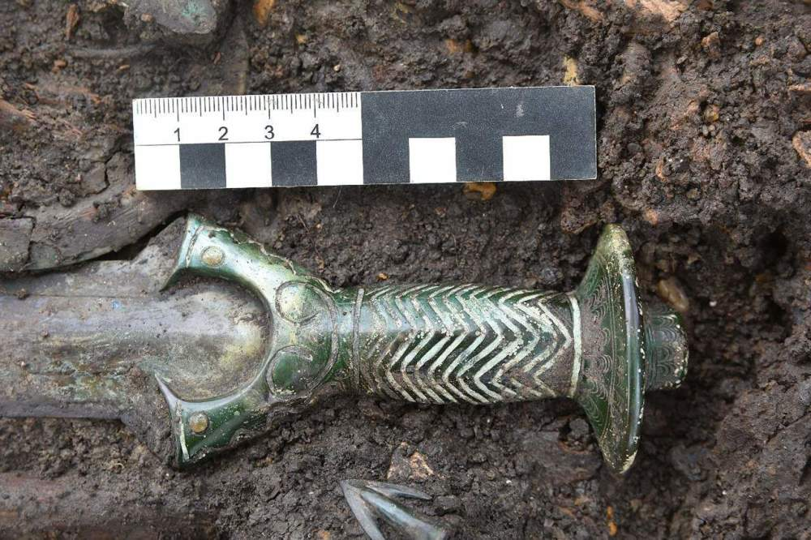

# 德国发现3000年前青铜剑，出土时“几乎还在发光”

(观察者网讯)据英国广播公司（BBC）、美国有线电视新闻网（CNN）6月17日报道，上周德国考古学家在多瑙河附近发掘出一把距今已有3000年历史的青铜剑。据了解，该剑保存完好，色彩鲜明，“几乎还在发光”。

_BBC报道截图_

德国巴伐利亚州古迹保护办公室表示，制造这样一把剑工艺复杂，因为刀柄是铸在刀刃上的。这把剑也被考古学家认为是真正的武器，而非单纯的装饰品。专家表示，剑身重心在前部的情况表明，这把剑的主要功能在于向前砍杀。

_出土的青铜剑 本文配图均来自CNN_

据报道，这把刀柄为八角型的青铜剑，是在德国南部城镇诺德林根的一座坟墓中挖掘出的。据了解，这把剑的历史可追溯至公元前14世纪末的青铜时代。

除青铜器外，挖掘现场还发现一个男人、一个女人和一个男孩的遗骨。考古学家尚不确定这三者是否存在关联。这把剑的来源也引发了人们的质疑，专家表示，无论是这柄青铜剑本身，还是挖掘出公元前14世纪的青铜剑，都极为罕见。

