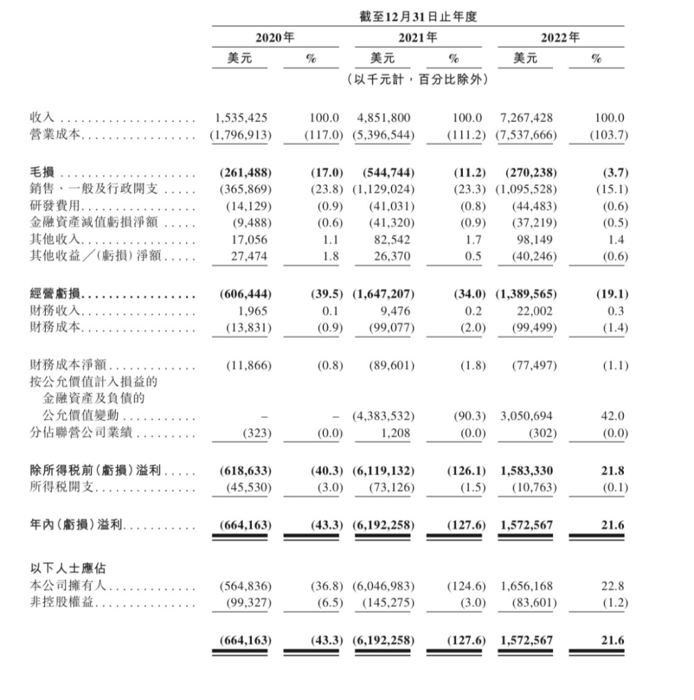
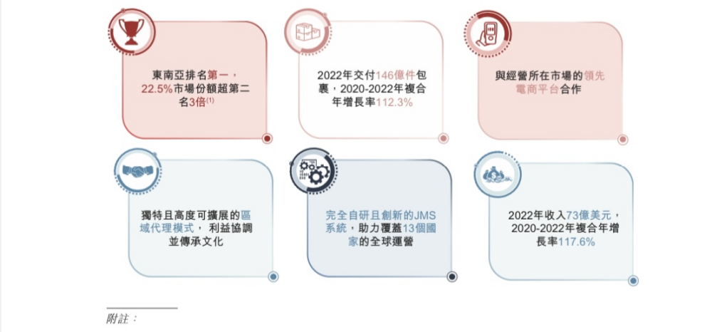
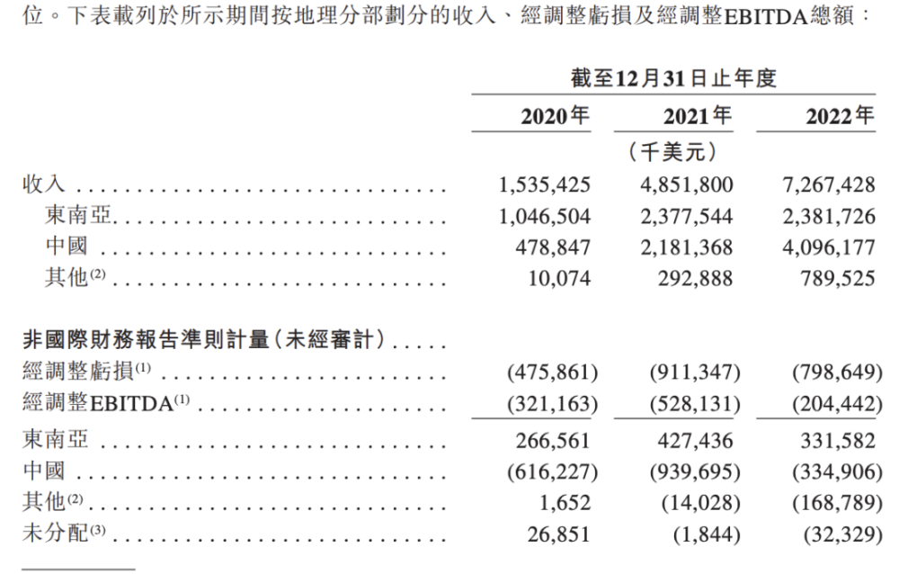
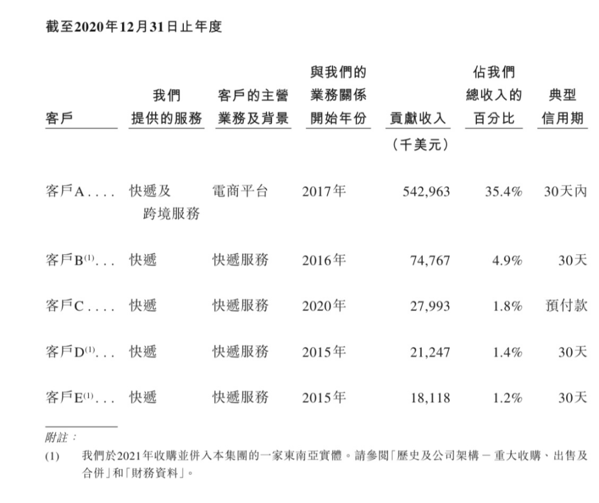

# 拆解极兔招股书：段永平朋友圈撑起东南亚最大快递商｜深网

作者 | 叶蓁

编辑 | 康晓

出品｜深网.小满工作室

6月16日晚，极兔速递（以下简称极兔）正式提交香港 IPO 申请，计划筹集 5 亿至 10
亿美元的资金，预计最快在年内上市。联席保荐人为摩根士丹利、中金、美银。

招股书显示，极兔2020年、2021年、2022年营收分别为15.35亿美元、48.52亿美元、72.67亿美元，经调整净亏损分别为4.76亿美元、9.1亿美元、8亿美元。

公开资料显示，极兔由OPPO印尼业务创始人李杰2015年于印尼首都雅加达创办。2019年，极兔成为东南亚第二大快递公司，同一年，极兔收购上海龙邦快递，在中国直接获得快递经营资质和快递网络。

根据弗若斯特沙利文资料，按2022年包裹量计，该公司为东南亚排名第一的快递运营商，市场份额为22.5%。极兔于2020年进军中国快递市场，按包裹量计，2022年市场份额达到10.9%。

极兔若是上市成功，将成继顺丰、京东物流、中通、申通、圆通及百世后，又一家上市物流企业。

**段永平朋友圈合力打造**

2014年成立的极兔，已经进行了多轮融资。到2021年11月，博裕投资、高瓴资本、红杉资本和腾讯控股等一众私募25亿美元入股极兔，估值达到200亿美元，约合1300亿人民币。

股权结构中，按照编纂前数据，创始人李杰为第一大股东，持股11.54%；腾讯为第二大股东，持股6.32%；博裕为第三大股东，持股6.1%；ATM为第四大股东，持股5.49%。高瓴资本持股2%、红杉持股1.62%。

按照编纂后新数据，上述股东持股比例均有所下降。

极兔创始人李杰曾是OPPO安徽和江苏的代理商，在2013年的时候，OPPO想开拓东南亚市场，李杰就被选了出来委以重任。资料显示，李杰1975年出生于四川，毕业于北京科技大学，毕业后在步步高的代理商体系下从事销售工作。

极兔的招股书显示：极兔的管理、业务和投资，段永平的朋友圈支撑了一大半——包括网易、步步高系、拼多多。投资人郑玉芬、廖清华、张源，执行总裁樊苏州，均与段永平曾主导过的小霸王、步步高、OPPO等企业颇具渊源。

段永平，小霸王缔造者、步步高创始人、著名投资人。段永平也曾自证投资过极兔，OPPO创始人陈明永亦是极兔的早起投资者。陈明永、vivo沈炜，步步高金志江、加上拼多多创始人黄峥，被称为段永平的“四大门徒”。

陈明永目前通过Team Spirit Group
Limited，持有极兔4.4%股权。算是除李杰之外的最大个人股东了。招股书也显示，陈明永曾在疫情期间，担任过极兔董事会董事一年。极兔董事会中的郑玉芬，是曾经的步步高CFO和网易独立董事。除了OPPO外，董事会中的杨昭烜，目前是网易CFO。

李杰长期在OPPO的体系里，深受段永平创业文化的影响。极兔的企业文化价值观是“本分”，众所周知，OPPO，vivo还有拼多多，在谈及自己的企业文化的时候，无一例外称“本分”是其企业文化的关键词。

**而极兔一位早期内部创业人士告诉《深网》，“极兔延续了段永平‘本分’系一贯的价值观，人员非常抱团，执行力很强，做事风格勇敢果断。我们的目标很简单，那就是怎么样从更多的维度满足客户的需求，并把这种需求的实现做到极致，这也是从步步高‘本分’文化出发的初衷。”**

**东南亚市场撑起增长**

极兔是物流极兔是东南亚第一大快递，东南亚也是极兔的大本营和赚钱的市场，利润率高达18%。根据据弗若斯特沙利文的资料，于2021年及2022年，按包裹量计，极兔是东南亚排名第一的快递运营商，其中2022年的市场份额为22.5%。

李杰帮助OPPO敲开印度尼西亚的大门，2013年建设起了整个OPPO印度尼西亚的经销商队伍。深得段永平创业精髓的李杰，只用了两年，OPPO做到印尼市场份额的20%，成为当地手机行业TOP2。

当东南亚电商蓬勃发展时，快递业也必然随着迎来发展期。参照国内电商巨头的发展简史，快递将成为刚需。J&T
Express诞生之前，印度尼西亚市场常用的快递是JNE，快递公司周六日和节假日不工作，体验非常差。

“OPPO在早期印尼的快递用的也是JNE，但非常慢，当时李杰想的就是自己创业做个快递公司，因为OPPO本身在整个印尼的销售网络就很大，正好也碰上了东南亚电商市场的爆发。”ATM
Capital 创始人、极兔早期投资人屈田告诉《深网》。

2015年5月，雅加达OPPO发布会上，时任印度西尼亚区首席执行官李杰当着台下上千名销商的面宣布了一个重磅消息：他要离开OPPO，兴办自己的快递公司J&T
Express（极兔）了。

“极兔以‘免费上门揽件’（在当地揽件是单独收费的）、‘包裹轨迹实时跟新’、‘7*24小时服务’（当地之前是节假日和夜间休息）、‘网点集散’（当地在此之前无转运中心与集散网点的概念，很多都是一个城市只有一处网点，货物都是现场分拣寻找）等新模式在当地获得竞争优势。”一位极兔内部早期创业人士告诉《深网》。

精细化运营下，极兔被打上了“印度尼西亚版顺丰”的标签，凭借电商浪潮带来的商流，和优化运营做好的货流，J&T在印度尼西亚做出了口碑，并在四年内扩张到新马泰、菲律宾、越南、柬埔寨等六个国家，成为东南亚最具影响力的快递公司之一。

**拼多多在极兔的营收占比重下降**

根据招股书披露的信息，从2020年开始，其国内业务收入大幅增长，其中，2020年收入4.79亿美元，2021年收入猛增356%，达到21.8亿美元，2022年再度同比增长88%，达到40.96亿美元。根据极兔披露的信息，其占据了国内10.9%的市场份额。

2020年前后，极兔的创始人李杰把目光转向国内。当时物流行业的现状是电商件方面，三通一达占有率达到了78-82%；商务件方面，顺丰、京东、EMS三家占据着85%的市场。

“快递业模式相通，我们在海外创业多年，快递领域的相关经验与管理模式对国内起网也是适用的。我们这么些年积累了一大片兼具国际视野与快递专业经验的人才，这个对我们在国内的起网大有裨益，也是我们在行业发展里重要的优势之一。”极兔一位早期内部创业人士告诉《深网》。

当然，这一时期极兔在国内的狂飙突进跟拼多多的关系非常大。有消息称，2020年、2021年时，极兔超过9成的订单来自于拼多多。

根据披露的信息，拼多多2020年、2021年为极兔贡献的收入分别为5.43亿美元和17.15亿美元，都占了总收入的收入35.4%。按照中国区收入来算，2020年和2021年，拼多多贡献的收入占了极兔中国的51.9%和78.7%。

伴随着拼多多的狂飙突进，加上李杰的“低价”策略，极兔打出义乌“8毛发全国”的策略。极兔的日单量也跟着水涨船高，从0突破到2000万件日单量只用了10个月，这是三通一达10多年才做到的。

此外，2021年10月29日，极兔以68亿元收购百世汇通国内快递业务。百世汇通隶属于阿里巴巴，从2014年起，这家成立于2008年的快递公司一直亏损，负债总计达到了175.06亿。

物流业人士点评，“买下百世汇通之后，极兔速递才上了国内物流业的牌桌。百世汇通的末端网点、高管、大客户资源对极兔来说，都是非常有价值的。”百世当时拥有2000多万日均单量，加起来极兔日均单量一下超4000万，市场份额提升至14%进入第一梯队。

极兔2020年、2021年、2022年来自中国的营收分别为4.79亿美元、21.81亿美元、40.96亿美元。极兔在中国市场的快速增长是建立在亏损和补贴之上的。极兔中国经调整EBITDA分别为-6.16亿美元、-9.4亿美元、-3.35亿美元，三年合计亏损近19亿美元。

2021年时，极兔在中国的一个包裹收入是0.26美元，营业成本达0.41美元，相当于一个包裹亏0.15美元；2022年，单个包裹收入提高到0.34美元，成本保持在0.4美元，亏损缩至0.06美元。

但2022年起，极兔来自拼多多的收入大幅下滑至12.31亿美元，同比下降了40%。与此同时，拼多多在极兔收入中占比下降到16.9%，在极兔中国收入中的比重下降金额下降至30%。另外，2022年，“社交电商平台”抖音贡献的收入达到了4.82亿美元，占到了极兔中国收入近12%。

