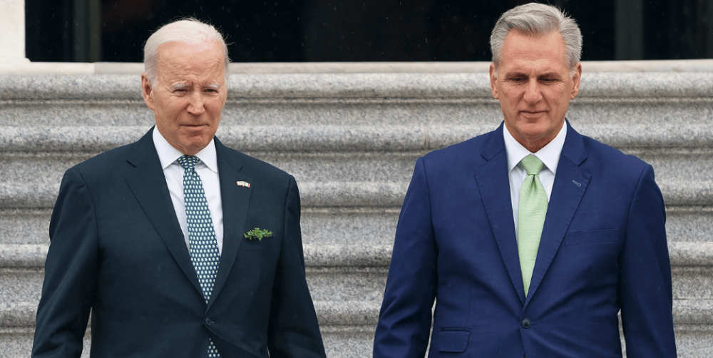

# 比预测提早了9年！美国政府债务规模首次超过32万亿美元

（观察者网讯）据《纽约时报》当地时间6月16日报道，美国财政部最新公布的数据显示，美国国债首次超过32万亿美元，这比之前的预测提早了9年。

_《纽约时报》报道截图_

报道称，经济低迷背景下，美国政府为应付新冠疫情的数万亿美元紧急支出，是造成这一情况的主因。随着新冠纾困法案、基础设施建设法案等措施的接连出台，拜登政府为筹集资金而发债的规模水涨船高。之后随着美联储多次激进加息，美国政府债务利息继续攀升。据美财政部去年10月4日公布的数据，美国政府债务规模首次超过31万亿美元。

美国两党都表达了对国家债务的担忧，但双方均未表现出最大限度的解决该问题的意愿。

根据美国国会预算办公室的数据，最近两党达成的相关协议削减了十年内1.5万亿美元的联邦支出，主要包括冻结明年将增长的部分资金，以及在2025年之前限制支出增长至1%的水平。《纽约时报》表示，即使考虑到新通过的支出削减措施，到本十年末（2029年），美国国债仍有可能超过50万亿美元。

6月3日，美国总统拜登在白宫签署了提高债务上限的《2023年财政责任法案》。拜登此前对美国国会参众两院通过抬高债务上限、削减部分开支的法案予以称赞，他表示，法案的通过使美国避免了经济崩溃。

本周，美国众议院拨款委员会已开始考虑其下一个支出法案，并表示将以低于美国总统拜登和众议院议长麦卡锡谈判达成的水平为联邦机构提供资金，从而安抚共和党占多数的保守派。

_资料图：美国民主党籍总统（左）和美国共和党籍众议院议长麦卡锡
图源：《国会山报》_

美国经济学家马克·赞迪表示，这不能从根本上解决美国政府的债务上限危机，美国面临的长期财政挑战依然存在。

美国两党的激烈党争，使美国今年持续了数月的债务上限危机闹剧。共和党人以优势票数控制着众议院，而民主党人则控制着参议院，美国社会普遍认为，目前美国两党在国会之间微弱的差距，为两党通过任何协议都只留下了一条狭窄的道路。

外交学院国际关系研究所李海东教授告诉观察者网，美国就这一轮债务上限的整体争论中没有赢家，全是输家，各国对美国作为一个债务国是否能信守诺言的质疑在加深，而通过这次事件，全世界都见识到美国外交深受国内极端分裂，甚至道德底线不断拉低的政治所影响。

今年1月，美国政府已经触及31.4万亿美元债务上限，美国财政部随即采取“非常规措施”以避免债务违约，但这些临时措施获取的资金额度有限。

美国财政部长耶伦5月26日表示，基于当时的数据，如果不能及时提高或暂停债务上限，到6月5日财政部资金预计不足以履行支付义务。

国际评级机构惠誉已将美国列入负面观察名单。该机构6月2日表示，惠誉将维持美国政府“AAA”的信用评级，但由于美国在过去15年间的治理状况持续恶化，不会在今年第三季度之前将美国移出负面观察名单。

美国彼得·彼得森基金会的最新预测显示，在未来30年，美国将增加127万亿美元的债务。到2053年，利息成本将消耗近40%的联邦财政收入。

**本文系观察者网独家稿件，未经授权，不得转载。**

