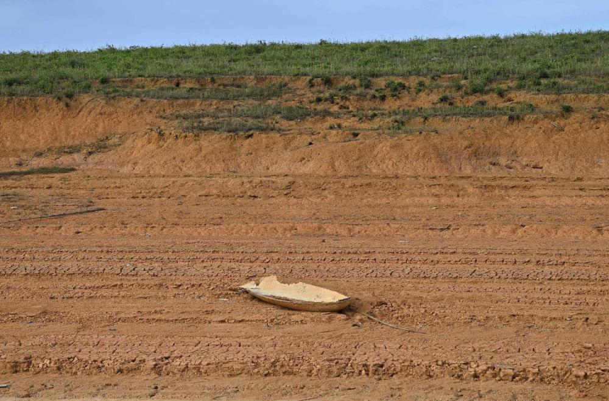
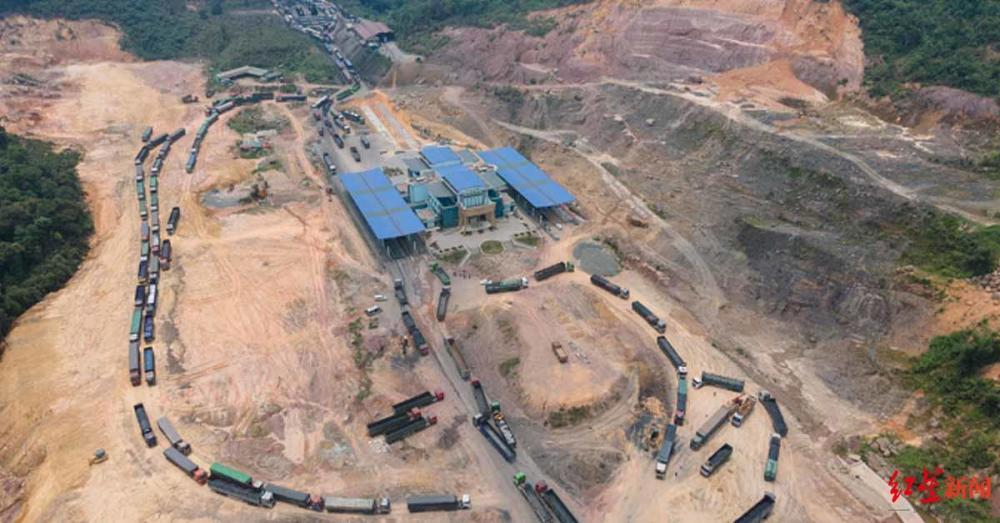
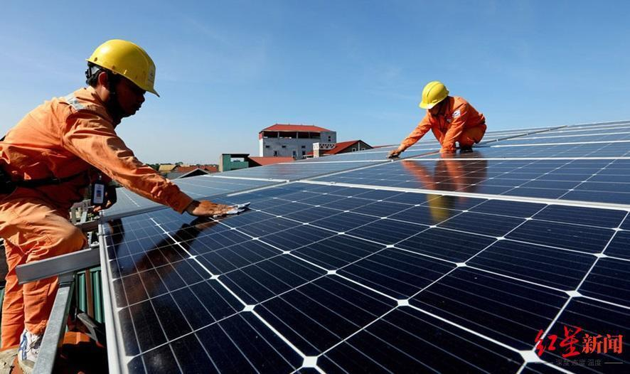

# 越南“电荒”背后：高温干旱、承接产业转移，薄弱电力基础难撑“越南制造”

受高温干旱天气影响，越南近来出现缺电状况，不仅造成上千只鸡死亡，首都河内夜晚关闭路灯节电，就连引以为傲的“越南制造”也受到冲击，工厂生产受到限制。（红星新闻昨日报道：《越南遭遇世纪高温闹“电荒”：一养鸡场热死上千只鸡，苹果三星被迫停工》）

在重压之下，越南采取了拉闸限电、进口电力等一系列措施，一些在疫情期间封存的太阳能板也被打理干净重新启用。不过，这些措施终究不如煤炭发电来得直接有效。越南海关总局数据显示，2023年1-5月，越南煤炭进口量比上年同期增长39.9%。

采用清洁能源取代煤炭已成为全球共识，但近年来包括越南在内的很多国家重回煤电老路，使得全球煤炭消耗量反而在2022年创下历史新高。

对此，四川大学国际关系学院李昊教授对红星新闻记者表示，早日实现“碳达峰”是全球面对日趋严峻的气候危机时取得的根本共识，但由于发达国家和发展中国家在产业分工、技术水平等层面的差异，实现清洁能源替代的步伐不可能强求一致。

_↑2023年5月30日，越南河内，一些路灯被关闭以节省电力，空调的需求飙升。图据视觉中国_

**电力缺口增大，越南重走煤炭发电老路**

最近十几年来，随着越南在低端制造业上的崛起，该国的用电消耗量逐年递增，但发电能力在2020年后进入瓶颈期，电力缺口也随之产生。

越南海关总局数据显示，2023年1-5月，越南煤炭进口量比上年同期增长39.9%。中国国家统计局近日发布的数据显示，2022年全国规模以上工业发电量8.4万亿千瓦时，人均约6000千瓦时；相比之下，2021年越南发电量约2550亿千瓦时。

资深投行人士王骥跃表示，从产业发展阶段上看，越南目前类似于中国工业化起步早期，出现缺电等配套方面的问题实属正常。越南电力基础的薄弱也长期制约着工业生产的扩张速度。

今年夏天，越南又遭遇了极端高温干旱的天气，水库干涸使得越南倚重的水利发电损失严重。

_↑当地时间2023年6月13日，越南安沛，Thac
Ba水电湖内形成的一个岛屿上的一艘废弃船只。图据视觉中国_

据越南工商贸易部电力管理局长Tran Viet
Hoa介绍，整个北方地区的用电需求预计为2.35万兆瓦至2.4万兆瓦，存在巨大缺口。他还表示，“一天中的大部分时间都存在电力短缺的风险”，并指出印度、孟加拉国等周边国家也面临限时停电的无奈选择。Tran
Viet Hoa还担心，目前从越南中部到北部地区的电力传输已经过分饱和，可能让电网承受安全隐患。

压力之下，越南选择重启煤炭发电。该国海关数据显示，今年5月，越南进口煤炭505.8万吨，同比增长76.3%。据报道，在越南老挝接壤的La
Lay地区，运煤卡车每日络绎不绝地向越南输送着煤炭，甚至在边关哨卡处形成交通堵塞。

为长期稳定从老挝进口煤炭，越南方面提议修建一条160公里长的煤炭传输带，每小时能运送超1500吨煤炭，每年可进口15万-20万吨煤炭。

**风电水电潜能巨大，为何还是依赖煤电？**

从自然资源条件来看，越南发展可再生能源可谓得天独厚。

越南不仅是东盟地区风电资源最为丰富的国家，拥有3200多公里长的海岸线，中部及南部地区具有巨大的发展潜力。而且越南处于热带地区，太阳能资源稳定，年日照量在2000至2500小时左右。越南的水能资源同样蕴藏丰富，红河、湄公河的流入使得越南全国河流年均径流总量达到8400亿立方米，位居世界第12位。

此外，越南矿产资源同样丰富，但是由于煤炭开采力度大，地层破坏已经较为严重，越南也在近年从煤炭资源出口国转变成了进口国。

_↑越南老挝边境上运煤卡车堵塞道路_

四川省安全教育科普基地特邀研究人员、四川大学国际关系学院博士研究生张新对红星新闻记者认为，越南虽然先天自然条件不错，但没有高效利用风能、太阳能等清洁能源进行能源结构转型，以至于燃煤发电目前仍然是越南最为重要的电力来源。

今年5月15日，越南总理范明政批准了《2021-2030年阶段和至2050年远景展望国家电力发展规划》（俗称“第八个电力规划”）。这项规划要求保障国内电力充足供应，实现2021年-2030年GDP年均增长约7%等社会经济发展目标。

张新对记者指出，越南“第八个电力规划”的目标是到2030年停止开发新的煤电项目，到2050年停止使用燃煤发电。这样长远的期限表明越南给自己留出了充足的转型时间，在近期内该国对煤电的依赖仍将继续。张新还认为越南目前缺乏高效完整的电力规划，国营越南电力集团（EVN）难以彻底打破地方利益格局，实现全国范围内统一调度电力的生产和使用。

**专家：能源转型压力巨大，“脱煤”是必然**

李昊教授认为，近几年新冠疫情叠加俄乌冲突，对越南这样的发展中国家来说能源供应雪上加霜，造成了电力紧缺和煤电“复活”的现象。

新冠疫情在全球范围内不仅严重打断生产活动，也造成了部分产业链的转移和重新布局。对于越南这样承接产业转移的国家来说，这意味着工业生产规模会有很多临时性的调整变动，使得原有的电力供给格局更难以满足生产的需要。

而自从俄乌冲突爆发后，天然气等清洁能源的价格一度飞涨，全球很多国家会被动承受输入性通胀。对越南来说，此时启动向清洁能源转型的压力巨大。

世界银行去年的一份研究报告曾将越南列为全球五大最容易受气候变暖影响冲击的国家之一。在该国漫长的海岸线上有很多低海拔城市，一旦海平面上升将遭遇“灭顶之灾”。报告估计，到2050年之前，应对气候问题付出的成本将占到越南GDP的12%至14.5%。由此看来，越南转向清洁能源的压力较为紧迫，同时该国刚通过的“第八个电力规划”也明确发展可再生能源的路线。

_↑越南工人检修太阳能板_

对此，李昊教授认为，在“脱碳”的总体路线确定的前提下，各国“脱煤”迈向清洁能源的节奏不可能完全一致，发达国家和发展中国家在历史包袱、技术水平以及产业链分工的位置等方面存在巨大的差异。

举例来说，发达国家工业起步早，现在已经不是主要的工业生产国，自然排放压力较小。加之欧美国家在核电、太阳能等领域有着成熟的技术积累，即使遭遇到俄乌冲突带来的能源压力，寻找替代能源也较为容易。而经济发展起步较晚的发展中国家处于产业链较低端的位置，本身承担了很重的工业生产任务，而且在资金、技术上的差距使他们的转型速度必然更慢。

但从长期趋势来看，李昊教授认为全球“脱煤”的大势不可阻挡：“巴黎协定提出的减排目标是各国的共识，这不仅仅是气候问题，也是全球重大的政治经济问题。脱碳、脱煤是既定的路线，煤炭从长期看是不可能在能源结构中搞‘复辟’的。”

红星新闻记者 郑直

责编 任志江

