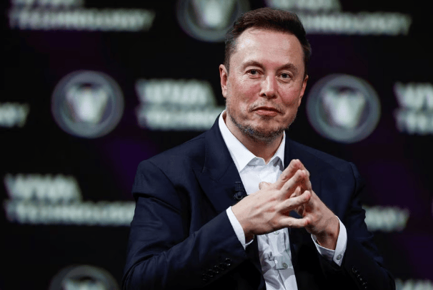

# 马斯克：AI可能是有史以来最具颠覆性的技术，人类要小心

（观察者网讯）在6月16日法国科技盛会Vivatech一场活动中，美国特斯拉公司首席执行官埃隆·马斯克再度就人工智能（AI）技术发出警告。他认为先进的人工智能技术或将是“有史以来最具破坏性的技术”，将给公众带来风险，他呼吁对人工智能行业发展进行相应监管，以最大限度地降低“潜在的灾难性后果”。

_路透社报道_

马斯克在直播活动中表示，数字超级智能确实存在产生负面后果的危险，他赞成对人工智能进行监管。

“我们可能会面临潜在的灾难性后果。（人工智能）最有可能的结果是积极的，但我们需要将数字超级智能出现问题的可能性降至最低。我赞成监管，因为……先进的人工智能对公众来说是一种风险。”

马斯克形容，“人工智能可能是有史以来最具破坏性的技术”，他打趣说，想活着见证“一些人工智能启示录……但希望这不会发生”。

今年3月，马斯克曾签署了一封联名公开信，呼吁在建立安全措施的同时暂停先进的人工智能开发。

“我认为没有人会同意暂停。”但马斯克认为，暂停人工智能发展是一种态度，仍应该留下记录（指上文的联署公开信）。

_马斯克6月16日参加Viva科技论坛活动/路透社
图_

与此同时，马斯克还指出，目前的技术标准不足以限制人工智能系统的影响力。他指出，具体而言，旨在阻止机器人访问网页的验证程序在人工智能时代是无用的。

“很明显，有了今天的人工智能，计算机可以通过每一项‘你是否为真人’的测试，就像识别红绿灯一样。”“开源人工智能可以通过所有的人类测试，所以你需要比这更好的认证（方式）。”

实际上，对人工智能发出警告的不止马斯克一人。就在5月，OpenAI首席执行官山姆·阿尔特曼（Sam
Altman）出席国会听证会时，同样呼吁对人工智能进行监管。他支持创建一个专门机构，向创建人工智能模型的组织颁发许可证，并且在新模型正式发布之前对其开展测试。

微软总裁布拉德·史密斯（Brad
Smith）也支持类似的想法。上个月，微软发布了一份长达41页的关于控制人工智能的报告，呼吁美国和其他国家建立自己的政府机构，专门监管人工智能。

6月14日，欧洲议会议员投票表决通过了更加严格的人工智能法规草案，其中包括禁止在生物监测活动中使用这项技术，以及聊天生成预训练转换器ChatGPT等生成式AI系统须披露AI生成内容的规定。路透社称，这意味着欧盟成为世界上全面推进人工智能立法的主要政府机构之一。

**本文系观察者网独家稿件，未经授权，不得转载。**

