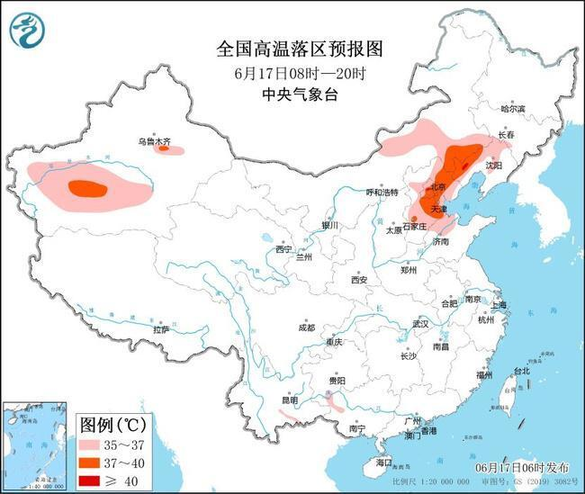

# 高温预警：今天辽宁河北北京等地局地最高气温可达40℃以上

中国天气网讯 中央气象台6月17日06时继续发布高温黄色预警：

预计6月17日白天，内蒙古东南部和中部、辽宁北部和西部、新疆南疆盆地、河北中北部、北京、天津、山东北部等地有35～36℃高温天气，其中，内蒙古东南部、辽宁西部、新疆南疆盆地、河北中北部、北京、天津等地部分地区最高气温37～39℃，局地可达40℃以上。

防御指南：

1、有关部门和单位按照职责做好防暑降温准备工作；

2、午后尽量减少户外活动；

3、对老、弱、病、幼人群提供防暑降温指导；

4、高温条件下作业和白天需要长时间进行户外露天作业的人员应当采取必要的防护措施。

