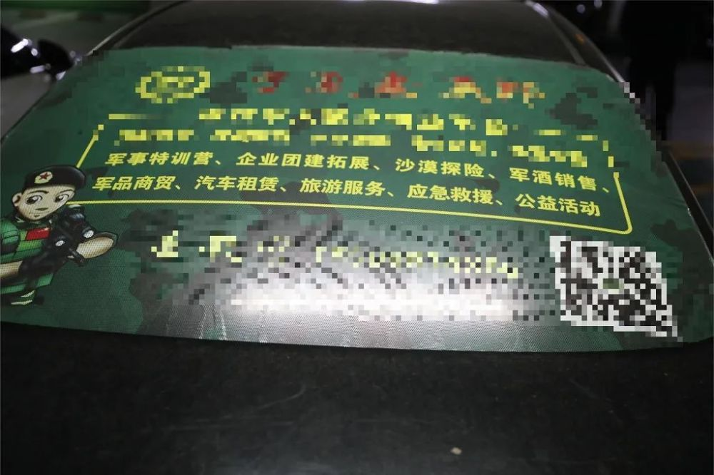
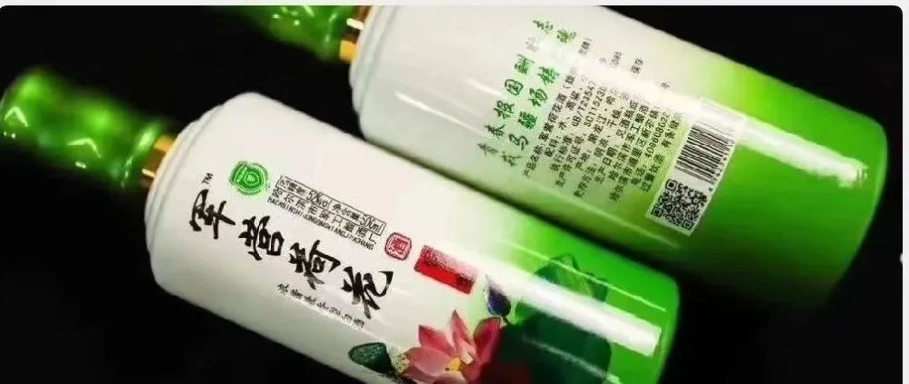
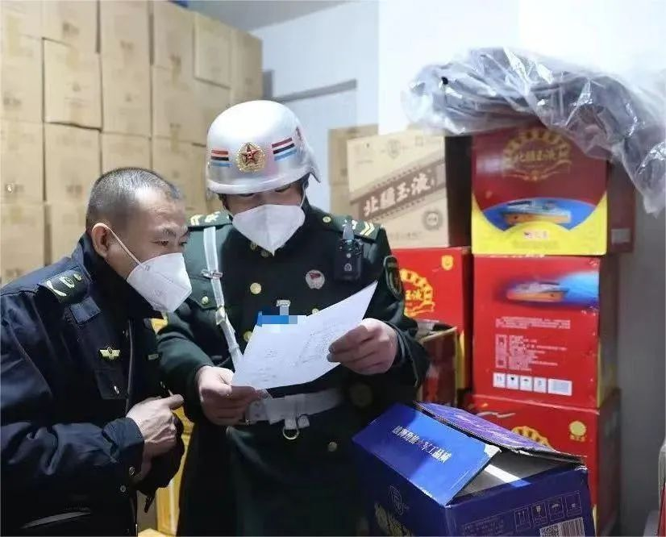
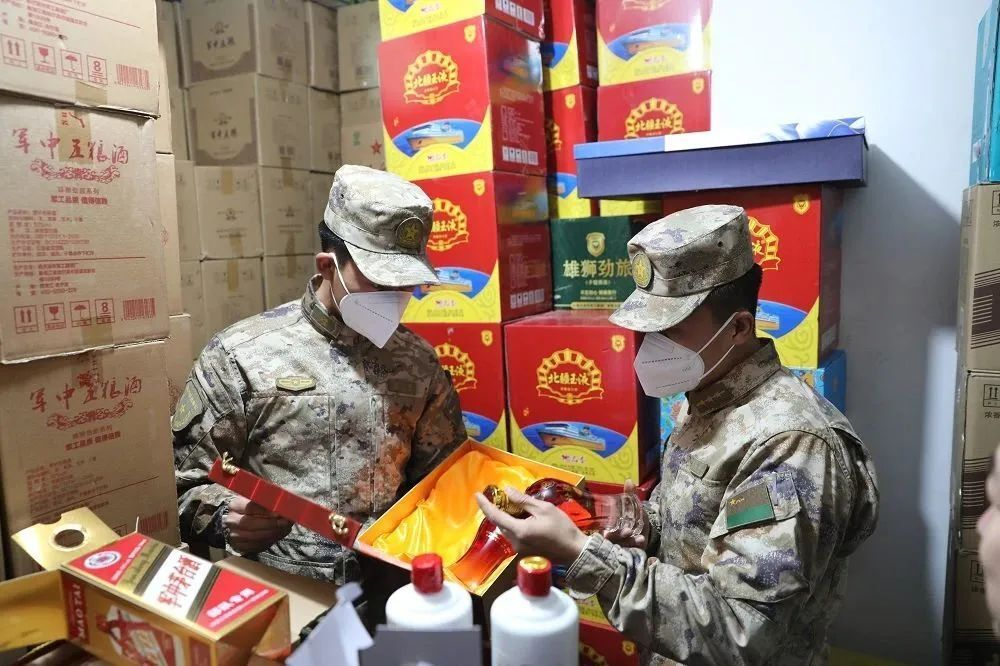
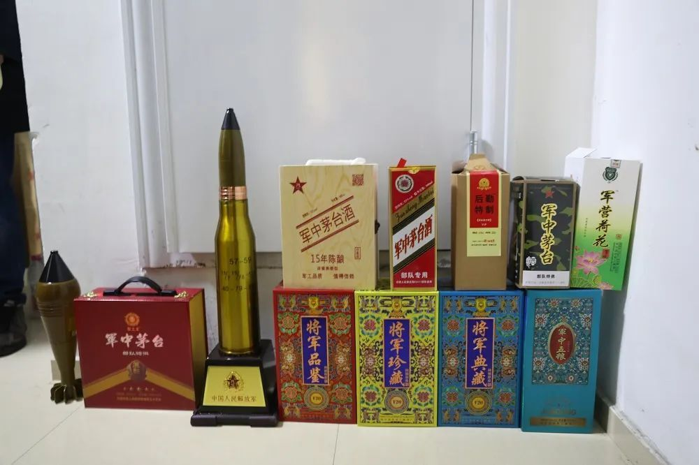

# “军中茅台”“部队特供”？军地联合查处所谓军酒销售门店

“军中茅台”？“军中五粮”？

你以为这是“特供”佳酿？大错特错！

以“军”字号为噱头售酒，胆子太大！

宁夏军区警备办公室今年在执行纠察任务时，一辆私家车引起了他们的注意。车身两侧疑似印有军队臂章样式的标识，车辆后侧玻璃上还标注着“军酒销售”的字样。

纠察员发现后随即拍照，并进行跟随，顺藤摸瓜找到了车辆所属公司。

经调查发现，该公司注册有微信公众号，公开销售“军酒军品”品类多达40余种，还附有“军酒”销售电子彩页。

经进一步调查发现，该公司主要负责“军酒”销售后的派送工作，其背后供货商为李某。

李某2020年在朋友的怂恿下，嗅到了“军”字号产品的所谓“商机”，开始从事“军酒”销售。

在掌握更多证据后，宁夏军区警备办公室联合银川市公安局、银川市市场监督管理局金凤区分局，对其销售门店及库房进行查纠，
**封存12个品种、600余件、3500余瓶疑似涉“军”字号酒，累计金额达数十万元，** 并对该公司作出
**罚款3万元、没收“无厂名厂址军酒”的处罚，并责令其立即整改。**

近年来，部分经营者公开或变相冒用军队名义，使用军队特定含义字样和图案，生产销售“军中茅台”“军队专供”等假冒伪劣商品，严重损害军队声誉形象，影响国家经济环境治理。为了维护人民军队良好形象、社会公共利益和市场经营秩序，2022年，中央军委后勤保障部等6部门联合发布
**《关于禁止销售“军”字号烟酒等商品的通告》** 。

**一、严禁任何单位和个人利用中国人民解放军和武装警察部队名义，以任何形式进行商业营销宣传。**

**二、严禁线上线下销售“军”字号烟酒等商品。“军”字号烟酒等商品，指在商品或包装上印刷、刻制、铸造包括但不限于下列字样或者图案，易误导消费者、造成涉军负面影响的商品。**

（一）军事单位名称，包括中央军委、各战区、各军兵种、武装警察部队及其他军队单位的全称或者简称。

（二）部队番号或者代号，包括中国人民解放军和武装警察部队实有番号、代号的全称或者简称，以及虚假的部队番号、代号。

（三）涉军特定含义字样，包括“军队”“部队”“解放军”“武警”“战区”“警卫局”“PLA”“CAPF”“PAP”“国防”“八一”“军用”“军供”“军中”“军需”“军服”“军品”“军队专供”“军队特供”“军队特制”“军品代销”“军品专营”等。

（四）军用标志物图案或者类似图案，包括军旗、军徽、武警部队徽、八一、勋章、领花、胸标、臂章等。

**三、严密组织“军”字号烟酒等商品监管。相关职能部门要密切配合，加强对违规生产、销售“军”字号烟酒等商品和涉军商标注册监管，对发现的问题坚决予以纠正，对拒不整改、顶风违法违规的，依法依规严肃查处。**

来源：央视军事综合守望贺兰、国家知识产权局

**监制丨马烨**

**主编丨白晨**

**编辑丨王吴恺馨**

**©央视军事**

