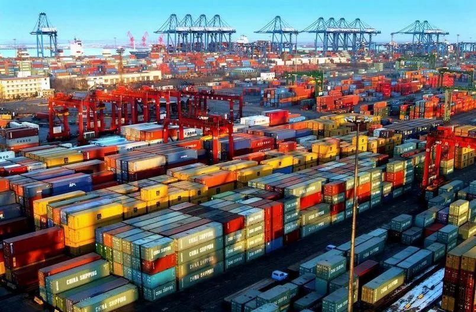

# 中国已向CPTPP成员递交交流文件，专家解读来了

17日，商务部国际贸易谈判代表兼副部长王受文在2023年亚太经合组织(APEC)工商领导人中国论坛上，介绍了我国加入《全面与进步跨太平洋伙伴关系协定》（CPTPP）的推进进程。

“我们主动对标CPTPP高标准，在国内主动实施了相关领域内改革开放的先行先试。”王受文指出，中国有意愿、有能力加入CPTPP、达到CPTPP的高标准，中国的加入也将为所有CPTPP成员带来利益，为亚太地区贸易投资自由化增加新的动力。

商务部研究院对外贸易研究所所长梁明近期在接受第一财经记者采访时表示，我国已经明确提出要加入CPTPP。

“我们为此做了大量工作，对CPTPP所有条款进行了深入研究，发布了专门报告。从自身能力来看，我们已完全具备对照、适应或接受CPTPP规则的一些基本条件。”梁明表示，目前，我们已在一些自贸试验区开展规则的“先行先试”，加入CPTPP的基础工作已经成熟。

_中国申请加入CPTPP最新进展（新华社图）_

**中国申请加入CPTPP最新进展**

2018年12月30日，日本、加拿大、澳大利亚、智利、新西兰、新加坡、文莱、马来西亚、越南、墨西哥和秘鲁11个国家签署的CPTPP正式生效。协定覆盖4.98亿人口，成员国国内生产总值之和占全球经济总量约13%。

2021年9月16日，中国正式提出申请加入CPTPP。

此次王受文表示，目前我国对于CPTPP的2300多项条款进行了深入、全面地研究和评估，梳理了中国加入CPTPP需要实施的改革措施和需要修改的法律法规。

他表示，近期，中国政府向CPTPP成员递交了中国加入该协定的一份交流文件。

5月25日，在回答“中国驻澳大利亚大使上周表示，中国已经建议设立一个工作小组和澳大利亚商讨中国加入CPTPP的事宜”相关提问时，中国商务部发言人束珏婷表示，中方正在按照加入CPTPP的程序，同各成员方进行沟通和磋商。

此前在2021年9月，束珏婷说：“为积极推动加入进程，中方已就协定案文规则进行了充分、全面和深入的研究评估，梳理了加入CPTPP可能需要采取的改革举措和修改的法律法规。我们愿通过持续深化改革，努力全面达到CPTPP规则标准，并在市场准入领域作出超过中方现有缔约实践的高水平开放承诺。中方愿与各方共同努力，积极推进区域经济一体化和贸易投资自由化便利化，为促进全球经济稳定复苏作出积极贡献。”

束珏婷表示，CPTPP是高标准国际经贸协定，内容非常广泛。加入CPTPP不仅有利于中国扩大高水平开放，也有助于CPTPP成员国拓展在中国的市场，扩大对华经贸合作。

梁明对第一财经记者解释道，CPTPP的加入机制需要所有成员方同意和签订一些相关准入措施，这可能是下一步中国谈判的关键。

他表示：“中国加入CPTPP可以直接带动区域内的贸易增量，贸易创造效应将非常明显。一些相关国家对中国加入CPTPP的增量效益也有非常清楚的认识。”

“当前，我们正在履行加入CPTPP的一些程序和手续，加入的进展还要看我们跟CPTPP成员的谈判的情况，以及成员方的态度。”梁明表示，从目前来看，大部分的成员方支持中国加入CPTPP。

不仅仅是CPTPP，为参与贸易数字化国际规则的构建，去年8月，中国加入《数字经济伙伴关系协定》（DEPA）工作组正式成立，全面推进中国加入DEPA的谈判。

对于这一谈判的进展，束珏婷在4月27日的例行新闻发布会上对第一财经记者表示，3月28日，中国加入DEPA工作组第一次技术磋商在线举行。

束珏婷称，中方与DEPA成员方重点就无纸贸易、国内电子交易框架、物流、电子发票、快运货物、电子支付等条款开展深入交流。

“下一步，中方将继续就数字产品、数据治理、数字包容性等议题与成员方在工作组机制下继续开展磋商。”束珏婷对第一财经记者表示。

此前在第133届广交会上举办的贸易数字化创新发展论坛上，王受文表示，我国正在积极推进加入DEPA，同时在推进CPTPP的加入进程。

王受文称：“我们已经与DEPA的成员就无纸贸易、国内电子交易框架、物流、电子发票、电子支付这些贸易便利化议题进行了深入的交流，目的在于应用，在于推动我们贸易环节效率的提升。”

**未来我国将合理地缩减外资准入负面清单**

17日，王受文表示，中国将继续敞开大门谋发展，积极推动高水平的开放。王受文说，我国已经基本放开了制造业的外资准入，正在全面有序地放开服务业，未来我国将合理地缩减外资准入负面清单，推出自贸试验区和全国范围内的跨境服务贸易负面清单。

王受文表示，中国将坚持依法治国，积极构建国际化、市场化、法治化的营商环境。最近我国出台了一些法律法规，其目的是完善法治建设，扩大规则、规制管理和标准方面的制度型开放，最终是为工商界提供透明的、可预期的、高质量的保护。

王受文表示，中方将大力吸引外资，欢迎外资企业在中国投资兴业。投资中国意味着将获得14亿人的巨大市场，可以获得安全、稳定、高效的全产业供应链的保障，也意味着可以获得更加优质便利的投资服务和更加透明稳定的营商环境。

今年1-5月，全国实际使用外资金额5748.1亿元人民币，同比（下同）增长0.1%，折合843.5亿美元，下降5.6%。

对此，商务部外资司负责人表示，前5个月，全国实际使用外资以人民币计微增、以美元计下降主要有两方面原因：一是去年1-5月大项目集中到资，引资金额以美元计达历史同期最高水平，导致去年同期基数大。二是受近期美元汇率波动的影响。

商务部外资司负责人表示，外商投资是市场行为，跨国公司从作出投资决策到实际投入资金有一定周期。

商务部外资司负责人表示，今年以来，众多跨国企业高管纷纷来华考察，外资企业普遍对中国经济发展前景充满信心，表示愿继续深耕中国市场、投资中国，以实际行动对中国经济发展前景投下“信任票”。1-5月，全国新设外商投资企业18532家，同比增长38.3%。

值班编辑：阿贵

