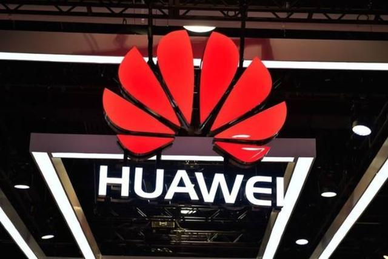

# 传华为正在要求大约30家日本公司支付专利授权费

6月18日消息，据日经新闻近日报道，华为正在向大约 30 家中小型日本公司收取使用专利技术的许可费。

华为日本部门的一位消息人士透露，“目前华为正在与大约 30 家日本电信相关公司进行谈判。”

几家日本公司的消息人士称，从一些只有几名员工的企业到拥有 100
多名员工的初创公司都收到了华为支付专利授权费用的要求。这些企业大多属于无线通信模块的组件的制造商及其他相关厂商。

据悉，华为要求的支付的专利授权费用从每单位 50 日元（35 美分）或更少的固定费用到系统价格的 0.1% 或更少。

东京大学访问研究员 Toshifumi Futamata 表示，“华为的收费与国际标准相当。”

不过，Toshifumi Futamata
警告称，许多中小型公司不熟悉专利谈判，可能会签订不利条款的合同，甚至可能会导致日本公司的数据泄露。比如包括授权访问通信模块软件的合同，可能会带来数据泄露的风险。Toshifumi
Futamata 表示，这些日本中小型企业需要寻求律师和其他专家的帮助，以避免签订不利合同。

而华为之所以能够要求这些日本企业支付专利授权费，主要是由于华为在通信领域拥有较高份额的标准必要专利，这些专利对于使用 4G/5G 或 Wi-Fi
等无线通信标准至关重要。其他公司生产的符合这些标准的设备就需要获得华为的专利技术授权。

根据华为在2022年初公布的数据显示，截至2021年底，华为全球共持有有效授权专利4.5万余族（超过11万件），90%以上专利为发明专利。

世界知识产权组织（WIPO）2022年2月在日内瓦发布的2021年全球PCT专利报告也显示，华为以6952件PCT专利申请量排名全球第一。

在5G专利方面，德国专利信息分析机构IPlytics发布的报告显示，截至2021年2月，全球5G标准必要专利族声明排行榜中，华为排名全球第一，占据了15.39%的份额。

2022年12月5日，国家知识产权局知识产权发展研究中心发布的《中国民营企业发明专利授权量报告（2021）》报告显示，华为以7630件发明专利授权量排名第一。

总部位于东京的研究公司 Seed Planning 表示，使用华为专利技术的无线通信模块对于连接的物联网 (IoT)
网络来说是必不可少的。该技术正在自动驾驶、自动化工厂、医药、电力和物流等领域得到应用。

此外，报道还表示，除了日本之外，华为也将加强在东南亚的特许权使用费征收。

近几年来，在美国的持续加码制裁之下，华为多项重要业务出现了大幅下滑，专利授权业务因此也成为了华为开拓的一个新方向。

2021年3月16日，华为在深圳发布了《华为创新和知识产权白皮书2020》，上线了华为专利数字墙，同时公布了其5G专利许可费率标准，5G多模手机单台许可费上限为2.5美元。这一举动正式开启了华为专利授权业务。随后，有消息显示，华为已经开始向全球最大智能手机品牌征收特许权使用费，其中就包括苹果公司和三星电子。

2022年4月，华为在心声社区公开了一则由任正非签发的《专利许可业务汇报》会议纪要。任正非在会议上表示：“华为要构建合理的价格基准，让产业界公平合理地使用华为的专利技术，在获得适当的研发回报的同时，也有利于华为在国际社会奠定创新者形象；华为使用了别人的专利，也要合理付费，这样就在全世界建立起了有利于创新的知识产权价值观和土壤。”

任正非还指出，专利收费不能为了收费而收费；也不能要得太低，要得低了，就遏制了整个社会的创新，没人愿意再投入研发了，会形成我们的事实垄断，也不符合法律要求的公平合理无歧视原则。投入研发的人，都期望收入比投入要多一点，投入研发必然有很多失败，失败的费用也要包含在成本里，这样大家才会愿意持续投入深度研发，形成正循环。

2022年6月，挪威芯片设计厂商Nordic
Semiconductor与华为技术有限公司签订专利许可协议。通过该协议，华为将向Nordic及其客户授予低功耗广域(LPWA)蜂窝物联网标准必要专利(SEP)的组件级许可，相关专利许可费按照公平、合理和非歧视性(FRAND)原则设置。

在2022年9月的“2022 世界设计之都大会”开幕式上，华为常务董事、终端 BG CEO
余承东就因为专利侵权问题进行过吐槽。他表示，“在很多行业，尤其中国的一些企业，他们在抄袭我们（华为）的设计。在西方的文化之中，抄袭别人是非常不耻的。但咱们中国人，包括我们的一些专利，大家使用了也不给我们（华为）付专利费，都直接用，然后还讲成是他们自己的专利，甚至有些东西是直接抄。”

2022年12月9日，OPPO广东移动通信有限公司与华为宣布签订全球专利交叉许可协议，该协议覆盖了包括5G标准在内的蜂窝通信标准基本专利。

2022年12月23日，华为宣布与诺基亚续签专利交叉许可协议，并与奔驰、奥迪、保时捷以及宝马等多家汽车制造商达成授予协议。这些车企都希望在他们的汽车中增加通讯技术。

华为知识产权部部长樊志勇称，2022年华为已签署了20多项专利许可协议，涵盖智能手机、互联汽车、网络和物联网。仅在汽车行业，华为就和大约15家汽车制造商达成了使用其先进无线技术的协议，其中包括奥迪、奔驰、宝马和兰博基尼等知名品牌。

随着专利授权业务的持续开展，也为华为带来了专利授权收入的增长。华为美国首席知识产权法律顾问史蒂文·盖斯勒（Steven
Geiszler）此前公布的数据显示，在截至2021年的过去三年中，华为全球专利授权收入约为12亿美元（约合83.88亿元人民币），相当于平均每年有4亿美元的收入。而华为在2022年获得的专利授权收入，就超过了其支付给其他公司的专利费用，而且这是连续两年出现这种喜人的结果。

“借助从我们的研发投资中获得的回报，我们能够重新投资和重新发明(研发)。”盖斯勒说：“华为2022年全年销售额数据要到明年才会统计，许可部门的利润或亏损也不会独立核算。他表示，作为公开披露的技术，这些专利不受美国限制。”

盖斯勒还表示，过去两年里，华为在达成专利许可交易方面变得更加积极，至少借此弥补一些因美国制裁而损失的收入。此外，在一些以前从未有资金往来的交叉许可协议中，华为现在可以获得现金来平衡交易，因为华为销售地使用其已获得专利的设备数量减少了。

编辑：芯智讯-浪客剑

