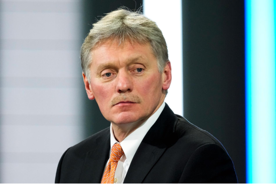

# 克宫：对乌克兰“非军事化”目标已基本实现，其自己的武器越来越少

【环球网报道】据塔斯社18日报道，克里姆林宫发言人佩斯科夫在接受“今日俄罗斯”采访时表示，对乌克兰“非军事化”目标实际上已经基本实现，因为基辅使用的武器中属于自己的部分越来越少。

_佩斯科夫
资料图_

塔斯社报道称，佩斯科夫表示，“实际上，在（特别军事行动）开始时，乌克兰的军事化程度很高。而且，正如普京昨天所说，行动目标之一是使乌克兰非军事化。事实上，这一目标已基本实现。乌克兰正在使用的武器中属于自己的越来越少，而由西方国家提供的部分越来越多”。

报道称，在评论西方国家向乌克兰提供武器时，佩斯科夫表示，俄罗斯的特别军事行动一开始为了保卫顿巴斯地区，而现在实际上已经变成了与西方集团的战争。他提到，普京曾表示，如果乌克兰继续炮击俄罗斯境内，要考虑在乌境内建立一个“安全区”。佩斯科夫补充称，随着运送到乌克兰的武器射程范围扩大，这种缓冲区域，即“我们将不得不把乌克兰人从我们领土移走的距离”也将扩大。

俄罗斯《观点报》14日报道称，普京13日称，如果乌克兰继续炮击俄罗斯境内，要考虑在乌境内建立一个“安全区”。他在与战地记者会面时表示：“从乌克兰境内仍能炮击我们国家境内（目标），对此有几种解决方案。首先是提高反炮兵作战的能力，但这并不意味着我们国土不会受到炮击。如果炮击仍将持续，那么我们将必须考虑这个问题：要在乌境内建立一个‘安全区’。当然，我并不是说，明天就开始进行这项工作，需要看局势发展而定。”

