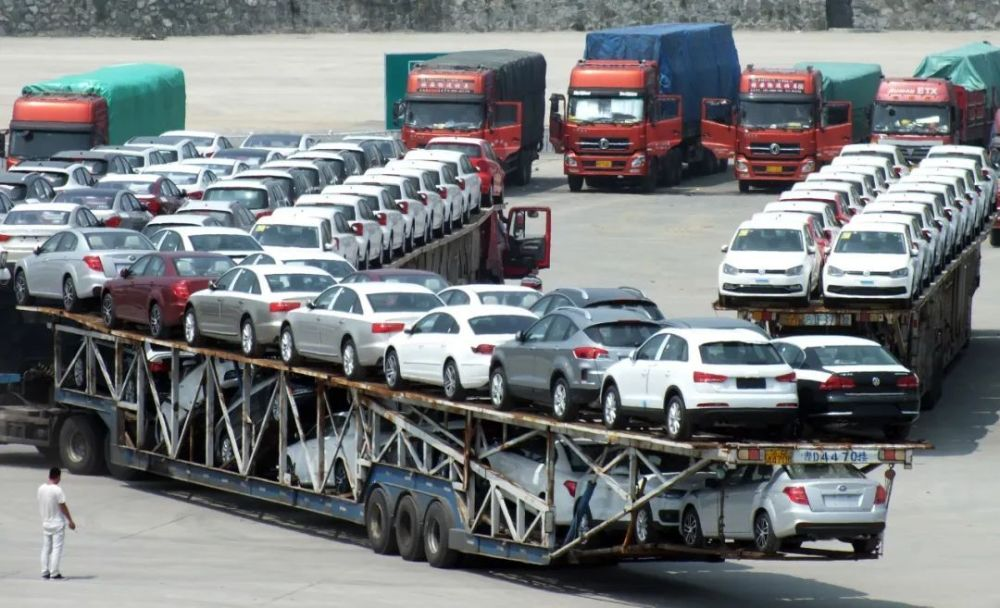

# 出口世界第一，中国车卖到哪里去了

图/视觉中国

**文｜特约撰稿 翟芳雪 《财经》记者 李皙寅**

**编辑｜李皙寅**

中国汽车出口量超越日本，成为全球最大汽车出口国。

中国汽车工业协会数据显示，2023年1月-5月，汽车企业出口175.8万辆，同比增长81.5%。新能源汽车出口45.7万辆，同比增长1.6倍。

外行看热闹，内行看门道。要知道，中国同期国内销售汽车1161.7万辆，汽车内需与出口两旺，在国际上并不多见。

汽车出口大国一般要同时符合两个条件：一是本身产业结构完善、产能强劲；二是本国市场不能过于庞大，以至于本国的产能无法溢出。出口和内销两旺代表着，中国汽车消费市场有极强的消费能力，且生产出来的产品在全球范围内有极强的影响力。

那么，问题来了，这么多的中国汽车都是被谁买走了？这样庞大的出口体量能否可持续？海外经营环境不同于国内，有何需要注意？

纵观世界汽车出口历史，20世纪，由于三次石油危机的爆发，日韩汽车得以主导欧美汽车进口市场。这一汽车市场格局，虽略有波动，但整体延续到如今。目前，中国的新能源汽车出口，有打破这一格局的可能性。

中国汽车出口井喷背后得益于进出口国之间良好的商贸环境，中国汽车产品较强的性价比，以及在新能源及智能网联领域抢先布局带来的发展势能。同时，需要清醒地认识到，从出口大国到出口强国的道路上，中国汽车产业仍有不少的路要走。

**俄罗斯墨西哥买了最多中国汽车**

2023年1月-4月汽车出口量前十的国家依次为俄罗斯、墨西哥、比利时、澳大利亚、沙特阿拉伯、英国、泰国、西班牙、阿联酋和菲律宾。

这些国家分布天南海北，从西欧到东南亚，从中东到拉丁美洲，既有传统汽车强国，也有高速发展的新兴汽车消费市场。这些差异化明显的国家都各自因为什么大量购入中国汽车？

细细判断来看， **主要原因是：外贸政策的春风、主打性价比的产品以及在新技术上的创新势能。**

俄罗斯的原因最为特殊，此前俄罗斯的汽车制造业一直依赖于西方的投资、零部件供应和合作伙伴关系。受俄乌冲突影响，大量跨国车企停止对俄出口，停止在俄生产汽车、供应备件。

今年3月，俄罗斯最大的汽车制造商Avtovaz宣布，由于零部件短缺，工厂提前开启并延长夏休假期。受此影响，俄罗斯的汽车消费完全进入卖方市场，车辆售价普遍水涨船高。

在此背景下，能够稳定供货的中国车企，吃到了红利。
**2022年，俄罗斯总计从中国进口约11.7万辆乘用车，较上年增长40%。中国已成为俄罗斯进口乘用车的主要来源国。**

有数据显示，过去一年，俄罗斯新增487家中国汽车品牌经销商门店；俄国目前每三家汽车经销商，就有一家售卖中国汽车。

低关税的利好，让中国汽车的性价比更显突出。这一点在澳大利亚与东南亚市场尤为显著。

由于澳大利亚与中国之间具有自由贸易协定，相比欧洲进口汽车，中国产汽车的关税更低；同样，RCEP（区域全面经济伙伴关系协定）为中国品牌进军东南亚市场提供了便利。

东南亚市场，长久以来都是日系车的天下。伴随RCEP的签署实施，中国车企开始享受到以往独属于日企的优惠政策，更好地实现了零部件在区域内的零关税流通。比如在泰国建厂的中国车企，就能让供应链延展到整个协议签署国，零部件实现了零关税。

无论是澳大利亚还是东南亚，中国汽车在价格方面具有超越欧洲品牌的优势，正逐渐从本田、丰田和马自达等厂家手中，接过昔日的消费者，向他们出售经济型汽车。

**如果说政策是润滑剂，那产品与技术是安身立命之本，中国车企率先开始新能源转型，对应上了全球交通绿色低碳转型的市场机遇。**

泰国就曾提出“3030愿景”——即到2030年，零排放汽车在新车产量中占比达到30%。从2023年1月-4月中国整车出口量数据来看，泰国从中国购入的新能源汽车数量已经超过了英国、西班牙等欧洲国家。

不只是泰国，凭借新能源产品优势，中国冲入了欧洲这一传统汽车豪强云集之地。

全球范围内，欧洲是在“禁售传统燃油车”、追求“碳中和”最为积极的地区之一，背后有对生态环境的思考，也是对于能源危机的切肤之痛。大量欧洲国家对新能源汽车发展大开绿灯，提供税收、路权等优惠。

然而，受限于产业链成本，欧洲新能源汽车价格较高，且欧洲本土车企电动化速度，相对中国车企仍显得慢了半拍。为此，给了中国车企出海的机会。

从2023年1月-4月中国汽车整车出口数据来看，英国与比利时进口中国新能源汽车的比例远大于传统能源汽车。

此外，针对欧洲市场，一些先锋车企展开了前瞻探索，比如领克在欧洲推出了“订阅模式”，让消费者通过比较低廉的价格获得汽车一个月的使用权，550欧元一切都打包在内，不用再操心；按月付钱，随时可以终止合同。目前，欧洲“订阅制”会员已突破20万。

墨西哥在中国汽车出口量前十的国家中排名第二还是挺让人惊讶的，毕竟墨西哥本身就是汽车生产大国，产量位居全球第七。

**中国车企看中墨西哥的原因有二。其一，这是一个旺盛且新兴的消费市场，合适提前布局；其二，在全球第二大汽车市场美国的邻国建立生产基地优势巨大——不只是出口整车，很多中国车企和零部件汽车在加码布局墨西哥。**

根据美国、加拿大、墨西哥三国1992年签署的《北美自由贸易区协定》，只要在墨西哥建设工厂的企业在北美三国采购的零部件满足一定比例，即可获准以零关税向美国出口。

作为最靠近美国市场的国家，墨西哥无疑是中国汽车产业向美国渗透的路径之一。另外，墨西哥具有汽车供应链配套的优势。美国的汽车龙头企业近年来已将部分产能转移到墨西哥，当地零部件供应商产业链齐全，有工业基础，且用工成本低。一些志在深耕美洲市场的中国车企恰恰需解决本地化生产、物流及供应链问题。

中国汽车正凭借高性价比逐渐在中东市场站稳脚跟。埃及汽车行业分析师塔雷克·穆斯塔法表示，中国品牌汽车凭借其越来越好的产品质量、及时周到的售后服务、与时俱进的技术研发，以及对客户需求的深度理解与快速响应，在中东市场日益崭露头角。

当视角来到中东国家，我们可以看到，受地理环境等方面影响，因地制宜的设计和物美价廉的质量服务是中国汽车在此地畅销的不二法门。

北京外国语大学阿拉伯学院院长刘欣路表示，中东国家，无论是产油国，抑或是非产油国，都将发展绿色经济、开发新能源和可再生能源作为国家可持续发展的基础性战略。在此背景下，新能源汽车已成为中东市场的新热点和增长点。

如果按照中国品牌在海外各市场的总销量计算，沙特排在海外市场的第三位。2022年，所有中国品牌在沙特总共销售了100482辆汽车。

中国车企在中东市场进行了充分调研，根据本地居民的驾驶习惯，对汽车在安全和性能上进行改进。

针对沙特的高温、潮湿气候及客户习惯，中国品牌宇通制定系统化的技术工艺改进方案，如朝觐车辆专用附件、散热、制冷系统优化等，其产品已覆盖朝觐车、定制化校车、高端团体车、VIP商务车等多个领域。

此外，宇通通过迪拜配件中心库及当地配件服务网络，保证配件快速可得；通过派驻常驻服务人员、组建专业服务团队、制定朝觐高峰期的全天候服务方案，为客户提供可信赖服务。

从汽车出口目的地情况来看，
**欧洲、北美、亚洲和澳大利亚等地区占中国汽车出口的绝大部分，其中主力地区是欧洲，北美发达市场的份额增长较为突出，澳大利亚、阿联酋、沙特和菲律宾等国的增速抢眼，而非洲和南美洲欠发达地区的出口量在逐渐减少。**

**高速增长的光荣与隐忧**

纵观中国汽车出口的历史，出口数量从1到100万辆，中国用了55年；从100万辆到200万辆，用了10年；从200万辆到300万辆，仅仅用了一年。由此可见，中国汽车出口，呈现出加速度的态势。

如今，新能源汽车是急先锋。中国新能源汽车关键领域兼具技术优势和产业链韧性，叠加国内综合制造成本优势、智能化先发优势，展现出较强的竞争力。

当年石油危机，让日韩系汽车开始主导欧美汽车消费市场数十载；如今，中国汽车品牌有望复现如上历史。

**据中国汽车工业协会数据显示，1月-5月，整车出口前十企业中，从增速上来看，比亚迪出口6.9万辆，同比增长14.2倍；奇瑞出口31.9万辆，同比增长1.8倍；长城出口9.9万辆，同比增长1倍。**

如今中国汽车出口正量价同升。“从去年开始，中国出口的汽车单价就在上升，特别是新能源汽车领域有很明显的体现，据我了解，中国新能源汽车出口的单价已经维持在了约每辆3万美元。”中国汽车工业协会副总工程师许海东对《财经》记者表示。

笑到最后笑得最好。在快速增长的同时，中国汽车出口必须讲求高质量和可持续发展。

这要体系化支持。以1至5月整车出口量第一的上汽集团为例，其在全球范围内建立了一条完整的汽车产业链，覆盖汽车产研销售后各环节；全球另有三大研发创新中心、三大设计中心、四座生产基地及KD工厂；开设多条自营国际航线，为后续出口蓄能。

还需要软实力。麦肯锡全球董事合伙人、麦肯锡大中华区汽车板块业务负责人管鸣宇告诉《财经》记者，这些年来不同类型企业出海，遭遇过的挫折种类繁多。企业在中国市场的经验，并不能直接拿来在全球复制，做好国际化，需要有顶层思维，系统性设计。

这需要车企内外兼修，提前考察好目的地的法律法规、行业生态、合作伙伴关系、商业文化；对内要有从市场、治理结构、组织、人才等全方面国际化的一揽子举措。“关键在于配置人才，”领英中国人才解决方案事业部总经理王茜告诉《财经》记者，这需要优化总部和前线部门的管控模式，提升品牌美誉度招募优才，结合当地文化助力人才融合。

需要冷静看待的是，中国汽车出口总量虽位居全球第一，但尚不能直接视作汽车出口强国。

**这是因为，世界主要汽车生产国的出口量占本国汽车产量的35%—50%，而中国在2022年，这一比重仅有11%。同时，上述销量口径，并未计算日韩系车企在他国建厂销售的产销量。**

同时，目前国内汽车品牌仍有待升级。以上汽名爵品牌为例，其在英联邦国家的售价和销量均远高于国内。源于这是一个英国品牌，后被上汽收购，上述国家对其颇为认可。

中国汽车在海外仍存在“散、弱、小”的状况，“低质、低价、抄袭”等固有认知仍根深蒂固。

“中国车企做海外市场，不能学渔民模式，广撒网，捞到啥算啥。”清华大学汽车发展研究中心主任李显君对《财经》记者分享了早前调研的经历：十几年前，他了解到一家车企在67个国家才卖了3万辆车，颇为哑然。汽车讲究规模效应，在这么多国家撒胡椒面，难以积累关系不说，产品售后都是问题。

“在出海之路上，汽车应该摸着摩托车的经验过河，避免再度摔倒。”中国摩托车商会秘书长张洪波对《财经》记者感慨。二十多年前，中国摩托车曾率先出海，在东南亚市场搏杀。可惜当初过于强调价格战，压缩了合理的利润空间，影响了企业的研发、售后和产品品质，被日系摩托车靠产品“杀了回马枪”。由此可见，“价格屠夫”和“内卷”可视作先头部队，但能否赢下市场还得倚重技术、质量和服务。

**综合来看，稳定的供应链、较高的性价比、对新能源汽车研发的先手优势、优惠的外贸政策等方面是中国汽车得以大量出口海外的可能原因。**

然而，那些阻碍竞争对手的不利因素终将被解决，中国汽车如何在性价比之外提高自身竞争力仍是需要用时间回答的问题。

