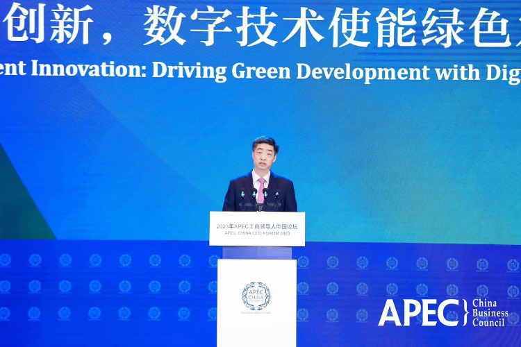

# 华为轮值董事长：最新超快充技术可15分钟充满一辆新能源车

_华为轮值董事长、APEC工商咨询理事会中国代表胡厚崑。图源：2023APEC工商领导人论坛组委会_

“数字技术的进步将如何改变世界？有两个关键趋势值得关注：
智能联接无处不在，智能计算无所不及。”6月17日，2023年APEC工商领导人中国论坛在北京举行。华为轮值董事长、APEC工商咨询理事会中国代表胡厚崑发表了题为“融合创新，数字技术使能绿色发展”的主题演讲。

他认为，在联接方面，带宽需求将百倍增长，我们要匹配从千兆到万兆的接入需求，未来下载一部4K电影可能仅需1分钟。他表示，有数据的地方就需要计算，每个行业都能从计算中获益。他指出，数字技术在绿色发展中扮演着非常重要的作用，参与能源的低碳化进程，例如通过超级快充技术可实现15分钟充满一辆新能源汽车，缓解续航焦虑；数据技术也可以助力改善光伏发电“靠天吃饭”困境，保障发电稳定性等。

匹配带宽需求，未来下载一部4K电影可能仅需1分钟

胡厚崑认为，要实现社会绿色发展，智能化、低碳化是关键举措。华为也进一步明确，促进社会的智能化、低碳化发展是其核心业务战略，更是进行技术创新的聚焦点。

如今，社会已经迈进了虚拟现实融合、人工智能大发展的数字时代，万物互联的智能世界正在加速构建中。胡厚崑指出，要想更好地把握数字技术的进步将如何改变世界，有两个关键趋势值得关注：
“智能联接无处不在，智能计算无所不及”。

智能世界的核心是数据，而数据的获取和传递靠的是联接。他认为，正在到来的万物互联具有以下三个特征：范围更广、数量更多，带宽更大、速度更快，时延更小、反应更敏捷。他举例说，随着元宇宙、全息影像等新业务形态的到来，带宽需求将百倍增长，我们要匹配从千兆到万兆的接入需求。这意味着下载一部60GB的4K高清电影，4G时代需要1.3小时，5G需要8分钟，未来仅仅需要不到1分钟。
而且还可以在线体验“身临其境”的3D XR游戏、全息教学、全息会议等新业务。

个人、工业应用将被ChatGPT等人工智能所改写

“数据经过计算才能成为智能，大数据、人工智能、以及最近热门的ChatGPT都是计算的具体形式。”胡厚崑认为，未来的计算是无所不及的，有数据的地方就需要计算。每个行业都能从计算中获益，在气象领域，20年前只能预测1天的天气情况，现在可以准确预测7天；在医药领域，基于药物分子大模型，超级抗菌药研发周期从数年缩短至一个月。

胡厚崑说，如今，以ChatGPT为代表的新的人工智能时代已到来，我们可以大胆地预测，所有的个人、工业应用都将被这种新的人工智能所改写。由于计算无所不及，以及算力需求的成倍增长，如到2030年，通用算力将增加10倍，人工智能算力将增加500倍。“我们将建设大量的数据中心、人工智能计算中心等ICT基础设施，如何降低这些设施的能耗，也是绿色低碳发展需要面对的挑战。”

15分钟充满一辆车，最新超快充技术缓解续航焦虑

在能源行业，当前电力行业生产主要依赖化石能源。胡厚崑指出，“要改变能源结构，需大力发展新能源，打造以电为中心，以新能源为主体的新型能源体系。”在演讲中，他提到华为的“比特管理瓦特”理念，推动电力电子技术与数字技术融合创新，发展清洁能源与传统能源数字化，推动能源变革。

这包括，促进能源消费侧向电气化转变。他以新能源汽车为例，华为最新推出的液冷超级快充技术，可实现1秒钟充1公里，15分钟充满一辆车，极大地缓解车主的续航焦虑，有助于推进交通工具电气化进程。

在电力生产侧，胡厚崑表示，可以通过大力推广5G、AI、云等数字技术，帮助传统电厂和电网进行数字化改造。目前有越来越多的传统电厂开展智慧电厂等数字化转型工作，通过物联网、人工智能、云计算等技术，实现了“无人值守、远程诊断、智慧检修”，提高了发电效率，降低了能耗。

数据技术改善光伏发电“靠天吃饭”困境，保障发电稳定性

在发展光能、风能等新能源方面，数字技术也可充分发挥价值。胡厚崑指出，以光伏发电为例，可以融合数字技术和电力电子技术，让光伏电站更平稳地发电，发更多的电，并入电网更简单，加速新能源成为主力能源。

据介绍，青海共和县有着全球最大的单体光伏电站，电站安装了超过700万块光伏板，涉及2.2GW的发电量，占地面积接近56平方公里。规模如此大的电站，其发电效率和运维管理的挑战可想而知。胡厚崑表示，一方面，发电“靠天吃饭”，即便是在大晴天，也会受到太阳照射角度变化、云遮挡、树荫遮的影响，减少发电量。另一方面，电站面积大，设备数量多，地处偏远，运维工作量非常大，耗时耗人。

值得一提的是，数字技术帮助光伏电站实现了“开源节流”。据胡厚崑介绍，光伏逆变器中融入了AI算法，相当于给光伏支架配了一个智能指导员，可根据云遮挡、云层移动等情况，计算出支架最佳转动角度，即便在多雨和多云的天气里，也能捕捉更多光照，可提升发电量1.5%。同时，无人机和AI图像识别技术带入了电站运维，实现智能巡检，巡检时间从近2个月缩短到2天，提高运维效率的同时，也保障了发电性能稳定。

信息与通信技术可能将全球二氧化碳排放量减少20%

提到“碳足迹”，很多人可能并不陌生，其是指服务或产品在全生命周期，直接与间接产生的温室气体排放总量。在本次论坛中，胡厚崑则强调了另一个概念——“碳手印”。它是指通过ICT（信息与通信技术）等数字技术，使能其他行业减少碳排放。“碳足迹越小越好，碳手印越大越好。”胡厚崑说。

根据环保行业组织GeSI(全球电子可持续发展推进协会)最新研究成果显示，信息与通信技术有可能将全球二氧化碳排放量减少20%，是自身碳排放量的10倍。胡厚崑举例称，通过机场协同决策系统可以减少飞机滑行等待时间，如果中国每架航班减少1分钟等待时间，每年可减少燃油消耗4400吨。

此外，玻璃制造是典型的高温、高能耗的行业，也是高碳排的重点行业之一。在玻璃生产过程中，天然气用气量大，通常占玻璃生产成本的35~40%。胡厚崑表示，优化天然气用量是提升企业经营利润及绿色发展的关键。

他以生产环节的关键设备窑炉举例论证称，过去，窑炉的温度、进气量等数据都是通过人工收集的，效率低，准确率不高。如今基于AI对窑炉的温度、天然气进气量等关键数据进行分析，可以帮助工艺专家对能耗较高的窑炉进行工艺优化，使得单位用气量降低3.8%，实现更绿色的生产。

**南都记者 陈秋圆 见习记者 王玮 发自北京**

