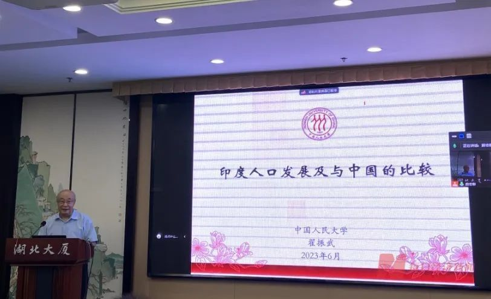

# 印度人口超过中国无需担忧，专家：印度劳动力规模比我们少2.6亿

6月16日，中国人口与发展研究中心组织召开“一带一路”人口与发展研讨会暨《“一带一路”人口与发展（第二辑）》新书发布会。

中国人口学会会长翟振武在主旨发言中比较了目前全球第一与第二人口大国印度与中国的人口状况。

他提出，
**由于印度劳动年龄人口劳动参与率大幅低于中国，劳动力规模在21世纪前半叶都不会超过中国，中国可凭借较高的劳动参与率继续保持世界第一劳动力大国的地位。**

同时，中国在人力资本存量以及人口城镇化进程上的比较优势极为明显。中国进入人口与经济总量“双第二”的阶段后，在推进人口规模巨大的现代化时，要尤其关注人口高质量的发展。

在研讨会期间，翟振武接受了《每日经济新闻》（以下简称NBD）记者采访。

_研讨会现场
图片来源：每经记者 张蕊 摄_

**NBD：您对比了中国和印度的人口现状，对比之后您觉得对我国人口相关政策有哪些启示？**

翟振武：大家对印度人口超越中国这一事实非常关注，也比较忧虑。我认为启示是要看人口对经济社会发展的影响，而不是仅仅看人口总量这个数字。

印度人口总量超过中国，但实际上对经济发展的影响并没有那么大，甚至人口总量都不是一个很重要的影响经济的变量。影响经济的其他变量，我们相对印度而言还有很大优势。

印度的劳动参与率很低，劳动年龄人口规模大并不等于劳动力规模大。2021年，中国与印度的劳动年龄人口分别为9.86亿、9.5亿，仅相差3622万。但当年劳动力规模中国与印度分别为7.48亿、4.88亿，相差2.6亿。由此可以得出，中国与印度的劳动参与率分别为75.82%、51.34%，相差24个百分点。

因此，即便印度人口总量超过中国，但劳动力规模比我们少2.6亿，也就是说，印度投入到经济中的劳动力更少，因此经济发展就会相对缓慢。而中国人口总量虽然少一点，但是劳动力规模比印度多。

所以看人口问题要全面，不要被表面数字迷惑，要做分析。

**NBD：现在有一种观点认为我们的人口红利已经消失，您怎么看？**

翟振武：人口红利期并没有过去，或者说人口机会窗口并没有关闭。我们一直说人口红利，其实是讲人口的机会窗口，劳动年龄（15~59岁）人口比例超过50%就是进入人口机会窗口，这就进入了人口红利期。

从改革开放以后，我国就进入人口红利期，后来这个比重持续增长，最高时超过70%。但从2012年开始，我国劳动年龄人口开始下降，这个比重也在下降，很多人就认为人口红利消失了。

实际上，只要这个比重超过50%都处于人口红利期，现在大概在67%左右，所以我们的人口红利期还没有过去，劳动力还是很多。目前就业仍然是需要高度关注和解决的问题，因此未来一段时间内我国劳动力还是非常充沛的。

但是我国劳动年龄人口开始下降需要引起高度重视。因为长期来看，如果劳动力越来越少，而经济增长还是靠劳动密集型产业支撑，那就会受到影响。如果经济增长转变成以高科技产业来支撑，那影响就不会那么大。所以这是一个需要长期关注的话题。

与此同时，我们要发挥人才红利，但并不是说上个红利过去了，现在有一个新的红利。我认为人口红利开始逐渐消失是对的，但它并没有过去。

_翟振武进行主旨发言
图片来源：每经记者 张蕊 摄_

**NBD：日前，国家相关部门提到，我们的人才红利正在形成。您怎么看人才红利？**

翟振武：我认为这个观点是对的。人才红利讲的是人力资本，现在推动经济发展最大、最活跃的动力源泉就是人力资本，其推动力已经远远超过物质资本。

比如一些发达国家，包括一些高科技企业，并不是靠人口数量多，而是靠人力资本，所以人力资本高应该是我们追求的方向。我们要靠技术型产业来支撑，而不是单纯靠劳动密集型产业实现经济增长。

**NBD：您觉得我们现在需要特别担忧中国人口负增长吗？**

翟振武：我认为至少近期不用，因为我国人才水平很高。美国全国只有3亿多人，劳动力不到2亿，而我国现在大学生就有2亿多人。所以我们要充分利用、充分挖掘人力资本。

**记者|** 张蕊 **编辑|** 陈星 卢祥勇 杜波

**校对|** 孙志成

｜每日经济新闻 nbdnews 原创文章｜

未经许可禁止转载、摘编、复制及镜像等使用

